# Home Page

## -- Sections Manager

You can select the sections displayed on the homepage (maximum 11 sections) in **Theme Editor** > **Homepage** > **Sections**.

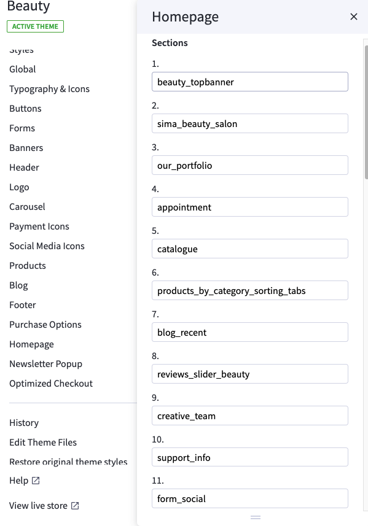

---

### List of available sections key: ###

* **section1": "beauty_topbanner**
* **section2": "sima_beauty_salon**
* **section3": "our_portfolio**
* **section4": "appointment**
* **section5": "catalogue**
* **section6": "products_by_category_sorting_tabs**
* **section7": "blog_recent**
* **section8": "reviews_slider_beauty**
* **section9": "creative_team**
* **section10": "support_info**
* **section11": "form_social**

## --- Beauty Top Banner Section

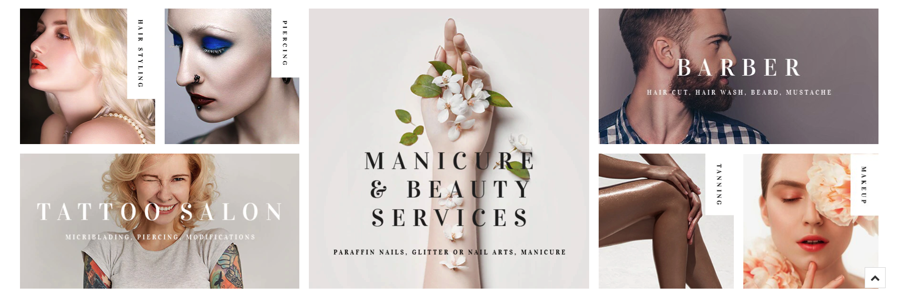

To edit content and images in this block, open the builder tool: [https://bc-feellio-builder.papathemes.com/](https://bc-feellio-builder.papathemes.com/)

Chooes __Furniture Featured Categories__ tab, fill in the form and follow the instruction on that page to create banner.

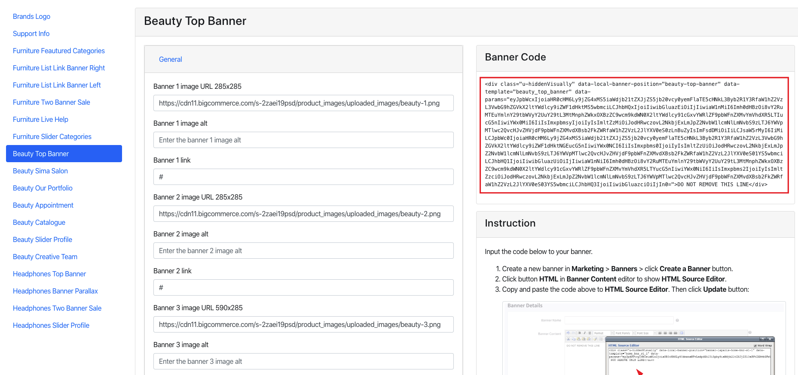

## --- Beauty Sima Salon Section

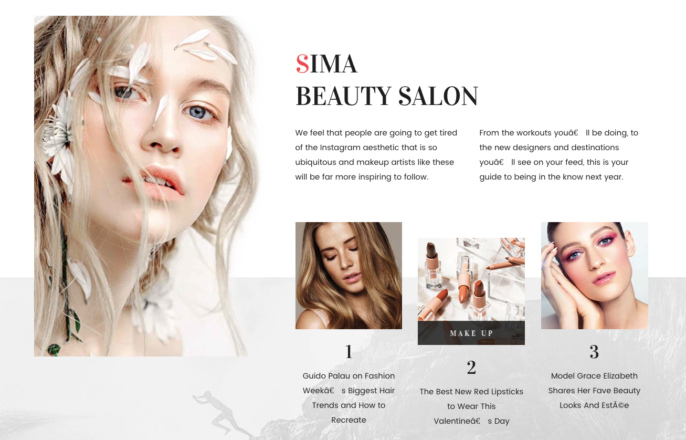

To edit content and images in this block, open the builder tool: [https://bc-feellio-builder.papathemes.com/](https://bc-feellio-builder.papathemes.com/)

Chooes __Furniture Featured Categories__ tab, fill in the form and follow the instruction on that page to create banner.

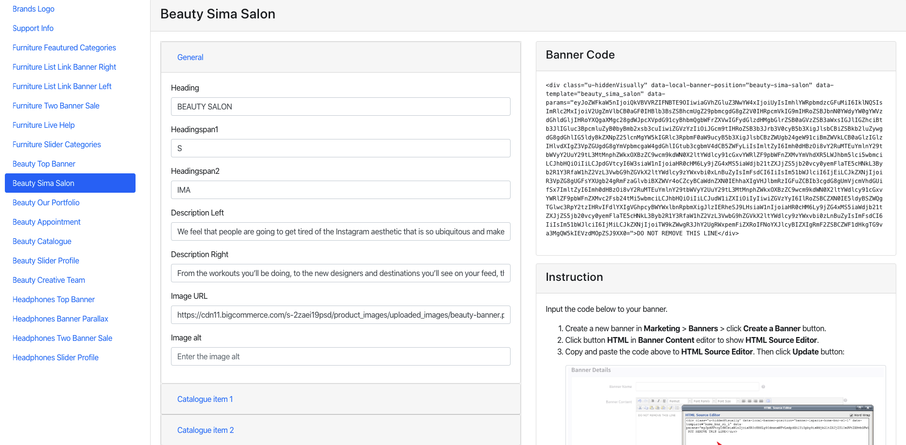

## --- Beauty Our Portfolio Section

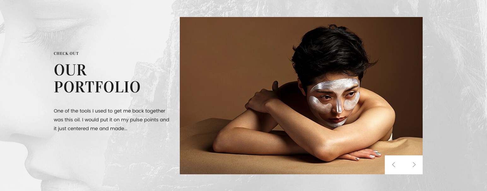

To edit content and images in this block, open the builder tool: [https://bc-feellio-builder.papathemes.com/](https://bc-feellio-builder.papathemes.com/)

Chooes __Furniture Featured Categories__ tab, fill in the form and follow the instruction on that page to create banner.

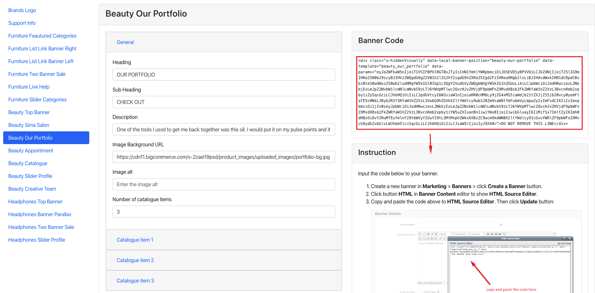

## --- Beauty Appointment Section

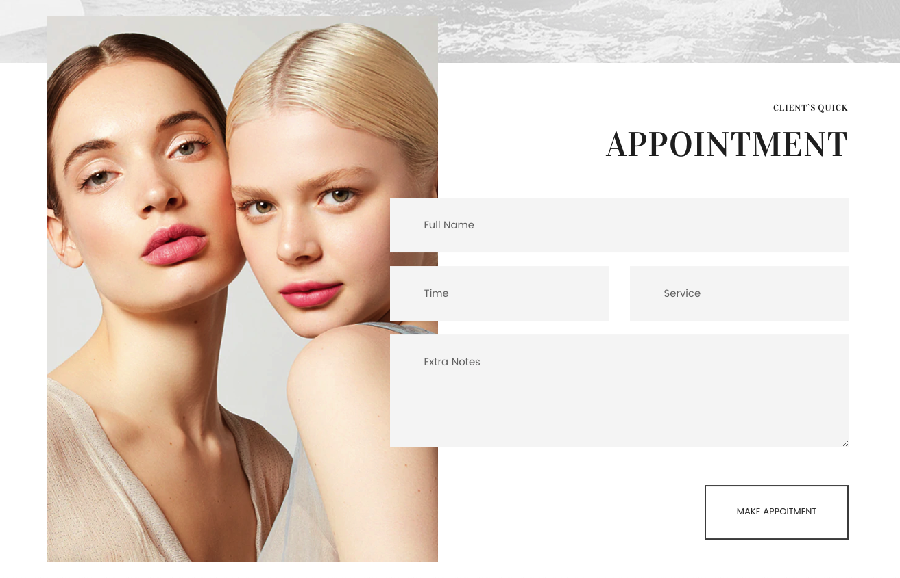

To edit content and images in this block, open the builder tool: [https://bc-feellio-builder.papathemes.com/](https://bc-feellio-builder.papathemes.com/)

Chooes __Furniture Featured Categories__ tab, fill in the form and follow the instruction on that page to create banner.

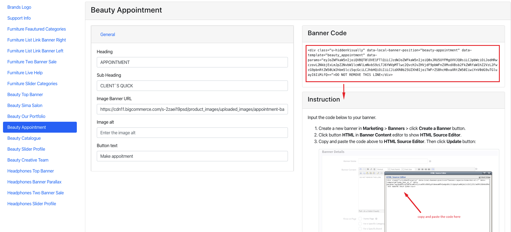

## --- Beauty Catalogue Section

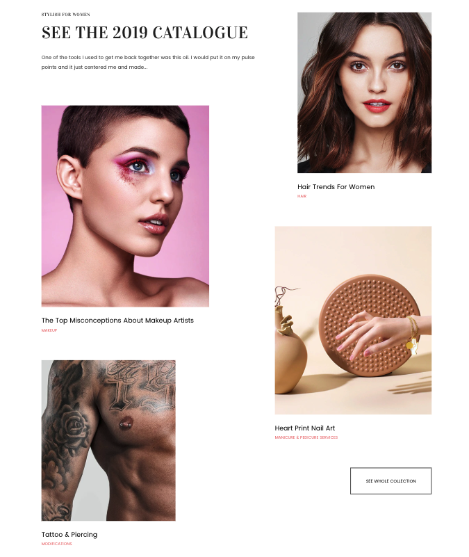

To edit content and images in this block, open the builder tool: [https://bc-feellio-builder.papathemes.com/](https://bc-feellio-builder.papathemes.com/)

Chooes __Furniture Featured Categories__ tab, fill in the form and follow the instruction on that page to create banner.

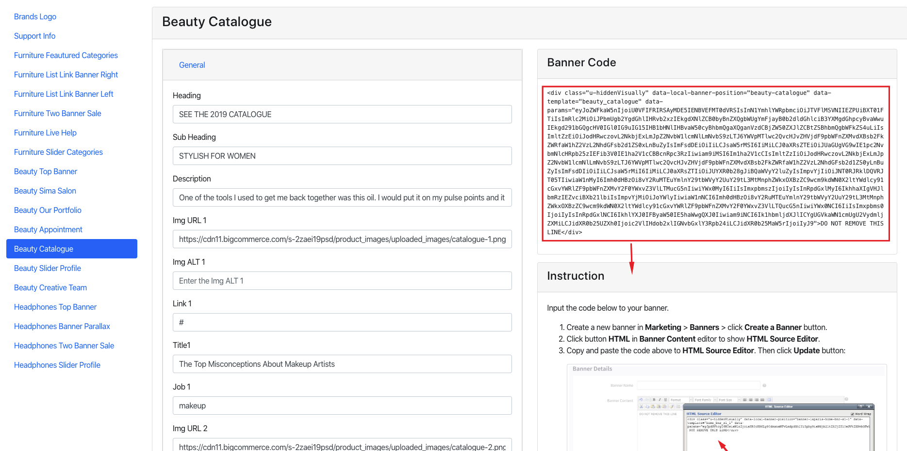

## --- Beauty Products By Category Sorting Tabs Section

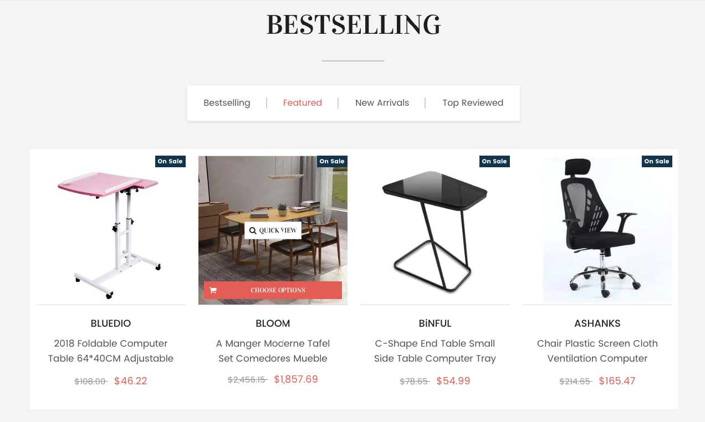

This section will show products organized categories. You can choose number of categories to display products. Categories are sorted by the order specified in **Product Categories** in admin manager.

To configure this section, go to **Theme Editor** > **Homepage** > **Products by Category with Sorting Tabs**:

#### OPTIMIZE FOR EXECUTION TIME

By default, all products will be loaded and displayed when opening the page. At a result, it takes a longer execution time that can affect your site's Page Speed score. To avoid this, you can select **Only load when scrolling to the viewport** option, the products won't loaded until user scrolls down to this area.

#### SPECIFY WHICH CATEGORIES TO DISPLAY

By default, the product categories displayed are the top categories in the order in which they are sorted on the main navigation. You can limit number of categories to display by setting Number of Categories option.

You can manually specify which categories should be displayed by setting the categories ID to Category ID box, separated by comma. For example: 200,221,254,275. Check instruction How to find the category ID. Note that Number of Categories will be ignored if you choose to display categories manually.

## --- Beauty Recent Posts Section

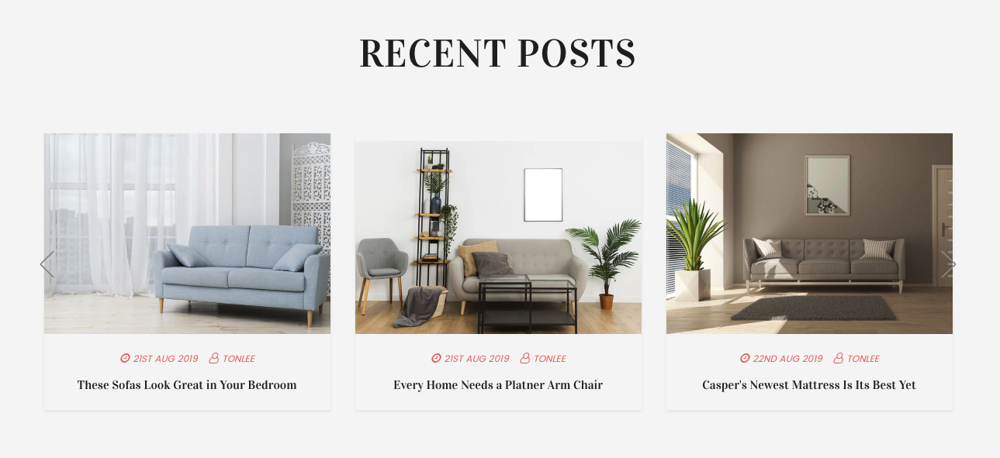

To show Recent Posts section on **Home Page**, go to **Theme Editor** > **Homepage** > set **Recent blog posts** = number of posts to show up.

## --- Beauty Review Slider Section

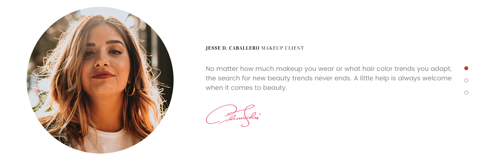

To edit content and images in this block, open the builder tool: [https://bc-feellio-builder.papathemes.com/](https://bc-feellio-builder.papathemes.com/)

Chooes __Furniture Featured Categories__ tab, fill in the form and follow the instruction on that page to create banner.

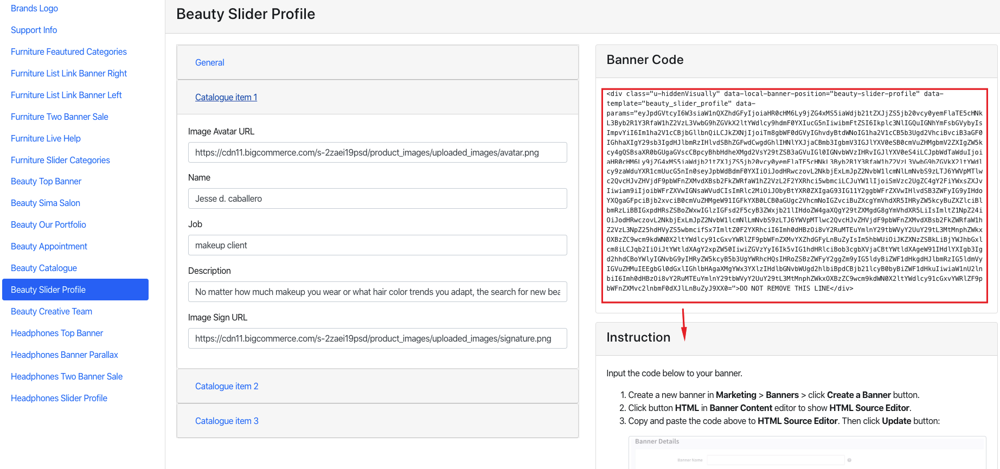

## --- Beauty Creative Team Section

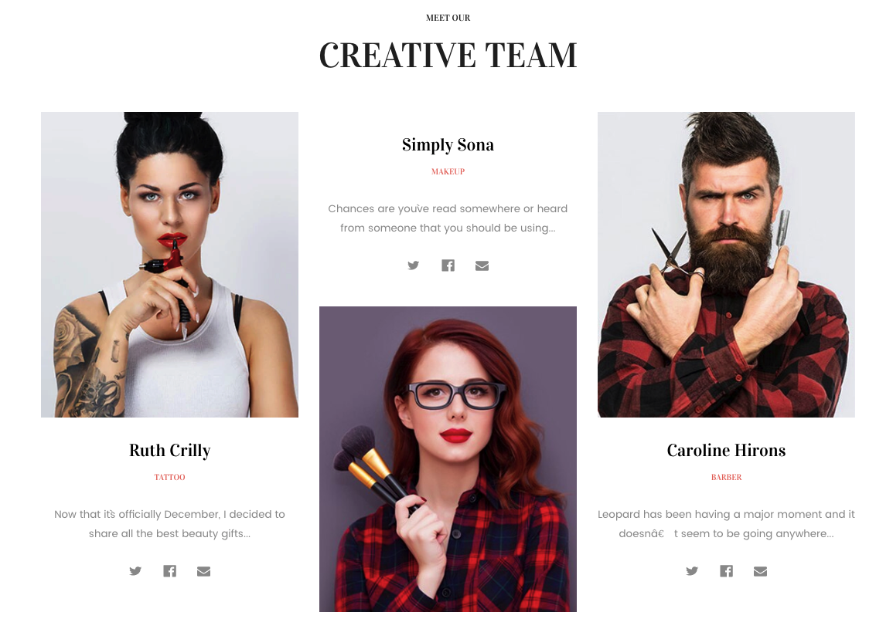

To edit content and images in this block, open the builder tool: [https://bc-feellio-builder.papathemes.com/](https://bc-feellio-builder.papathemes.com/)

Chooes __Furniture Featured Categories__ tab, fill in the form and follow the instruction on that page to create banner.

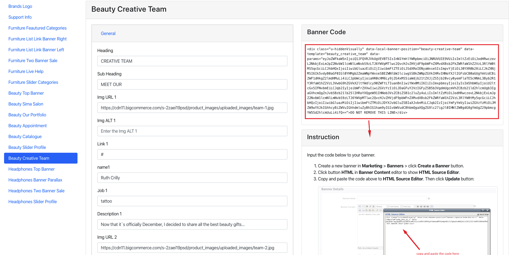

## --- Beauty Support Info Section

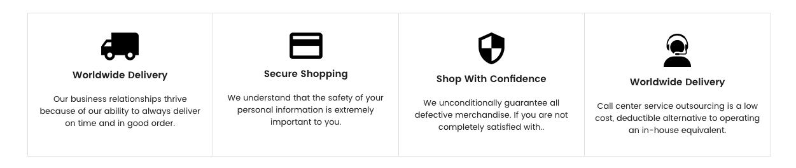

To edit content and images in this block, open the builder tool: [https://bc-feellio-builder.papathemes.com/](https://bc-feellio-builder.papathemes.com/)

Chooes __Furniture Live Help__ tab, fill in the form and follow the instruction on that page to create banner.

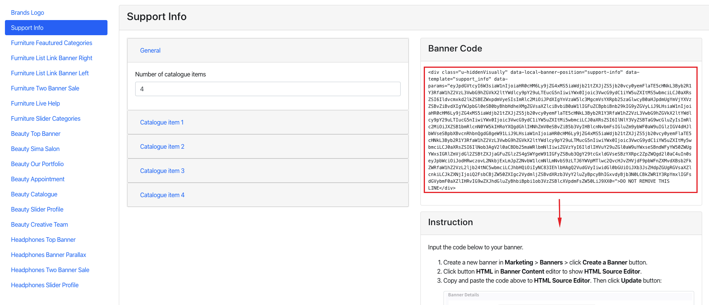