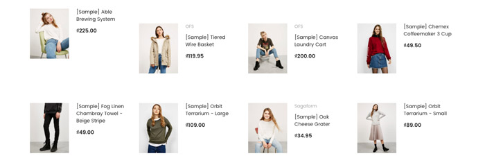
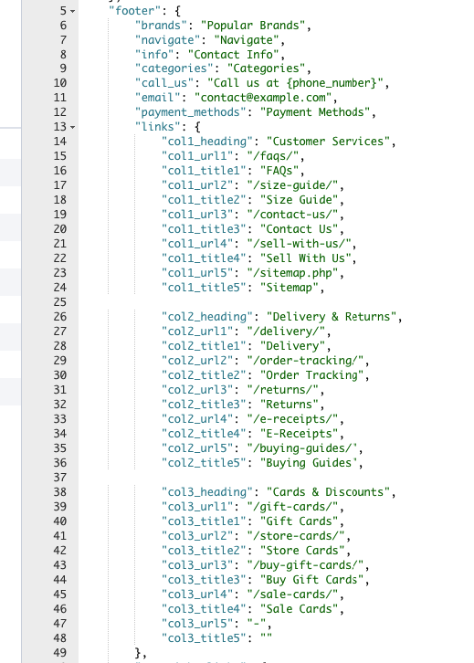
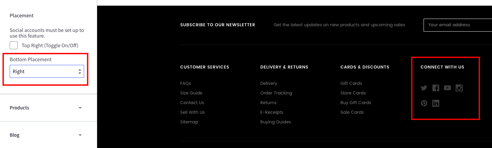
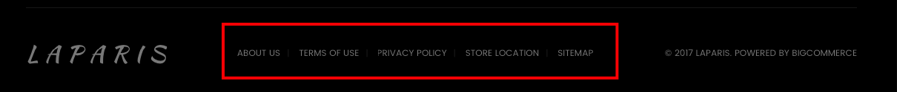
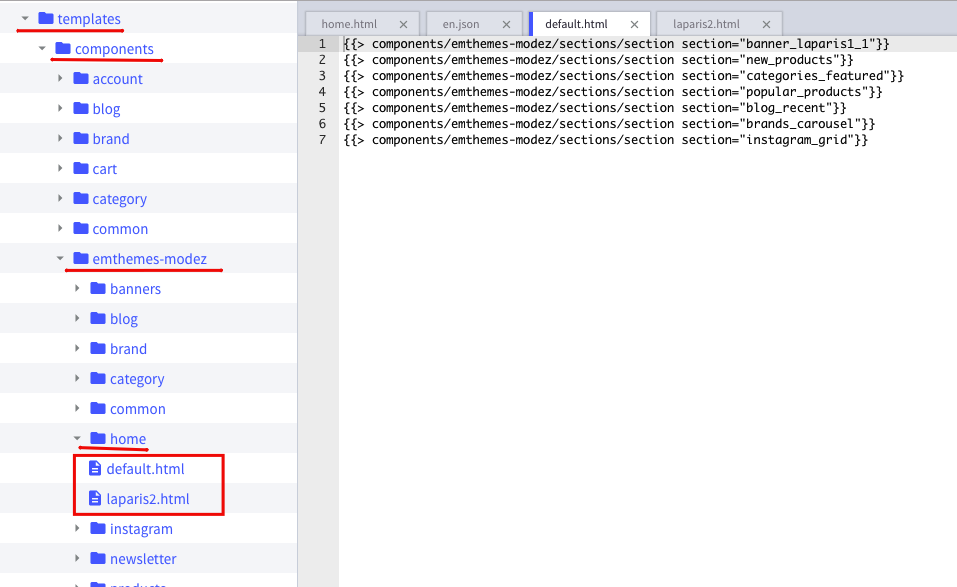

# Customization

This page will explain all configuration available and how to edit each section appear on theme. Let's view the first homepage.


## Top Banner


The top banner can be showed / edited in admin page > __Marketing__ > __Banners__. When you add / edit remember to choose __Location__ is __Top of Page__.

### Colors Customization

To customize colors of this section, go to admin page > __Storefront Design__ > __My Themes__, click button __Customize__ of the current theme to open the Theme Editor. 


Look into the options showing below:


## Header

### Header Styles
This theme support 3 different header styles:
- Logo at left
- Logo at right
- Logo at center


To configure, open the __Theme Editor__, scroll down to section __Logo__, click to expand the logo options. Choose a certain option of __Logo position__, then click __Refresh__ button appear after.


### Edit 3 info text blocks


Show or hide these text blocks in Theme Editor > __Header__ section as showing below: 


Edit content in the language file, from admin page > __Storefront Design__ > __My Themes__, click button __Advanced__ > __Edit Theme Files__ of the current theme:


From the left navigation, click to edit the language file (e.i `en.json`):


Edit the text as figured above.


### Colors Customization

To customize colors of the header section, look into the options showing below in the Theme Editor:


## Main Slideshow / Carousel

### Edit the slideshow

Edit the slideshow in admin page > __Storefront Design__ > __Design Options__:


### Change position of text content

The theme supports showing slideshow content like heading, text, button on __left__, __right__ or __center__ of the image. To configure this option, open Theme Editor, Look into section Carousel, click to expand:


Choose position of each slide you want to change.

### Colors Customization

To customize color of the slideshow's elements, look into section __Carousel__ in the Theme Editor:


### Hide the slideshow

To hide the slideshow on homepage, uncheck on the checkbox __Show Carousel__ in section __Carousel__ of the Theme Editor.


## 3 Banners


To edit content and images of 3 banners, edit the language file `en.json` as showing below:


If you don't want to show any elements of a banner, for example the button, leave the value __a single space__ character. Example: `"button": " "`.


## New / Featured / Popular Products

The theme supports 3 layout type of New Products, Featured Products and Popular Products blocks:

__Grid__:


__List__:



__Carousel__:


### Configure a Layout Type of products block & Number of Products to show up

In the __Theme Editor__ > __Homepage__, look into __New Products__ section (or __Featured Products__, __Most Popular Products__):

- __Display type__: Choose appropriate layout type (__Grid__, __List__ or __Carousel__).
- __Number of Products__: Choose number of products to show up.


### Show/Hide Quickview button

When hover on a product item, Quickview button is showed up by default. To disable this feature, uncheck the checkbox __Show Quickview__ in the __Theme Editor__ > __Products__ section.


### Change colors and image sizes

In the __Theme Editor__ > __Products__ section, Look into the color options below __Product cards__, __Product Sale Badges__, __Product cards (Quick search)__ and __Image sizes__'s options.


### Change the heading text

To change the heading text (New Products, Featured Products, Most Popular Products), edit the language file, look for the key `products` > `new` or `featured` or `top`.


## Recent Blog Posts


This block show the most recent blog posts.

### Customize heading text and other text

To change the heading text, read more text and date format, edit the language file. Find the key `blog` > `recent_posts`, `posted_by` and `read_more`, edit its values as you want.


## Image Carousel


To edit image and links in this image carousel section, edit the language file, find key `emthemesmodez` > `image_carousel`


- `image*`: is link to the image.
- `title*`: is image text description.
- `url*`: is image link. Leave a single space letter in the value if you want to hide any image.


## Instagram Photos


### Get your own User ID, Client ID, Access Token

In order to display your Instagram photos on your website, you will need to get the __User ID__, __Client ID__ and __Access Token__ from __Instagram Developer__ portal.

#### 1. Create your own Client ID

Open the URL <https://www.instagram.com/developer/> in your browser.

Login to your Instagram account.

Click button __Register Your Application__: 


Click button __Register a New Client__: 


Enter all required info on the form. 


Note that __Valid redirect URIs__ should be exactly `http://127.0.0.1` as recommended as it will be used in the next step.

After submitting the form you will get back to the previous page with a new __Client ID__ is created.


Save this __Client ID__ value, it will be used to configure the Instagram Photos block.

#### 2. Retrieve your Access Token

Click button __Manage__ on your the client app created previously. Open __Security__ tab, uncheck __Disable Implicit OAuth__ checkbox:


Click __Update Client__ button to complete.

Now open your web browser with the URL: 

```plain
https://api.instagram.com/oauth/authorize/?client_id=CLIENT-ID&redirect_uri=http://127.0.0.1&response_type=token
```

where `CLIENT-ID` is replaced by your __Client ID__ number created previously.

Click __Authorize__ button to grant access permission:


Instagram will redirect you to an error page with the URL similiar: 


The text after `access_token=` is the __Access Token__ you want to get. Save it for the next step.

#### 3. Retrieve your User ID

Open the link below on your web browser:

```plain
https://api.instagram.com/v1/users/self/?access_token=ACCESS-TOKEN
```
Where `ACCESS-TOKEN` is replaced by your real __Access Token__ just received previously.


The number in `"id": "..."` is your __User ID__.

### Display your Instagram photos

To display our own Instagram photos, edit the language file. Find the key `emthemesmodez` > `instagram`, input your real code:

- `user_id`: Is your Instagram __User ID__.
- `client_id`: is your Instagram __Client ID__.
- `access_token`: is your Instagram __Access Token__.
- `title`: Is the heading text.


## Footer - Newsletter


### Change text

To change text appear on this section you can edit the language file as instruction below:

From admin page > __Storefront Design__ > __My Themes__, click button __Advanced__ > __Edit Theme Files__ of the current theme:


From the left navigation, click to edit the language file (e.i `en.json`):


See the section `Newsletter` you can edit as you want:


### Colors Customization

To customize colors of the header section, look into the options showing below in the __Theme Editor__ > __Footer__:


## Footer - Links


To edit text and links on the footer, edit the language file, section `footer` > `links`:



- `col1_heading`, `col2_heading`, `col3_heading`: is the heading text of each column.
- `col*_url*`, `col*_title*`: is URL and text of each link.


## Social Media Icons



To show social icons in the footer, open __Theme Editor__ > __Social Media Icons__ section, set __Bottom Placement__ = `Right`. 

Note: You will need to configure which icons to appear in admin panel > __Storefront Design__ > __Design Options__, input your social links in __Social Media__ section.


## Payment Icons


To show/hide payment icons, go to Theme __Editor__ > __Payment Icons__ secitons, check or uncheck any icons you want to show or hide.


## Copyright Links



To edit links in the copyright section at footer, edit the language file, find `footer` > `copyright_links`:


- `url*` is link URL. Leave a __single space__ letter if you want to hide any link.
- `title*` is link title.


## Credit Links


To show/hide the credit links, go to Theme Editor > __Footer__ section, tick or untick the checkboxes as showing above.


## Mix contents from other theme styles

For example, if you want to use theme __default__ style as the main theme, but also want to display other content blocks from __LaParis II__ style. You can edit the template files, rearrange, add more content blocks or delete unused content blocks.

Let open folder `templates` > `components` > `emthemes-modez` > `home` in the template files editor:



There is 2 files in this folder:

- `default.html`: is used for __default__ style.
- `laparis2.html`: is used for __LaParis II__ style.

Let's take a look at contents of 2 files:

__default.html__

```plain
{{> components/emthemes-modez/sections/section section="banner_laparis1_1"}}
{{> components/emthemes-modez/sections/section section="new_products"}}
{{> components/emthemes-modez/sections/section section="categories_featured"}}
{{> components/emthemes-modez/sections/section section="popular_products"}}
{{> components/emthemes-modez/sections/section section="blog_recent"}}
{{> components/emthemes-modez/sections/section section="brands_carousel"}}
{{> components/emthemes-modez/sections/section section="instagram_grid"}}
```

__laparis2.html__

```plain
{{> components/emthemes-modez/sections/section section="products_by_category_1"}}
{{> components/emthemes-modez/sections/section section="products_by_category_2"}}
{{> components/emthemes-modez/sections/section section="carousel_laparis2_1"}}
{{> components/emthemes-modez/sections/section section="special_products_columns"}}
{{> components/emthemes-modez/sections/section section="brands_carousel"}}
{{> components/emthemes-modez/sections/section section="instagram_grid"}}
```

The files are showing very clearly how content blocks are displayed. See values in parameter `section="..."`:

- `banner_laparis1_1`: Is the first block content 3 banners in the homepage of default style.
- `new_products`: Is a block contains new products.
- `categories_featured`: Is a block contains featured products with categories list as appeared on the homepage of default style.
- `popular_products`: Is a block contains popular (or bestselling) products.
- `blog_recent`: Is a block contains recent blog posts.
- `brands_carousel`: Is a brand images carousel.
- `instagram_grid`: Is a block displaying instagram photos.
- `products_by_category_1` & `products_by_category_2`: Is a block contains product in a certain category as showing on homepage of LaParis II style.
- `carousel_laparis2_1`: Is the image carousel as showing on homepage of LaParis II style.
- `special_products_columns`: Is a block contains 3 columns showing new products, featured products and bestselling products as displayed on homepage of LaParis II style.

So just copy a line from the other file to the other. Arrange position of these sections as you wish.

Example of a mixed __default.html__:

```plain
{{> components/emthemes-modez/sections/section section="new_products"}}
{{> components/emthemes-modez/sections/section section="popular_products"}}
{{> components/emthemes-modez/sections/section section="banner_laparis1_1"}}
{{> components/emthemes-modez/sections/section section="products_by_category_1"}}
{{> components/emthemes-modez/sections/section section="products_by_category_2"}}
{{> components/emthemes-modez/sections/section section="instagram_grid"}}
{{> components/emthemes-modez/sections/section section="blog_recent"}}
{{> components/emthemes-modez/sections/section section="brands_carousel"}}
```

