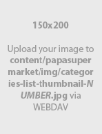

# Customization

This page will explain all configuration available and how to edit each section appear on theme. Let's view the first homepage.


## Top Banner


The top banner can be showed / edited in admin page > __Marketing__ > __Banners__. When you add / edit remember to choose __Location__ is __Top of Page__.

### Colors Customization

To customize colors of this section, go to admin page > __Storefront Design__ > __My Themes__, click button __Customize__ of the current theme to open the Theme Editor. 


Look into the options showing below:


## Header

### Header Styles
This theme support 3 different header styles:
- Logo at left
- Logo at center
- Logo at right


To configure, open the __Theme Editor__, scroll down to section __Logo__, click to expand the logo options. Choose a certain option of __Logo position__, then click __Refresh__ button appear after.


### Phone Number & Store Address


Store address and phone number are pulled out from your store profile. You can edit it in __Store Setup__ > __Store Profile__:


### Colors Customization

To customize colors of the header section, look into the options showing below in the Theme Editor:


## Main Slideshow / Carousel


### Edit the slideshow

Edit the slideshow in admin page > __Storefront Design__ > __Design Options__:


### Colors Customization

To customize color of the slideshow's elements, look into section __Carousel__ in the Theme Editor:


### Hide the slideshow

To hide the slideshow on homepage, uncheck on the checkbox __Show Carousel__ in section __Carousel__ of the Theme Editor.


## 3 Banners on Homepage


To show these banners on homepage, from your admin page > __Marketing__ > __Banners __> click button __Create a Banner__. In field __Banner Content__, click button HTML to open __HTML Source Editor__, input content below:

```html
<div id="emthemesModezBannersBlockHome01" class="emthemesModez-section  emthemesModez-section--banners-3x">
<div class="emthemesModez-section-inner">
<div class="emthemesModez-bannersContainer 
            emthemesModez-bannersContainer--onethird-x3 
            emthemesModez-bannersContainer--onethird-x3-1 
            ">
<div class="emthemesModez-banner">
<div class="emthemesModez-banner-container"><a href="#"></a></div>
</div>
<div class="emthemesModez-banner">
<div class="emthemesModez-banner-container"><a href="#"></a></div>
</div>
<div class="emthemesModez-banner">
<div class="emthemesModez-banner-container"><a href="#"></a></div>
</div>
</div>
</div>
</div>
```


Then click __Update__ button to go back previous screen.

Choose __Show on Page__ is __Home Page__.

Choose __Location__ is __Top of Page__.


Click __Save__ button to finish.

You can freely edit the HTML above to change banner images or link but keep the HTML attribute `id="emthemesModezBannersBlockHome01"` unchanged.


## Featured / Bestselling / New In Product Tabs


You can configure this section in __Theme Editor__ > __Homepage__:


## Products By Category


This section will show products by category. You can choose number of categories to display products. Categories are sorted by order specified in __Product Categories__ admin manager.


### Hot Categories

The __Hot Categories__ appears on the right is sub-categories of the current category.


### Banner Image


The placeholder image can be replaced by uploading your own images to your BigCommerce WebDAV. Upload your image to correct path `content/papasupermarket/img/products-by-category-CATEGORYID.jpg` where `CATEGORYID` is replaced by your current category ID.

You can find Category ID by editing that category and look at the URL:


To access to your WebDAV, from admin page > __Server Settings__ > __File Access (WebDAV)__, follow instruction on that page to upload files.


### Configuration 

To configure this section, go to __Theme Editor__ > __Homepage__ > __Products by Category with Sorting Tabs__:


## Top Categories


This block show top categories and child categories sorted by order in Product Categories manager.

### Configuration 

You can configure number of categories to display in __Theme Editor__ > __Homepage__ > __Top Categories__:


### Banner Images



Replace this placeholder image similar to [Replace image of Product by Categories section](customization.md#banner-image), except the image to upload is `content/papasupermarket/img/categories-list-thumbnail-NUMBER.jpg` where `NUMBER` is the index number start with 1.


## Fullwidth Banner on Homepage


To show these banners on homepage, from your admin page > __Marketing__ > __Banners __> click button __Create a Banner__. In field __Banner Content__, click button HTML to open __HTML Source Editor__, input content below:

```html
<div id="emthemesModezBannersBlockHome02" class="emthemesModez-section  emthemesModez-section--banners-one">
<div class="emthemesModez-section-inner">
<div class="emthemesModez-bannersContainer 
            emthemesModez-bannersContainer--one 
            emthemesModez-bannersContainer--one-1 
            ">
<div class="emthemesModez-banner">
<div class="emthemesModez-banner-container"><a href="#"></a></div>
</div>
</div>
</div>
</div>
```


Then click __Update__ button to go back previous screen.

Choose __Show on Page__ is __Home Page__.

Choose __Location__ is __Top of Page__.


Click __Save__ button to finish.

You can freely edit the HTML above to change banner images or link but keep the HTML attribute `id="emthemesModezBannersBlockHome02"` unchanged.


## Brand Carousel


To show this carousel on homepage, from your admin page > __Marketing__ > __Banners __> click button __Create a Banner__. In field __Banner Content__, click button HTML to open __HTML Source Editor__, input content below:

```html
<div id="emthemesModezBannersBlockHome03" class="emthemesModez-brandCarousel-container" data-section-type="brands-logo">
<div class="emthemesModez-brandCarousel" data-emthemesmodez-brand-carousel="">
<div class="emthemesModez-brandCarousel-slide"><a href="#"></a></div>
<div class="emthemesModez-brandCarousel-slide"><a href="#"></a></div>
<div class="emthemesModez-brandCarousel-slide"><a href="#"></a></div>
<div class="emthemesModez-brandCarousel-slide"><a href="#"></a></div>
<div class="emthemesModez-brandCarousel-slide"><a href="#"></a></div>
<div class="emthemesModez-brandCarousel-slide"><a href="#"></a></div>
<div class="emthemesModez-brandCarousel-slide"><a href="#"></a></div>
<div class="emthemesModez-brandCarousel-slide"><a href="#"></a></div>
<div class="emthemesModez-brandCarousel-slide"><a href="#"></a></div>
<div class="emthemesModez-brandCarousel-slide"><a href="#"></a></div>
</div>
</div>
```


Then click __Update__ button to go back previous screen.

Choose __Show on Page__ is __Home Page__.

Choose __Location__ is __Top of Page__.


Click __Save__ button to finish.

You can freely edit the HTML above to change banner images or link but keep the HTML attribute `id="emthemesModezBannersBlockHome03"` unchanged.


## Special Product Columns


This block show bestselling products, featured products, new products in columns.

You can configure this block in Theme Editor > Homepage > Special Products Columns:


## Footer - Newsletter


You can configure the newsletter block, show/hide or change color in __Theme Editor__ > __Footer__ > __Newsletter__:


## Footer - Links


You can change colors in __Theme Editor__ > __Footer__:


You can also show/hide about us block, pages, categories, brands, configure number of links to show.


## Footer - Payment Icons


To show/hide payment icons, go to Theme __Editor__ > __Payment Icons__ secitons, check or uncheck any icons you want to show or hide.


## Footer - Credit Links


To show/hide the credit links, go to Theme Editor > __Footer__ section, tick or untick the checkboxes as showing above.


## Add our own CSS (Sass) code

To add your own custom CSS code you can edit the file `assets/scss/_theme-custom.scss` in __Edit Theme Files__ editor:


__Note: __

- Copy / backup this file for future theme upgrade.
- Add custom CSS code required CSS (or Sass) programming skill. It's not recommended for new users.
