# Customization

This page will explain all configuration available and how to edit each section appear on theme. Let's view the first homepage.


## Top Banner


The top banner can be showed / edited in admin page > __Marketing__ > __Banners__. When you add / edit remember to choose __Location__ is __Top of Page__.

### Colors Customization

To customize colors of this section, go to admin page > __Storefront Design__ > __My Themes__, click button __Customize__ of the current theme to open the Theme Editor. 


Look into the options showing below:


## Header

### Header Styles
This theme support 2 different header styles:
- Logo at left
- Logo at right


To configure, open the __Theme Editor__, scroll down to section __Logo__, click to expand the logo options. Choose a certain option of __Logo position__, then click __Refresh__ button appear after.


### Edit top header text


Edit content in the language file, from admin page > __Storefront Design__ > __My Themes__, click button __Advanced__ > __Edit Theme Files__ of the current theme:


From the left navigation, click to edit the language file (e.i `en.json`):


Edit the text as figured above.


### Colors Customization

To customize colors of the header section, look into the options showing below in the Theme Editor:


## Main Slideshow / Carousel


### Edit the slideshow

Edit the slideshow in admin page > __Storefront Design__ > __Design Options__:


### Colors Customization

To customize color of the slideshow's elements, look into section __Carousel__ in the Theme Editor:


### Hide the slideshow

To hide the slideshow on homepage, uncheck on the checkbox __Show Carousel__ in section __Carousel__ of the Theme Editor.


## 2 Banners beside the main slideshow


To edit 2 banners, edit the language file `en.json`, find key `emthemesmodez` > `slideshow`:


- `title`: is banner alt text.
- `image`: is image URL.
- `url`: is image link.

You can remove 2 banners completely by editing template file `templates/components/emthemes-modez/sections/section1-sarahmarket1.html` delete the code figured as below:


## New / Featured / Popular Products

The theme supports 4 layout type of __New Products__, __Featured Products__ and __Popular Products__ blocks:

__Grid__:

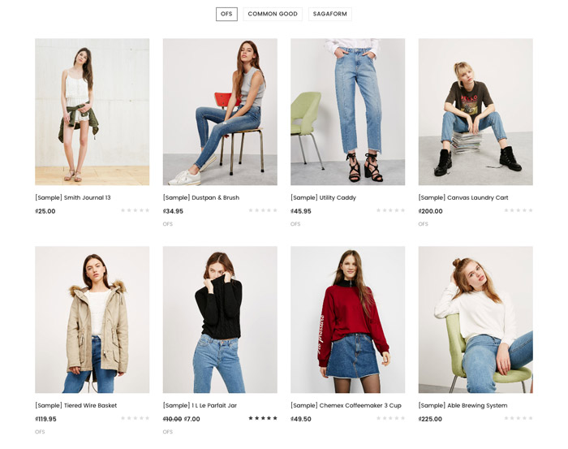

__Carousel__:

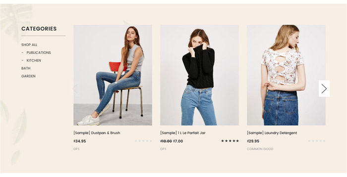

__Left Column Block__ & __Right Column Block__:


### Configure a Layout Type of products block & Number of Products to show up

In the __Theme Editor__ > __Homepage__, look into __New Products__ section (or __Featured Products__, __Most Popular Products__):

- __Display type__: Choose appropriate layout type (__Grid__, __Carousel__, __Left Column__ or __Right Column__).
- __Number of Products__: Choose number of products to show up.


### Show/Hide Quickview button

When hover on a product item, Quickview button is showed up by default. To disable this feature, uncheck the checkbox __Show Quickview__ in the __Theme Editor__ > __Products__ section.

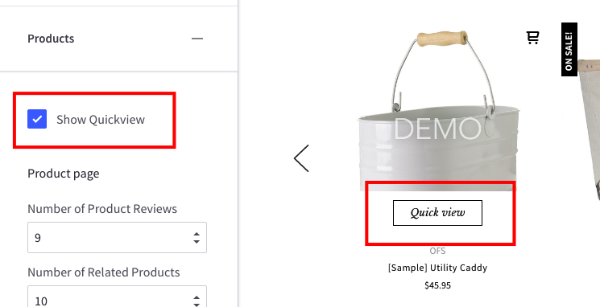

### Change colors and image sizes

In the __Theme Editor__ > __Products__ section, Look into the color options below __Product cards__, __Product Sale Badges__, __Product cards (Quick search)__ and __Image sizes__'s options.


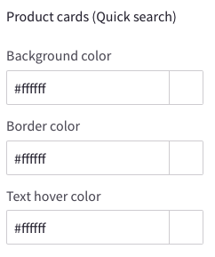


### Change the heading text

To change the heading text (New Products, Featured Products, Most Popular Products), edit the language file, look for the key `products` > `new` or `featured` or `top`.

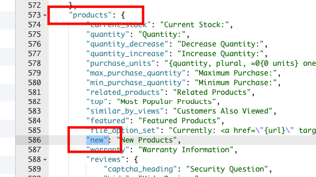


## New / Featured / Popular Products Tabs

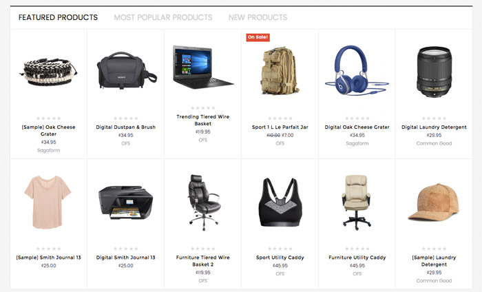

This section allows you to display __new products__, __featured products__, and __bestselling products__ in tabs. Products can be displayed as grid, list or carousel depend on configuration in the Theme Editor.


## Products by Category


This section let you show up products in a specific category. You can display this section type up to 6 sections, represent 6 different categories.

To specify which category to display, edit the language file `en.json`, find keys `emthemesmodez` > `products_by_category_sorting_tabs`:

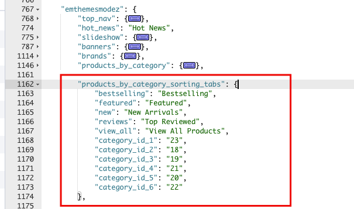

- You can change text of each tabs in keys `bestselling`, `featured`, `new`, `reviews`.
- The link text View All Products can be changed by editing key `view_all`.
- Input __category ID__ in key from `category_id_1` to `category_id_6` corresponding to 6 sections.

To find category ID of a certain category, go to admin page > Products > Product Categories, click on a category to edit. Now look at the URL on your browser, the ID is appear in the URL as showing below:


## Products by Category - Advanced Style

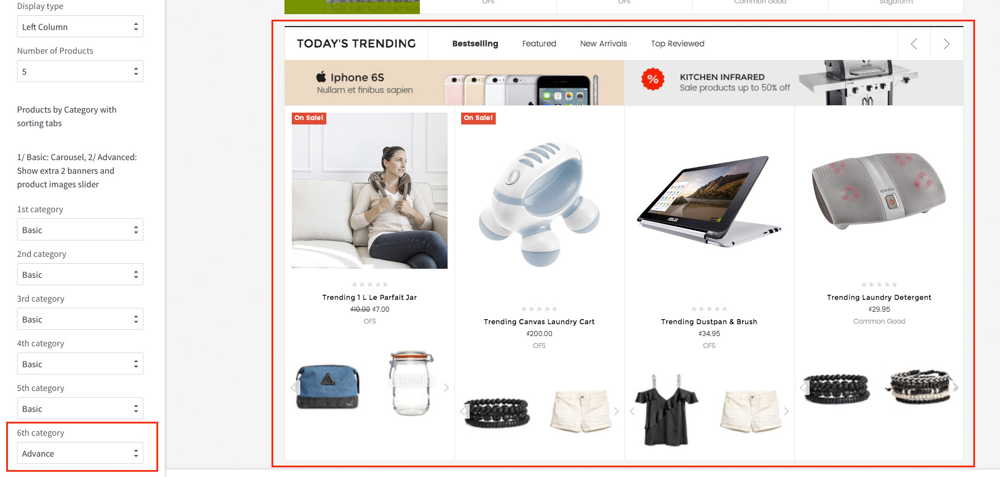

You can configure 6 secitons of products by category above with advanced style. Allow you to show more 2 additional banners and showing images of each products as slider.

In __Theme Editor__ > __Homepage__ section, configure products by category as figured above.

To edit these banners, edit the language file `en.json`, find keys `emthemessarahmarket` > `products_by_category_sorting_tabs`, `instance1` to `instance6` represent 6 sections:

### Edit banner images


- `banner1` and `banner2`: are banner image URL.
- `url1` and `url2`: are banner link.


## Products by Categories Tabs


This section let you show products by category, Each tab is a sub-category, tab content contains products in corresponding sub-categories. It show products immediately when click on a tab without leaving page.

You can show up to 3 sections of this section type. You can show root category or any sub-category as well.

To edit category ID and text, edit the the language file `en.json`, find keys `emthemesmodez` > `products_by_category_subcategories_tabs`:

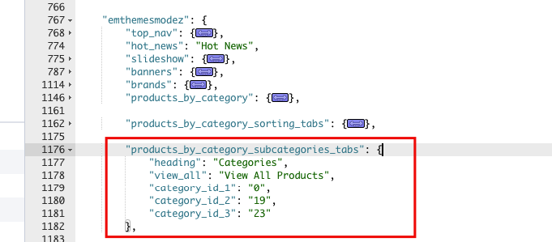

- `heading`: is the main heading if specific category is root category.
- `view_all`: is 'view all' link label.
- `category_1`, `category_2`, `category_3`: is category ID of section instance 1st, 2nd and 3rd. You can display up to 3 instances of this section. Value `0` specifies category is root category.


## Categories List

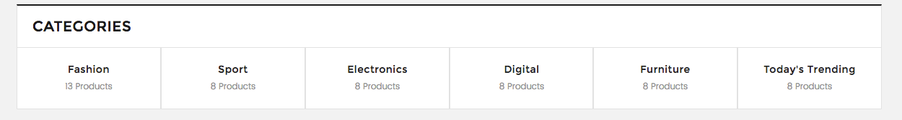

This section lets you show categories list, category images and number of products per category.

To edit text of this section, edit the language file `en.json`, find key `emthemesmodez` > `categories_grid`:


- `heading`: is section title.
- `products_count`: is the translation text showing number of products in category.


## Image Banners

Theme supports many banner styles:

### Fullwidth Banner


Support displaying up to 5 fullwidth banners on homepage.

To edit these banners, edit the language file `en.json`, find keys `emthemesmodez` > `banners` > `one_1` to `one_5` represent 5 fullwidth banners accordingly.

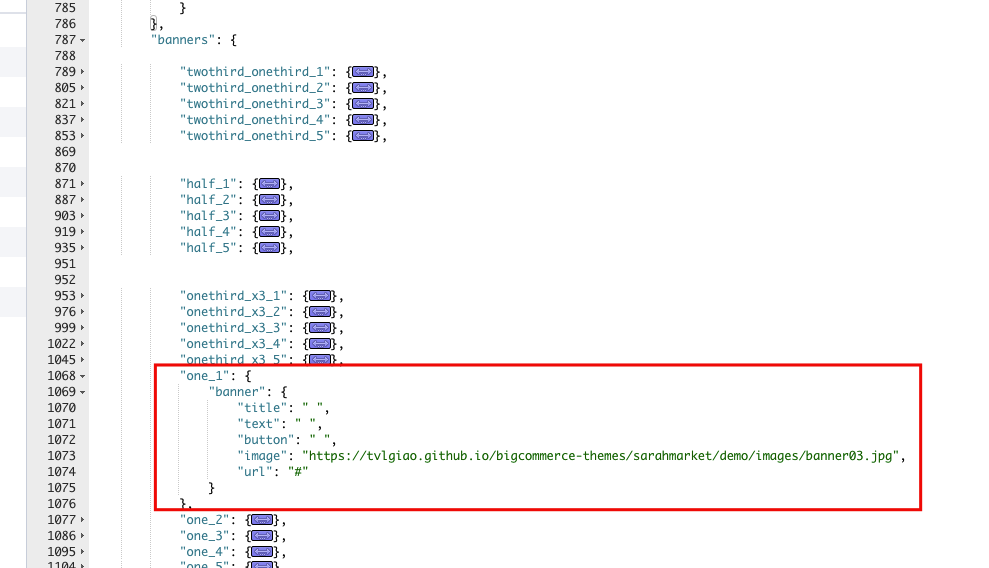

- `title`: is banner title text. Leave a single space character to hide it.
- `text`: is description text. Leave a single space character to hide it.
- `button`: is button text. Leave a single space character to hide it.
- `image`: is banner image URL.
- `url`: is banner link.


### 2 Half Banners


Support displaying up to 5 half-size banners on homepage.

To edit these banners, edit the language file `en.json`, find keys `emthemesmodez` > `banners` > `half_1` to `half_5` represent 5 fullwidth banners accordingly.

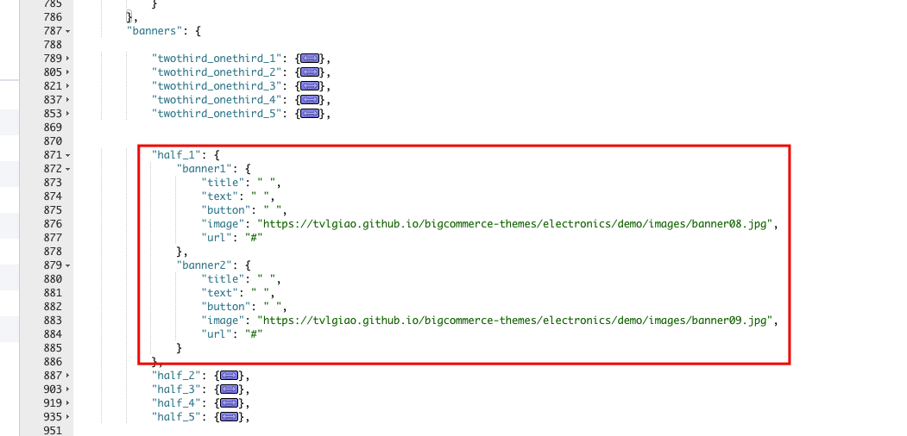


### 2/3 & 1/3 Banners


Support displaying up to 5 half-size banners on homepage.

To edit these banners, edit the language file `en.json`, find keys `emthemesmodez` > `banners` > `twothird_onethird_1` to `twothird_onethird_5` represent 5 fullwidth banners accordingly.


### 3 Banners


Support displaying up to 5 half-size banners on homepage.

To edit these banners, edit the language file `en.json`, find keys `emthemesmodez` > `banners` > `onethird_x3_1` to `onethird_x3_5` represent 5 fullwidth banners accordingly.


## Image Carousel


To edit image and links in this image carousel section, edit the language file, find key `emthemesmodez` > `image_carousel`


- `image*`: is link to the image.
- `title*`: is image text description.
- `url*`: is image link. Leave a single space letter in the value if you want to hide any image.


## Recent Blog Posts

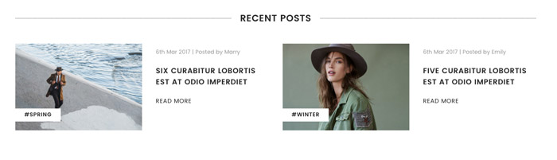

This block show the most recent blog posts.

### Customize heading text and other text

To change the heading text, read more text and date format, edit the language file. Find the key `blog` > `recent_posts`, `posted_by` and `read_more`, edit its values as you want.

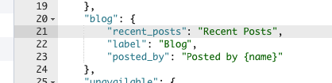


## Instagram Photos


### Get your own User ID, Client ID, Access Token

In order to display your Instagram photos on your website, you will need to get the __User ID__, __Client ID__ and __Access Token__ from __Instagram Developer__ portal.

#### 1. Create your own Client ID

Open the URL <https://www.instagram.com/developer/> in your browser.

Login to your Instagram account.

Click button __Register Your Application__: 

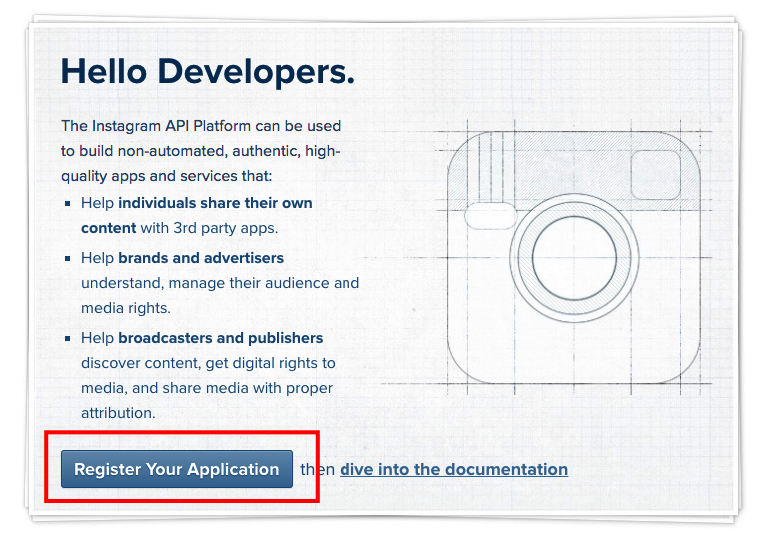

Click button __Register a New Client__: 


Enter all required info on the form. 

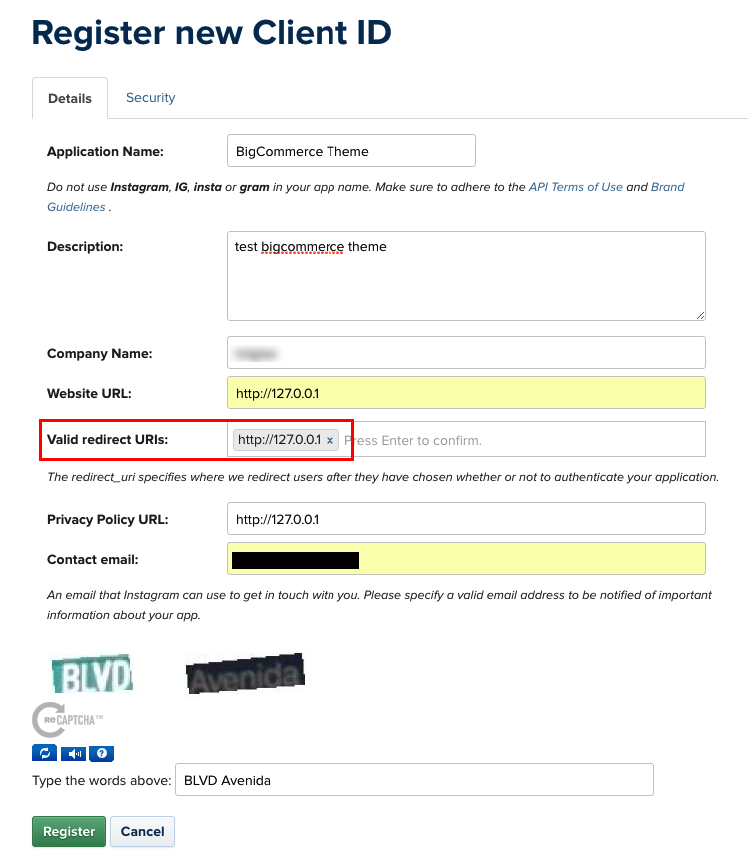

Note that __Valid redirect URIs__ should be exactly `http://127.0.0.1` as recommended as it will be used in the next step.

After submitting the form you will get back to the previous page with a new __Client ID__ is created.

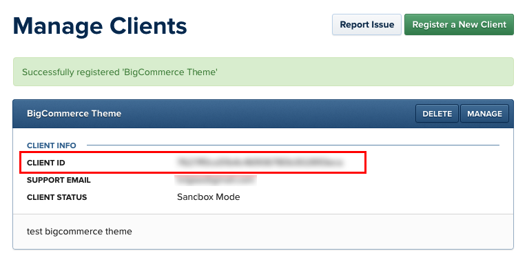

Save this __Client ID__ value, it will be used to configure the Instagram Photos block.

#### 2. Retrieve your Access Token

Click button __Manage__ on your the client app created previously. Open __Security__ tab, uncheck __Disable Implicit OAuth__ checkbox:

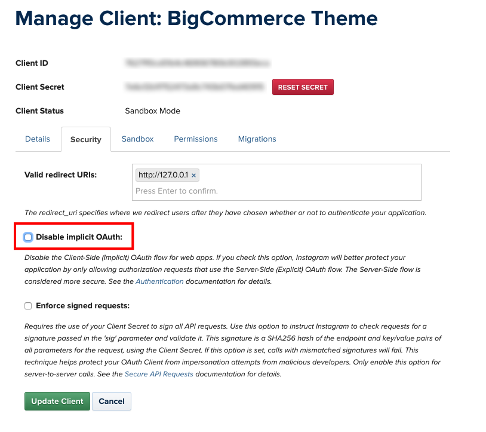

Click __Update Client__ button to complete.

Now open your web browser with the URL: 

```plain
https://api.instagram.com/oauth/authorize/?client_id=CLIENT-ID&redirect_uri=http://127.0.0.1&response_type=token
```

where `CLIENT-ID` is replaced by your __Client ID__ number created previously.

Click __Authorize__ button to grant access permission:


Instagram will redirect you to an error page with the URL similiar: 


The text after `access_token=` is the __Access Token__ you want to get. Save it for the next step.

#### 3. Retrieve your User ID

Open the link below on your web browser:

```plain
https://api.instagram.com/v1/users/self/?access_token=ACCESS-TOKEN
```
Where `ACCESS-TOKEN` is replaced by your real __Access Token__ just received previously.


The number in `"id": "..."` is your __User ID__.

### Display your Instagram photos

To display our own Instagram photos, edit the language file. Find the key `emthemesmodez` > `instagram`, input your real code:

- `user_id`: Is your Instagram __User ID__.
- `client_id`: is your Instagram __Client ID__.
- `access_token`: is your Instagram __Access Token__.
- `title`: Is the heading text.

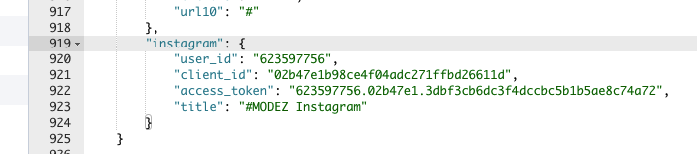


## Footer - Top info text

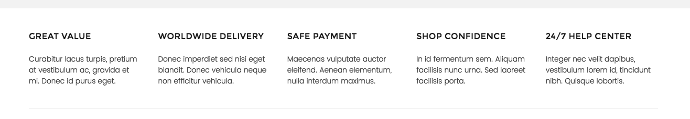

To edit this section's text, edit the language file `en.json`, find keys `emthemessarahmarket` > `footer` > `top_info`:

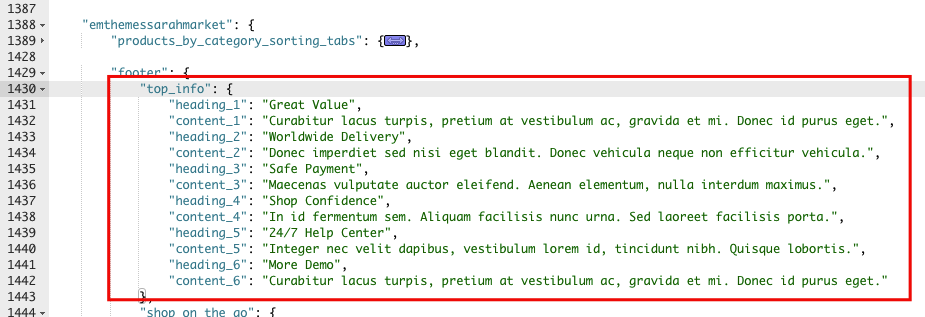

- `heading_*`: is heading text.
- `content_*`: is content text.

You can edit the template file `templates/components/common/footer.html` for advanced customization:

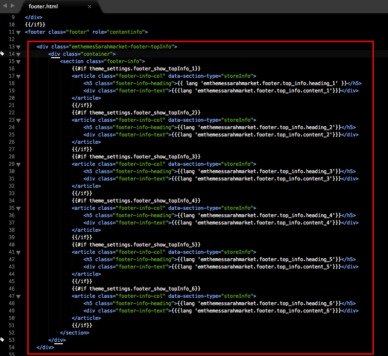


## Footer - Newsletter


### Edit text

To edit text in newsletter form, edit the language file `en.json`, find key `newsletter`, edit text in this section:


### Social media icons

Drag and drop social media icons you want to display in admin page > __Storefront Design__ > __Design Options__:


### Edit Shop On-The-Go text

To edit this text, edit the language file `en.json` > find key `emthemessarahmarket` > `footer` > `shop_on_the_go`:

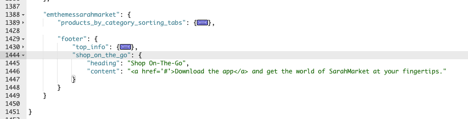


## Footer - Custom Links


To edit text and links in this footer section, edit the language file, find keys `footer`, 4 keys `links_col_1`, `links_col_2`, `links_col_3`, `links_col_4` represent 4 link columns:


- `heading`: is heading title in each column.
- `title`: is link label. Leave a single space character to hide this link.
- `url`: is link URL.


## Footer - Page Links


This section will show all our page links. To change the heading text __Navigate__, edit the language file `en.json`, find key `footer` > `navigate`, change this key value:


## Footer - Category Links

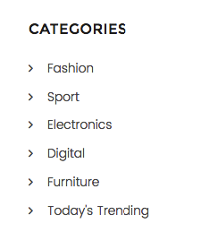

Edit heading text __Categories__ in the language file `en.json`, find key `footer` > `categories`:

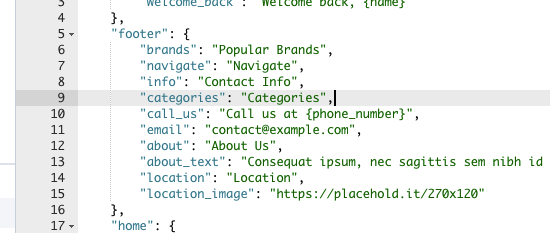


## Footer - Contact Info

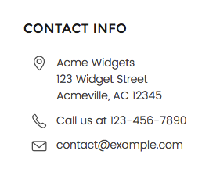

Edit heading text __Contact Info__ in the language file `en.json`, find key `footer` > `info`:

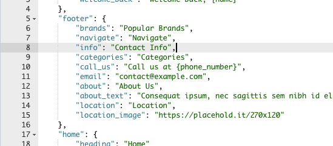

- `call_us`: is the translation text for phone calling number.
- `email`: is email to display.

Address can be edited in admin page > __Store Setup__ > __Store Profile__ > __Store Address__.


## Footer - Location

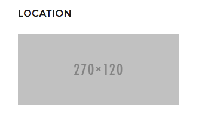

Edit heading text __Contact Info__ and the image in the language file `en.json`, find key `footer`, change value of `location` and `location_image`:

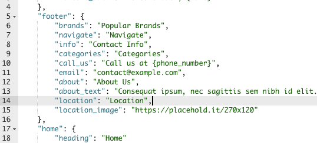


## Footer - Popular Brands


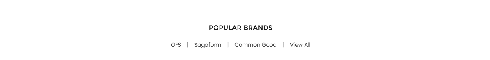

Edit heading text __Popular Brands__ in the language file `en.json`, find key `footer` > `brands`:


## Footer - Payment Icons


To show/hide payment icons, go to Theme __Editor__ > __Payment Icons__ secitons, check or uncheck any icons you want to show or hide.


## Footer - Credit Links


To show/hide the credit links, go to Theme Editor > __Footer__ section, tick or untick the checkboxes as showing above.


## Edit homepage template

This advanced topic will instruct you how to edit homepage template to customize your homepage, add more sections, delete or rearrange other sections.

To edit the homepage template, open __Edit Theme Files__, find and open file `templates` > `pages` > `home.html`:


Look at the code in `home.html`:

```
{{> components/emthemes-modez/sections/section section="featured_products"}}
{{> components/emthemes-modez/sections/section section="banner_one_1"}}
{{> components/emthemes-modez/sections/section section="popular_products"}}
{{> components/emthemes-modez/sections/section section="new_products"}}
{{> components/emthemes-modez/sections/section section="banner_one_2"}}
{{> components/emthemes-modez/sections/section section="products_by_category_sorting_tabs_1"}}
{{> components/emthemes-modez/sections/section section="banner_one_3"}}
{{> components/emthemes-modez/sections/section section="products_by_category_sorting_tabs_2"}}
{{> components/emthemes-modez/sections/section section="banner_one_4"}}
{{> components/emthemes-modez/sections/section section="products_by_category_sorting_tabs_3"}}
{{> components/emthemes-modez/sections/section section="banner_one_5"}}
{{> components/emthemes-modez/sections/section section="products_by_category_sorting_tabs_4"}}
{{> components/emthemes-modez/sections/section section="products_by_category_sorting_tabs_5"}}
{{> components/emthemes-modez/sections/section section="products_by_category_sorting_tabs_6"}}
{{> components/emthemes-modez/sections/section section="images_carousel"}}
```

each line represents a section appear on homepage. 

__Section supported:__

- `featured_products`                         : Show featured products. Screenshot: http://prntscr.com/elevep
- `popular_products`                          : Show popular products. Screenshot: http://prntscr.com/elevk2
- `new_products`                              : Show new products. Screenshot: http://prntscr.com/elevqg
- `special_products_tabs`                     : Show products tabs contain featured, popular, new products
- `categories_grid`                           : Show product categories
- `blog_recent`                               : Show recent posts
- `banner_one_1`                              : Show 1st full width banner. Screenshot: http://prntscr.com/elevyw
- `banner_one_2`                              : Show 2nd full width banner
- `banner_one_3`                              : Show 3rd full width banner
- `banner_one_4`                              : Show 4th full width banner
- `banner_one_5`                              : Show 5th full width banner
- `banner_half_1`                             : Show 1st 2 half banners
- `banner_half_2`                             : Show 2nd 2 half banners
- `banner_half_3`                             : Show 3rd 2 half banners
- `banner_half_4`                             : Show 4th 2 half banners
- `banner_half_5`                             : Show 5th 2 half banners
- `banner_2313_1`                             : Show 1st 2/3 + 1/3 banners
- `banner_2313_2`                             : Show 2nd 2/3 + 1/3 banners
- `banner_2313_3`                             : Show 3rd 2/3 + 1/3 banners
- `banner_2313_4`                             : Show 4th 2/3 + 1/3 banners
- `banner_2313_5`                             : Show 5th 2/3 + 1/3 banners
- `banner_3x_1`                               : Show 1st 3 1/3 banners
- `banner_3x_2`                               : Show 2nd 3 1/3 banners
- `banner_3x_3`                               : Show 3rd 3 1/3 banners
- `banner_3x_4`                               : Show 4th 3 1/3 banners
- `banner_3x_5`                               : Show 5th 3 1/3 banners
- `products_by_category_sorting_tabs_1`       : Show 1st products by a category with sorting tabs (featured, bestselling, new, top reviewed). Screenshot: http://prntscr.com/elewh4
- `products_by_category_sorting_tabs_2`       : Show 2nd products by a category with sorting tabs (featured, bestselling, new, top reviewed)
- `products_by_category_sorting_tabs_3`       : Show 3rd products by a category with sorting tabs (featured, bestselling, new, top reviewed)
- `products_by_category_sorting_tabs_4`       : Show 4th products by a category with sorting tabs (featured, bestselling, new, top reviewed)
- `products_by_category_sorting_tabs_5`       : Show 5th products by a category with sorting tabs (featured, bestselling, new, top reviewed)
- `products_by_category_sorting_tabs_6`       : Show 6th products by a category with sorting tabs (featured, bestselling, new, top reviewed)
- `products_by_category_subcategories_tabs_1` : Show 1st products by a categories with subcategories tabs
- `products_by_category_subcategories_tabs_2` : Show 2nd products by a categories with subcategories tabs
- `products_by_category_subcategories_tabs_3` : Show 3rd products by a categories with subcategories tabs
- `images_carousel`                           : Show images carousel. Screenshot: http://prntscr.com/elewn3
- `brands_carousel`                           : Show brands carousel


You can add or delete any section you want, rerrange by move each line up or down.


## Edit footer template

If you want more control about the footer, you can edit the footer template at `templates` > `components` > `common` > `footer.html`:

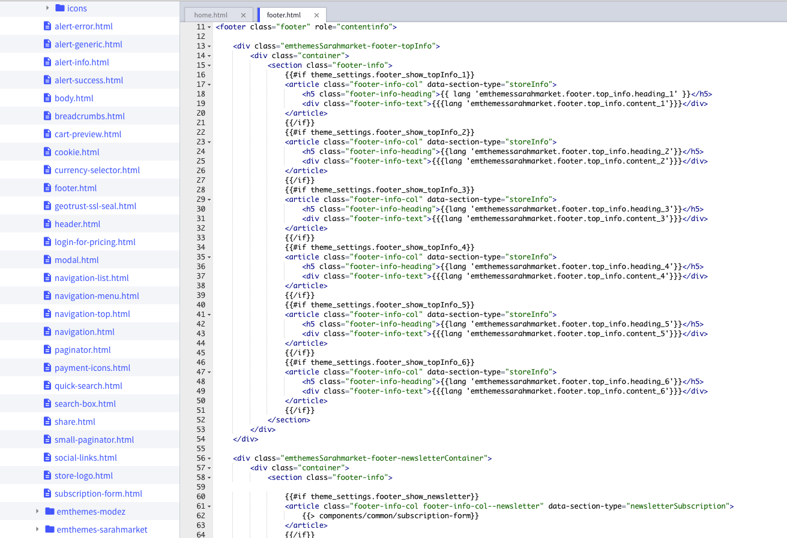

