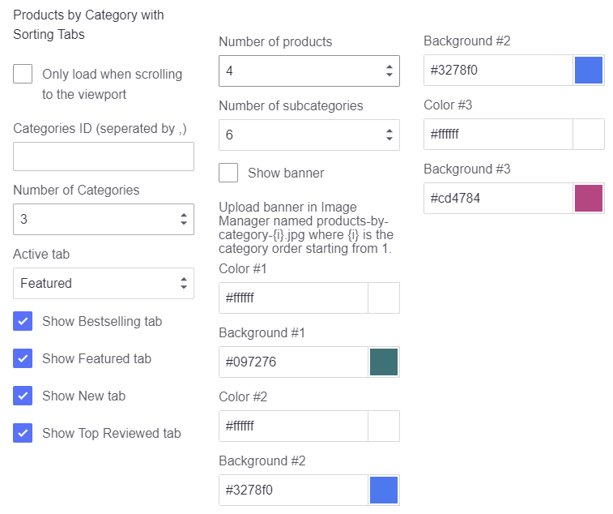

<script>
  angular.module("app", ['hljs']);
</script>
<div ng-app="app">
  <!-- Modal -->
  <div class="modal fade" id="bannersBlockHome01Modal" tabindex="-1" role="dialog" aria-labelledby="bannersBlockHome01ModalLabel">
    <div class="modal-dialog" role="document">
      <div class="modal-content">
        <div class="modal-header">
          <button type="button" class="close" data-dismiss="modal" aria-label="Close"><span aria-hidden="true">&times;</span></button>
          <h4 class="modal-title" id="bannersBlockHome01ModalLabel">Code Generator: Banners Block Home 01</h4>
        </div>
        <div class="modal-body">
          <form>
                <div class="panel-group" id="bannersBlockHome01Accordion" role="tablist" aria-multiselectable="true">
                  <div class="panel panel-default">
                    <div class="panel-heading" role="tab" id="bannersBlockHome01Banner1Heading">
                      <h4 class="panel-title">
                        <a role="button" data-toggle="collapse" data-parent="#bannersBlockHome01Accordion" href="#bannersBlockHome01Banner1Collapse" aria-expanded="true" aria-controls="bannersBlockHome01Banner1Collapse">
                          Banner 1
                        </a>
                      </h4>
                    </div>
                    <div id="bannersBlockHome01Banner1Collapse" class="panel-collapse collapse in" role="tabpanel" aria-labelledby="bannersBlockHome01Banner1Heading">
                      <div class="panel-body">
                        <div class="form-group">
                          <label for="bannersBlockHome01Banner1Img">Image URL:</label>
                          <input ng-model="banner1_img" type="text" class="form-control" id="bannersBlockHome01Banner1Img" placeholder="Example: https://tvlgiao.github.io/bigcommerce-themes/supermarket/demo/images/banner01.jpg">
                        </div>
                        <div class="form-group">
                          <label for="bannersBlockHome01Banner1Alt">Image Alt:</label>
                          <input ng-model="banner1_alt" type="text" class="form-control" id="bannersBlockHome01Banner1Alt" placeholder="Example: Banner 1">
                        </div>
                        <div class="form-group">
                          <label for="bannersBlockHome01Banner1Link">Link URL:</label>
                          <input ng-model="banner1_link" type="text" class="form-control" id="bannersBlockHome01Banner1Link" placeholder="Example: https://supermarket-blue-demo.mybigcommerce.com">
                        </div>
                      </div>
                    </div>
                  </div>
                  <div class="panel panel-default">
                    <div class="panel-heading" role="tab" id="bannersBlockHome01Banner2Heading">
                      <h4 class="panel-title">
                        <a class="collapsed" role="button" data-toggle="collapse" data-parent="#bannersBlockHome01Accordion" href="#bannersBlockHome01Banner2Collapse" aria-expanded="false" aria-controls="bannersBlockHome01Banner2Collapse">
                          Banner 2
                        </a>
                      </h4>
                    </div>
                    <div id="bannersBlockHome01Banner2Collapse" class="panel-collapse collapse" role="tabpanel" aria-labelledby="bannersBlockHome01Banner2Heading">
                      <div class="panel-body">
                        <div class="form-group">
                          <label for="bannersBlockHome01Banner2Img">Image URL:</label>
                          <input ng-model="banner2_img" type="text" class="form-control" id="bannersBlockHome01Banner2Img" placeholder="Example: https://tvlgiao.github.io/bigcommerce-themes/supermarket/demo/images/banner01.jpg">
                        </div>
                        <div class="form-group">
                          <label for="bannersBlockHome01Banner2Alt">Image Alt:</label>
                          <input ng-model="banner2_alt" type="text" class="form-control" id="bannersBlockHome01Banner2Alt" placeholder="Example: Banner 1">
                        </div>
                        <div class="form-group">
                          <label for="bannersBlockHome01Banner2Link">Link URL:</label>
                          <input ng-model="banner2_link" type="text" class="form-control" id="bannersBlockHome01Banner2Link" placeholder="Example: https://supermarket-blue-demo.mybigcommerce.com">
                        </div>
                      </div>
                    </div>
                  </div>
                  <div class="panel panel-default">
                    <div class="panel-heading" role="tab" id="bannersBlockHome01Banner3Heading">
                      <h4 class="panel-title">
                        <a class="collapsed" role="button" data-toggle="collapse" data-parent="#bannersBlockHome01Accordion" href="#bannersBlockHome01Banner3Collapse" aria-expanded="false" aria-controls="bannersBlockHome01Banner3Collapse">
                          Banner 3
                        </a>
                      </h4>
                    </div>
                    <div id="bannersBlockHome01Banner3Collapse" class="panel-collapse collapse" role="tabpanel" aria-labelledby="bannersBlockHome01Banner3Heading">
                      <div class="panel-body">
                        <div class="form-group">
                          <label for="bannersBlockHome01Banner3Img">Image URL:</label>
                          <input ng-model="banner3_img" type="text" class="form-control" id="bannersBlockHome01Banner3Img" placeholder="Example: https://tvlgiao.github.io/bigcommerce-themes/supermarket/demo/images/banner01.jpg">
                        </div>
                        <div class="form-group">
                          <label for="bannersBlockHome01Banner3Alt">Image Alt:</label>
                          <input ng-model="banner3_alt" type="text" class="form-control" id="bannersBlockHome01Banner3Alt" placeholder="Example: Banner 1">
                        </div>
                        <div class="form-group">
                          <label for="bannersBlockHome01Banner3Link">Link URL:</label>
                          <input ng-model="banner3_link" type="text" class="form-control" id="bannersBlockHome01Banner3Link" placeholder="Example: https://supermarket-blue-demo.mybigcommerce.com">
                        </div>
                      </div>
                    </div>
                  </div>
                </div>
                <div hljs include="'/samples/bannersBlockHome01.txt'" compile="true" id="bannersBlockHome01Code" class="highlight-code"></div>
          </form>
        </div>
        <div class="modal-footer">
          <button type="button" class="btn btn-default" data-dismiss="modal">Close</button>
          <button type="button" class="btn btn-primary" data-clipboard-target="#bannersBlockHome01Code">Copy Code</button>
        </div>
      </div>
    </div>
  </div><!-- modal #bannersBlockHome01Modal -->
  <!-- Modal -->
  <div class="modal fade" id="bannersBlockHome02Modal" tabindex="-1" role="dialog" aria-labelledby="bannersBlockHome02ModalLabel">
    <div class="modal-dialog" role="document">
      <div class="modal-content">
        <div class="modal-header">
          <button type="button" class="close" data-dismiss="modal" aria-label="Close"><span aria-hidden="true">&times;</span></button>
          <h4 class="modal-title" id="bannersBlockHome02ModalLabel">Code Generator: Banners Block Home 02</h4>
        </div>
        <div class="modal-body">
          <form>
                <div class="panel-group" id="bannersBlockHome02Accordion" role="tablist" aria-multiselectable="true">
                  <div class="panel panel-default">
                    <div class="panel-heading" role="tab" id="bannersBlockHome02BannerHeading">
                      <h4 class="panel-title">
                        <a role="button" data-toggle="collapse" data-parent="#bannersBlockHome02Accordion" href="#bannersBlockHome02BannerCollapse" aria-expanded="true" aria-controls="bannersBlockHome02BannerCollapse">
                          Banner
                        </a>
                      </h4>
                    </div>
                    <div id="bannersBlockHome02BannerCollapse" class="panel-collapse collapse in" role="tabpanel" aria-labelledby="bannersBlockHome02BannerHeading">
                      <div class="panel-body">
                        <div class="form-group">
                          <label for="bannersBlockHome02BannerImg">Image URL:</label>
                          <input ng-model="banner_img" type="text" class="form-control" id="bannersBlockHome02BannerImg" placeholder="Example: https://tvlgiao.github.io/bigcommerce-themes/supermarket/demo/images/banner04.jpg">
                        </div>
                        <div class="form-group">
                          <label for="bannersBlockHome02BannerAlt">Image Alt:</label>
                          <input ng-model="banner_alt" type="text" class="form-control" id="bannersBlockHome02BannerAlt" placeholder="Example: Banner 1">
                        </div>
                        <div class="form-group">
                          <label for="bannersBlockHome02BannerLink">Link URL:</label>
                          <input ng-model="banner_link" type="text" class="form-control" id="bannersBlockHome02BannerLink" placeholder="Example: https://supermarket-blue-demo.mybigcommerce.com">
                        </div>
                      </div>
                    </div>
                  </div>
                </div>
                <div hljs include="'/samples/bannersBlockHome02.txt'" compile="true" id="bannersBlockHome02Code" class="highlight-code"></div>
          </form>
        </div>
        <div class="modal-footer">
          <button type="button" class="btn btn-default" data-dismiss="modal">Close</button>
          <button type="button" class="btn btn-primary" data-clipboard-target="#bannersBlockHome02Code">Copy Code</button>
        </div>
      </div>
    </div>
  </div><!-- modal #bannersBlockHome02Modal -->
  <!-- Modal -->
  <div class="modal fade" id="bannersBlockHome03Modal" tabindex="-1" role="dialog" aria-labelledby="bannersBlockHome03ModalLabel">
    <div class="modal-dialog" role="document">
      <div class="modal-content">
        <div class="modal-header">
          <button type="button" class="close" data-dismiss="modal" aria-label="Close"><span aria-hidden="true">&times;</span></button>
          <h4 class="modal-title" id="bannersBlockHome03ModalLabel">Code Generator: Banners Block Home 03</h4>
        </div>
        <div class="modal-body">
          <form>
                <div class="panel-group" id="bannersBlockHome03Accordion" role="tablist" aria-multiselectable="true">
                  <div class="panel panel-default">
                    <div class="panel-heading" role="tab" id="bannersBlockHome03Banner1Heading">
                      <h4 class="panel-title">
                        <a role="button" data-toggle="collapse" data-parent="#bannersBlockHome03Accordion" href="#bannersBlockHome03Banner1Collapse" aria-expanded="true" aria-controls="bannersBlockHome03Banner1Collapse">
                          Banner 1
                        </a>
                      </h4>
                    </div>
                    <div id="bannersBlockHome03Banner1Collapse" class="panel-collapse collapse in" role="tabpanel" aria-labelledby="bannersBlockHome03Banner1Heading">
                      <div class="panel-body">
                        <div class="form-group">
                          <label for="bannersBlockHome03Banner1Img">Image URL:</label>
                          <input ng-model="banner1_img" type="text" class="form-control" id="bannersBlockHome03Banner1Img" placeholder="Example: https://tvlgiao.github.io/bigcommerce-themes/supermarket/demo/images/banner01.jpg">
                        </div>
                        <div class="form-group">
                          <label for="bannersBlockHome03Banner1Alt">Image Alt:</label>
                          <input ng-model="banner1_alt" type="text" class="form-control" id="bannersBlockHome03Banner1Alt" placeholder="Example: Banner 1">
                        </div>
                        <div class="form-group">
                          <label for="bannersBlockHome03Banner1Link">Link URL:</label>
                          <input ng-model="banner1_link" type="text" class="form-control" id="bannersBlockHome03Banner1Link" placeholder="Example: https://supermarket-blue-demo.mybigcommerce.com">
                        </div>
                      </div>
                    </div>
                  </div>
                  <div class="panel panel-default">
                    <div class="panel-heading" role="tab" id="bannersBlockHome03Banner2Heading">
                      <h4 class="panel-title">
                        <a class="collapsed" role="button" data-toggle="collapse" data-parent="#bannersBlockHome03Accordion" href="#bannersBlockHome03Banner2Collapse" aria-expanded="false" aria-controls="bannersBlockHome03Banner2Collapse">
                          Banner 2
                        </a>
                      </h4>
                    </div>
                    <div id="bannersBlockHome03Banner2Collapse" class="panel-collapse collapse" role="tabpanel" aria-labelledby="bannersBlockHome03Banner2Heading">
                      <div class="panel-body">
                        <div class="form-group">
                          <label for="bannersBlockHome03Banner2Img">Image URL:</label>
                          <input ng-model="banner2_img" type="text" class="form-control" id="bannersBlockHome03Banner2Img" placeholder="Example: https://tvlgiao.github.io/bigcommerce-themes/supermarket/demo/images/banner01.jpg">
                        </div>
                        <div class="form-group">
                          <label for="bannersBlockHome03Banner2Alt">Image Alt:</label>
                          <input ng-model="banner2_alt" type="text" class="form-control" id="bannersBlockHome03Banner2Alt" placeholder="Example: Banner 1">
                        </div>
                        <div class="form-group">
                          <label for="bannersBlockHome03Banner2Link">Link URL:</label>
                          <input ng-model="banner2_link" type="text" class="form-control" id="bannersBlockHome03Banner2Link" placeholder="Example: https://supermarket-blue-demo.mybigcommerce.com">
                        </div>
                      </div>
                    </div>
                  </div>
                  <div class="panel panel-default">
                    <div class="panel-heading" role="tab" id="bannersBlockHome03Banner3Heading">
                      <h4 class="panel-title">
                        <a class="collapsed" role="button" data-toggle="collapse" data-parent="#bannersBlockHome03Accordion" href="#bannersBlockHome03Banner3Collapse" aria-expanded="false" aria-controls="bannersBlockHome03Banner3Collapse">
                          Banner 3
                        </a>
                      </h4>
                    </div>
                    <div id="bannersBlockHome03Banner3Collapse" class="panel-collapse collapse" role="tabpanel" aria-labelledby="bannersBlockHome03Banner3Heading">
                      <div class="panel-body">
                        <div class="form-group">
                          <label for="bannersBlockHome03Banner3Img">Image URL:</label>
                          <input ng-model="banner3_img" type="text" class="form-control" id="bannersBlockHome03Banner3Img" placeholder="Example: https://tvlgiao.github.io/bigcommerce-themes/supermarket/demo/images/banner01.jpg">
                        </div>
                        <div class="form-group">
                          <label for="bannersBlockHome03Banner3Alt">Image Alt:</label>
                          <input ng-model="banner3_alt" type="text" class="form-control" id="bannersBlockHome03Banner3Alt" placeholder="Example: Banner 1">
                        </div>
                        <div class="form-group">
                          <label for="bannersBlockHome03Banner3Link">Link URL:</label>
                          <input ng-model="banner3_link" type="text" class="form-control" id="bannersBlockHome03Banner3Link" placeholder="Example: https://supermarket-blue-demo.mybigcommerce.com">
                        </div>
                      </div>
                    </div>
                  </div>
                  <div class="panel panel-default">
                    <div class="panel-heading" role="tab" id="bannersBlockHome03Banner4Heading">
                      <h4 class="panel-title">
                        <a class="collapsed" role="button" data-toggle="collapse" data-parent="#bannersBlockHome03Accordion" href="#bannersBlockHome03Banner4Collapse" aria-expanded="false" aria-controls="bannersBlockHome03Banner4Collapse">
                          Banner 4
                        </a>
                      </h4>
                    </div>
                    <div id="bannersBlockHome03Banner4Collapse" class="panel-collapse collapse" role="tabpanel" aria-labelledby="bannersBlockHome03Banner4Heading">
                      <div class="panel-body">
                        <div class="form-group">
                          <label for="bannersBlockHome03Banner4Img">Image URL:</label>
                          <input ng-model="banner4_img" type="text" class="form-control" id="bannersBlockHome03Banner4Img" placeholder="Example: https://tvlgiao.github.io/bigcommerce-themes/laparis/demo/images/brand04.png">
                        </div>
                        <div class="form-group">
                          <label for="bannersBlockHome03Banner4Alt">Image Alt:</label>
                          <input ng-model="banner4_alt" type="text" class="form-control" id="bannersBlockHome03Banner4Alt" placeholder="Example: Banner 4">
                        </div>
                        <div class="form-group">
                          <label for="bannersBlockHome03Banner4Link">Link URL:</label>
                          <input ng-model="banner4_link" type="text" class="form-control" id="bannersBlockHome03Banner4Link" placeholder="Example: https://supermarket-blue-demo.mybigcommerce.com">
                        </div>
                      </div>
                    </div>
                  </div>
                  <div class="panel panel-default">
                    <div class="panel-heading" role="tab" id="bannersBlockHome03Banner5Heading">
                      <h4 class="panel-title">
                        <a class="collapsed" role="button" data-toggle="collapse" data-parent="#bannersBlockHome03Accordion" href="#bannersBlockHome03Banner5Collapse" aria-expanded="false" aria-controls="bannersBlockHome03Banner5Collapse">
                          Banner 5
                        </a>
                      </h4>
                    </div>
                    <div id="bannersBlockHome03Banner5Collapse" class="panel-collapse collapse" role="tabpanel" aria-labelledby="bannersBlockHome03Banner5Heading">
                      <div class="panel-body">
                        <div class="form-group">
                          <label for="bannersBlockHome03Banner5Img">Image URL:</label>
                          <input ng-model="banner5_img" type="text" class="form-control" id="bannersBlockHome03Banner5Img" placeholder="Example: https://tvlgiao.github.io/bigcommerce-themes/laparis/demo/images/brand05.png">
                        </div>
                        <div class="form-group">
                          <label for="bannersBlockHome03Banner5Alt">Image Alt:</label>
                          <input ng-model="banner5_alt" type="text" class="form-control" id="bannersBlockHome03Banner5Alt" placeholder="Example: Banner 5">
                        </div>
                        <div class="form-group">
                          <label for="bannersBlockHome03Banner5Link">Link URL:</label>
                          <input ng-model="banner5_link" type="text" class="form-control" id="bannersBlockHome03Banner5Link" placeholder="Example: https://supermarket-blue-demo.mybigcommerce.com">
                        </div>
                      </div>
                    </div>
                  </div>
                  <div class="panel panel-default">
                    <div class="panel-heading" role="tab" id="bannersBlockHome03Banner6Heading">
                      <h4 class="panel-title">
                        <a class="collapsed" role="button" data-toggle="collapse" data-parent="#bannersBlockHome03Accordion" href="#bannersBlockHome03Banner6Collapse" aria-expanded="false" aria-controls="bannersBlockHome03Banner6Collapse">
                          Banner 6
                        </a>
                      </h4>
                    </div>
                    <div id="bannersBlockHome03Banner6Collapse" class="panel-collapse collapse" role="tabpanel" aria-labelledby="bannersBlockHome03Banner6Heading">
                      <div class="panel-body">
                        <div class="form-group">
                          <label for="bannersBlockHome03Banner6Img">Image URL:</label>
                          <input ng-model="banner6_img" type="text" class="form-control" id="bannersBlockHome03Banner6Img" placeholder="Example: https://tvlgiao.github.io/bigcommerce-themes/laparis/demo/images/brand01.png">
                        </div>
                        <div class="form-group">
                          <label for="bannersBlockHome03Banner6Alt">Image Alt:</label>
                          <input ng-model="banner6_alt" type="text" class="form-control" id="bannersBlockHome03Banner6Alt" placeholder="Example: Banner 6">
                        </div>
                        <div class="form-group">
                          <label for="bannersBlockHome03Banner6Link">Link URL:</label>
                          <input ng-model="banner6_link" type="text" class="form-control" id="bannersBlockHome03Banner6Link" placeholder="Example: https://supermarket-blue-demo.mybigcommerce.com">
                        </div>
                      </div>
                    </div>
                  </div>
                  <div class="panel panel-default">
                    <div class="panel-heading" role="tab" id="bannersBlockHome03Banner7Heading">
                      <h4 class="panel-title">
                        <a class="collapsed" role="button" data-toggle="collapse" data-parent="#bannersBlockHome03Accordion" href="#bannersBlockHome03Banner7Collapse" aria-expanded="false" aria-controls="bannersBlockHome03Banner7Collapse">
                          Banner 7
                        </a>
                      </h4>
                    </div>
                    <div id="bannersBlockHome03Banner7Collapse" class="panel-collapse collapse" role="tabpanel" aria-labelledby="bannersBlockHome03Banner7Heading">
                      <div class="panel-body">
                        <div class="form-group">
                          <label for="bannersBlockHome03Banner7Img">Image URL:</label>
                          <input ng-model="banner7_img" type="text" class="form-control" id="bannersBlockHome03Banner7Img" placeholder="Example: https://tvlgiao.github.io/bigcommerce-themes/laparis/demo/images/brand02.png">
                        </div>
                        <div class="form-group">
                          <label for="bannersBlockHome03Banner7Alt">Image Alt:</label>
                          <input ng-model="banner7_alt" type="text" class="form-control" id="bannersBlockHome03Banner7Alt" placeholder="Example: Banner 7">
                        </div>
                        <div class="form-group">
                          <label for="bannersBlockHome03Banner7Link">Link URL:</label>
                          <input ng-model="banner7_link" type="text" class="form-control" id="bannersBlockHome03Banner7Link" placeholder="Example: https://supermarket-blue-demo.mybigcommerce.com">
                        </div>
                      </div>
                    </div>
                  </div>
                  <div class="panel panel-default">
                    <div class="panel-heading" role="tab" id="bannersBlockHome03Banner8Heading">
                      <h4 class="panel-title">
                        <a class="collapsed" role="button" data-toggle="collapse" data-parent="#bannersBlockHome03Accordion" href="#bannersBlockHome03Banner8Collapse" aria-expanded="false" aria-controls="bannersBlockHome03Banner8Collapse">
                          Banner 8
                        </a>
                      </h4>
                    </div>
                    <div id="bannersBlockHome03Banner8Collapse" class="panel-collapse collapse" role="tabpanel" aria-labelledby="bannersBlockHome03Banner8Heading">
                      <div class="panel-body">
                        <div class="form-group">
                          <label for="bannersBlockHome03Banner8Img">Image URL:</label>
                          <input ng-model="banner8_img" type="text" class="form-control" id="bannersBlockHome03Banner8Img" placeholder="Example: https://tvlgiao.github.io/bigcommerce-themes/laparis/demo/images/brand03.png">
                        </div>
                        <div class="form-group">
                          <label for="bannersBlockHome03Banner8Alt">Image Alt:</label>
                          <input ng-model="banner8_alt" type="text" class="form-control" id="bannersBlockHome03Banner8Alt" placeholder="Example: Banner 8">
                        </div>
                        <div class="form-group">
                          <label for="bannersBlockHome03Banner8Link">Link URL:</label>
                          <input ng-model="banner8_link" type="text" class="form-control" id="bannersBlockHome03Banner8Link" placeholder="Example: https://supermarket-blue-demo.mybigcommerce.com">
                        </div>
                      </div>
                    </div>
                  </div>
                  <div class="panel panel-default">
                    <div class="panel-heading" role="tab" id="bannersBlockHome03Banner9Heading">
                      <h4 class="panel-title">
                        <a class="collapsed" role="button" data-toggle="collapse" data-parent="#bannersBlockHome03Accordion" href="#bannersBlockHome03Banner9Collapse" aria-expanded="false" aria-controls="bannersBlockHome03Banner9Collapse">
                          Banner 9
                        </a>
                      </h4>
                    </div>
                    <div id="bannersBlockHome03Banner9Collapse" class="panel-collapse collapse" role="tabpanel" aria-labelledby="bannersBlockHome03Banner9Heading">
                      <div class="panel-body">
                        <div class="form-group">
                          <label for="bannersBlockHome03Banner9Img">Image URL:</label>
                          <input ng-model="banner9_img" type="text" class="form-control" id="bannersBlockHome03Banner9Img" placeholder="Example: https://tvlgiao.github.io/bigcommerce-themes/laparis/demo/images/brand04.png">
                        </div>
                        <div class="form-group">
                          <label for="bannersBlockHome03Banner9Alt">Image Alt:</label>
                          <input ng-model="banner9_alt" type="text" class="form-control" id="bannersBlockHome03Banner9Alt" placeholder="Example: Banner 9">
                        </div>
                        <div class="form-group">
                          <label for="bannersBlockHome03Banner9Link">Link URL:</label>
                          <input ng-model="banner9_link" type="text" class="form-control" id="bannersBlockHome03Banner9Link" placeholder="Example: https://supermarket-blue-demo.mybigcommerce.com">
                        </div>
                      </div>
                    </div>
                  </div>
                  <div class="panel panel-default">
                    <div class="panel-heading" role="tab" id="bannersBlockHome03Banner10Heading">
                      <h4 class="panel-title">
                        <a class="collapsed" role="button" data-toggle="collapse" data-parent="#bannersBlockHome03Accordion" href="#bannersBlockHome03Banner10Collapse" aria-expanded="false" aria-controls="bannersBlockHome03Banner10Collapse">
                          Banner 10
                        </a>
                      </h4>
                    </div>
                    <div id="bannersBlockHome03Banner10Collapse" class="panel-collapse collapse" role="tabpanel" aria-labelledby="bannersBlockHome03Banner10Heading">
                      <div class="panel-body">
                        <div class="form-group">
                          <label for="bannersBlockHome03Banner10Img">Image URL:</label>
                          <input ng-model="banner10_img" type="text" class="form-control" id="bannersBlockHome03Banner10Img" placeholder="Example: https://tvlgiao.github.io/bigcommerce-themes/laparis/demo/images/brand05.png">
                        </div>
                        <div class="form-group">
                          <label for="bannersBlockHome03Banner10Alt">Image Alt:</label>
                          <input ng-model="banner10_alt" type="text" class="form-control" id="bannersBlockHome03Banner10Alt" placeholder="Example: Banner 10">
                        </div>
                        <div class="form-group">
                          <label for="bannersBlockHome03Banner10Link">Link URL:</label>
                          <input ng-model="banner10_link" type="text" class="form-control" id="bannersBlockHome03Banner10Link" placeholder="Example: https://supermarket-blue-demo.mybigcommerce.com">
                        </div>
                      </div>
                    </div>
                  </div>
                </div>
                <div hljs include="'/samples/bannersBlockHome03.txt'" compile="true" id="bannersBlockHome03Code" class="highlight-code"></div>
          </form>
        </div>
        <div class="modal-footer">
          <button type="button" class="btn btn-default" data-dismiss="modal">Close</button>
          <button type="button" class="btn btn-primary" data-clipboard-target="#bannersBlockHome03Code">Copy Code</button>
        </div>
      </div>
    </div>
  </div><!-- modal #bannersBlockHome03Modal -->
  <!-- Modal -->
  <div class="modal fade" id="bannersBlockSidebarImgModal" tabindex="-1" role="dialog" aria-labelledby="bannersBlockSidebarImgModalLabel">
    <div class="modal-dialog" role="document">
      <div class="modal-content">
        <div class="modal-header">
          <button type="button" class="close" data-dismiss="modal" aria-label="Close"><span aria-hidden="true">&times;</span></button>
          <h4 class="modal-title" id="bannersBlockSidebarImgModalLabel">Code Generator: Banners Block on Sidebar</h4>
        </div>
        <div class="modal-body">
          <form>
                <div class="panel-group" id="bannersBlockSidebarImgAccordion" role="tablist" aria-multiselectable="true">
                  <div class="panel panel-default">
                    <div class="panel-heading" role="tab" id="bannersBlockSidebarImgBannerHeading">
                      <h4 class="panel-title">
                        <a role="button" data-toggle="collapse" data-parent="#bannersBlockSidebarImgAccordion" href="#bannersBlockSidebarImgBannerCollapse" aria-expanded="true" aria-controls="bannersBlockSidebarImgBannerCollapse">
                          Banner
                        </a>
                      </h4>
                    </div>
                    <div id="bannersBlockSidebarImgBannerCollapse" class="panel-collapse collapse in" role="tabpanel" aria-labelledby="bannersBlockSidebarImgBannerHeading">
                      <div class="panel-body">
                        <div class="form-group">
                          <label for="bannersBlockSidebarImgBannerPosition">Position:</label>
                          <select ng-model="banner_position" class="form-control" id="bannersBlockSidebarImgBannerPosition">
                            <option value="01">Before Facebook Block</option>
                            <option value="02">After Facebook Block</option>
                          </select>
                        </div>
                        <div class="form-group">
                          <label for="bannersBlockSidebarImgBannerImg">Image URL:</label>
                          <input ng-model="banner_img" type="text" class="form-control" id="bannersBlockSidebarImgBannerImg" placeholder="Example: https://placehold.it/270x450">
                        </div>
                        <div class="form-group">
                          <label for="bannersBlockSidebarImgBannerAlt">Image Alt:</label>
                          <input ng-model="banner_alt" type="text" class="form-control" id="bannersBlockSidebarImgBannerAlt" placeholder="Example: Banner 1">
                        </div>
                        <div class="form-group">
                          <label for="bannersBlockSidebarImgBannerLink">Link URL:</label>
                          <input ng-model="banner_link" type="text" class="form-control" id="bannersBlockSidebarImgBannerLink" placeholder="Example: https://supermarket-blue-demo.mybigcommerce.com">
                        </div>
                      </div>
                    </div>
                  </div>
                </div>
                <div hljs include="'/samples/bannersBlockSidebarImg.txt'" compile="true" id="bannersBlockSidebarImgCode" class="highlight-code"></div>
          </form>
        </div>
        <div class="modal-footer">
          <button type="button" class="btn btn-default" data-dismiss="modal">Close</button>
          <button type="button" class="btn btn-primary" data-clipboard-target="#bannersBlockSidebarImgCode">Copy Code</button>
        </div>
      </div>
    </div>
  </div><!-- modal #bannersBlockSidebarImgModal -->
  <!-- Modal -->
  <div class="modal fade" id="bannersBlockSidebarTextBlockModal" tabindex="-1" role="dialog" aria-labelledby="bannersBlockSidebarTextBlockModalLabel">
    <div class="modal-dialog" role="document">
      <div class="modal-content">
        <div class="modal-header">
          <button type="button" class="close" data-dismiss="modal" aria-label="Close"><span aria-hidden="true">&times;</span></button>
          <h4 class="modal-title" id="bannersBlockSidebarTextBlockModalLabel">Code Generator: Text Block on Sidebar</h4>
        </div>
        <div class="modal-body">
          <form>
                <div class="panel-group" id="bannersBlockSidebarTextBlockAccordion" role="tablist" aria-multiselectable="true">
                  <div class="panel panel-default">
                    <div class="panel-heading" role="tab" id="bannersBlockSidebarTextBlockPanelHeading">
                      <h4 class="panel-title">
                        <a role="button" data-toggle="collapse" data-parent="#bannersBlockSidebarTextBlockAccordion" href="#bannersBlockSidebarTextBlockCollapse" aria-expanded="true" aria-controls="bannersBlockSidebarTextBlockCollapse">
                          Banner
                        </a>
                      </h4>
                    </div>
                    <div id="bannersBlockSidebarTextBlockCollapse" class="panel-collapse collapse in" role="tabpanel" aria-labelledby="bannersBlockSidebarTextBlockPanelHeading">
                      <div class="panel-body">
                        <div class="form-group">
                          <label for="bannersBlockSidebarTextBlockPosition">Position:</label>
                          <select ng-model="position" class="form-control" id="bannersBlockSidebarTextBlockPosition">
                            <option value="01">Before Facebook Block</option>
                            <option value="02">After Facebook Block</option>
                          </select>
                        </div>
                        <div class="form-group">
                          <label for="bannersBlockSidebarTextBlockHeading">Heading:</label>
                          <input ng-model="heading" type="text" class="form-control" id="bannersBlockSidebarTextBlockHeading" placeholder="Example: Custom Block">
                        </div>
                        <div class="form-group">
                          <label for="bannersBlockSidebarTextBlockBannerContent">Content:</label>
                          <textarea ng-model="content" type="text" class="form-control" id="bannersBlockSidebarTextBlockBannerContent" placeholder="Custom block displayed at the left sidebar. You can put your own content here: text, html, images, media... whatever you like. Here are many similar sample content placeholders across the store. All editable from admin panel. Sample Button"></textarea>
                        </div>
                        <div class="form-group">
                          <label for="bannersBlockSidebarTextBlockButtonText">Button Text:</label>
                          <input ng-model="btn_text" type="text" class="form-control" id="bannersBlockSidebarTextBlockButtonText" placeholder="Example: Sample Button">
                        </div>
                        <div class="form-group">
                          <label for="bannersBlockSidebarTextBlockButtonLink">Button URL:</label>
                          <input ng-model="btn_link" type="text" class="form-control" id="bannersBlockSidebarTextBlockButtonLink" placeholder="Example: https://supermarket-blue-demo.mybigcommerce.com">
                        </div>
                      </div>
                    </div>
                  </div>
                </div>
                <div hljs include="'/samples/bannersBlockSidebarTextBlock.txt'" compile="true" id="bannersBlockSidebarTextBlockCode" class="highlight-code"></div>
          </form>
        </div>
        <div class="modal-footer">
          <button type="button" class="btn btn-default" data-dismiss="modal">Close</button>
          <button type="button" class="btn btn-primary" data-clipboard-target="#bannersBlockSidebarTextBlockCode">Copy Code</button>
        </div>
      </div>
    </div>
  </div><!-- modal #bannersBlockSidebarTextBlockModal -->
</div>


# Customization

This page will explain all configuration available and how to edit each section appear on theme. Let's view the first homepage.


## Use Fixed Vertical Menu layout across the whole site


You can enable this layout in __Theme Editor__ > __Global__ > __Layout__, choose `Left Sidebar`:


## Top Banner


The top banner can be showed / edited in admin page > __Marketing__ > __Banners__. When you add / edit remember to choose __Location__ is __Top of Page__.

### Colors Customization

To customize colors of this section, go to admin page > __Storefront Design__ > __My Themes__, click button __Customize__ of the current theme to open the Theme Editor. 


Look into the options showing below:


## Header

### Header Styles
This theme support 3 different header styles:
- Logo at left
- Logo at center
- Logo at right


To configure, open the __Theme Editor__, scroll down to section __Logo__, click to expand the logo options. Choose a certain option of __Logo position__, then click __Refresh__ button appear after.


### Welcome Text


This welcome text can be showed/hide in the __Theme Editor__ > __Header__ > __Show welcome text__:


You can edit the text in the language file `lang/en.json` in __Edit Theme Files__:


### Phone Number & Store Address


Store address and phone number are pulled out from your store profile. You can edit it in __Store Setup__ > __Store Profile__:


### Social Media Icons


This social media icons group can be turned on/off in __Theme Editor__ > __Social Media Icons__ > __Placement__ > __Top/Right__:


To configure your social media links, go to admin page > __Storefront Design__ > __Design Options__ > __Social Media__ section:


### Colors Customization

To customize colors of the header section, look into the options showing below in the Theme Editor:


## Main Slideshow / Carousel


### Edit the slideshow

Edit the slideshow in admin page > __Storefront Design__ > __Design Options__:


### Colors Customization

To customize color of the slideshow's elements, look into section __Carousel__ in the Theme Editor:


### Hide the slideshow

To hide the slideshow on homepage, uncheck on the checkbox __Show Carousel__ in section __Carousel__ of the Theme Editor.


## 3 Banners on Homepage


To show these banners on homepage, from your admin page > __Marketing__ > __Banners __> click button __Create a Banner__. In field __Banner Content__, click button HTML to open __HTML Source Editor__, input content below:

```html
<div id="emthemesModezBannersBlockHome01" class="emthemesModez-section  emthemesModez-section--banners-3x">
<div class="emthemesModez-section-inner">
<div class="emthemesModez-bannersContainer 
            emthemesModez-bannersContainer--onethird-x3 
            emthemesModez-bannersContainer--onethird-x3-1 
            ">
<div class="emthemesModez-banner">
<div class="emthemesModez-banner-container"><a href="#"></a></div>
</div>
<div class="emthemesModez-banner">
<div class="emthemesModez-banner-container"><a href="#"></a></div>
</div>
<div class="emthemesModez-banner">
<div class="emthemesModez-banner-container"><a href="#"></a></div>
</div>
</div>
</div>
</div>
```

Or use button below to generate the code with your own banners:

<!-- Button trigger modal -->
<button type="button" class="btn btn-primary btn-lg" data-toggle="modal" data-target="#bannersBlockHome01Modal">
  Launch Banner Code Generator
</button>


Then click __Update__ button to go back previous screen.

Choose __Show on Page__ is __Home Page__.

Choose __Location__ is __Top of Page__.


Click __Save__ button to finish.

You can freely edit the HTML above to change banner images or link but keep the HTML attribute `id="emthemesModezBannersBlockHome01"` unchanged.


## Featured / Bestselling / New In Product Tabs


You can configure this section in __Theme Editor__ > __Homepage__:


## Products By Category


This section will show products by category. You can choose number of categories to display products. Categories are sorted by order specified in __Product Categories__ admin manager.


### Hot Categories

The __Hot Categories__ appears on the right is sub-categories of the current category.


### Configuration 

To configure this section, go to __Theme Editor__ > __Homepage__ > __Products by Category with Sorting Tabs__:




## Top Categories


This block show top categories and child categories sorted by order in Product Categories manager.

### Configuration 

You can configure number of categories to display in __Theme Editor__ > __Homepage__ > __Top Categories__:


## Fullwidth Banner on Homepage


To show these banners on homepage, from your admin page > __Marketing__ > __Banners __> click button __Create a Banner__. In field __Banner Content__, click button HTML to open __HTML Source Editor__, input content below:

```html
<div id="emthemesModezBannersBlockHome02" class="emthemesModez-section  emthemesModez-section--banners-one">
<div class="emthemesModez-section-inner">
<div class="emthemesModez-bannersContainer 
            emthemesModez-bannersContainer--one 
            emthemesModez-bannersContainer--one-1 
            ">
<div class="emthemesModez-banner">
<div class="emthemesModez-banner-container"><a href="#"></a></div>
</div>
</div>
</div>
</div>
```

Or use button below to generate the code with your own banners:

<!-- Button trigger modal -->
<button type="button" class="btn btn-primary btn-lg" data-toggle="modal" data-target="#bannersBlockHome02Modal">
  Launch Banner Code Generator
</button>


Then click __Update__ button to go back previous screen.

Choose __Show on Page__ is __Home Page__.

Choose __Location__ is __Top of Page__.


Click __Save__ button to finish.

You can freely edit the HTML above to change banner images or link but keep the HTML attribute `id="emthemesModezBannersBlockHome02"` unchanged.


## Brand Carousel


To show this carousel on homepage, from your admin page > __Marketing__ > __Banners __> click button __Create a Banner__. In field __Banner Content__, click button HTML to open __HTML Source Editor__, input content below:

```html
<div id="emthemesModezBannersBlockHome03" class="emthemesModez-brandCarousel-container" data-section-type="brands-logo">
<div class="emthemesModez-brandCarousel" data-emthemesmodez-brand-carousel="">
<div class="emthemesModez-brandCarousel-slide"><a href="#"></a></div>
<div class="emthemesModez-brandCarousel-slide"><a href="#"></a></div>
<div class="emthemesModez-brandCarousel-slide"><a href="#"></a></div>
<div class="emthemesModez-brandCarousel-slide"><a href="#"></a></div>
<div class="emthemesModez-brandCarousel-slide"><a href="#"></a></div>
<div class="emthemesModez-brandCarousel-slide"><a href="#"></a></div>
<div class="emthemesModez-brandCarousel-slide"><a href="#"></a></div>
<div class="emthemesModez-brandCarousel-slide"><a href="#"></a></div>
<div class="emthemesModez-brandCarousel-slide"><a href="#"></a></div>
<div class="emthemesModez-brandCarousel-slide"><a href="#"></a></div>
</div>
</div>
```

Or use button below to generate the code:

<!-- Button trigger modal -->
<button type="button" class="btn btn-primary btn-lg" data-toggle="modal" data-target="#bannersBlockHome03Modal">
  Launch Banner Code Generator
</button>


Then click __Update__ button to go back previous screen.

Choose __Show on Page__ is __Home Page__.

Choose __Location__ is __Top of Page__.


Click __Save__ button to finish.

You can freely edit the HTML above to change banner images or link but keep the HTML attribute `id="emthemesModezBannersBlockHome03"` unchanged.


## Special Product Columns


This block show bestselling products, featured products, new products in columns.

You can configure this block in Theme Editor > Homepage > Special Products Columns:


## Footer - Newsletter


You can configure the newsletter block, show/hide or change color in __Theme Editor__ > __Footer__ > __Newsletter__:


## Footer - Links


You can change colors in __Theme Editor__ > __Footer__:


You can also show/hide about us block, pages, categories, brands, configure number of links to show.


## Footer - Payment Icons


To show/hide payment icons, go to Theme __Editor__ > __Payment Icons__ secitons, check or uncheck any icons you want to show or hide.


## Footer - Credit Links


To show/hide the credit links, go to Theme Editor > __Footer__ section, tick or untick the checkboxes as showing above.


## Banners on the Left Sidebar

### Show a banner above Facebook Like Page block


To show this banner, go to Marketing > Banners, click button __Create a Banner__. Input:

- __Banner Name__: whatever you want
- __Banner Content__: click the square button `HTML` to open HTML source code editor.

Copy and paste the sample code below:

```
<div class="sidebarBlock sidebarBlock--banner emthemesModezBannersBlockSidebar01">
<div class="emthemesModez-bannersContainer">
<div class="emthemesModez-banner">
<div class="emthemesModez-banner-figure"><a href="#"></a></div>
</div>
</div>
</div>
```

Or you can use this tool to generate your banner content:

<!-- Button trigger modal -->
<button type="button" class="btn btn-primary btn-lg" data-toggle="modal" data-target="#bannersBlockSidebarImgModal">
  Launch Banner Code Generator
</button>

- __Show on Page__: `Search Results Page`
- __Visible__: Checked
- __Location__: `Top of Page`


### Show banners & text block below Facebook Like Page block


To show this banner and the text block, go to Marketing > Banners, click button __Create a Banner__. Input:

- __Banner Name__: whatever you want
- __Banner Content__: click the square button `HTML` to open HTML source code editor.

Copy and paste the sample code below:

```
<!-- Banner -->
<div class="sidebarBlock sidebarBlock--banner emthemesModezBannersBlockSidebar02">
<div class="emthemesModez-bannersContainer">
<div class="emthemesModez-banner">
<div class="emthemesModez-banner-figure"><a href="#"></a></div>
</div>
</div>
</div>

<!-- Text Block -->
<div class="sidebarBlock sidebarBlock--textBlock sidebarBlock--mobileCollapsible emthemesModezBannersBlockSidebar02">
<h5 class="sidebarBlock-heading is-open" data-collapsible="#sidebar-textBlock01" data-collapsible-disabled-breakpoint="medium">Custom Block</h5>
<div id="sidebar-textBlock01" class="sidebarBlock-content is-open">
<p>Custom block displayed at the left sidebar. You can put your own content here: text, html, images, media... whatever you like.</p>
<p>Here are many similar sample content placeholders across the store. All editable from admin panel.</p>
<p><a class="button" href="#">Sample Button</a></p>
</div>
</div>

<!-- Banner -->
<div class="sidebarBlock sidebarBlock--banner emthemesModezBannersBlockSidebar02">
<div class="emthemesModez-bannersContainer">
<div class="emthemesModez-banner">
<div class="emthemesModez-banner-figure"><a href="#"></a></div>
</div>
</div>
</div>
```

Or you can use this tool to generate your banner & text block content:

<!-- Button trigger modal -->
<button type="button" class="btn btn-primary btn-lg" data-toggle="modal" data-target="#bannersBlockSidebarImgModal">
  Launch Banner Code Generator
</button>
<button type="button" class="btn btn-primary btn-lg" data-toggle="modal" data-target="#bannersBlockSidebarTextBlockModal">
  Launch Text Block Code Generator
</button>

- __Show on Page__: `Search Results Page`
- __Visible__: Checked
- __Location__: `Top of Page`


## Facebook Like Page on the Left Sidebar


You can show your own Facebook Like Page block or hide it completely. 

From __Theme Editor__ > __Social Media Icons__ > Enter your facebook page name in __Facebook page__ field. For example if your Facebook page URL is <https://www.facebook.com/papathemes/> you should only input `papathemes`.

To hide this block, just leave it empty value.


## Add our own CSS (Sass) code

To add your own custom CSS code you can edit the file `assets/scss/_theme-custom.scss` in __Edit Theme Files__ editor:


__Note: __

- Copy / backup this file for future theme upgrade.
- Add custom CSS code required CSS (or Sass) programming skill. It's not recommended for new users.

