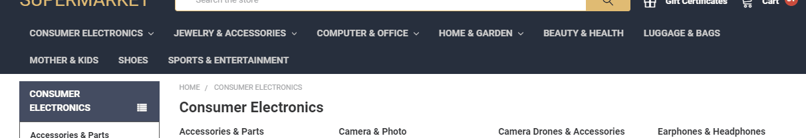
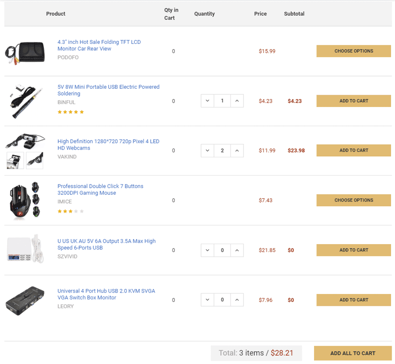
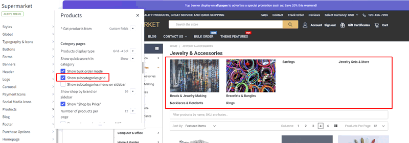
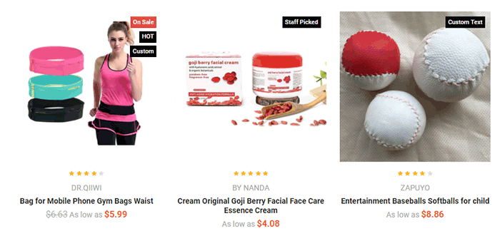
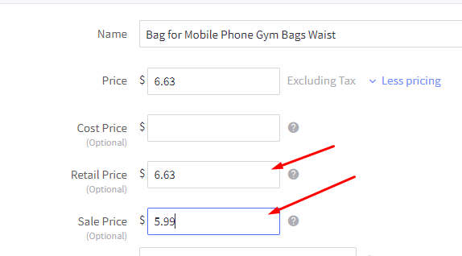
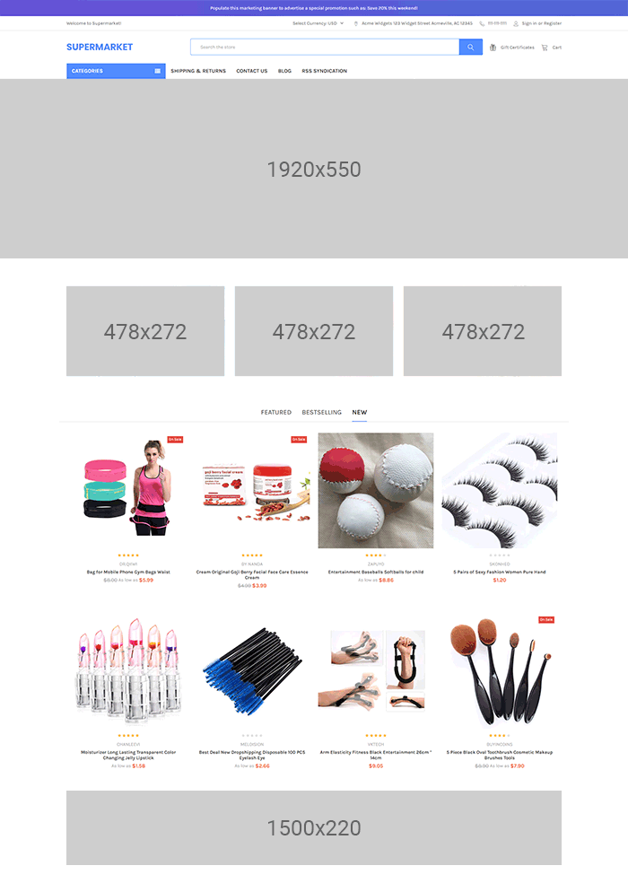

<div ng-app="app">
  <!-- Modal -->
  <div class="modal fade" id="bannersBlockHome01Modal" tabindex="-1" role="dialog" aria-labelledby="bannersBlockHome01ModalLabel">
    <div class="modal-dialog" role="document">
      <div class="modal-content">
        <div class="modal-header">
          <button type="button" class="close" data-dismiss="modal" aria-label="Close"><span aria-hidden="true">&times;</span></button>
          <h4 class="modal-title" id="bannersBlockHome01ModalLabel">Code Generator: Banners Block Home 01</h4>
        </div>
        <div class="modal-body">
          <form>
                <div class="panel-group" id="bannersBlockHome01Accordion" role="tablist" aria-multiselectable="true">
                  <div class="panel panel-default">
                    <div class="panel-heading" role="tab" id="bannersBlockHome01Banner1Heading">
                      <h4 class="panel-title">
                        <a role="button" data-toggle="collapse" data-parent="#bannersBlockHome01Accordion" href="#bannersBlockHome01Banner1Collapse" aria-expanded="true" aria-controls="bannersBlockHome01Banner1Collapse">
                          Banner 1
                        </a>
                      </h4>
                    </div>
                    <div id="bannersBlockHome01Banner1Collapse" class="panel-collapse collapse in" role="tabpanel" aria-labelledby="bannersBlockHome01Banner1Heading">
                      <div class="panel-body">
                        <div class="form-group">
                          <label for="bannersBlockHome01Banner1Img">Image URL:</label>
                          <input ng-model="banner1_img" type="text" class="form-control" id="bannersBlockHome01Banner1Img" placeholder="Example: https://tvlgiao.github.io/bigcommerce-themes/supermarket/demo/images/banner01.jpg">
                        </div>
                        <div class="form-group">
                          <label for="bannersBlockHome01Banner1Alt">Image Alt:</label>
                          <input ng-model="banner1_alt" type="text" class="form-control" id="bannersBlockHome01Banner1Alt" placeholder="Example: Banner 1">
                        </div>
                        <div class="form-group">
                          <label for="bannersBlockHome01Banner1Link">Link URL:</label>
                          <input ng-model="banner1_link" type="text" class="form-control" id="bannersBlockHome01Banner1Link" placeholder="Example: https://supermarket-blue-demo.mybigcommerce.com">
                        </div>
                      </div>
                    </div>
                  </div>
                  <div class="panel panel-default">
                    <div class="panel-heading" role="tab" id="bannersBlockHome01Banner2Heading">
                      <h4 class="panel-title">
                        <a class="collapsed" role="button" data-toggle="collapse" data-parent="#bannersBlockHome01Accordion" href="#bannersBlockHome01Banner2Collapse" aria-expanded="false" aria-controls="bannersBlockHome01Banner2Collapse">
                          Banner 2
                        </a>
                      </h4>
                    </div>
                    <div id="bannersBlockHome01Banner2Collapse" class="panel-collapse collapse" role="tabpanel" aria-labelledby="bannersBlockHome01Banner2Heading">
                      <div class="panel-body">
                        <div class="form-group">
                          <label for="bannersBlockHome01Banner2Img">Image URL:</label>
                          <input ng-model="banner2_img" type="text" class="form-control" id="bannersBlockHome01Banner2Img" placeholder="Example: https://tvlgiao.github.io/bigcommerce-themes/supermarket/demo/images/banner01.jpg">
                        </div>
                        <div class="form-group">
                          <label for="bannersBlockHome01Banner2Alt">Image Alt:</label>
                          <input ng-model="banner2_alt" type="text" class="form-control" id="bannersBlockHome01Banner2Alt" placeholder="Example: Banner 1">
                        </div>
                        <div class="form-group">
                          <label for="bannersBlockHome01Banner2Link">Link URL:</label>
                          <input ng-model="banner2_link" type="text" class="form-control" id="bannersBlockHome01Banner2Link" placeholder="Example: https://supermarket-blue-demo.mybigcommerce.com">
                        </div>
                      </div>
                    </div>
                  </div>
                  <div class="panel panel-default">
                    <div class="panel-heading" role="tab" id="bannersBlockHome01Banner3Heading">
                      <h4 class="panel-title">
                        <a class="collapsed" role="button" data-toggle="collapse" data-parent="#bannersBlockHome01Accordion" href="#bannersBlockHome01Banner3Collapse" aria-expanded="false" aria-controls="bannersBlockHome01Banner3Collapse">
                          Banner 3
                        </a>
                      </h4>
                    </div>
                    <div id="bannersBlockHome01Banner3Collapse" class="panel-collapse collapse" role="tabpanel" aria-labelledby="bannersBlockHome01Banner3Heading">
                      <div class="panel-body">
                        <div class="form-group">
                          <label for="bannersBlockHome01Banner3Img">Image URL:</label>
                          <input ng-model="banner3_img" type="text" class="form-control" id="bannersBlockHome01Banner3Img" placeholder="Example: https://tvlgiao.github.io/bigcommerce-themes/supermarket/demo/images/banner01.jpg">
                        </div>
                        <div class="form-group">
                          <label for="bannersBlockHome01Banner3Alt">Image Alt:</label>
                          <input ng-model="banner3_alt" type="text" class="form-control" id="bannersBlockHome01Banner3Alt" placeholder="Example: Banner 1">
                        </div>
                        <div class="form-group">
                          <label for="bannersBlockHome01Banner3Link">Link URL:</label>
                          <input ng-model="banner3_link" type="text" class="form-control" id="bannersBlockHome01Banner3Link" placeholder="Example: https://supermarket-blue-demo.mybigcommerce.com">
                        </div>
                      </div>
                    </div>
                  </div>
                </div>
                <div hljs include="'/samples/bannersBlockHome01.txt'" compile="true" id="bannersBlockHome01Code" class="highlight-code"></div>
          </form>
        </div>
        <div class="modal-footer">
          <button type="button" class="btn btn-default" data-dismiss="modal">Close</button>
          <button type="button" class="btn btn-primary" data-clipboard-target="#bannersBlockHome01Code">Copy Code</button>
        </div>
      </div>
    </div>
  </div><!-- modal #bannersBlockHome01Modal -->
  <!-- Modal -->
  <div class="modal fade" id="bannersBlockHome02Modal" tabindex="-1" role="dialog" aria-labelledby="bannersBlockHome02ModalLabel">
    <div class="modal-dialog" role="document">
      <div class="modal-content">
        <div class="modal-header">
          <button type="button" class="close" data-dismiss="modal" aria-label="Close"><span aria-hidden="true">&times;</span></button>
          <h4 class="modal-title" id="bannersBlockHome02ModalLabel">Code Generator: Banners Block Home 02</h4>
        </div>
        <div class="modal-body">
          <form>
                <div class="panel-group" id="bannersBlockHome02Accordion" role="tablist" aria-multiselectable="true">
                  <div class="panel panel-default">
                    <div class="panel-heading" role="tab" id="bannersBlockHome02BannerHeading">
                      <h4 class="panel-title">
                        <a role="button" data-toggle="collapse" data-parent="#bannersBlockHome02Accordion" href="#bannersBlockHome02BannerCollapse" aria-expanded="true" aria-controls="bannersBlockHome02BannerCollapse">
                          Banner
                        </a>
                      </h4>
                    </div>
                    <div id="bannersBlockHome02BannerCollapse" class="panel-collapse collapse in" role="tabpanel" aria-labelledby="bannersBlockHome02BannerHeading">
                      <div class="panel-body">
                        <div class="form-group">
                          <label for="bannersBlockHome02BannerImg">Image URL:</label>
                          <input ng-model="banner_img" type="text" class="form-control" id="bannersBlockHome02BannerImg" placeholder="Example: https://tvlgiao.github.io/bigcommerce-themes/supermarket/demo/images/banner04.jpg">
                        </div>
                        <div class="form-group">
                          <label for="bannersBlockHome02BannerAlt">Image Alt:</label>
                          <input ng-model="banner_alt" type="text" class="form-control" id="bannersBlockHome02BannerAlt" placeholder="Example: Banner 1">
                        </div>
                        <div class="form-group">
                          <label for="bannersBlockHome02BannerLink">Link URL:</label>
                          <input ng-model="banner_link" type="text" class="form-control" id="bannersBlockHome02BannerLink" placeholder="Example: https://supermarket-blue-demo.mybigcommerce.com">
                        </div>
                      </div>
                    </div>
                  </div>
                </div>
                <div hljs include="'/samples/bannersBlockHome02.txt'" compile="true" id="bannersBlockHome02Code" class="highlight-code"></div>
          </form>
        </div>
        <div class="modal-footer">
          <button type="button" class="btn btn-default" data-dismiss="modal">Close</button>
          <button type="button" class="btn btn-primary" data-clipboard-target="#bannersBlockHome02Code">Copy Code</button>
        </div>
      </div>
    </div>
  </div><!-- modal #bannersBlockHome02Modal -->
  <!-- Modal -->
  <div class="modal fade" id="bannersBlockHome03Modal" tabindex="-1" role="dialog" aria-labelledby="bannersBlockHome03ModalLabel">
    <div class="modal-dialog" role="document">
      <div class="modal-content">
        <div class="modal-header">
          <button type="button" class="close" data-dismiss="modal" aria-label="Close"><span aria-hidden="true">&times;</span></button>
          <h4 class="modal-title" id="bannersBlockHome03ModalLabel">Code Generator: Banners Block Home 03</h4>
        </div>
        <div class="modal-body">
          <form>
                <div class="panel-group" id="bannersBlockHome03Accordion" role="tablist" aria-multiselectable="true">
                  <div class="panel panel-default">
                    <div class="panel-heading" role="tab" id="bannersBlockHome03Banner1Heading">
                      <h4 class="panel-title">
                        <a role="button" data-toggle="collapse" data-parent="#bannersBlockHome03Accordion" href="#bannersBlockHome03Banner1Collapse" aria-expanded="true" aria-controls="bannersBlockHome03Banner1Collapse">
                          Banner 1
                        </a>
                      </h4>
                    </div>
                    <div id="bannersBlockHome03Banner1Collapse" class="panel-collapse collapse in" role="tabpanel" aria-labelledby="bannersBlockHome03Banner1Heading">
                      <div class="panel-body">
                        <div class="form-group">
                          <label for="bannersBlockHome03Banner1Img">Image URL:</label>
                          <input ng-model="banner1_img" type="text" class="form-control" id="bannersBlockHome03Banner1Img" placeholder="Example: https://tvlgiao.github.io/bigcommerce-themes/supermarket/demo/images/banner01.jpg">
                        </div>
                        <div class="form-group">
                          <label for="bannersBlockHome03Banner1Alt">Image Alt:</label>
                          <input ng-model="banner1_alt" type="text" class="form-control" id="bannersBlockHome03Banner1Alt" placeholder="Example: Banner 1">
                        </div>
                        <div class="form-group">
                          <label for="bannersBlockHome03Banner1Link">Link URL:</label>
                          <input ng-model="banner1_link" type="text" class="form-control" id="bannersBlockHome03Banner1Link" placeholder="Example: https://supermarket-blue-demo.mybigcommerce.com">
                        </div>
                      </div>
                    </div>
                  </div>
                  <div class="panel panel-default">
                    <div class="panel-heading" role="tab" id="bannersBlockHome03Banner2Heading">
                      <h4 class="panel-title">
                        <a class="collapsed" role="button" data-toggle="collapse" data-parent="#bannersBlockHome03Accordion" href="#bannersBlockHome03Banner2Collapse" aria-expanded="false" aria-controls="bannersBlockHome03Banner2Collapse">
                          Banner 2
                        </a>
                      </h4>
                    </div>
                    <div id="bannersBlockHome03Banner2Collapse" class="panel-collapse collapse" role="tabpanel" aria-labelledby="bannersBlockHome03Banner2Heading">
                      <div class="panel-body">
                        <div class="form-group">
                          <label for="bannersBlockHome03Banner2Img">Image URL:</label>
                          <input ng-model="banner2_img" type="text" class="form-control" id="bannersBlockHome03Banner2Img" placeholder="Example: https://tvlgiao.github.io/bigcommerce-themes/supermarket/demo/images/banner01.jpg">
                        </div>
                        <div class="form-group">
                          <label for="bannersBlockHome03Banner2Alt">Image Alt:</label>
                          <input ng-model="banner2_alt" type="text" class="form-control" id="bannersBlockHome03Banner2Alt" placeholder="Example: Banner 1">
                        </div>
                        <div class="form-group">
                          <label for="bannersBlockHome03Banner2Link">Link URL:</label>
                          <input ng-model="banner2_link" type="text" class="form-control" id="bannersBlockHome03Banner2Link" placeholder="Example: https://supermarket-blue-demo.mybigcommerce.com">
                        </div>
                      </div>
                    </div>
                  </div>
                  <div class="panel panel-default">
                    <div class="panel-heading" role="tab" id="bannersBlockHome03Banner3Heading">
                      <h4 class="panel-title">
                        <a class="collapsed" role="button" data-toggle="collapse" data-parent="#bannersBlockHome03Accordion" href="#bannersBlockHome03Banner3Collapse" aria-expanded="false" aria-controls="bannersBlockHome03Banner3Collapse">
                          Banner 3
                        </a>
                      </h4>
                    </div>
                    <div id="bannersBlockHome03Banner3Collapse" class="panel-collapse collapse" role="tabpanel" aria-labelledby="bannersBlockHome03Banner3Heading">
                      <div class="panel-body">
                        <div class="form-group">
                          <label for="bannersBlockHome03Banner3Img">Image URL:</label>
                          <input ng-model="banner3_img" type="text" class="form-control" id="bannersBlockHome03Banner3Img" placeholder="Example: https://tvlgiao.github.io/bigcommerce-themes/supermarket/demo/images/banner01.jpg">
                        </div>
                        <div class="form-group">
                          <label for="bannersBlockHome03Banner3Alt">Image Alt:</label>
                          <input ng-model="banner3_alt" type="text" class="form-control" id="bannersBlockHome03Banner3Alt" placeholder="Example: Banner 1">
                        </div>
                        <div class="form-group">
                          <label for="bannersBlockHome03Banner3Link">Link URL:</label>
                          <input ng-model="banner3_link" type="text" class="form-control" id="bannersBlockHome03Banner3Link" placeholder="Example: https://supermarket-blue-demo.mybigcommerce.com">
                        </div>
                      </div>
                    </div>
                  </div>
                  <div class="panel panel-default">
                    <div class="panel-heading" role="tab" id="bannersBlockHome03Banner4Heading">
                      <h4 class="panel-title">
                        <a class="collapsed" role="button" data-toggle="collapse" data-parent="#bannersBlockHome03Accordion" href="#bannersBlockHome03Banner4Collapse" aria-expanded="false" aria-controls="bannersBlockHome03Banner4Collapse">
                          Banner 4
                        </a>
                      </h4>
                    </div>
                    <div id="bannersBlockHome03Banner4Collapse" class="panel-collapse collapse" role="tabpanel" aria-labelledby="bannersBlockHome03Banner4Heading">
                      <div class="panel-body">
                        <div class="form-group">
                          <label for="bannersBlockHome03Banner4Img">Image URL:</label>
                          <input ng-model="banner4_img" type="text" class="form-control" id="bannersBlockHome03Banner4Img" placeholder="Example: https://tvlgiao.github.io/bigcommerce-themes/laparis/demo/images/brand04.png">
                        </div>
                        <div class="form-group">
                          <label for="bannersBlockHome03Banner4Alt">Image Alt:</label>
                          <input ng-model="banner4_alt" type="text" class="form-control" id="bannersBlockHome03Banner4Alt" placeholder="Example: Banner 4">
                        </div>
                        <div class="form-group">
                          <label for="bannersBlockHome03Banner4Link">Link URL:</label>
                          <input ng-model="banner4_link" type="text" class="form-control" id="bannersBlockHome03Banner4Link" placeholder="Example: https://supermarket-blue-demo.mybigcommerce.com">
                        </div>
                      </div>
                    </div>
                  </div>
                  <div class="panel panel-default">
                    <div class="panel-heading" role="tab" id="bannersBlockHome03Banner5Heading">
                      <h4 class="panel-title">
                        <a class="collapsed" role="button" data-toggle="collapse" data-parent="#bannersBlockHome03Accordion" href="#bannersBlockHome03Banner5Collapse" aria-expanded="false" aria-controls="bannersBlockHome03Banner5Collapse">
                          Banner 5
                        </a>
                      </h4>
                    </div>
                    <div id="bannersBlockHome03Banner5Collapse" class="panel-collapse collapse" role="tabpanel" aria-labelledby="bannersBlockHome03Banner5Heading">
                      <div class="panel-body">
                        <div class="form-group">
                          <label for="bannersBlockHome03Banner5Img">Image URL:</label>
                          <input ng-model="banner5_img" type="text" class="form-control" id="bannersBlockHome03Banner5Img" placeholder="Example: https://tvlgiao.github.io/bigcommerce-themes/laparis/demo/images/brand05.png">
                        </div>
                        <div class="form-group">
                          <label for="bannersBlockHome03Banner5Alt">Image Alt:</label>
                          <input ng-model="banner5_alt" type="text" class="form-control" id="bannersBlockHome03Banner5Alt" placeholder="Example: Banner 5">
                        </div>
                        <div class="form-group">
                          <label for="bannersBlockHome03Banner5Link">Link URL:</label>
                          <input ng-model="banner5_link" type="text" class="form-control" id="bannersBlockHome03Banner5Link" placeholder="Example: https://supermarket-blue-demo.mybigcommerce.com">
                        </div>
                      </div>
                    </div>
                  </div>
                  <div class="panel panel-default">
                    <div class="panel-heading" role="tab" id="bannersBlockHome03Banner6Heading">
                      <h4 class="panel-title">
                        <a class="collapsed" role="button" data-toggle="collapse" data-parent="#bannersBlockHome03Accordion" href="#bannersBlockHome03Banner6Collapse" aria-expanded="false" aria-controls="bannersBlockHome03Banner6Collapse">
                          Banner 6
                        </a>
                      </h4>
                    </div>
                    <div id="bannersBlockHome03Banner6Collapse" class="panel-collapse collapse" role="tabpanel" aria-labelledby="bannersBlockHome03Banner6Heading">
                      <div class="panel-body">
                        <div class="form-group">
                          <label for="bannersBlockHome03Banner6Img">Image URL:</label>
                          <input ng-model="banner6_img" type="text" class="form-control" id="bannersBlockHome03Banner6Img" placeholder="Example: https://tvlgiao.github.io/bigcommerce-themes/laparis/demo/images/brand01.png">
                        </div>
                        <div class="form-group">
                          <label for="bannersBlockHome03Banner6Alt">Image Alt:</label>
                          <input ng-model="banner6_alt" type="text" class="form-control" id="bannersBlockHome03Banner6Alt" placeholder="Example: Banner 6">
                        </div>
                        <div class="form-group">
                          <label for="bannersBlockHome03Banner6Link">Link URL:</label>
                          <input ng-model="banner6_link" type="text" class="form-control" id="bannersBlockHome03Banner6Link" placeholder="Example: https://supermarket-blue-demo.mybigcommerce.com">
                        </div>
                      </div>
                    </div>
                  </div>
                  <div class="panel panel-default">
                    <div class="panel-heading" role="tab" id="bannersBlockHome03Banner7Heading">
                      <h4 class="panel-title">
                        <a class="collapsed" role="button" data-toggle="collapse" data-parent="#bannersBlockHome03Accordion" href="#bannersBlockHome03Banner7Collapse" aria-expanded="false" aria-controls="bannersBlockHome03Banner7Collapse">
                          Banner 7
                        </a>
                      </h4>
                    </div>
                    <div id="bannersBlockHome03Banner7Collapse" class="panel-collapse collapse" role="tabpanel" aria-labelledby="bannersBlockHome03Banner7Heading">
                      <div class="panel-body">
                        <div class="form-group">
                          <label for="bannersBlockHome03Banner7Img">Image URL:</label>
                          <input ng-model="banner7_img" type="text" class="form-control" id="bannersBlockHome03Banner7Img" placeholder="Example: https://tvlgiao.github.io/bigcommerce-themes/laparis/demo/images/brand02.png">
                        </div>
                        <div class="form-group">
                          <label for="bannersBlockHome03Banner7Alt">Image Alt:</label>
                          <input ng-model="banner7_alt" type="text" class="form-control" id="bannersBlockHome03Banner7Alt" placeholder="Example: Banner 7">
                        </div>
                        <div class="form-group">
                          <label for="bannersBlockHome03Banner7Link">Link URL:</label>
                          <input ng-model="banner7_link" type="text" class="form-control" id="bannersBlockHome03Banner7Link" placeholder="Example: https://supermarket-blue-demo.mybigcommerce.com">
                        </div>
                      </div>
                    </div>
                  </div>
                  <div class="panel panel-default">
                    <div class="panel-heading" role="tab" id="bannersBlockHome03Banner8Heading">
                      <h4 class="panel-title">
                        <a class="collapsed" role="button" data-toggle="collapse" data-parent="#bannersBlockHome03Accordion" href="#bannersBlockHome03Banner8Collapse" aria-expanded="false" aria-controls="bannersBlockHome03Banner8Collapse">
                          Banner 8
                        </a>
                      </h4>
                    </div>
                    <div id="bannersBlockHome03Banner8Collapse" class="panel-collapse collapse" role="tabpanel" aria-labelledby="bannersBlockHome03Banner8Heading">
                      <div class="panel-body">
                        <div class="form-group">
                          <label for="bannersBlockHome03Banner8Img">Image URL:</label>
                          <input ng-model="banner8_img" type="text" class="form-control" id="bannersBlockHome03Banner8Img" placeholder="Example: https://tvlgiao.github.io/bigcommerce-themes/laparis/demo/images/brand03.png">
                        </div>
                        <div class="form-group">
                          <label for="bannersBlockHome03Banner8Alt">Image Alt:</label>
                          <input ng-model="banner8_alt" type="text" class="form-control" id="bannersBlockHome03Banner8Alt" placeholder="Example: Banner 8">
                        </div>
                        <div class="form-group">
                          <label for="bannersBlockHome03Banner8Link">Link URL:</label>
                          <input ng-model="banner8_link" type="text" class="form-control" id="bannersBlockHome03Banner8Link" placeholder="Example: https://supermarket-blue-demo.mybigcommerce.com">
                        </div>
                      </div>
                    </div>
                  </div>
                  <div class="panel panel-default">
                    <div class="panel-heading" role="tab" id="bannersBlockHome03Banner9Heading">
                      <h4 class="panel-title">
                        <a class="collapsed" role="button" data-toggle="collapse" data-parent="#bannersBlockHome03Accordion" href="#bannersBlockHome03Banner9Collapse" aria-expanded="false" aria-controls="bannersBlockHome03Banner9Collapse">
                          Banner 9
                        </a>
                      </h4>
                    </div>
                    <div id="bannersBlockHome03Banner9Collapse" class="panel-collapse collapse" role="tabpanel" aria-labelledby="bannersBlockHome03Banner9Heading">
                      <div class="panel-body">
                        <div class="form-group">
                          <label for="bannersBlockHome03Banner9Img">Image URL:</label>
                          <input ng-model="banner9_img" type="text" class="form-control" id="bannersBlockHome03Banner9Img" placeholder="Example: https://tvlgiao.github.io/bigcommerce-themes/laparis/demo/images/brand04.png">
                        </div>
                        <div class="form-group">
                          <label for="bannersBlockHome03Banner9Alt">Image Alt:</label>
                          <input ng-model="banner9_alt" type="text" class="form-control" id="bannersBlockHome03Banner9Alt" placeholder="Example: Banner 9">
                        </div>
                        <div class="form-group">
                          <label for="bannersBlockHome03Banner9Link">Link URL:</label>
                          <input ng-model="banner9_link" type="text" class="form-control" id="bannersBlockHome03Banner9Link" placeholder="Example: https://supermarket-blue-demo.mybigcommerce.com">
                        </div>
                      </div>
                    </div>
                  </div>
                  <div class="panel panel-default">
                    <div class="panel-heading" role="tab" id="bannersBlockHome03Banner10Heading">
                      <h4 class="panel-title">
                        <a class="collapsed" role="button" data-toggle="collapse" data-parent="#bannersBlockHome03Accordion" href="#bannersBlockHome03Banner10Collapse" aria-expanded="false" aria-controls="bannersBlockHome03Banner10Collapse">
                          Banner 10
                        </a>
                      </h4>
                    </div>
                    <div id="bannersBlockHome03Banner10Collapse" class="panel-collapse collapse" role="tabpanel" aria-labelledby="bannersBlockHome03Banner10Heading">
                      <div class="panel-body">
                        <div class="form-group">
                          <label for="bannersBlockHome03Banner10Img">Image URL:</label>
                          <input ng-model="banner10_img" type="text" class="form-control" id="bannersBlockHome03Banner10Img" placeholder="Example: https://tvlgiao.github.io/bigcommerce-themes/laparis/demo/images/brand05.png">
                        </div>
                        <div class="form-group">
                          <label for="bannersBlockHome03Banner10Alt">Image Alt:</label>
                          <input ng-model="banner10_alt" type="text" class="form-control" id="bannersBlockHome03Banner10Alt" placeholder="Example: Banner 10">
                        </div>
                        <div class="form-group">
                          <label for="bannersBlockHome03Banner10Link">Link URL:</label>
                          <input ng-model="banner10_link" type="text" class="form-control" id="bannersBlockHome03Banner10Link" placeholder="Example: https://supermarket-blue-demo.mybigcommerce.com">
                        </div>
                      </div>
                    </div>
                  </div>
                </div>
                <div hljs include="'/samples/bannersBlockHome03.txt'" compile="true" id="bannersBlockHome03Code" class="highlight-code"></div>
          </form>
        </div>
        <div class="modal-footer">
          <button type="button" class="btn btn-default" data-dismiss="modal">Close</button>
          <button type="button" class="btn btn-primary" data-clipboard-target="#bannersBlockHome03Code">Copy Code</button>
        </div>
      </div>
    </div>
  </div><!-- modal #bannersBlockHome03Modal -->
  <!-- Modal -->
  <div class="modal fade" id="bannersBlockSidebarImgModal" tabindex="-1" role="dialog" aria-labelledby="bannersBlockSidebarImgModalLabel">
    <div class="modal-dialog" role="document">
      <div class="modal-content">
        <div class="modal-header">
          <button type="button" class="close" data-dismiss="modal" aria-label="Close"><span aria-hidden="true">&times;</span></button>
          <h4 class="modal-title" id="bannersBlockSidebarImgModalLabel">Code Generator: Banners Block on Sidebar</h4>
        </div>
        <div class="modal-body">
          <form>
                <div class="panel-group" id="bannersBlockSidebarImgAccordion" role="tablist" aria-multiselectable="true">
                  <div class="panel panel-default">
                    <div class="panel-heading" role="tab" id="bannersBlockSidebarImgBannerHeading">
                      <h4 class="panel-title">
                        <a role="button" data-toggle="collapse" data-parent="#bannersBlockSidebarImgAccordion" href="#bannersBlockSidebarImgBannerCollapse" aria-expanded="true" aria-controls="bannersBlockSidebarImgBannerCollapse">
                          Banner
                        </a>
                      </h4>
                    </div>
                    <div id="bannersBlockSidebarImgBannerCollapse" class="panel-collapse collapse in" role="tabpanel" aria-labelledby="bannersBlockSidebarImgBannerHeading">
                      <div class="panel-body">
                        <div class="form-group">
                          <label for="bannersBlockSidebarImgBannerPosition">Position:</label>
                          <select ng-model="banner_position" class="form-control" id="bannersBlockSidebarImgBannerPosition">
                            <option value="01">Before Facebook Block</option>
                            <option value="02">After Facebook Block</option>
                          </select>
                        </div>
                        <div class="form-group">
                          <label for="bannersBlockSidebarImgBannerImg">Image URL:</label>
                          <input ng-model="banner_img" type="text" class="form-control" id="bannersBlockSidebarImgBannerImg" placeholder="Example: https://placehold.it/270x450">
                        </div>
                        <div class="form-group">
                          <label for="bannersBlockSidebarImgBannerAlt">Image Alt:</label>
                          <input ng-model="banner_alt" type="text" class="form-control" id="bannersBlockSidebarImgBannerAlt" placeholder="Example: Banner 1">
                        </div>
                        <div class="form-group">
                          <label for="bannersBlockSidebarImgBannerLink">Link URL:</label>
                          <input ng-model="banner_link" type="text" class="form-control" id="bannersBlockSidebarImgBannerLink" placeholder="Example: https://supermarket-blue-demo.mybigcommerce.com">
                        </div>
                      </div>
                    </div>
                  </div>
                </div>
                <div hljs include="'/samples/bannersBlockSidebarImg.txt'" compile="true" id="bannersBlockSidebarImgCode" class="highlight-code"></div>
          </form>
        </div>
        <div class="modal-footer">
          <button type="button" class="btn btn-default" data-dismiss="modal">Close</button>
          <button type="button" class="btn btn-primary" data-clipboard-target="#bannersBlockSidebarImgCode">Copy Code</button>
        </div>
      </div>
    </div>
  </div><!-- modal #bannersBlockSidebarImgModal -->
  <!-- Modal -->
  <div class="modal fade" id="bannersBlockSidebarTextBlockModal" tabindex="-1" role="dialog" aria-labelledby="bannersBlockSidebarTextBlockModalLabel">
    <div class="modal-dialog" role="document">
      <div class="modal-content">
        <div class="modal-header">
          <button type="button" class="close" data-dismiss="modal" aria-label="Close"><span aria-hidden="true">&times;</span></button>
          <h4 class="modal-title" id="bannersBlockSidebarTextBlockModalLabel">Code Generator: Text Block on Sidebar</h4>
        </div>
        <div class="modal-body">
          <form>
                <div class="panel-group" id="bannersBlockSidebarTextBlockAccordion" role="tablist" aria-multiselectable="true">
                  <div class="panel panel-default">
                    <div class="panel-heading" role="tab" id="bannersBlockSidebarTextBlockPanelHeading">
                      <h4 class="panel-title">
                        <a role="button" data-toggle="collapse" data-parent="#bannersBlockSidebarTextBlockAccordion" href="#bannersBlockSidebarTextBlockCollapse" aria-expanded="true" aria-controls="bannersBlockSidebarTextBlockCollapse">
                          Banner
                        </a>
                      </h4>
                    </div>
                    <div id="bannersBlockSidebarTextBlockCollapse" class="panel-collapse collapse in" role="tabpanel" aria-labelledby="bannersBlockSidebarTextBlockPanelHeading">
                      <div class="panel-body">
                        <div class="form-group">
                          <label for="bannersBlockSidebarTextBlockPosition">Position:</label>
                          <select ng-model="position" class="form-control" id="bannersBlockSidebarTextBlockPosition">
                            <option value="01">Before Facebook Block</option>
                            <option value="02">After Facebook Block</option>
                          </select>
                        </div>
                        <div class="form-group">
                          <label for="bannersBlockSidebarTextBlockHeading">Heading:</label>
                          <input ng-model="heading" type="text" class="form-control" id="bannersBlockSidebarTextBlockHeading" placeholder="Example: Custom Block">
                        </div>
                        <div class="form-group">
                          <label for="bannersBlockSidebarTextBlockBannerContent">Content:</label>
                          <textarea ng-model="content" type="text" class="form-control" id="bannersBlockSidebarTextBlockBannerContent" placeholder="Custom block displayed at the left sidebar. You can put your own content here: text, html, images, media... whatever you like. Here are many similar sample content placeholders across the store. All editable from admin panel. Sample Button"></textarea>
                        </div>
                        <div class="form-group">
                          <label for="bannersBlockSidebarTextBlockButtonText">Button Text:</label>
                          <input ng-model="btn_text" type="text" class="form-control" id="bannersBlockSidebarTextBlockButtonText" placeholder="Example: Sample Button">
                        </div>
                        <div class="form-group">
                          <label for="bannersBlockSidebarTextBlockButtonLink">Button URL:</label>
                          <input ng-model="btn_link" type="text" class="form-control" id="bannersBlockSidebarTextBlockButtonLink" placeholder="Example: https://supermarket-blue-demo.mybigcommerce.com">
                        </div>
                      </div>
                    </div>
                  </div>
                </div>
                <div hljs include="'/samples/bannersBlockSidebarTextBlock.txt'" compile="true" id="bannersBlockSidebarTextBlockCode" class="highlight-code"></div>
          </form>
        </div>
        <div class="modal-footer">
          <button type="button" class="btn btn-default" data-dismiss="modal">Close</button>
          <button type="button" class="btn btn-primary" data-clipboard-target="#bannersBlockSidebarTextBlockCode">Copy Code</button>
        </div>
      </div>
    </div>
  </div><!-- modal #bannersBlockSidebarTextBlockModal -->
  <!-- Modal -->
  <div class="modal fade" id="bannersBlockStaticNavPagesModal" tabindex="-1" role="dialog" aria-labelledby="bannersBlockStaticNavPagesModalLabel">
    <div class="modal-dialog" role="document">
      <div class="modal-content">
        <div class="modal-header">
          <button type="button" class="close" data-dismiss="modal" aria-label="Close"><span aria-hidden="true">&times;</span></button>
          <h4 class="modal-title" id="bannersBlockStaticNavPagesModalLabel">Code Generator: Manual Main Menu</h4>
        </div>
        <div class="modal-body">
          <form>
            <!-- Panel -->
            <div class="panel-group" id="bannersBlockStaticNavPagesAccordion" role="tablist" aria-multiselectable="true">
              <div class="panel panel-default">
                <div class="panel-heading" role="tab" id="bannersBlockStaticNavPagesLink1Heading">
                  <h4 class="panel-title">
                    <a role="button" data-toggle="collapse" data-parent="#bannersBlockStaticNavPagesAccordion" href="#bannersBlockStaticNavPagesLink1Collapse" aria-expanded="true" aria-controls="bannersBlockStaticNavPagesLink1Collapse">
                      Link 1
                    </a>
                  </h4>
                </div>
                <div id="bannersBlockStaticNavPagesLink1Collapse" class="panel-collapse collapse in" role="tabpanel" aria-labelledby="bannersBlockStaticNavPagesLink1Heading">
                  <div class="panel-body">
                    <div class="form-group">
                      <label for="bannersBlockStaticNavPagesLink1Img">Link URL:</label>
                      <input ng-model="link1_url" type="text" class="form-control" id="bannersBlockStaticNavPagesLink1Url" placeholder="Example: /">
                    </div>
                    <div class="form-group">
                      <label for="bannersBlockStaticNavPagesLink1Title">Link Title:</label>
                      <input ng-model="link1_title" type="text" class="form-control" id="bannersBlockStaticNavPagesLink1Title" placeholder="Example: Home">
                    </div>
                  </div>
                </div>
              </div>
            </div>
            <!-- Panel Collapsed -->
            <div class="panel-group" id="bannersBlockStaticNavPagesAccordion" role="tablist" aria-multiselectable="true">
              <div class="panel panel-default">
                <div class="panel-heading" role="tab" id="bannersBlockStaticNavPagesLink2Heading">
                  <h4 class="panel-title">
                    <a class="collapsed" role="button" data-toggle="collapse" data-parent="#bannersBlockStaticNavPagesAccordion" href="#bannersBlockStaticNavPagesLink2Collapse" aria-expanded="false" aria-controls="bannersBlockStaticNavPagesLink2Collapse">
                      Link 2
                    </a>
                  </h4>
                </div>
                <div id="bannersBlockStaticNavPagesLink2Collapse" class="panel-collapse collapse" role="tabpanel" aria-labelledby="bannersBlockStaticNavPagesLink2Heading">
                  <div class="panel-body">
                    <div class="form-group">
                      <label for="bannersBlockStaticNavPagesLink2Img">Link URL:</label>
                      <input ng-model="link2_url" type="text" class="form-control" id="bannersBlockStaticNavPagesLink2Url" placeholder="Example: /about-us">
                    </div>
                    <div class="form-group">
                      <label for="bannersBlockStaticNavPagesLink2Title">Link Title:</label>
                      <input ng-model="link2_title" type="text" class="form-control" id="bannersBlockStaticNavPagesLink2Title" placeholder="Example: About Us">
                    </div>
                  </div>
                </div>
              </div>
            </div>
            <!-- Panel Collapsed -->
            <div class="panel-group" id="bannersBlockStaticNavPagesAccordion" role="tablist" aria-multiselectable="true">
              <div class="panel panel-default">
                <div class="panel-heading" role="tab" id="bannersBlockStaticNavPagesLink3Heading">
                  <h4 class="panel-title">
                    <a class="collapsed" role="button" data-toggle="collapse" data-parent="#bannersBlockStaticNavPagesAccordion" href="#bannersBlockStaticNavPagesLink3Collapse" aria-expanded="false" aria-controls="bannersBlockStaticNavPagesLink3Collapse">
                      Link 3
                    </a>
                  </h4>
                </div>
                <div id="bannersBlockStaticNavPagesLink3Collapse" class="panel-collapse collapse" role="tabpanel" aria-labelledby="bannersBlockStaticNavPagesLink3Heading">
                  <div class="panel-body">
                    <div class="form-group">
                      <label for="bannersBlockStaticNavPagesLink3Img">Link URL:</label>
                      <input ng-model="link3_url" type="text" class="form-control" id="bannersBlockStaticNavPagesLink3Url" placeholder="Example: /contact-us">
                    </div>
                    <div class="form-group">
                      <label for="bannersBlockStaticNavPagesLink3Title">Link Title:</label>
                      <input ng-model="link3_title" type="text" class="form-control" id="bannersBlockStaticNavPagesLink3Title" placeholder="Example: Contact Us">
                    </div>
                  </div>
                </div>
              </div>
            </div>
            <!-- Panel Collapsed -->
            <div class="panel-group" id="bannersBlockStaticNavPagesAccordion" role="tablist" aria-multiselectable="true">
              <div class="panel panel-default">
                <div class="panel-heading" role="tab" id="bannersBlockStaticNavPagesLink4Heading">
                  <h4 class="panel-title">
                    <a class="collapsed" role="button" data-toggle="collapse" data-parent="#bannersBlockStaticNavPagesAccordion" href="#bannersBlockStaticNavPagesLink4Collapse" aria-expanded="false" aria-controls="bannersBlockStaticNavPagesLink4Collapse">
                      Link 4
                    </a>
                  </h4>
                </div>
                <div id="bannersBlockStaticNavPagesLink4Collapse" class="panel-collapse collapse" role="tabpanel" aria-labelledby="bannersBlockStaticNavPagesLink4Heading">
                  <div class="panel-body">
                    <div class="form-group">
                      <label for="bannersBlockStaticNavPagesLink4Img">Link URL:</label>
                      <input ng-model="link4_url" type="text" class="form-control" id="bannersBlockStaticNavPagesLink4Url" placeholder="Example: /link-a">
                    </div>
                    <div class="form-group">
                      <label for="bannersBlockStaticNavPagesLink4Title">Link Title:</label>
                      <input ng-model="link4_title" type="text" class="form-control" id="bannersBlockStaticNavPagesLink4Title" placeholder="Example: Link A">
                    </div>
                  </div>
                </div>
              </div>
            </div>
            <!-- Panel Collapsed -->
            <div class="panel-group" id="bannersBlockStaticNavPagesAccordion" role="tablist" aria-multiselectable="true">
              <div class="panel panel-default">
                <div class="panel-heading" role="tab" id="bannersBlockStaticNavPagesLink5Heading">
                  <h4 class="panel-title">
                    <a class="collapsed" role="button" data-toggle="collapse" data-parent="#bannersBlockStaticNavPagesAccordion" href="#bannersBlockStaticNavPagesLink5Collapse" aria-expanded="false" aria-controls="bannersBlockStaticNavPagesLink5Collapse">
                      Link 5
                    </a>
                  </h4>
                </div>
                <div id="bannersBlockStaticNavPagesLink5Collapse" class="panel-collapse collapse" role="tabpanel" aria-labelledby="bannersBlockStaticNavPagesLink5Heading">
                  <div class="panel-body">
                    <div class="form-group">
                      <label for="bannersBlockStaticNavPagesLink5Img">Link URL:</label>
                      <input ng-model="link5_url" type="text" class="form-control" id="bannersBlockStaticNavPagesLink5Url" placeholder="Example: /link-b">
                    </div>
                    <div class="form-group">
                      <label for="bannersBlockStaticNavPagesLink5Title">Link Title:</label>
                      <input ng-model="link5_title" type="text" class="form-control" id="bannersBlockStaticNavPagesLink5Title" placeholder="Example: Link B">
                    </div>
                  </div>
                </div>
              </div>
            </div>
            <!-- Panel Collapsed -->
            <div class="panel-group" id="bannersBlockStaticNavPagesAccordion" role="tablist" aria-multiselectable="true">
              <div class="panel panel-default">
                <div class="panel-heading" role="tab" id="bannersBlockStaticNavPagesLink6Heading">
                  <h4 class="panel-title">
                    <a class="collapsed" role="button" data-toggle="collapse" data-parent="#bannersBlockStaticNavPagesAccordion" href="#bannersBlockStaticNavPagesLink6Collapse" aria-expanded="false" aria-controls="bannersBlockStaticNavPagesLink6Collapse">
                      Link 6
                    </a>
                  </h4>
                </div>
                <div id="bannersBlockStaticNavPagesLink6Collapse" class="panel-collapse collapse" role="tabpanel" aria-labelledby="bannersBlockStaticNavPagesLink6Heading">
                  <div class="panel-body">
                    <div class="form-group">
                      <label for="bannersBlockStaticNavPagesLink6Img">Link URL:</label>
                      <input ng-model="link6_url" type="text" class="form-control" id="bannersBlockStaticNavPagesLink6Url" placeholder="Example: /link-c">
                    </div>
                    <div class="form-group">
                      <label for="bannersBlockStaticNavPagesLink6Title">Link Title:</label>
                      <input ng-model="link6_title" type="text" class="form-control" id="bannersBlockStaticNavPagesLink6Title" placeholder="Example: Link C">
                    </div>
                  </div>
                </div>
              </div>
            </div>
            <!-- Panel Collapsed -->
            <div class="panel-group" id="bannersBlockStaticNavPagesAccordion" role="tablist" aria-multiselectable="true">
              <div class="panel panel-default">
                <div class="panel-heading" role="tab" id="bannersBlockStaticNavPagesLink7Heading">
                  <h4 class="panel-title">
                    <a class="collapsed" role="button" data-toggle="collapse" data-parent="#bannersBlockStaticNavPagesAccordion" href="#bannersBlockStaticNavPagesLink7Collapse" aria-expanded="false" aria-controls="bannersBlockStaticNavPagesLink7Collapse">
                      Link 7
                    </a>
                  </h4>
                </div>
                <div id="bannersBlockStaticNavPagesLink7Collapse" class="panel-collapse collapse" role="tabpanel" aria-labelledby="bannersBlockStaticNavPagesLink7Heading">
                  <div class="panel-body">
                    <div class="form-group">
                      <label for="bannersBlockStaticNavPagesLink7Img">Link URL:</label>
                      <input ng-model="link7_url" type="text" class="form-control" id="bannersBlockStaticNavPagesLink7Url" placeholder="Example: /link-d">
                    </div>
                    <div class="form-group">
                      <label for="bannersBlockStaticNavPagesLink7Title">Link Title:</label>
                      <input ng-model="link7_title" type="text" class="form-control" id="bannersBlockStaticNavPagesLink7Title" placeholder="Example: Link D">
                    </div>
                  </div>
                </div>
              </div>
            </div>
            <!-- Panel Collapsed -->
            <div class="panel-group" id="bannersBlockStaticNavPagesAccordion" role="tablist" aria-multiselectable="true">
              <div class="panel panel-default">
                <div class="panel-heading" role="tab" id="bannersBlockStaticNavPagesLink8Heading">
                  <h4 class="panel-title">
                    <a class="collapsed" role="button" data-toggle="collapse" data-parent="#bannersBlockStaticNavPagesAccordion" href="#bannersBlockStaticNavPagesLink8Collapse" aria-expanded="false" aria-controls="bannersBlockStaticNavPagesLink8Collapse">
                      Link 8
                    </a>
                  </h4>
                </div>
                <div id="bannersBlockStaticNavPagesLink8Collapse" class="panel-collapse collapse" role="tabpanel" aria-labelledby="bannersBlockStaticNavPagesLink8Heading">
                  <div class="panel-body">
                    <div class="form-group">
                      <label for="bannersBlockStaticNavPagesLink8Img">Link URL:</label>
                      <input ng-model="link8_url" type="text" class="form-control" id="bannersBlockStaticNavPagesLink8Url" placeholder="Example: /link-e">
                    </div>
                    <div class="form-group">
                      <label for="bannersBlockStaticNavPagesLink8Title">Link Title:</label>
                      <input ng-model="link8_title" type="text" class="form-control" id="bannersBlockStaticNavPagesLink8Title" placeholder="Example: Link E">
                    </div>
                  </div>
                </div>
              </div>
            </div>
            <!-- Panel Collapsed -->
            <div class="panel-group" id="bannersBlockStaticNavPagesAccordion" role="tablist" aria-multiselectable="true">
              <div class="panel panel-default">
                <div class="panel-heading" role="tab" id="bannersBlockStaticNavPagesLink9Heading">
                  <h4 class="panel-title">
                    <a class="collapsed" role="button" data-toggle="collapse" data-parent="#bannersBlockStaticNavPagesAccordion" href="#bannersBlockStaticNavPagesLink9Collapse" aria-expanded="false" aria-controls="bannersBlockStaticNavPagesLink9Collapse">
                      Link 9
                    </a>
                  </h4>
                </div>
                <div id="bannersBlockStaticNavPagesLink9Collapse" class="panel-collapse collapse" role="tabpanel" aria-labelledby="bannersBlockStaticNavPagesLink9Heading">
                  <div class="panel-body">
                    <div class="form-group">
                      <label for="bannersBlockStaticNavPagesLink9Img">Link URL:</label>
                      <input ng-model="link9_url" type="text" class="form-control" id="bannersBlockStaticNavPagesLink9Url" placeholder="Example: /link-f">
                    </div>
                    <div class="form-group">
                      <label for="bannersBlockStaticNavPagesLink9Title">Link Title:</label>
                      <input ng-model="link9_title" type="text" class="form-control" id="bannersBlockStaticNavPagesLink9Title" placeholder="Example: Link F">
                    </div>
                  </div>
                </div>
              </div>
            </div>
            <div hljs include="'/samples/bannersBlockStaticNavPages.txt'" compile="true" id="bannersBlockStaticNavPagesCode" class="highlight-code"></div>
          </form>
        </div>
        <div class="modal-footer">
          <button type="button" class="btn btn-default" data-dismiss="modal">Close</button>
          <button type="button" class="btn btn-primary" data-clipboard-target="#bannersBlockStaticNavPagesCode">Copy Code</button>
        </div>
      </div>
    </div>
  </div><!-- modal #bannersBlockStaticNavPagesModal -->
  <!-- Modal -->
  <div class="modal fade" id="bannersBlockAdvTopHeaderModal" tabindex="-1" role="dialog" aria-labelledby="bannersBlockAdvTopHeaderModalLabel">
    <div class="modal-dialog" role="document">
      <div class="modal-content">
        <div class="modal-header">
          <button type="button" class="close" data-dismiss="modal" aria-label="Close"><span aria-hidden="true">&times;</span></button>
          <h4 class="modal-title" id="bannersBlockAdvTopHeaderModalLabel">Code Generator: Advanced top header banner</h4>
        </div>
        <div class="modal-body">
          <form>
                <div class="panel-group" id="bannersBlockAdvTopHeaderAccordion" role="tablist" aria-multiselectable="true">
                  <div class="panel panel-default">
                    <div class="panel-heading" role="tab" id="bannersBlockAdvTopHeaderBannerHeading">
                      <h4 class="panel-title">
                        <a role="button" data-toggle="collapse" data-parent="#bannersBlockAdvTopHeaderAccordion" href="#bannersBlockAdvTopHeaderBannerCollapse" aria-expanded="true" aria-controls="bannersBlockAdvTopHeaderBannerCollapse">
                          Banner
                        </a>
                      </h4>
                    </div>
                    <div id="bannersBlockAdvTopHeaderBannerCollapse" class="panel-collapse collapse in" role="tabpanel" aria-labelledby="bannersBlockAdvTopHeaderBannerHeading">
                      <div class="panel-body">
                        <div class="form-group">
                          <label for="bannersBlockAdvTopHeaderBannerContent">Content:</label>
                          <textarea ng-model="banner_content" class="form-control" id="bannersBlockAdvTopHeaderBannerContent"></textarea>
                        </div>
                      </div>
                    </div>
                  </div>
                </div>
                <div hljs include="'/samples/bannersBlockAdvTopHeader.txt'" compile="true" id="bannersBlockAdvTopHeaderCode" class="highlight-code"></div>
          </form>
        </div>
        <div class="modal-footer">
          <button type="button" class="btn btn-default" data-dismiss="modal">Close</button>
          <button type="button" class="btn btn-primary" data-clipboard-target="#bannersBlockAdvTopHeaderCode">Copy Code</button>
        </div>
      </div>
    </div>
  </div><!-- modal #bannersBlockAdvTopHeaderModal -->
  <!-- Modal -->
  <div class="modal fade" id="bannersBlockAfterHeaderModal" tabindex="-1" role="dialog" aria-labelledby="bannersBlockAfterHeaderModalLabel">
    <div class="modal-dialog" role="document">
      <div class="modal-content">
        <div class="modal-header">
          <button type="button" class="close" data-dismiss="modal" aria-label="Close"><span aria-hidden="true">&times;</span></button>
          <h4 class="modal-title" id="bannersBlockAfterHeaderModalLabel">Code Generator: Banner below header</h4>
        </div>
        <div class="modal-body">
          <form>
                <div class="panel-group" id="bannersBlockAfterHeaderAccordion" role="tablist" aria-multiselectable="true">
                  <div class="panel panel-default">
                    <div class="panel-heading" role="tab" id="bannersBlockAfterHeaderBannerHeading">
                      <h4 class="panel-title">
                        <a role="button" data-toggle="collapse" data-parent="#bannersBlockAfterHeaderAccordion" href="#bannersBlockAfterHeaderBannerCollapse" aria-expanded="true" aria-controls="bannersBlockAfterHeaderBannerCollapse">
                          Banner
                        </a>
                      </h4>
                    </div>
                    <div id="bannersBlockAfterHeaderBannerCollapse" class="panel-collapse collapse in" role="tabpanel" aria-labelledby="bannersBlockAfterHeaderBannerHeading">
                      <div class="panel-body">
                        <div class="form-group">
                          <label for="bannersBlockAfterHeaderBannerImg">Image URL:</label>
                          <input ng-model="banner_img" type="text" class="form-control" id="bannersBlockAfterHeaderBannerImg" placeholder="Example: https://placehold.it/270x450">
                        </div>
                        <div class="form-group">
                          <label for="bannersBlockAfterHeaderBannerAlt">Image Alt:</label>
                          <input ng-model="banner_alt" type="text" class="form-control" id="bannersBlockAfterHeaderBannerAlt" placeholder="Example: Banner 1">
                        </div>
                        <div class="form-group">
                          <label for="bannersBlockAfterHeaderBannerLink">Link URL:</label>
                          <input ng-model="banner_link" type="text" class="form-control" id="bannersBlockAfterHeaderBannerLink" placeholder="Example: https://supermarket-blue-demo.mybigcommerce.com">
                        </div>
                      </div>
                    </div>
                  </div>
                </div>
                <div hljs include="'/samples/bannersBlockAfterHeader.txt'" compile="true" id="bannersBlockAfterHeaderCode" class="highlight-code"></div>
          </form>
        </div>
        <div class="modal-footer">
          <button type="button" class="btn btn-default" data-dismiss="modal">Close</button>
          <button type="button" class="btn btn-primary" data-clipboard-target="#bannersBlockAfterHeaderCode">Copy Code</button>
        </div>
      </div>
    </div>
  </div><!-- modal #bannersBlockAfterHeaderModal -->
  <!-- Modal -->
  <div class="modal fade" id="bannersBlockBeforeCategoryModal" tabindex="-1" role="dialog" aria-labelledby="bannersBlockBeforeCategoryModalLabel">
    <div class="modal-dialog" role="document">
      <div class="modal-content">
        <div class="modal-header">
          <button type="button" class="close" data-dismiss="modal" aria-label="Close"><span aria-hidden="true">&times;</span></button>
          <h4 class="modal-title" id="bannersBlockBeforeCategoryModalLabel">Code Generator: Banner on category page top content</h4>
        </div>
        <div class="modal-body">
          <form>
                <div class="panel-group" id="bannersBlockBeforeCategoryAccordion" role="tablist" aria-multiselectable="true">
                  <div class="panel panel-default">
                    <div class="panel-heading" role="tab" id="bannersBlockBeforeCategoryBannerHeading">
                      <h4 class="panel-title">
                        <a role="button" data-toggle="collapse" data-parent="#bannersBlockBeforeCategoryAccordion" href="#bannersBlockBeforeCategoryBannerCollapse" aria-expanded="true" aria-controls="bannersBlockBeforeCategoryBannerCollapse">
                          Banner
                        </a>
                      </h4>
                    </div>
                    <div id="bannersBlockBeforeCategoryBannerCollapse" class="panel-collapse collapse in" role="tabpanel" aria-labelledby="bannersBlockBeforeCategoryBannerHeading">
                      <div class="panel-body">
                        <div class="form-group">
                          <label for="bannersBlockBeforeCategoryBannerImg">Image URL:</label>
                          <input ng-model="banner_img" type="text" class="form-control" id="bannersBlockBeforeCategoryBannerImg" placeholder="Example: https://placehold.it/270x450">
                        </div>
                        <div class="form-group">
                          <label for="bannersBlockBeforeCategoryBannerAlt">Image Alt:</label>
                          <input ng-model="banner_alt" type="text" class="form-control" id="bannersBlockBeforeCategoryBannerAlt" placeholder="Example: Banner 1">
                        </div>
                        <div class="form-group">
                          <label for="bannersBlockBeforeCategoryBannerLink">Link URL:</label>
                          <input ng-model="banner_link" type="text" class="form-control" id="bannersBlockBeforeCategoryBannerLink" placeholder="Example: https://supermarket-blue-demo.mybigcommerce.com">
                        </div>
                      </div>
                    </div>
                  </div>
                </div>
                <div hljs include="'/samples/bannersBlockBeforeCategory.txt'" compile="true" id="bannersBlockBeforeCategoryCode" class="highlight-code"></div>
          </form>
        </div>
        <div class="modal-footer">
          <button type="button" class="btn btn-default" data-dismiss="modal">Close</button>
          <button type="button" class="btn btn-primary" data-clipboard-target="#bannersBlockBeforeCategoryCode">Copy Code</button>
        </div>
      </div>
    </div>
  </div><!-- modal #bannersBlockBeforeCategoryModal -->
  <!-- Modal -->
  <div class="modal fade" id="bannersBlockAfterRatingModal" tabindex="-1" role="dialog" aria-labelledby="bannersBlockAfterRatingModalLabel">
    <div class="modal-dialog" role="document">
      <div class="modal-content">
        <div class="modal-header">
          <button type="button" class="close" data-dismiss="modal" aria-label="Close"><span aria-hidden="true">&times;</span></button>
          <h4 class="modal-title" id="bannersBlockAfterRatingModalLabel">Code Generator: Banner below ratings</h4>
        </div>
        <div class="modal-body">
          <form>
                <div class="panel-group" id="bannersBlockAfterRatingAccordion" role="tablist" aria-multiselectable="true">
                  <div class="panel panel-default">
                    <div class="panel-heading" role="tab" id="bannersBlockAfterRatingBannerHeading">
                      <h4 class="panel-title">
                        <a role="button" data-toggle="collapse" data-parent="#bannersBlockAfterRatingAccordion" href="#bannersBlockAfterRatingBannerCollapse" aria-expanded="true" aria-controls="bannersBlockAfterRatingBannerCollapse">
                          Banner
                        </a>
                      </h4>
                    </div>
                    <div id="bannersBlockAfterRatingBannerCollapse" class="panel-collapse collapse in" role="tabpanel" aria-labelledby="bannersBlockAfterRatingBannerHeading">
                      <div class="panel-body">
                        <div class="form-group">
                          <label for="bannersBlockAfterRatingBannerImg">Image URL:</label>
                          <input ng-model="banner_img" type="text" class="form-control" id="bannersBlockAfterRatingBannerImg" placeholder="Example: https://placehold.it/270x450">
                        </div>
                        <div class="form-group">
                          <label for="bannersBlockAfterRatingBannerAlt">Image Alt:</label>
                          <input ng-model="banner_alt" type="text" class="form-control" id="bannersBlockAfterRatingBannerAlt" placeholder="Example: Banner 1">
                        </div>
                        <div class="form-group">
                          <label for="bannersBlockAfterRatingBannerLink">Link URL:</label>
                          <input ng-model="banner_link" type="text" class="form-control" id="bannersBlockAfterRatingBannerLink" placeholder="Example: https://supermarket-blue-demo.mybigcommerce.com">
                        </div>
                      </div>
                    </div>
                  </div>
                </div>
                <div hljs include="'/samples/bannersBlockAfterRating.txt'" compile="true" id="bannersBlockAfterRatingCode" class="highlight-code"></div>
          </form>
        </div>
        <div class="modal-footer">
          <button type="button" class="btn btn-default" data-dismiss="modal">Close</button>
          <button type="button" class="btn btn-primary" data-clipboard-target="#bannersBlockAfterRatingCode">Copy Code</button>
        </div>
      </div>
    </div>
  </div><!-- modal #bannersBlockAfterRatingModal -->
  <!-- Modal -->
  <div class="modal fade" id="bannersBlockAfterAddToCartButtonModal" tabindex="-1" role="dialog" aria-labelledby="bannersBlockAfterAddToCartButtonModalLabel">
    <div class="modal-dialog" role="document">
      <div class="modal-content">
        <div class="modal-header">
          <button type="button" class="close" data-dismiss="modal" aria-label="Close"><span aria-hidden="true">&times;</span></button>
          <h4 class="modal-title" id="bannersBlockAfterAddToCartButtonModalLabel">Code Generator: Banner below Add To Cart button</h4>
        </div>
        <div class="modal-body">
          <form>
                <div class="panel-group" id="bannersBlockAfterAddToCartButtonAccordion" role="tablist" aria-multiselectable="true">
                  <div class="panel panel-default">
                    <div class="panel-heading" role="tab" id="bannersBlockAfterAddToCartButtonBannerHeading">
                      <h4 class="panel-title">
                        <a role="button" data-toggle="collapse" data-parent="#bannersBlockAfterAddToCartButtonAccordion" href="#bannersBlockAfterAddToCartButtonBannerCollapse" aria-expanded="true" aria-controls="bannersBlockAfterAddToCartButtonBannerCollapse">
                          Banner
                        </a>
                      </h4>
                    </div>
                    <div id="bannersBlockAfterAddToCartButtonBannerCollapse" class="panel-collapse collapse in" role="tabpanel" aria-labelledby="bannersBlockAfterAddToCartButtonBannerHeading">
                      <div class="panel-body">
                        <div class="form-group">
                          <label for="bannersBlockAfterAddToCartButtonBannerImg">Image URL:</label>
                          <input ng-model="banner_img" type="text" class="form-control" id="bannersBlockAfterAddToCartButtonBannerImg" placeholder="Example: https://placehold.it/270x450">
                        </div>
                        <div class="form-group">
                          <label for="bannersBlockAfterAddToCartButtonBannerAlt">Image Alt:</label>
                          <input ng-model="banner_alt" type="text" class="form-control" id="bannersBlockAfterAddToCartButtonBannerAlt" placeholder="Example: Banner 1">
                        </div>
                        <div class="form-group">
                          <label for="bannersBlockAfterAddToCartButtonBannerLink">Link URL:</label>
                          <input ng-model="banner_link" type="text" class="form-control" id="bannersBlockAfterAddToCartButtonBannerLink" placeholder="Example: https://supermarket-blue-demo.mybigcommerce.com">
                        </div>
                      </div>
                    </div>
                  </div>
                </div>
                <div hljs include="'/samples/bannersBlockAfterAddToCartButton.txt'" compile="true" id="bannersBlockAfterAddToCartButtonCode" class="highlight-code"></div>
          </form>
        </div>
        <div class="modal-footer">
          <button type="button" class="btn btn-default" data-dismiss="modal">Close</button>
          <button type="button" class="btn btn-primary" data-clipboard-target="#bannersBlockAfterAddToCartButtonCode">Copy Code</button>
        </div>
      </div>
    </div>
  </div><!-- modal #bannersBlockAfterAddToCartButtonModal -->
  <!-- Modal -->
  <div class="modal fade" id="bannersBlockBeforeDescriptionModal" tabindex="-1" role="dialog" aria-labelledby="bannersBlockBeforeDescriptionModalLabel">
    <div class="modal-dialog" role="document">
      <div class="modal-content">
        <div class="modal-header">
          <button type="button" class="close" data-dismiss="modal" aria-label="Close"><span aria-hidden="true">&times;</span></button>
          <h4 class="modal-title" id="bannersBlockBeforeDescriptionModalLabel">Code Generator: Banner above description tabs</h4>
        </div>
        <div class="modal-body">
          <form>
                <div class="panel-group" id="bannersBlockBeforeDescriptionAccordion" role="tablist" aria-multiselectable="true">
                  <div class="panel panel-default">
                    <div class="panel-heading" role="tab" id="bannersBlockBeforeDescriptionBannerHeading">
                      <h4 class="panel-title">
                        <a role="button" data-toggle="collapse" data-parent="#bannersBlockBeforeDescriptionAccordion" href="#bannersBlockBeforeDescriptionBannerCollapse" aria-expanded="true" aria-controls="bannersBlockBeforeDescriptionBannerCollapse">
                          Banner
                        </a>
                      </h4>
                    </div>
                    <div id="bannersBlockBeforeDescriptionBannerCollapse" class="panel-collapse collapse in" role="tabpanel" aria-labelledby="bannersBlockBeforeDescriptionBannerHeading">
                      <div class="panel-body">
                        <div class="form-group">
                          <label for="bannersBlockBeforeDescriptionBannerImg">Image URL:</label>
                          <input ng-model="banner_img" type="text" class="form-control" id="bannersBlockBeforeDescriptionBannerImg" placeholder="Example: https://placehold.it/270x450">
                        </div>
                        <div class="form-group">
                          <label for="bannersBlockBeforeDescriptionBannerAlt">Image Alt:</label>
                          <input ng-model="banner_alt" type="text" class="form-control" id="bannersBlockBeforeDescriptionBannerAlt" placeholder="Example: Banner 1">
                        </div>
                        <div class="form-group">
                          <label for="bannersBlockBeforeDescriptionBannerLink">Link URL:</label>
                          <input ng-model="banner_link" type="text" class="form-control" id="bannersBlockBeforeDescriptionBannerLink" placeholder="Example: https://supermarket-blue-demo.mybigcommerce.com">
                        </div>
                      </div>
                    </div>
                  </div>
                </div>
                <div hljs include="'/samples/bannersBlockBeforeDescription.txt'" compile="true" id="bannersBlockBeforeDescriptionCode" class="highlight-code"></div>
          </form>
        </div>
        <div class="modal-footer">
          <button type="button" class="btn btn-default" data-dismiss="modal">Close</button>
          <button type="button" class="btn btn-primary" data-clipboard-target="#bannersBlockBeforeDescriptionCode">Copy Code</button>
        </div>
      </div>
    </div>
  </div><!-- modal #bannersBlockBeforeDescriptionModal -->
  <!-- Modal -->
  <div class="modal fade" id="bannersBlockTopHeaderBanner01Modal" tabindex="-1" role="dialog" aria-labelledby="bannersBlockTopHeaderBanner01ModalLabel">
    <div class="modal-dialog" role="document">
      <div class="modal-content">
        <div class="modal-header">
          <button type="button" class="close" data-dismiss="modal" aria-label="Close"><span aria-hidden="true">&times;</span></button>
          <h4 class="modal-title" id="bannersBlockTopHeaderBanner01ModalLabel">Code Generator: Custom Text on Top Left of Header</h4>
        </div>
        <div class="modal-body">
          <form>
                <div class="panel-group" id="bannersBlockTopHeaderBanner01Accordion" role="tablist" aria-multiselectable="true">
                  <div class="panel panel-default">
                    <div class="panel-heading" role="tab" id="bannersBlockTopHeaderBanner01PanelHeading">
                      <h4 class="panel-title">
                        <a role="button" data-toggle="collapse" data-parent="#bannersBlockTopHeaderBanner01Accordion" href="#bannersBlockTopHeaderBanner01Collapse" aria-expanded="true" aria-controls="bannersBlockTopHeaderBanner01Collapse">
                          Banner
                        </a>
                      </h4>
                    </div>
                    <div id="bannersBlockTopHeaderBanner01Collapse" class="panel-collapse collapse in" role="tabpanel" aria-labelledby="bannersBlockTopHeaderBanner01PanelHeading">
                      <div class="panel-body">
                        <div class="form-group">
                          <label for="bannersBlockTopHeaderBanner01BannerContent">Content:</label>
                          <textarea ng-model="content" type="text" class="form-control" id="bannersBlockTopHeaderBanner01BannerContent" placeholder="Custom content to display on top left of header"></textarea>
                        </div>
                      </div>
                    </div>
                  </div>
                </div>
                <div hljs include="'/samples/bannersBlockTopHeaderBanner01.txt'" compile="true" id="bannersBlockTopHeaderBanner01Code" class="highlight-code"></div>
          </form>
        </div>
        <div class="modal-footer">
          <button type="button" class="btn btn-default" data-dismiss="modal">Close</button>
          <button type="button" class="btn btn-primary" data-clipboard-target="#bannersBlockTopHeaderBanner01Code">Copy Code</button>
        </div>
      </div>
    </div>
  </div><!-- modal #bannersBlockTopHeaderBanner01Modal -->
  <!-- Modal -->
  <div class="modal fade" id="bannersBlockTopHeaderBanner02Modal" tabindex="-1" role="dialog" aria-labelledby="bannersBlockTopHeaderBanner02ModalLabel">
    <div class="modal-dialog" role="document">
      <div class="modal-content">
        <div class="modal-header">
          <button type="button" class="close" data-dismiss="modal" aria-label="Close"><span aria-hidden="true">&times;</span></button>
          <h4 class="modal-title" id="bannersBlockTopHeaderBanner02ModalLabel">Code Generator: Custom Text on Top Left of Header</h4>
        </div>
        <div class="modal-body">
          <form>
            <!-- Panel -->
            <div class="panel-group" id="bannersBlockTopHeaderBanner02Accordion1" role="tablist" aria-multiselectable="true">
              <div class="panel panel-default">
                <div class="panel-heading" role="tab" id="bannersBlockTopHeaderBanner02Link1Heading">
                  <h4 class="panel-title">
                    <a role="button" data-toggle="collapse" data-parent="#bannersBlockTopHeaderBanner02Accordion1" href="#bannersBlockTopHeaderBanner02Link1Collapse" aria-expanded="true" aria-controls="bannersBlockTopHeaderBanner02Link1Collapse">
                      Link 1
                    </a>
                  </h4>
                </div>
                <div id="bannersBlockTopHeaderBanner02Link1Collapse" class="panel-collapse collapse in" role="tabpanel" aria-labelledby="bannersBlockTopHeaderBanner02Link1Heading">
                  <div class="panel-body">
                    <div class="form-group">
                      <label for="bannersBlockTopHeaderBanner02Link1Url">Link URL:</label>
                      <input ng-model="link1_url" type="text" class="form-control" id="bannersBlockTopHeaderBanner02Link1Url" placeholder="Example: /faqs">
                    </div>
                    <div class="form-group">
                      <label for="bannersBlockTopHeaderBanner02Link1Title">Link Title:</label>
                      <input ng-model="link1_title" type="text" class="form-control" id="bannersBlockTopHeaderBanner02Link1Title" placeholder="Example: FAQs">
                    </div>
                  </div>
                </div>
              </div>
            </div>
            <!-- Panel Collapsed -->
            <div class="panel-group" id="bannersBlockTopHeaderBanner02Accordion2" role="tablist" aria-multiselectable="true">
              <div class="panel panel-default">
                <div class="panel-heading" role="tab" id="bannersBlockTopHeaderBanner02Link2Heading">
                  <h4 class="panel-title">
                    <a class="collapsed" role="button" data-toggle="collapse" data-parent="#bannersBlockTopHeaderBanner02Accordion2" href="#bannersBlockTopHeaderBanner02Link2Collapse" aria-expanded="false" aria-controls="bannersBlockTopHeaderBanner02Link2Collapse">
                      Link 2
                    </a>
                  </h4>
                </div>
                <div id="bannersBlockTopHeaderBanner02Link2Collapse" class="panel-collapse collapse" role="tabpanel" aria-labelledby="bannersBlockTopHeaderBanner02Link2Heading">
                  <div class="panel-body">
                    <div class="form-group">
                      <label for="bannersBlockTopHeaderBanner02Link2Url">Link URL:</label>
                      <input ng-model="link2_url" type="text" class="form-control" id="bannersBlockTopHeaderBanner02Link2Url" placeholder="Example: /contact">
                    </div>
                    <div class="form-group">
                      <label for="bannersBlockTopHeaderBanner02Link2Title">Link Title:</label>
                      <input ng-model="link2_title" type="text" class="form-control" id="bannersBlockTopHeaderBanner02Link2Title" placeholder="Example: Contact">
                    </div>
                  </div>
                </div>
              </div>
            </div>
            <!-- Panel Collapsed -->
            <div class="panel-group" id="bannersBlockTopHeaderBanner02Accordion3" role="tablist" aria-multiselectable="true">
              <div class="panel panel-default">
                <div class="panel-heading" role="tab" id="bannersBlockTopHeaderBanner02Link3Heading">
                  <h4 class="panel-title">
                    <a class="collapsed" role="button" data-toggle="collapse" data-parent="#bannersBlockTopHeaderBanner02Accordion3" href="#bannersBlockTopHeaderBanner02Link3Collapse" aria-expanded="false" aria-controls="bannersBlockTopHeaderBanner02Link3Collapse">
                      Link 3
                    </a>
                  </h4>
                </div>
                <div id="bannersBlockTopHeaderBanner02Link3Collapse" class="panel-collapse collapse" role="tabpanel" aria-labelledby="bannersBlockTopHeaderBanner02Link3Heading">
                  <div class="panel-body">
                    <div class="form-group">
                      <label for="bannersBlockTopHeaderBanner02Link3Url">Link URL:</label>
                      <input ng-model="link3_url" type="text" class="form-control" id="bannersBlockTopHeaderBanner02Link3Url" placeholder="Example: /track-order">
                    </div>
                    <div class="form-group">
                      <label for="bannersBlockTopHeaderBanner02Link3Title">Link Title:</label>
                      <input ng-model="link3_title" type="text" class="form-control" id="bannersBlockTopHeaderBanner02Link3Title" placeholder="Example: Track Order">
                    </div>
                  </div>
                </div>
              </div>
            </div>
            <!-- Panel Collapsed -->
            <div class="panel-group" id="bannersBlockTopHeaderBanner02Accordion4" role="tablist" aria-multiselectable="true">
              <div class="panel panel-default">
                <div class="panel-heading" role="tab" id="bannersBlockTopHeaderBanner02Link4Heading">
                  <h4 class="panel-title">
                    <a class="collapsed" role="button" data-toggle="collapse" data-parent="#bannersBlockTopHeaderBanner02Accordion4" href="#bannersBlockTopHeaderBanner02Link4Collapse" aria-expanded="false" aria-controls="bannersBlockTopHeaderBanner02Link4Collapse">
                      Link 4
                    </a>
                  </h4>
                </div>
                <div id="bannersBlockTopHeaderBanner02Link4Collapse" class="panel-collapse collapse" role="tabpanel" aria-labelledby="bannersBlockTopHeaderBanner02Link4Heading">
                  <div class="panel-body">
                    <div class="form-group">
                      <label for="bannersBlockTopHeaderBanner02Link4Url">Link URL:</label>
                      <input ng-model="link4_url" type="text" class="form-control" id="bannersBlockTopHeaderBanner02Link4Url" placeholder="Example: /reviews">
                    </div>
                    <div class="form-group">
                      <label for="bannersBlockTopHeaderBanner02Link4Title">Link Title:</label>
                      <input ng-model="link4_title" type="text" class="form-control" id="bannersBlockTopHeaderBanner02Link4Title" placeholder="Example: Reviews">
                    </div>
                  </div>
                </div>
              </div>
            </div>
            <div hljs include="'/samples/bannersBlockTopHeaderBanner02.txt'" compile="true" id="bannersBlockTopHeaderBanner02Code" class="highlight-code"></div>
          </form>
        </div>
        <div class="modal-footer">
          <button type="button" class="btn btn-default" data-dismiss="modal">Close</button>
          <button type="button" class="btn btn-primary" data-clipboard-target="#bannersBlockTopHeaderBanner02Code">Copy Code</button>
        </div>
      </div>
    </div>
  </div><!-- modal #bannersBlockTopHeaderBanner02Modal -->
  <!-- Modal -->
  <div class="modal fade" id="bannersBlockNewsletterPopupModal" tabindex="-1" role="dialog" aria-labelledby="bannersBlockNewsletterPopupModalLabel">
    <div class="modal-dialog" role="document">
      <div class="modal-content">
        <div class="modal-header">
          <button type="button" class="close" data-dismiss="modal" aria-label="Close"><span aria-hidden="true">&times;</span></button>
          <h4 class="modal-title" id="bannersBlockNewsletterPopupModalLabel">Code Generator: Newsletter Popup</h4>
        </div>
        <div class="modal-body">
          <form>
                <div class="panel-group" id="bannersBlockNewsletterPopupAccordion" role="tablist" aria-multiselectable="true">
                  <div class="panel panel-default">
                    <div class="panel-heading" role="tab" id="bannersBlockNewsletterPopupPanelHeading">
                      <h4 class="panel-title">
                        <a role="button" data-toggle="collapse" data-parent="#bannersBlockNewsletterPopupAccordion" href="#bannersBlockNewsletterPopupCollapse" aria-expanded="true" aria-controls="bannersBlockNewsletterPopupCollapse">
                          Banner
                        </a>
                      </h4>
                    </div>
                    <div id="bannersBlockNewsletterPopupCollapse" class="panel-collapse collapse in" role="tabpanel" aria-labelledby="bannersBlockNewsletterPopupPanelHeading">
                      <div class="panel-body">
                        <div class="form-group">
                          <label for="bannersBlockNewsletterPopupBannerImgSrc">Image URL:</label>
                          <input ng-model="img_src" type="text" class="form-control" id="bannersBlockNewsletterPopupBannerImgSrc" placeholder="https://placehold.it/300x375" />
                        </div>
                        <div class="form-group">
                          <label for="bannersBlockNewsletterPopupBannerImgAlt">Image Alt:</label>
                          <input ng-model="img_alt" type="text" class="form-control" id="bannersBlockNewsletterPopupBannerImgAlt" placeholder="" />
                        </div>
                        <div class="form-group">
                          <label for="bannersBlockNewsletterPopupBannerHeading">Heading:</label>
                          <input ng-model="heading" type="text" class="form-control" id="bannersBlockNewsletterPopupBannerHeading" placeholder="Subscribe to our newsletter" />
                        </div>
                        <div class="form-group">
                          <label for="bannersBlockNewsletterPopupBannerDesc">Content:</label>
                          <textarea ng-model="desc" type="text" class="form-control" id="bannersBlockNewsletterPopupBannerDesc" placeholder="Sign up here to get the latest news, updates and special offers delivered directly to your inbox."></textarea>
                        </div>
                      </div>
                    </div>
                  </div>
                </div>
                <div hljs include="'/samples/bannersBlockNewsletterPopup.txt'" compile="true" id="bannersBlockNewsletterPopupCode" class="highlight-code"></div>
          </form>
        </div>
        <div class="modal-footer">
          <button type="button" class="btn btn-default" data-dismiss="modal">Close</button>
          <button type="button" class="btn btn-primary" data-clipboard-target="#bannersBlockNewsletterPopupCode">Copy Code</button>
        </div>
      </div>
    </div>
  </div><!-- modal #bannersBlockNewsletterPopupModal -->
</div>


# Customization

This page will explain all configuration available and how to edit each section appear on theme. Let's view the first homepage.


## Layout


Theme supports 2 different layouts across the entire site:

1. **Fixed Left Sidebar layout** - Sidebar always appears on most of pages.
2. **Default layout** - Sidebar appears only on the pages required, such as category pages, brands, search pages.

You can configure the layout in **Theme Editor** > **Global** > **Layout**:


## Top Banner


Create or edit the top banner in __Marketing__ > __Banners__. Remember to choose __Location__ = `Top of Page`.

### Colors Customization

To customize this banner's colors, go to __Storefront Design__ > __My Themes__, click __Customize__ button of the current theme to open **Theme Editor**. 


Find the options below:


### Advanced Top Banner


You can show the top banner on all pages or on all other page exclude the homepage. Go to **Theme Editor** > **Banners** > choose **Advanced top header banner**:


Edit the top banner's content in **Marketing** > **Banners**, click button **Create a Banner**. In **Banner Content** box, click the square `HTML` button to open **HTML source code editor**, copy and paste the sample code below:

```html
<div id="emthemesModezBannersBlockAdvTopHeader" class="banners emthemesModezBannersBlockAdvTopHeader">
<div class="banner">
<p>Top banner display on <strong>all pages</strong> to advertise a special promotion such as: Save 20% this weekend!</p>
</div>
</div>
```

Or click the button below to generate the code with your custom content:

<!-- Button trigger modal -->
<button type="button" class="btn btn-primary btn-lg" data-toggle="modal" data-target="#bannersBlockAdvTopHeaderModal">
  Launch Banner Code Generator
</button>

Other fields should be configured as below:

- __Show on Page__: `Search Results Page`
- __Visible__: Checked
- __Location__: `Top of Page`


#### Tutorial video

Also check out the tutorial video below:

<iframe width="560" height="315" src="https://www.youtube.com/embed/pa8_08I3Jn0" frameborder="0" allow="accelerometer; autoplay; encrypted-media; gyroscope; picture-in-picture" allowfullscreen></iframe>


## Header

### Header Styles

Theme supports 3 different header styles:

- Logo at left
- Logo at center
- Logo at right


To configure it, open the __Theme Editor__, scroll down to __Logo__ section, click to expand Logo options, choose __Logo position__ as you wish.


### Welcome Text


The welcome text can be showed in __Theme Editor__ > __Header__ > tick on __Show welcome text__


You can edit the text in the language file `lang/en.json` in __Edit Theme Files__:


### Phone Number & Store Address


Your store address and phone number are pulled out from **Store Profile**. You can edit it in __Store Setup__ > __Store Profile__:


### Promotion content on the header left


To display the custom text at this position, go to **Theme Editor** > **Header**, tick on **Show custom content after welcome text**, save & publish:


Then create a new banner content in **Marketing** > **Banners** as below screenshot:


**Banner Content**: Click the **HTML** button to open **HTML Source Editor** and input the sample content below:

```html
<div class="emthemesModezBannersBlockTopHeaderBanner01"><strong>WE PROVIDE HIGH QUALITY PRODUCTS, GREAT SERVICE AND QUICK SHIPPING</strong></div>
```

Or click on the button below to generate the HTML code with your custom content:

<!-- Button trigger modal -->
<button type="button" class="btn btn-primary btn-lg" data-toggle="modal" data-target="#bannersBlockTopHeaderBanner01Modal">
  Launch Banner Code Generator
</button>

_**Note:** DO NOT remove `emthemesModezBannersBlockTopHeaderBanner01`._

- **Show on Page**: `Search Results Page`
- **Location**: `Top of Page`


### Custom Links on the header right


To display the custom links at this position, go to **Theme Editor** > **Header** > **Top Bar**, tick on **Show extra links**, save & publish:


Then create a new banner content in **Marketing** > **Banners** as showing below:


**Banner Content**: Click to the **HTML** button to open **HTML Source Editor** and input the sample content below:

```html
<ul class="navUser-section emthemesModezBannersBlockTopHeaderBanner02">
<li class="navUser-item"><a class="navUser-action" href="#">FAQs</a></li>
<li class="navUser-item"><a class="navUser-action" href="/contact">Contact</a></li>
<li class="navUser-item"><a class="navUser-action" href="#">Track Order</a></li>
<li class="navUser-item"><a class="navUser-action" href="#">Reviews</a></li>
</ul>
```

Or click on the button below to generate the HTML code with your custom links:

<!-- Button trigger modal -->
<button type="button" class="btn btn-primary btn-lg" data-toggle="modal" data-target="#bannersBlockTopHeaderBanner02Modal">
  Launch Banner Code Generator
</button>

_**Note:** DO NOT remove `emthemesModezBannersBlockTopHeaderBanner02`._

- **Show on Page**: `Search Results Page`
- **Location**: `Top of Page`


### Social Media Icons


The social media icons group can be turned on/off in __Theme Editor__ > __Social Media Icons__ > __Placement__ > __Top/Right__:


To configure your social media links, go to __Storefront Design__ > __Design Options__ > __Social Media__ section:


### Colors Customization

To customize the header's colors, find the options showing below in Theme Editor:


## Main Navigation


The main navigation automatically shows your web page links if it's visible.

You can show or hide the web page links, or just show some custom links or custom text by editing the options in Theme Editor in **Theme Editor** > **Header** > **Page Navigation**:


- **Hide Content Pages in Main Menu**: if checked, it will hide all web page links completely.
- **Use manual links in Main Menu**: if checked, it will allow you to show custom links or custom text by creating a specific banner in **Marketing** > **Banners**. Use the tool below to generate banner HTML code with your custom links.


### Vertical Mega Menu vs. Slide Down Msenu

**Note: the slide-down menu only works with the `Fixed Left Sidebar` layout.**


**Mega Menu**:


**Slide Down Menu**:


You can switch the mega menu to slide down menu in **Theme Editor** > **Header** > tick to **Showing sub-categories vertical**:


### Show all top categories menu horizontally



To display all top categories menu horizontally instead of displaying in the dropdown "Categories" item, go to **Theme Editor** > **Header** > **Main navigation** > set **Show categories** = `Horizontal`.


### Use flyout menu


Enable in **Theme Editor** > **Header** > **Main navigation** > tick on **Use flyout menu instead of mega menu**.


### Show custom links in Main Navigation

Theme allows you to input your custom links manually in the main navigation area. First, tick on **Use manual links in Main Menu** checkout in **Theme Editor**.

Go to **Marketing** > **Banners**, click **Create a Banner** button. In **Banner Content** field, click on **HTML** button to open **HTML Source Editor**, input the sample content below:

```html
<ul id="emthemesModezBannersBlockStaticNavPages" class="navPages-list">
<li class="navPages-item"><a class="navPages-action" href="/">Home</a></li>
<li class="navPages-item"><a class="navPages-action" href="/about-us">About Us</a></li>
<li class="navPages-item"><a class="navPages-action" href="/contact">Contact Us</a></li>
<li class="navPages-item"><a class="navPages-action" href="/link-1">Link 1</a></li>
<li class="navPages-item"><a class="navPages-action" href="/link-2">Link 2</a></li>
</ul>
```

Or click on the button below to generate the code with your custom links:

<!-- Button trigger modal -->
<button type="button" class="btn btn-primary btn-lg" data-toggle="modal" data-target="#bannersBlockStaticNavPagesModal">
  Launch Main Menu Code Generator
</button>


Remember to choose other fields as below:

- __Show on Page__: `Search Results Page`
- __Visible__: Checked
- __Location__: `Top of Page`


### Show banners on Mega Menu


You can show custom banners on Mega Menu. Enable this feature in **Theme Editor** > **Header** > **Main Navigation** > tick on **Show banners on Mega Menu**. Click **Save** then **Publish**.

Then go to **Marketing** > **Banners**, click **Create a Banner** button. In Banner Content editor, click on small **HTML** button to open **HTML Source Editor**. Input the sample content below:

```html
<p>--- Banner for the 1st mega menu: ---</p>
<div class="navPage-subMenu-rightBanners" id="emthemesModezBannersBlockMegaMenuRight0">
    <p><a href="#"></a></p>
    <p><a href="#"></a></p>
    <p><a href="#"></a></p>
</div>
<div class="navPage-subMenu-bottomBanners" id="emthemesModezBannersBlockMegaMenuBottom0">
    <p class="row">
        <a class="column" href="#"></a>
        <a class="column" href="#"></a>
        <a class="column" href="#"></a>
        <a class="column" href="#"></a>
    </p>
    <p class="row">
        <a class="column" href="#"></a>
        <a class="column" href="#"></a>
        <a class="column" href="#"></a>
        <a class="column" href="#"></a>
    </p>
</div>

<p>--- Banner for the 2nd mega menu: ---</p>
<div class="navPage-subMenu-rightBanners" id="emthemesModezBannersBlockMegaMenuRight1">
    <p><a href="#"></a></p>
    <p><a href="#"></a></p>
</div>
<div class="navPage-subMenu-bottomBanners" id="emthemesModezBannersBlockMegaMenuBottom1">
    <p class="row">
        <a class="column" href="#"></a>
        <a class="column" href="#"></a>
        <a class="column" href="#"></a>
    </p>
    <p class="row">
        <a class="column" href="#"></a>
        <a class="column" href="#"></a>
        <a class="column" href="#"></a>
        <a class="column" href="#"></a>
    </p>
</div>

<p>--- Banner for the 3rd mega menu: ---</p>
<div class="navPage-subMenu-rightBanners" id="emthemesModezBannersBlockMegaMenuRight2">
    <p class="row"><a class="column" href="#"></a></p>
</div>
<div class="navPage-subMenu-bottomBanners" id="emthemesModezBannersBlockMegaMenuBottom2">
    <p class="row">
        <a class="column" href="#"></a>
        <a class="column" href="#"></a>
        <a class="column" href="#"></a>
    </p>
</div>
```

Please note the `div` elements ID:

- `emthemesModezBannersBlockMegaMenuRight0`: All HTML inside this element will display on the **right** side of the **first mega menu**.
- `emthemesModezBannersBlockMegaMenuBottom0`: All HTML inside this element will display on the **bottom** of the **first mega menu**.
- `emthemesModezBannersBlockMegaMenuRight1`: All HTML inside this element will display on the **right** side of the **second mega menu**.
- `emthemesModezBannersBlockMegaMenuBottom2`: All HTML inside this element will display on the **bottom** of the **second mega menu**.
- `emthemesModezBannersBlockMegaMenuRight2`: All HTML inside this element will display on the **right** side of the **third mega menu**.
- `emthemesModezBannersBlockMegaMenuBottom2`: All HTML inside this element will display on the **bottom** of the **third mega menu**.

You can do the same to add more banners to other mega menus.

Also note `column` and `row` classes which allow you to style the banner images into rows and columns.

Remember to choose:

- **Show on Page** = `Search Results Page`
- **Visible** = Yes
- **Location** = `Top of Page`


## Banner below Header


You can enable this banner across all pages or on all other pages except Home Page in **Theme Editor** > **Banners** > **Banner after header**:


After enabled, you can edit banner content by go to **Marketing** > **Banners**, click **Create a Banner** button. Input the fields as below:

- __Banner Name__: whatever.
- __Banner Content__: click the **HTML** button to open **HTML source code editor**.

Copy and paste the sample code below:

```html
<div id="emthemesModezBannersBlockAfterHeader" class="container emthemesModezBannersBlockAfterHeader">
<div class="emthemesModez-section emthemesModez-section--banners-one">
<div class="emthemesModez-section-inner">
<div class="emthemesModez-bannersContainer emthemesModez-bannersContainer--one">
<div class="emthemesModez-banner">
<div class="emthemesModez-banner-container"><a href="#"></a></div>
</div>
</div>
</div>
</div>
</div>
```

Or use the button below to generate the code with your own banner image:

<!-- Button trigger modal -->
<button type="button" class="btn btn-primary btn-lg" data-toggle="modal" data-target="#bannersBlockAfterHeaderModal">
  Launch Banner Code Generator
</button>

Remember to choose other fields as below:

- __Show on Page__: `Search Results Page`
- __Visible__: Checked
- __Location__: `Top of Page`


## Home Page

### Rearrange Home Page Sections

The home page content is divided into sections. You can show or hide any section or rearrange the sections' order in **Theme Editor** > **Home Page** > **Sections**.


#### Tutorial video

Watch this video for how to hide and rearrange the sections' order.

<iframe width="560" height="315" src="https://www.youtube.com/embed/0wILFdym2M4" frameborder="0" allow="accelerometer; autoplay; encrypted-media; gyroscope; picture-in-picture" allowfullscreen></iframe>


### Home Page Carousels


#### Edit the carousel

Edit the home page carousel in __Storefront Design__ > __Design Options__:


#### Colors customization

To customize the carousel colors, find __Carousel__ section in the Theme Editor:


#### Hide the carousel

To hide the main carousel on Home Page, uncheck __Show Carousel__ checkbox in __Carousel__ section of Theme Editor.

#### Show videos on the carousel

To display YouTube videos on Home Page Carousel, go to **Theme Editor** > **Carousel** > input your _YouTube video ID_ in the input fields as showing below:


**Video 1** will be put on the first slide, **Video 3** will be put on the 3rd slide and so on.

**_Note: you much upload images on the slides at position 1 and position 3 in order to display videos on these slides._**

Example how to display videos on slide 1 and slide 3:


**Height/Width ratio percent** is percent of your video height divide width, for example the size of video is 1920x1080, then input `56.25%` into this field.


### 2 banners beside the carousel

Enable in **Theme Editor** > **Carousel** > tick on **Enable side banners?**.

Create a new banner in **Storefront** > **Banners**:

- Click on `HTML` button in the editor and paste the code below into **Banner content:**

```html
<div class="papathemesHeroCarouselBanner emthemesModezBannersBlock">
    <div><a href="#"></a></div>
    <div><a href="#"></a></div>
</div>
```

- **Show on page**: `Home Page`
- **Location**: `Top of Page`


### 3 Banners on Home Page


To show these banners on homepage, go to __Marketing__ > __Banners__ > click __Create a Banner__ button. In __Banner Content__ editor, click **HTML** button to open __HTML Source Editor__, input them sample content below:

```html
<div id="emthemesModezBannersBlockHome01" class="emthemesModez-section  emthemesModez-section--banners-3x">
<div class="emthemesModez-section-inner">
<div class="emthemesModez-bannersContainer 
            emthemesModez-bannersContainer--onethird-x3 
            emthemesModez-bannersContainer--onethird-x3-1 
            ">
<div class="emthemesModez-banner">
<div class="emthemesModez-banner-container"><a href="#"></a></div>
</div>
<div class="emthemesModez-banner">
<div class="emthemesModez-banner-container"><a href="#"></a></div>
</div>
<div class="emthemesModez-banner">
<div class="emthemesModez-banner-container"><a href="#"></a></div>
</div>
</div>
</div>
</div>
```

Or click on the button below to generate the code with your own banners:

<!-- Button trigger modal -->
<button type="button" class="btn btn-primary btn-lg" data-toggle="modal" data-target="#bannersBlockHome01Modal">
  Launch Banner Code Generator
</button>


Then click __Update__ button to go back the previous screen.

Choose __Show on Page__ = __Home Page__.

Choose __Location__ = __Top of Page__.


Click __Save__ button to finish.

You can freely edit the HTML above to change banner images or links but keep the HTML attribute `id="emthemesModezBannersBlockHome01"` unchanged.


#### Tutorial video

Watch the video below for step by step instruction:

<iframe width="560" height="315" src="https://www.youtube.com/embed/Yp0NXGn9lBY" frameborder="0" allow="accelerometer; autoplay; encrypted-media; gyroscope; picture-in-picture" allowfullscreen></iframe>


### Featured / Bestselling / New  Products Tabs


You can configure this section in __Theme Editor__ > __Homepage__:


#### Optimize for loading speed

Showing many products may affects to your website loading speed. In order to optimize the loading speed (TTFB - Time to first byte) while still loading many products, you can configure value of **Show more products when the page loaded** lower, for example `4` and set **Show more products when scrolling to the viewport** higher, for example `8`. As a result, when opening the home page, 4 products will be displayed immediately, when scrolling down to this section, additional 8 products will be loaded and displayed next.

In addition, **Show Load More button** option allows displaying a Load More button that when clicked will load and display more products. The maximium number of products that can be displayed is 25 for new products, 100 for bestselling and featured.

### Products By Categories


This section will show products organized categories. You can choose number of categories to display products. Categories are sorted by the order specified in __Product Categories__ in admin manager.


#### Configuration 

To configure this section, go to __Theme Editor__ > __Homepage__ > __Products by Category with Sorting Tabs__:


#### Optimize for execution time

By default, all products will be loaded and displayed when opening the page. At a result, it takes a longer execution time that can affect your site's Page Speed score. To avoid this, you can select **Only load when scrolling to the viewport** option, the products won't loaded until user scrolls down to this area.

#### Specify which categories to display

By default, the product categories displayed are the top categories in the order in which they are sorted on the main navigation. You can limit number of categories to display by setting **Number of Categories** option. 

You can manually specify which categories should be displayed by setting the categories ID to **Category ID** box, separated by comma. For example: `200,221,254,275`. Check instruction [How to find the category ID](https://solidcommerce.zendesk.com/hc/en-us/articles/215722843-Finding-Bigcommerce-Category-Names-and-ID-Numbers#automark4). Note that **Number of Categories** will be ignored if you choose to display categories manually.


#### Show Banner per Category


To show the banner image per products by category block, tick on option **Show banner** in **Theme Editor** > **Homepage** > **Products by Category with Sorting Tabs**:


Then go to **Storefront** > **Image Manager**, upload your banner image with name following this rule: `products-by-category-{i}` where `{i}` is replaced by category order starting from 1. The banner image format must be **jpg**, it means the image on your computer must be `products-by-category-1.jpg` if it's used for the first category. All letters must be lower case.


**Watch this tutorial video:**

<iframe width="560" height="315" src="https://www.youtube.com/embed/0cWTw4xr_w0" frameborder="0" allow="accelerometer; autoplay; encrypted-media; gyroscope; picture-in-picture" allowfullscreen></iframe>


#### Hot Categories

__Hot Categories__ appears on the right is the sub-categories of the current category.


#### Display featured product items

To show products sorted by _Featured_, edit the products, change the **Sort Order** value to smaller than others. By default, Sort Order value is 0, therefore you need to update the products you want to display by featured order a smaller value, negative number also works well.

Please note that products by category sorted by _featured item_ are different than **featured products**. Your featured products (which are marked stars) won't show here if the **Sort Order** value is not set correctly.

**Watch this video for step by step instruction:**

<iframe width="560" height="315" src="https://www.youtube.com/embed/lV931JCfvEc" frameborder="0" allow="accelerometer; autoplay; encrypted-media; gyroscope; picture-in-picture" allowfullscreen></iframe>


### Top Categories


This block show top categories and its sub-categories sorted by the order set in Product Categories manager.


#### Configuration 

You can configure number of categories to display in __Theme Editor__ > __Homepage__ > __Top Categories__:


#### Show Thumbnails


To show thumbnail images beside each category, tick on **Show thumbnails** in **Theme Editor** > **Homepage** > **Top Categories Of This Month**.

Then go to **Storefront** > **Image Manager**, upload your thumbnail images with appropriated name: `categories-list-thumbnail-{i}` where `{i}` is replaced by category order starting from 1. The thumbnail image format must be **jpg**, it means the image on your computer must be `categories-list-thumbnail-1.jpg` if it's used for the first category. All letters must be lower case.


### Fullwidth Banner on Home Page


To show this banner on Home Page, Go to __Marketing__ > __Banners__ > click __Create a Banner__ button. In __Banner Content__ editor, click **HTML** button to open __HTML Source Editor__, input the sample content below:

```html
<div id="emthemesModezBannersBlockHome02" class="emthemesModez-section  emthemesModez-section--banners-one">
<div class="emthemesModez-section-inner">
<div class="emthemesModez-bannersContainer 
            emthemesModez-bannersContainer--one 
            emthemesModez-bannersContainer--one-1 
            ">
<div class="emthemesModez-banner">
<div class="emthemesModez-banner-container"><a href="#"></a></div>
</div>
</div>
</div>
</div>
```

Or click on the button below to generate the code with your own banners:

<!-- Button trigger modal -->
<button type="button" class="btn btn-primary btn-lg" data-toggle="modal" data-target="#bannersBlockHome02Modal">
  Launch Banner Code Generator
</button>


Then click __Update__ button to go back the previous screen.

Choose __Show on Page__ = __Home Page__.

Choose __Location__ = __Top of Page__.


Click __Save__ button to finish.

You can freely edit the HTML code above to change banner images or links but keep the HTML attribute `id="emthemesModezBannersBlockHome02"` unchanged.


### Brand Carousel


To show this carousel on Home Page, go to __Marketing__ > __Banners__ > click __Create a Banner__ button. In __Banner Content__ editor, click **HTML** button to open __HTML Source Editor__, input the sample content below:

```html
<div id="emthemesModezBannersBlockHome03" class="emthemesModez-brandCarousel-container" data-section-type="brands-logo">
<div class="emthemesModez-brandCarousel" data-emthemesmodez-brand-carousel="">
<div class="emthemesModez-brandCarousel-slide"><a href="#"></a></div>
<div class="emthemesModez-brandCarousel-slide"><a href="#"></a></div>
<div class="emthemesModez-brandCarousel-slide"><a href="#"></a></div>
<div class="emthemesModez-brandCarousel-slide"><a href="#"></a></div>
<div class="emthemesModez-brandCarousel-slide"><a href="#"></a></div>
<div class="emthemesModez-brandCarousel-slide"><a href="#"></a></div>
<div class="emthemesModez-brandCarousel-slide"><a href="#"></a></div>
<div class="emthemesModez-brandCarousel-slide"><a href="#"></a></div>
<div class="emthemesModez-brandCarousel-slide"><a href="#"></a></div>
<div class="emthemesModez-brandCarousel-slide"><a href="#"></a></div>
</div>
</div>
```

Or click on the button below to generate the code:

<!-- Button trigger modal -->
<button type="button" class="btn btn-primary btn-lg" data-toggle="modal" data-target="#bannersBlockHome03Modal">
  Launch Banner Code Generator
</button>


Then click __Update__ button to go back the previous screen.

Choose __Show on Page__ = __Home Page__.

Choose __Location__ = __Top of Page__.


Click __Save__ button to finish.

You can freely edit the HTML above to change banner images or links but keep the HTML attribute `id="emthemesModezBannersBlockHome03"` unchanged.


### Special Products Columns


This section shows bestselling products, featured products and new products in 3 columns.

You can configure this section in **Theme Editor** > **Homepage** > **Special Products Columns**:


### Recent Posts

To show Recent Posts section on Home Page, go to **Theme Editor** > **Homepage** > set **Recent blog posts** = number of posts to show up.


### Instagram

To show your Intagram photos on Home Page, go to **Theme Editor** > **Homepage** > **Instagram**, input your **Access Token** code and **User ID**.

- To retrieve your Access Token, use this tool <http://bit.ly/2Cm0I1O>
- To retrieve your User ID, use this tool <http://bit.ly/2Et7ULx>

Choose **Number of photos** to show up.


### Newsletter Popup


To configure Newsletter Popup, go to **Theme Editor** > **Newsletter Popup**.

To edit the popup content, create a new banner in **Marketing** > **Banners**:


**Banner Content**: Click **HTML** button to open **HTML Source Editor** and input the sample content below:

```html
<div id="emthemesModezBannersBlockNewsletterPopup" class="newsletterPopup">
<div class="newsletterPopup-image"></div>
<div class="newsletterPopup-content">
<h3 class="newsletterPopup-heading">Subscribe to our newsletter</h3>
<div class="newsletterPopup-description">Sign up here to get the latest news, updates and special offers delivered directly to your inbox.</div>
<div id="newsletterPopup-form-placeholder" class="newsletterPopup-form"><span class="u-hiddenVisually" style="color: red;">FORM SHOWS HERE - DO NOT DELETE THIS RED LINE</span></div>
</div>
</div>
```

Or click on the button below to generate HTML code with your custom content:

<!-- Button trigger modal -->
<button type="button" class="btn btn-primary btn-lg" data-toggle="modal" data-target="#bannersBlockNewsletterPopupModal">
  Launch Banner Code Generator
</button>

_**Note:** DO NOT remove `emthemesModezBannersBlockNewsletterPopup`._

- **Show on Page**: `Search Results Page`
- **Location**: `Top of Page`


## Footer


### Newsletter


You can configure the newsletter block, show/hide or change colors in __Theme Editor__ > __Footer__ > __Newsletter__:


### Links


You can change colors in __Theme Editor__ > __Footer__:


You can also show/hide About Us block, Pages, Categories, Brands, or configure number of links to show.


### Payment Icons


To show/hide the payment icons, go to __Theme Editor__ > __Payment Icons__ seciton, tick on any icons you want to show.


### Credit Links


To show/hide the credit links, go to **Theme Editor** > __Footer__ section, tick on the checkboxes as showing above.


## Sidebar


### Banners on Left Sidebar

#### Show a banner above Facebook Like Page block


To show this banner, go to **Marketing** > **Banners**, click __Create a Banner__ button. Input:

- __Banner Name__: whatever you want
- __Banner Content__: click on `HTML` button to open **HTML source code editor**.

Copy and paste the sample code below:

```html
<div class="sidebarBlock sidebarBlock--banner emthemesModezBannersBlockSidebar01">
<div class="emthemesModez-bannersContainer">
<div class="emthemesModez-banner">
<div class="emthemesModez-banner-figure"><a href="#"></a></div>
</div>
</div>
</div>
```

Or click on the button below generate your own banner content:

<!-- Button trigger modal -->
<button type="button" class="btn btn-primary btn-lg" data-toggle="modal" data-target="#bannersBlockSidebarImgModal">
  Launch Banner Code Generator
</button>

- __Show on Page__: `Search Results Page`
- __Visible__: Checked
- __Location__: `Top of Page`


#### Show banners & text block below Facebook Like Page block


To show this banner and text block, go to **Marketing** > **Banners**, click __Create a Banner__ button. Input:

- __Banner Name__: whatever you want
- __Banner Content__: click `HTML` button to open **HTML source code editor**.

Copy and paste the sample code below:

```html
<!-- Banner -->
<div class="sidebarBlock sidebarBlock--banner emthemesModezBannersBlockSidebar02">
<div class="emthemesModez-bannersContainer">
<div class="emthemesModez-banner">
<div class="emthemesModez-banner-figure"><a href="#"></a></div>
</div>
</div>
</div>

<!-- Text Block -->
<div class="sidebarBlock sidebarBlock--textBlock sidebarBlock--mobileCollapsible emthemesModezBannersBlockSidebar02">
<h5 class="sidebarBlock-heading is-open" data-collapsible="#sidebar-textBlock01" data-collapsible-disabled-breakpoint="medium">Custom Block</h5>
<div id="sidebar-textBlock01" class="sidebarBlock-content is-open">
<p>Custom block displayed at the left sidebar. You can put your own content here: text, html, images, media... whatever you like.</p>
<p>Here are many similar sample content placeholders across the store. All editable from admin panel.</p>
<p><a class="button" href="#">Sample Button</a></p>
</div>
</div>

<!-- Banner -->
<div class="sidebarBlock sidebarBlock--banner emthemesModezBannersBlockSidebar02">
<div class="emthemesModez-bannersContainer">
<div class="emthemesModez-banner">
<div class="emthemesModez-banner-figure"><a href="#"></a></div>
</div>
</div>
</div>
```

Or click on the button below to generate your own banner & text block content:

<!-- Button trigger modal -->
<button type="button" class="btn btn-primary btn-lg" data-toggle="modal" data-target="#bannersBlockSidebarImgModal">
  Launch Banner Code Generator
</button>
<button type="button" class="btn btn-primary btn-lg" data-toggle="modal" data-target="#bannersBlockSidebarTextBlockModal">
  Launch Text Block Code Generator
</button>

Remember to choose:

- __Show on Page__: `Search Results Page`
- __Visible__: Checked
- __Location__: `Top of Page`


### Facebook Like Page


You can show your own Facebook Like Page block or hide it completely. 

From __Theme Editor__ > __Social Media Icons__ > Enter your facebook page name in __Facebook page__ field. For example if your Facebook page URL is <https://www.facebook.com/papathemes/>, ONLY input `papathemes`.

To hide this block, just leave it empty.


## Category Page


### Content Top Banner


You can enable this banner on all category pages in **Theme Editor** > **Banners** > **Top banner on category page** set to `Show`.

After enabled, you can edit the banner content by go to **Marketing** > **Banners**, click button **Create a Banner**. Input:

- __Banner Name__: whatever you want
- __Banner Content__: click `HTML` button to **open HTML source code editor**.

Copy and paste the sample code below:

```html
<div id="emthemesModezBannersBlockBeforeCategory" class="container emthemesModezBannersBlockBeforeCategory">
<div class="emthemesModez-section emthemesModez-section--banners-one">
<div class="emthemesModez-section-inner">
<div class="emthemesModez-bannersContainer emthemesModez-bannersContainer--one">
<div class="emthemesModez-banner">
<div class="emthemesModez-banner-container"><a href="#"></a></div>
</div>
</div>
</div>
</div>
</div>
```

Or click on the button below to generate the code with your own banner image:

<!-- Button trigger modal -->
<button type="button" class="btn btn-primary btn-lg" data-toggle="modal" data-target="#bannersBlockBeforeCategoryModal">
  Launch Banner Code Generator
</button>

Remember to choose:

- __Show on Page__: `Search Results Page`
- __Visible__: Checked
- __Location__: `Top of Page`


### Bulk Order feature



This feature allows to display products in any category as table layout. Customer can quickly choose and add the selected products to cart at the same time. It's ideal for wholesale and large stores. 

Enable it in **Theme Editor** > **Products** > **Category pages** > tick on **Show bulk order mode**.

To display Bulk Order layout for a specific category, edit the category and choose **Template Layout File** = `bulk-order`.


### Search in Category feature


This feature allows to quickly search products on the current category. 

Enable this feature in **Theme Editor** > **Products** > **Category page** > **Show quick search in category** = `Show`.


### Sub-Category Thumbnails



Theme supports displaying sub-category thumbnails. Enable this feature in **Theme Editor** > **Products** > **Category pages**, tick **Show subcategories grid**. The thumbnails are the sub-category images.

If you only use the category images for these thumbnails, and hide it on the category pages, see the instruction [Hide the category images on category pages](faqs.md#hide-the-category-images-on-category-pages)


## Product Page


### Responsive main product images

To display the main product images automatically changing quality according to screen size, and especially displaying high quality images for retina displays, you can enable this feature in the **Theme Editor** > **Products** > **Product page** > tick on **Responsive main product images**.

**Note:** If your original image is larger than 10Mb or it's PNG format, you should NOT enable this feature because it will take more time to generate many different size images, which affect the speed of image display.


### Display Sale badget & custom badges



#### Sale badges

You need to input both **Sale Price** and **Retail Price** of product:



In **Theme Editor** > **Products** > **Product Sale Badges**, choose to display product Sale badge:


#### Custom Badges

To display the custom badges, enable **Custom Badges** option in **Theme Editor**. Edit your product, add a custom field with name = `__badge` and value is the custom badget content.


### Banners


Theme supports various banner positions on the product pages. You can enable it in **Theme Editor** > **Banners**:

- **Banner below ratings on product page**
- **Banner below Add To Cart button on product page**
- **Banner above description tabs on product page**


After enabled, you can edit the banner content by go to **Marketing** > **Banners**, click button **Create a Banner**. Input:

- __Banner Name__: whatever you want
- __Banner Content__: click `HTML` button to open **HTML source code editor**.

Copy and paste the sample code below:

**For Banner below Ratings:**

```html
<div id="emthemesModezBannersBlockAfterRating" class="emthemesModezBannersBlockAfterRating">
<div class="emthemesModez-section emthemesModez-section--banners-one">
<div class="emthemesModez-section-inner">
<div class="emthemesModez-bannersContainer emthemesModez-bannersContainer--one">
<div class="emthemesModez-banner">
<div class="emthemesModez-banner-container"><a href="#"></a></div>
</div>
</div>
</div>
</div>
</div>
```

<!-- Button trigger modal -->
<button type="button" class="btn btn-primary btn-lg" data-toggle="modal" data-target="#bannersBlockAfterRatingModal">
  Launch Banner Code Generator
</button>


**For Banner below Add to Cart button:**

```html
<div id="emthemesModezBannersBlockAfterAddToCartButton" class="emthemesModezBannersBlockAfterAddToCartButton">
<div class="emthemesModez-section emthemesModez-section--banners-one">
<div class="emthemesModez-section-inner">
<div class="emthemesModez-bannersContainer emthemesModez-bannersContainer--one">
<div class="emthemesModez-banner">
<div class="emthemesModez-banner-container"><a href="#"></a></div>
</div>
</div>
</div>
</div>
</div>
```

<!-- Button trigger modal -->
<button type="button" class="btn btn-primary btn-lg" data-toggle="modal" data-target="#bannersBlockAfterAddToCartButtonModal">
  Launch Banner Code Generator
</button>


**For Banner above Description Tabs:**

```html
<div id="emthemesModezBannersBlockBeforeDescription" class="emthemesModezBannersBlockBeforeDescription">
<div class="emthemesModez-section emthemesModez-section--banners-one">
<div class="emthemesModez-section-inner">
<div class="emthemesModez-bannersContainer emthemesModez-bannersContainer--one">
<div class="emthemesModez-banner">
<div class="emthemesModez-banner-container"><a href="#"></a></div>
</div>
</div>
</div>
</div>
</div>
```

<!-- Button trigger modal -->
<button type="button" class="btn btn-primary btn-lg" data-toggle="modal" data-target="#bannersBlockBeforeDescriptionModal">
  Launch Banner Code Generator
</button>

Remember to choose:

- __Show on Page__: `Search Results Page`
- __Visible__: Checked
- __Location__: `Top of Page`


### Custom Tabs

To add the custom tabs and product pages, edit your product description, click on **HTML** button to switch on **HTML editor mode**:


Copy and paste sample HTML code below at the end of product description HTML content:

```html
<div data-custom-tab>
<p data-custom-tab-title>Custom Tab 1</p>
<p>Tab 1 content etc...</p>
</div>

<div data-custom-tab>
<p data-custom-tab-title>Custom Tab 2</p>
<p>Tab 2 content etc...</p>
</div>
```

You can add many tabs as you want. Replace the tab title in `<p data-custom-tab-title>` and the tab content below tab title.


### Frequently Bought Together


To display **Frequently Bought Together** feature, go to **Theme Editor** > **Products** > **Product Page** > **Show buy together**, choose position to display:


#### Associate "bought together" products to a specific product

Then, edit a product, in **Custom Fields** tab, add some custom fields with name `__alsobought` and value is the "bought together" **product ID** you want to associate:


To find the **product ID**, edit the product, then look at the URL address box on your web browser, the number between `products/` and `/edit` is the product ID.


### Shipping Date Notification (BETA)


_**Warning: This feature is Beta testing. We do not guarantee with work as your expectation.**_

This notification displays estimated shipping automatically.

Enable **Banner below Add To Cart button on product page** in **Theme Editor** > **Banners**.

Next, create a banner in **Marketing** > **Banners**:


**Content:**

```html
<div id="emthemesModezBannersBlockAfterAddToCartButton" class="emthemesModezBannersBlockAfterAddToCartButton">
<div class="emthemesModez-section emthemesModez-section--banners-one">
<div class="emthemesModez-section-inner">
<div class="emthemesModez-bannersContainer emthemesModez-bannersContainer--one">
<div class="emthemesModez-banner">
<div class="emthemesModez-banner-container">
<p data-blackout-dates="02-05,03-01,05-02" data-deadline-time="13" data-shipping-day="2" data-time-offset="-5"><strong>Want it on <span data-shipping-date="dddd, MMM. d">***</span>?<br /></strong> Choose <strong>Priority Mail</strong> at checkout.</p>
</div>
</div>
</div>
</div>
</div>
</div>
```

- `data-blackout-dates="02-05,03-01,05-02"`: Configure backout dates of year
- `data-deadline-time="13"`: Configure deadline time when postal service is closed.
- `data-shipping-day="2"`: Configure shipping days.
- `data-time-offset="-5"`: Configure your time offset.
- `data-shipping-date="dddd, MMM. d"`: Configure print out date format.

_**Note:** Don't remove `emthemesModezBannersBlockAfterAddToCartButton`._

- **Show on Page**: `Search Results Page`
- **Location**: `Top of Page`


Next, insert the custom javascript below to **Storefront** > **Footer Scripts**:

```html
<script src="https://cdnjs.cloudflare.com/ajax/libs/datejs/1.0/date.min.js"></script>
<script>
// <!--
window.jQuerySupermarket(function(e){function t(){if(e("body").hasClass("papaSupermarket-page--pages-product"))var t=setInterval(function(){var a=e("#emthemesModezBannersBlockAfterAddToCartButton");if(a.length>0){clearInterval(t);var i=a.find("[data-deadline-time]");if(i.length>0){var n=parseInt(i.data("deadline-time"),10),r=parseInt(i.data("shipping-day"),10),d=[];i.data("blackout-dates").split(",").forEach(function(e){var t=e.split("-");d.push(t)});var s=parseInt(i.data("time-offset"),10),o=new Date;o.setTime(o.getTime()+60*s*60*1e3),o.getUTCHours()>=n&&o.setTime(o.getTime()+864e5);var p,g=!1;do{if((p=!1)||0!=o.getUTCDay()||(p=!0),p||6!=o.getUTCDay()||g||(p=!0),!p)for(var l in d)if(d[l][0]==o.getUTCMonth()+1&&d[l][1]==o.getUTCDate()){p=!0;break}(r>0||p)&&o.setTime(o.getTime()+864e5),p||(r--,g=!0)}while(r>=0||p);o.setTime(o.getTime()-60*s*60*1e3);var m=e("[data-shipping-date]");m.length>0&&m.html(o.toString(m.data("shipping-date")))}}},1e3)}t(),e("body").on("loaded.instantload",t)});
// -->
</script>
```


## Brands Page

### Brands Page Layout


Configure Brands Page layout to display alphabet table and grouped by letter in **Theme Editor** > **Products** > **Brands pages** > **Layout** = `A-Z Table`. Save & Publish.


## Instant Load

Instant Load can speed up your store dramatically by predict and preload the pages user may view forward. It makes user navigation effectively instant in most cases. Let's preview this feature in this video:

<iframe width="560" height="315" src="https://www.youtube.com/embed/5IbpKMMJGFU" frameborder="0" allow="accelerometer; autoplay; encrypted-media; gyroscope; picture-in-picture" allowfullscreen></iframe>

To enable this feature in **Theme Editor** > **Global** > tick on **Enable Instant-Load for faster browsing pages (experiment)**.

Note that this feature only works for certain pages such as: _Category pages_, _product pages_, _brand pages_, _blog_ and _static web pages_. Other pages will be loaded as normal.


## Banner Sizes





## Add our own CSS / JavaScript code

You can add your custom CSS by inserting to  **Storefront** > **Footer Scripts**, wrapped by a `<style> </style>` tag.

To add custom JavaScript, you can insert to **Footer Scripts** wrapped by a `<script> </script>` tag or create a new script in **Scripts Manager**.


