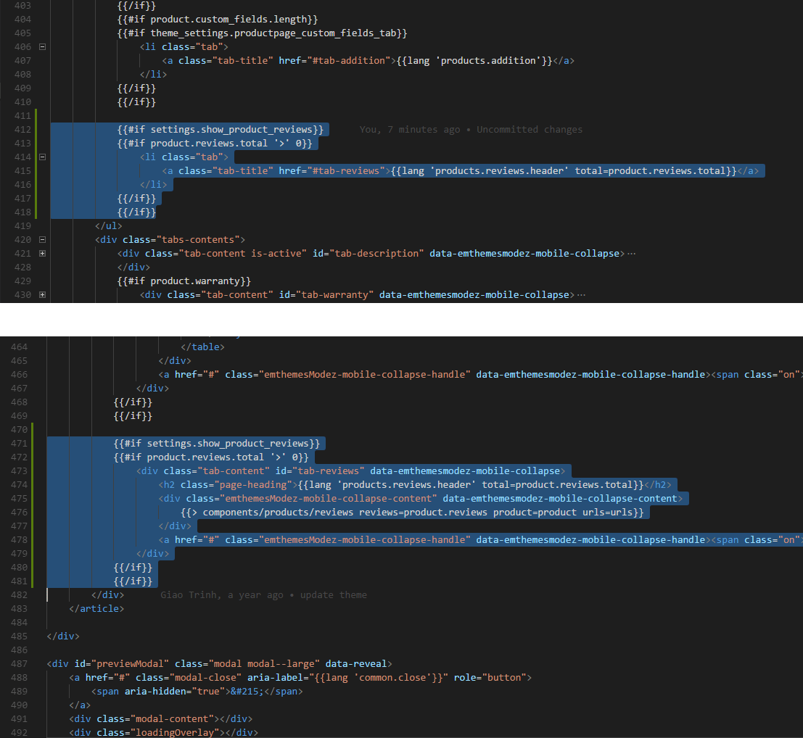
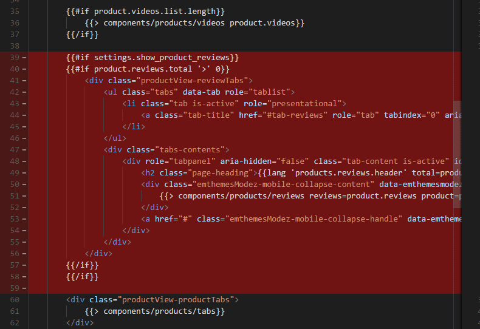
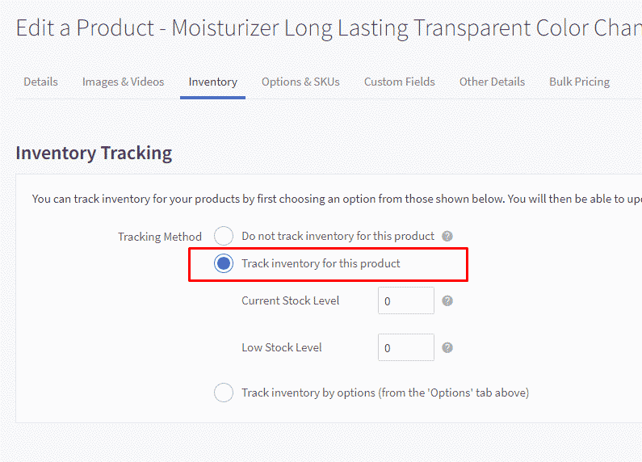
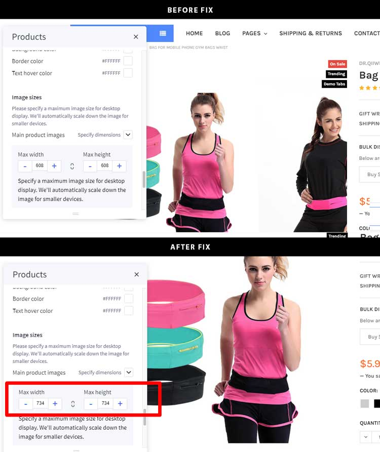

# FAQs

## Fix social icons messy on product page


Add this custom CSS to **Storefront** > **Footer Script**:

```css
<style>
.google_plusone_iframe_widget {
    width: 38px !important;
    height: 24px !important;
    margin-top: -4px;
}

.fb_iframe_widget + .fb_iframe_widget {
    display: none;
}

.addthis_button_facebook_like.icon--facebook_like > svg {
    display: none;
}

.addthis_button_facebook_like.icon--facebook_like {
	width: 60px !important;
	overflow: hidden !important;
}
</style>
```


## Limit length of product name display on products grid


Add this custom CSS to **Storefront** > **Footer Script**:

```css
<style>
.card-title {
    max-height: 3.75rem;
    overflow: hidden;
}
</style>
```

It will limit maximum 3 lines. Set `max-height: 2.5rem` to limit maximum 2 lines.


## Hide category name on category page

Add this custom CSS to **Storefront** > **Footer Script**:

```css
<style>
.papaSupermarket-page--pages-category .page-heading--desktopOnly {
    display: none;
}
</style>
```

## Hide the category images on category pages

Add the code below to **Storefront** > **Footer Script**:

```html
<style>
.emthemesModez-categoryPage-mainImage { display: none !important }
</style>
```


## Change active tabs & remove other tabs in products by category block


By default, the theme display Bestselling tab active by default, if you want to make other tab active by default and/or hide other tabs, follow instruction below to edit the theme source code.

Make a copy of your theme in order to edit the theme source code:


Then click on **Edit Theme Files**. In the editor, edit file `templates\components\papa-supermarket\category\ajax-products-by-category-sorting-tabs.html`:


Edit as screenshot:


In the next version, we will add new feature allow customize this in Theme Editor.


## My products by category with sorting tabs block is not rendering on homepage?


If you already configured **Number of Categories** in Theme Editor but it's still not appearing, it's probably your categories have no products. To bypass this case to display products in sub-categories, you will need to edit theme source code. Edit file `templates/components/emthemes-modez/section/section.html`

Delete 2 line as screenshot below:


## Make main image & thumbnails on product details page uniform

Add the code below to Footer Script:

```html
<style>
.productView-imageCarousel-nav-item.slick-slide {
    position: relative;
}

.productView-imageCarousel-nav-item.slick-slide:before {
    display: block;
    content: ' ';
    height: 0;
    padding-bottom: 113.8%; /* height/width */
}

.productView-imageCarousel-nav-item img {
    max-height: 100%;
    max-width: calc(100% - 10px);
    position: absolute;
    top: 0;
    left: 50%;
    transform: translateX(-50%);
}

.productView-imageCarousel-main {
    margin-left: auto;
    margin-right: auto;
}

@media (min-width: 550px) {
    .productView-imageCarousel-main {
        max-width: 500px;
    }
}

.productView-imageCarousel-main-item > a {
    position: relative;
    display: block;
    height: 0;
    padding-top: 113.8%; /* height/width */
}

.productView-imageCarousel-main-item > a img {
    position: absolute;
    top: 0;
    left: 50%;
    transform: translateX(-50%);
    max-height: 100%;
}
</style>
```


## Display tooltip when hover Compare button on product items

Add custom code below into **Storefront** > **Footer Scripts**:

```html
<style>
.card-figcaption-button--compare:hover:after {
    content: 'Compare';
    position: absolute;
    padding: 4px 8px;
    background: #fff;
    display: inline-block;
    font-size: 12px;
    color: #666666;
    bottom: calc(100% + 4px);
    right: 0;
    text-indent: 0;
}
</style>
```


## How to change "Image Coming Soon" default product image?

Please upload your own "Coming Soon" image in **Marketing** > **Banner Manager**, then copy the image URL.

Edit **Storefront** > **Footer Scripts**, add the code below:

```html
<script>
    document.querySelectorAll("img[src*='ProductDefault.gif']").forEach(function(img) {
        img.src = 'https://placehold.it/500x500';
    });
</script>
```

Replace  `https://placehold.it/500x500` by your "Coming Soon" image URL.


## How to show "Coming Soon" default product image on product page?

Display: "Coming Soon" image on product page by adding the code in **Footer Scripts**:

```html
{{#unless product.main_image}}
<style>
.productView-images { background: url(https://placehold.it/500x500) no-repeat center center; background-size: auto; padding-top: 100%; height: 0; }
    
@media (min-width: 801px) {
.productView-images { padding-top: 50%; }
}
</style>
{{/unless}}​
```

Replace  `https://placehold.it/500x500` by your "Coming Soon" image URL.


## Move maintenance notice box to top of page

Add the code below into **Storefront** > **Footer Scripts**:

```html
<style>
body {
    padding-top: 10rem;
}

.maintenanceNotice {
    top: 55px;
    left: 0;
    right: 0;
    width: auto;
    display: flex;
    justify-content: space-between;
    height: 6rem;
    font-size: 11px;
    overflow: hidden;
}

@media (min-width: 550px) {
    body {
        padding-top: 8rem;
    }
    .maintenanceNotice {
        height: 4rem;
    }
}

@media (min-width: 800px) {
    body {
        padding-top: 4rem;
    }
    .maintenanceNotice {
        top: 0;
    }
}


@media (min-width: 1200px) {
    body {
        padding-top: 3rem;
    }
    .maintenanceNotice {
        height: 3rem;
    }
}

.maintenanceNotice > p {
    margin: 0;
    padding-right: 1.5rem;
}

.maintenanceNotice > br {
    display: none;
}

.maintenanceNotice > a {
    padding-left: 1.5rem;
}
</style>
```

**Note: Remove it when you launch your store.**


## Display sub-category name below sub-category image

By the default, the theme dipslays sub-category name over image. If you don't like this style, but want to display sub-category name under image, just add custom CSS code below into **Storefront** > **Footer Scripts**:

```css
<style>
.papaSupermarket-subcategories-image {
    height: 0;
    padding-top: 100%;
    text-align: center;
    display: block;
    position: relative;
}
.papaSupermarket-subcategories-image img {
    max-height: 100%;
    position: absolute;
    top: 50%;
    left: 50%;
    transform: translate(-50%, -50%);
}
.papaSupermarket-subcategories-grid-item:hover img {
    transform: translate(-50%, -50%) scale(1.2);
}
.papaSupermarket-subcategories-image + .papaSupermarket-subcategories-name {
    position: static;
    transform: none;
    background-color: transparent;
    display: block;
    text-align: center;
    padding-left: 0;
    padding-right: 0;
}
</style>
```

## Display entire product description on mobile

To optimize for mobile view, product description are collapse by default. Tap on VIEW ALL link to expand all product description.


If you want to display entire product description by default, add the custom code below into **Storefront** > **Footer Scripts**:

```html
<style>
@media (max-width: 800px) {
    .productView-description-tabContent.emthemesModez-mobile-collapse-content {
        max-height: none;
        overflow: auto;
    }

    .productView-description-tabContent .emthemesModez-mobile-collapse-handle {
        display: none;
    }
}
</style>
```

## Move reviews tab next to description tab on product page

Edit file `templates\components\products\product-view.html`, insert the code as showing below:



```html
{{#if settings.show_product_reviews}}
{{#if product.reviews.total '>' 0}}
    <li class="tab">
        <a class="tab-title" href="#tab-reviews">{{lang 'products.reviews.header' total=product.reviews.total}}</a>
    </li>
{{/if}}
{{/if}}
```

```html
{{#if settings.show_product_reviews}}
{{#if product.reviews.total '>' 0}}
    <div class="tab-content" id="tab-reviews" data-emthemesmodez-mobile-collapse>
        <h2 class="page-heading">{{lang 'products.reviews.header' total=product.reviews.total}}</h2>
        <div class="emthemesModez-mobile-collapse-content" data-emthemesmodez-mobile-collapse-content>
            {{> components/products/reviews reviews=product.reviews product=product urls=urls}}
        </div>
        <a href="#" class="emthemesModez-mobile-collapse-handle" data-emthemesmodez-mobile-collapse-handle><span class="on">{{lang 'common.view_all'}}</span><span class="off">{{lang 'common.close'}}</span></a>
    </div>
{{/if}}
{{/if}}
```


Edit file `templates\pages\product.html`, delete the code as showing below:




## Move brands list underneath products list on Brand page


If you want to display brands list under products list on brand page, add the custom CSS below into **Storefront** > **Footer Scripts**:

```html
<style>
@media (max-width: 800px) {
  .papaSupermarket-page--pages-brand .page {
    display: flex;
    flex-direction: column;
  }
  
  .papaSupermarket-page--pages-brand .page-sidebar {
    order: 2;
  }
  
  .papaSupermarket-page--pages-brand .page-content {
    order: 1;
  }

  .emthemesModez-productsFilter {
    position: fixed;
    top: 100px;
    left: 10px;
    z-index: 100;
  }
  
  .emthemesModez-productsFilter .actionBar {
    width: 280px;
  }
}
</style>
```

## Move bottom banner to under brand title on brand page

Insert the custom script below into **Storefront** > **Footer Scripts**:

```html
<script>
(function() {
    var body = document.body || document.getElementsByTagName('body')[0];
    if (body.className.match(/papaSupermarket-page--pages-brand/)) {
        var banners = document.querySelectorAll('.banners--bottom');
        var title = document.querySelectorAll('.h1.page-heading')[0];
        for (var i = 0; i < banners.length; i++) {
            title.parentNode.insertBefore(banners[i], title.nextSibling);
        }

        var css = '.papaSupermarket-page--pages-brand .banners--bottom { margin-top: 0; }';
        var head = document.head || document.getElementsByTagName('head')[0];
        var style = document.createElement('style');
        style.type = 'text/css';
        if (style.styleSheet){
            style.styleSheet.cssText = css;
        } else {
            style.appendChild(document.createTextNode(css));
        }
        head.appendChild(style);
    }
})();
</script>
```

## Move bottom banner up above product tabs

Insert the custom script below into **Storefront** > **Footer Scripts**:

```html
<script>
(function() {
    var body = document.body || document.getElementsByTagName('body')[0];
    if (body.className.match(/papaSupermarket-page--pages-home/)) {
        var banners = document.querySelectorAll('.banners--bottom');
        var productTabs = document.querySelectorAll('.emthemesModez-section--specialProductsTabs')[0];
        for (var i = 0; i < banners.length; i++) {
            productTabs.parentNode.insertBefore(banners[i], productTabs);
        }
    }
})();
</script>
```


## Display custom message above shipping options on checkout page:


Insert the code below into **Scripts Manager**, Checkout page, footer location:

```html
<script>
(function() {
    function processCheckoutShippingOptionTips() {
        $(function() {
            var $tipsEl = $('#checkout-shipping-options-tips');
            window.setInterval(function() {
                if ($('#checkout-shipping-options-tips-clone').length === 0) {
                    var $shippingOptionsEl = $('#checkout-shipping-options');
                    if ($shippingOptionsEl.length > 0) {
                        $tipsEl.clone()
                            .attr('id', 'checkout-shipping-options-tips-clone')
                            .show()
                            .insertBefore($shippingOptionsEl.children('legend'));
                    }
                }
            }, 500);
        });
    }

    document.write('\
        <div id="checkout-shipping-options-tips" style="display: none">\
            <ul>\
                <li>Please allow 1 to 2 business days for handling in addition to shipping time.</li>\
                <li>Orders placed on Fridays or Holidays may not be shipped until the next business day.</li>\
            </ul>\
            <p>Tip: Look at USPS as a shipping option for late week orders. We ship from Rhode Island and in many cases USPS is more cost effective method and will deliver on Saturdays as opposed to other carriers in the same or less time frame.</p>\
        </div>');

    var script = document.createElement("script");
    script.onload = processCheckoutShippingOptionTips;
    document.currentScript.parentNode.insertBefore(script, document.currentScript);
    script.src = 'https://cdnjs.cloudflare.com/ajax/libs/jquery/3.3.1/jquery.min.js';
})();
</script>
```


## Hide Sale badge for logged in users

Insert the custom script below into **Storefront** > **Footer Scripts**:

```html
<!-- Hide sale label for logged in users -->
{{#if customer}}
    <style>
        .sale-flag-side:not(.sale-flag-side--custom) {
            display: none;
        }
    </style>
{{/if}}
```


## Display customer group name & 'Price' label before products price

Insert the custom script below into **Storefront** > **Footer Scripts**:

```html
<!-- Display customer group & 'price' label before price -->
{{#if customer.customer_group_id}}
    <style>
        .customerGroup-price-label {
            float: left;
            margin-right: .75rem;
            margin-top: 5px;
        }
        .card-customerGroup-price-label {
            margin-right: .375rem;
        }
    </style>
    <script src="https://cdnjs.cloudflare.com/ajax/libs/jquery/3.3.1/jquery.min.js"></script>
    <script>
        $(function() {
            $('.productView-price').prepend('<div class="customerGroup-price-label">{{{customer.customer_group_name}}} Price</div>');
            $('.card-text .price:not(.price--rrp)').prepend('<span class="card-customerGroup-price-label">{{{customer.customer_group_name}}} Price</span>')
        });
    </script>
{{/if}}
```


## Fix product thumbnails carousel on product page for Supermarket version 1.5.4 and older

Insert the custom script below into **Storefront** > **Footer Scripts**:

```html
<!-- Fix product thumbnails carousel on product page for Supermarket version 1.5.4 and older -->
{{#if page_type '===' 'product'}}
    {{#if product.images.length '<=' theme_settings.productpage_thumbnails_count}}
        <style>
            .productView-imageCarousel-nav .slick-track { transform: none !important }
        </style>
    {{/if}}
{{/if}}
```


## Display product condition badge on every product card and product page main image


Insert the custom script below into **Storefront** > **Footer Scripts**:

```html
<!-- Papathemes: display product condition badge on product cards and product details page -->
<script src="https://cdnjs.cloudflare.com/ajax/libs/jquery/3.3.1/jquery.min.js"></script>
<script>
$(function() {
    function product_page() {
        var $el = $('.productView-info-value--condition');
        var $cond_badge = $('<div class="sale-flag-side sale-flag-side--custom"><span class="sale-text">' + $el.text() + '</span></div>');
        var $image = $('.productView-imageCarousel-main');
        var $last_badge = $('.productView-images .sale-flag-side').last();
        if ($last_badge.length > 0) {
            $last_badge.before($cond_badge);
        } else {
            $image.after($cond_badge)
        }
    }
    product_page();

    
    function request_all($scope) {
        $('[data-emthemesmodez-cart-item-add]', $scope).each(function(i, a) {
            var m = a.href.match(/product_id=([0-9]+)/);
            if (m) {
                var $card_figure = $(a).closest('.card-figure');
                var id = m[1];
                request_card(id, $card_figure);
            }
        });
    }

    function request_card(id, $card_figure) {
        $.ajax({
            url: '/products.php?productId=' + id,
            headers: {
                'stencil-options': '{"render_with":"products/quick-view"}'
            },
            success: function(data, status, xhr) {
                $html = $(data);
                $cond = $html.find('.productView-info-value--condition');
                if ($cond.length > 0) {
                    var $cond_badge = $('<div class="sale-flag-side sale-flag-side--custom"><span class="sale-text">' + $cond.text() + '</span></div>');
                    var $last_badge = $card_figure.find('.sale-flag-side');
                    if ($last_badge.length > 0) {
                        $last_badge.after($cond_badge);
                    } else {
                        $card_figure.prepend($cond_badge);
                    }
                }
            }
        });
    }
    request_all($('body'));
  
    setInterval(function() {
      $('.emthemesModez-productsByCategoryTabs-products').each(function(i, el) {
        if (!$(el).data('conditionBadgeAdded')) {
          $(el).data('conditionBadgeAdded', true);
          request_all($(el));
        }
      });
    }, 500);
});
</script>​
```


## Make all product card items in carousel (Related Products, Customer Also Viewed) same height

Add this custom CSS into **Storefront** > **Footer Scripts**:

```html
<style>
.productCarousel .slick-track { display: flex; align-items: stretch; }
.productCarousel .slick-track:before,
.productCarousel .slick-track:after { display: none; }
.productCarousel .slick-slide { height: auto; }
.productCarousel .card { min-height: 100%; }
</style>
```


## Show Out of Stock message on product page

It is a built-in feature of BigCommerce. However, some of our clients don't know how to accomplish. So we think this guide will be helpful.


Please configure **Advanced Settings** > **Inventory** as showing below:


Edit your product, make sure you enable tracking inventory:


## Show UPS and all options of shipping

### On Checkout page for developers

Edit file `checkout_express.html` in **Storefront** > **Checkout Template Files**, add the code below:

```html
<style>
.shippingquote { display: block !important; }
.shippingquote a[onclick*=toggle] { display:none; }
</style>
```
### On estimated shipping of shopping cart page

Add the custom CSS below into **Storefront** > **Footer Scripts**:
```html
<style>
.estimator-form--ups { display: block !important; clip: auto !important; height: auto !important; width: auto !important; position: static !important }
.estimator-form-toggleUPSRate { display: none }
</style>
```


## Fix quick search popup cut off when the header is configured sticky

Add the custom CSS below into **Storefront** > **Footer Scripts**:

```html
<style>
[data-stickymenu] .dropdown--quickSearch .quickSearchResults { max-height: calc(100vh - 300px); overflow: auto; overflow-x: hidden }
.is-sticky[data-stickymenu] .dropdown--quickSearch .quickSearchResults { max-height: calc(100vh - 250px) }
[data-stickymenu] .dropdown--quickSearch .modal-close { top: -25px; right: -25px }
</style>
```


## Show all product thumbnails on product page

Configure Theme Editor to show up to 10 thumbnail images and add custom CSS below to **Storefront** > **Footer Scripts**:

```html
<style>
@media (min-width: 801px) {
    .productView-imageCarousel-nav { height: auto !important; overflow: visible !important; padding: 0 !important; }
    .productView-imageCarousel-nav .slick-arrow { display: none }
    .productView-imageCarousel-nav .slick-track { width: 100% !important; transform: none !important; }
    .productView-imageCarousel-nav-item { width: 100px !important; margin-bottom: 10px !important }
    .js .productView-imageCarousel-nav { max-height: none }
}
</style>
```


## Move Out of Stock alert to the top of product details on product page

Add this custom script into **Storefront** > **Footer Scripts**:

<script>
(function () {
    function moveAlert(from, to) {
        var alerts = from.querySelectorAll('.alertBox.alertBox--error');
        if (alerts) {
            for (var i in alerts) {
                if (typeof alerts[i] === 'object') {
                    var alert = alerts[i];
                    to.insertBefore(alert, to.firstChild);
                }
            }
        }
    }

    var productView = document.querySelector('.productView');
    var productViewInfo = document.querySelector('.productView-options');
    if (productView && productViewInfo) {
        setInterval(function () {
            moveAlert(productViewInfo, productView);
        }, 100);

        var MutationObserver = window.MutationObserver || window.WebKitMutationObserver;
        if (MutationObserver) {
            var observer = new MutationObserver(function () {
                moveAlert(productViewInfo, productView);
            });
            observer.observe(productViewInfo, {
                childList: true,
                subtree: true,
            });
        }
    }
})();
</script>

## Add background image to header

Add this custom script into **Storefront** > **Footer Scripts**:

<style>
@media (min-width: 801px) {
.emthemesModez-header-userSection { background-image: url('https://cdn8.bigcommerce.com/s-tlt0fnmxln/product_images/uploaded_images/lpgshop-logo.png?t=1535516377'); background-repeat: no-repeat; background-position: left center; background-size: contain }
.header .header-logo-text { opacity: 0 }
}
</style>​​​​​​​​​​​​


## Always show Add to Cart button on product cards

Add this custom script into **Storefront** > **Footer Scripts**:

```html
<style>
.productCarousel .card-buttons, .productGrid .card-buttons { opacity: 1; clip: auto; visibility: visible }
.card-figcaption { opacity: 1 }
.card-figcaption-button.quickview { opacity: 0 }
.card:hover .card-figcaption-button.quickview { opacity: 1 }
</style>
```

## Show Add to Cart button at the bottom of product card item

Add this custom script into **Storefront** > **Footer Scripts**:

```html
<style>
@media (min-width: 801px) {
    .card { padding-bottom: 50px !important }
    .card-figure { overflow: visible; position: static }
    .card-img-container { position: relative }
    .card-figcaption-button.quickview-alt { bottom: 0 }
}
</style>
```

## Display phone number on header on mobile

Add this custom script into **Storefront** > **Footer Scripts**:

```html
<style>
@media(max-width:800px) {
  .emthemesModez-header-topSection .navUser:last-child .navUser-section .navUser-item:last-child { display: block; margin-right: 50px; border: 0 } 
}
</style>
```


## Fix instagram photos display uniform

Add this custom script into **Storefront** > **Footer Scripts**:

```html
<style>
.emthemesModez-instafeed .slick-slide a {
  padding-top: 100%;
  content: '';
  display: block;
  height: 0;
  position: relative;
}

.emthemesModez-instafeed .slick-slide img {
  object-fit: cover;
  position: absolute;
  top: 0;
  left: 0;
  width: 100%;
  height: 100%;
}
</style>
```


## Fix Products Bought Together stop working after BigCommerce API changed

If you suddenly get a problem that the products also bought together stop working on your product pages. 
That is because BigCommerce has changed the content type of product ajax request.

To workaround this issue while waiting for the fix from BigCommerce or the theme update, please follow
this instruction.

Login to your store admin panel, go to **Storefront** > **Script Manager** > click on the button **Create a Script**.

Input:

- **Name of Script**: `Fix Also Bought Products stop working after BC API changed` or whatever.
- **Location of page**: `Footer`
- **Select pages where script will be added**: `Store pages`.
- **Script type**: `Script`.
- **Script contents**:

```html
<script>
window.jQuerySupermarket(document).ajaxSend((event, xhr, settings) => {
	if (settings.url.match(/\/products\.php/)) {
		xhr.setRequestHeader('x-requested-with', '');
	}
});
</script>
```

Then click **Save** button.

Your script should look like this screenshot:


## Fix the main product image carousel show next image cropped

This issue may appears when upgrade theme from version 4.1 to 4.2. To fix it, just increase the main image size from 608x608 to 734x734 or bigger. Go to **Theme Editor** > **Products** > **Image Sizes** > set **Main product images** = `Specify dimensions` and set **Max width** = `734`, **Max height** = `734`.



## Fix the popular brands not show enough items as configured in the footer

From version 4.2, we added an option to support show/hide popular brands in the sidebar. The popular brands in the footer may not work properly because your theme settings still stores the old variable. To fix this, go to **Theme Editor** > **Products** > **Category pages** > set **Show shop by brands on** = any value; Footer > **Main Footer** > **Show brands** = any value.


## Show all thumbnails as grid in product detail pages

Add the custom code below to Storefront > Footer Scripts:

```html
<style>
.productView-imageCarousel-nav .slick-track { transform: none !important; width: 100% !important; }
.productView-imageCarousel-nav-item { width: calc(25% - 10px) !important; margin: 5px !important; }
.productView-imageCarousel-nav .slick-arrow { display: none }
</style>
```


## Add custom labels on the main menu items


Add the custom code below to **Storefront** > **Footer Scripts**:

```html
<style>
@media (min-width: 801px) {
.navPages-container .navPages > .navPages-list > .navPages-item:nth-child(5) a:after {
  content: "New";
  font-size: 9px;
  position: absolute;
  top: -2px;
  right: 0;
  background: #167ac6;
  color: white;
  padding: 0 4px;
}
.navPages-container .navPages > .navPages-list > .navPages-item:nth-child(6) a:after {
  content: "Hot";
  font-size: 9px;
  position: absolute;
  top: -2px;
  right: 0;
  background: red;
  color: white;
  padding: 0 4px;
}
}
</style>​
```

Update `nth-child(5)` and `nth-child(6)` coresponding your menu item order number.


## Move sub-pages menu to the right sidebar

Add the custom code below to **Storefront** > **Scripts Manager**, at **Footer** position:

```html
<script>
(function($) {
    var $subpages = $('.page-sidebar .navList--aside .sidebarBlock--navList');
    var $rightSidebar = $('<div class="page-sidebar page-sidebar--right"></div>');
    if ($subpages.length > 0) {
        $rightSidebar.append($subpages);
        $('.page-sidebar').after($rightSidebar);
    }
})(window.jQuerySupermarket || window.$);
</script>
```


## How to use animated GIF logo

Add the custom code below to **Storefront** > **Script Manager**, choose position = Footer and show on all storefront pages:

```html
<script>
(function() {
    var els = document.getElementsByClassName('header-logo-image');
    for (var i in els) {
        var el = els[i];
        el.src = el.src.replace(/^.*\/([^\/]+)$/, '/product_images/$1');
    }
})();
</script>
```


## Hide the active page title on the breacrumbs

If you want to hide the active page title or the last item link on the breadcrumbs, add the code below to **Storefront** > **Footer Scripts**:

```html
<style>
.breadcrumb.is-active { display: none }
</style>
```


## Fix review link anchor jump to content hidden by the sticky header

Add the custom code below to **Storefront** > **Script Manager**, location = Footer, page = all storefront pages:

```html
<script>
(function($) {
    $('.productView-reviewLink a').not('[data-reveal-id]').on('click', function() {
        $('html, body').animate({scrollTop: $('#product-reviews').offset().top - 200}, 500);
    });
})(window.jQuerySupermarket || window.jQuery);
</script>
```


## Display the main carousel's content overlay the image on mobile like  on desktop

Add the custom code below to **Storefront** > **Footer Scripts**:

```html
<style>
@media (max-width: 800px) {
    .heroCarousel-content {
        position: absolute;
        top: 50%;
        transform: translateY(-50%);
        padding: 8px 16px;
        background-color: transparent;
        display: flex;
        flex-direction: column;
    }

    .heroCarousel-title {
        font-size: 16px;
        background-color: rgba(0, 0, 0, .6);
        padding: 2px 4px;
        margin: 0 auto;
    }

    .heroCarousel-description {
        font-size: 12px;
        background-color: rgba(0, 0, 0, .6);
        padding: 2px 4px;
        margin: 4px auto 0;
    }

    .heroCarousel-action {
        padding: 4px 8px;
        font-size: 12px;
        margin: 4px auto 0;
    }
}
</style>
```


## Fix the phone number link on the top header bar

The phone number link which has `tel:` attribute requires to specify the country code in order to make it callable. To fix this issue, add the custom code below to **Storefront** > **Script Manager**, **location** = `footer`, **page** = `all storefront pages`.
Update `+11231231234` by your phone number. `+1` is dialing code of USA.

```html
<script>
(function($) {
    $('.emthemesModez-header-topSection a[href^="tel:"]').attr('href', 'tel:+11231231234');
})(window.jQuerySupermarket || window.jQuery);
</script>
```

## Add custom CSS to Checkout Page

Add the custom code below to **Storefront** > **Script Manager**, **Location** = `Footer`, **Page** = `Checkout Pages`:

```html
<script>
(function() {
    var style = document.createElement('style');
    style.innerHTML = 'INSERT YOUR CUSTOM CSS HERE';
    document.head.appendChild(style);
})();
</script>
```


## Fix cart quantity counter shouldn't count child products

By default, BigCommerce API returns cart quantity include the parent products and the child products (products used in product pick-list option). If think it's incorrect, take a look at the code below to make it only counts the parent products.

Add the code below to **Storefront** > **Scripts Manager**, choose **Location** = `Footer`, **Page** == `All Storefront Pages`:

```html
<script>
(function($) {
    $(document).ajaxComplete(function(event, xhr, options) {
        if (!options.url || options.url.indexOf('api/storefront/cart') === -1 || !xhr.responseJSON || xhr.responseJSON.length === 0) {
            return;
        }
        var cart = xhr.responseJSON[0];
        var lineItemQuantities = [
            cart.lineItems.physicalItems,
            cart.lineItems.digitalItems,
            cart.lineItems.customItems,
        ].reduce(function(a, b) {
            return a.concat(b);
        }).reduce(function(total, item) {
            return (typeof total == 'object' ? total.quantity : total) + (item.parentId ? 0 : item.quantity);
        });
        var giftCertificateQuantity = cart.lineItems.giftCertificates.length;
        var quantity = lineItemQuantities + giftCertificateQuantity;
        setTimeout(function() {
        	$('body').trigger('cart-quantity-update', quantity);
        }, 200);
    });
})(window.jQuerySupermarket || window.jQuery);
</script>
```


## Change the placeholder text of the search input box

Add the code below to **Storefront** > **Scripts Manager**, choose **Location** = `Footer`, **Page** == `All Storefront Pages`:

```html
<script>
(function($) {
    $('input[data-search-quick]').attr('placeholder', 'Search by product name,sku and keyword');
})(window.jQuerySupermarket || window.jQuery);
</script>
```


## Change the wording "You can only purchase a maximum of 1..." in the popup message.


Add the code below to **Storefront** > **Scripts Manager**, choose **Location** = `Footer`, **Page** == `All Storefront Pages`:


```html
<script>
(function($) {
    $('#alert-modal').on('opened.fndtn.reveal', function(event) {
        var $el = $(event.target).find('.modal-content > span');
        if ($el.length > 0) {
            var msg = $el.html().replace('You can only purchase a maximum of 1', 'You already have one in your shopping cart');
            $el.html(msg);
        }
    });
})(window.jQuerySupermarket || window.chiarajQuery || window.jQuery);
</script>
```

## Remove the new products on the left sidebar of blog pages

Add the code below to **Storefront** > **Scripts Manager**, choose **Location** = `Footer`, **Page** == `All Storefront Pages`:

```html
<script>
(function($) {
    $('.sidebarBlock .productList[data-product-type=new]').closest('.sidebarBlock').remove();
})(window.jQuerySupermarket || window.jQuery);
</script>
```

## Fix social bookmarks doesn't work properly when Instant-Load feature is enabled

Add the code below to **Storefront** > **Scripts Manager**, choose **Location** = `Footer`, **Page** == `All Storefront Pages`:

```html
<script>
(function($) {
    $('body').on('loaded.instantload', function() {
        if (window.addthis) {
            window.addthis.toolbox('.addthis_toolbox');
        }
    });
})(window.jQuerySupermarket || window.jQuery);
</script>
```

## Move product description show under the price

Add the code below to **Storefront** > **Scripts Manager**, choose **Location** = `Footer`, **Page** == `All Storefront Pages`:

```html
<script>
(function($) {
    function main() {
        $('.productView').first().find('.productView-price').first().after($('#tab-description .productView-description-tabContent').html());
        $('.productView').first().find('.productView-description').hide();
    }
    $(document).ready(main);
    $('body').on('loaded.instantload', main);
})(window.jQuerySupermarket || window.jQuery);
</script>
```


## Fix product main images loading slow on product page

If your original image is large or it's PNG format, in some cases the image appears very slow because the LQIP image processing function of BigCommerce takes time to process if it is not cached before. There may be an issue with BigCommerce's LQIP image compression function.

While waiting for the fix from BigCommerce, you can insert the following code into **Storefront** > **Scripts Manager**, choose **location** = `footer`, **page** = `all storefront pages` to disable LQIP for the product main images:

```html
<script>
(function($) {
    function main() {
        console.log('Fix product main images.');
        $('.productView-imageCarousel-main-item img')
            .removeAttr('srcset')
            .removeAttr('data-srcset');
    }

    $(document).ready(main);
    $('body').on('loaded.instantload', main);
    $('#modal').on('opened.fndtn.reveal', main);
})(window.jQuerySupermarket || window.jQuery);
</script>
```
