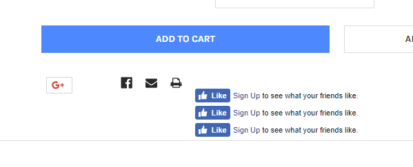

# FAQs

## Fix social icons messy on product page



Add this custom CSS to **Storefront** > **Footer Script**:

```css
<style>
.google_plusone_iframe_widget {
    width: 38px !important;
    height: 24px !important;
    margin-top: -4px;
}

.fb_iframe_widget + .fb_iframe_widget {
    display: none;
}

.addthis_button_facebook_like.icon--facebook_like > svg {
    display: none;
}

.addthis_button_facebook_like.icon--facebook_like {
	width: 60px !important;
	overflow: hidden !important;
}
</style>
```


## Limit length of product name display on products grid


Add this custom CSS to **Storefront** > **Footer Script**:

```css
<style>
.card-title {
    max-height: 3.75rem;
    overflow: hidden;
}
</style>
```

It will limit maximum 3 lines. Set `max-height: 2.5rem` to limit maximum 2 lines.


## Hide category name on category page

Add this custom CSS to **Storefront** > **Footer Script**:

```css
<style>
.papaSupermarket-page--pages-category .page-heading--desktopOnly {
    display: none;
}
</style>
```

## Change active tabs & remove other tabs in products by category block


By default, the theme display Bestselling tab active by default, if you want to make other tab active by default and/or hide other tabs, follow instruction below to edit the theme source code.

Make a copy of your theme in order to edit the theme source code:


Then click on **Edit Theme Files**. In the editor, edit file `templates\components\papa-supermarket\category\ajax-products-by-category-sorting-tabs.html`:


Edit as screenshot:


In the next version, we will add new feature allow customize this in Theme Editor.


## My products by category with sorting tabs block is not rendering on homepage?


If you already configured **Number of Categories** in Theme Editor but it's still not appearing, it's probably your categories have no products. To bypass this case to display products in sub-categories, you will need to edit theme source code. Edit file `templates/components/emthemes-modez/section/section.html`

Delete 2 line as screenshot below:


## Make main image & thumbnails on product details page uniform

Add the code below to Footer Script:

```html
<style>
.productView-imageCarousel-nav-item.slick-slide {
    position: relative;
}

.productView-imageCarousel-nav-item.slick-slide:before {
    display: block;
    content: ' ';
    height: 0;
    padding-bottom: 113.8%; /* height/width */
}

.productView-imageCarousel-nav-item img {
    max-height: 100%;
    max-width: calc(100% - 10px);
    position: absolute;
    top: 0;
    left: 50%;
    transform: translateX(-50%);
}

.productView-imageCarousel-main {
    margin-left: auto;
    margin-right: auto;
}

@media (min-width: 550px) {
    .productView-imageCarousel-main {
        max-width: 500px;
    }
}

.productView-imageCarousel-main-item > a {
    position: relative;
    display: block;
    height: 0;
    padding-top: 113.8%; /* height/width */
}

.productView-imageCarousel-main-item > a img {
    position: absolute;
    top: 0;
    left: 50%;
    transform: translateX(-50%);
    max-height: 100%;
}
</style>
```


## Display tooltip when hover Compare button on product items

Add custom code below into **Storefront** > **Footer Scripts**:

```html
<style>
.card-figcaption-button--compare:hover:after {
    content: 'Compare';
    position: absolute;
    padding: 4px 8px;
    background: #fff;
    display: inline-block;
    font-size: 12px;
    color: #666666;
    bottom: calc(100% + 4px);
    right: 0;
    text-indent: 0;
}
</style>
```


## How to change "Image Coming Soon" default product image?

Please upload your own "Coming Soon" image in **Marketing** > **Banner Manager**, then copy the image URL.

Edit **Storefront** > **Footer Scripts**, add the code below:

```html
<script>
    document.querySelectorAll("img[src*='ProductDefault.gif']").forEach(function(img) {
        img.src = 'https://placehold.it/500x500';
    });
</script>
```

Replace  `https://placehold.it/500x500` by your "Coming Soon" image URL.


## How to show "Coming Soon" default product image on product page?

Display: "Coming Soon" image on product page by adding the code in **Footer Scripts**:

```html
{{#unless product.main_image}}
<style>
.productView-images { background: url(https://placehold.it/500x500) no-repeat center center; background-size: auto; padding-top: 100%; height: 0; }
    
@media (min-width: 801px) {
.productView-images { padding-top: 50%; }
}
</style>
{{/unless}}​
```

Replace  `https://placehold.it/500x500` by your "Coming Soon" image URL.


## Move maintenance notice box to top of page

Add the code below into **Storefront** > **Footer Scripts**:

```html
<style>
body {
    padding-top: 10rem;
}

.maintenanceNotice {
    top: 55px;
    left: 0;
    right: 0;
    width: auto;
    display: flex;
    justify-content: space-between;
    height: 6rem;
    font-size: 11px;
    overflow: hidden;
}

@media (min-width: 550px) {
    body {
        padding-top: 8rem;
    }
    .maintenanceNotice {
        height: 4rem;
    }
}

@media (min-width: 800px) {
    body {
        padding-top: 4rem;
    }
    .maintenanceNotice {
        top: 0;
    }
}


@media (min-width: 1200px) {
    body {
        padding-top: 3rem;
    }
    .maintenanceNotice {
        height: 3rem;
    }
}

.maintenanceNotice > p {
    margin: 0;
    padding-right: 1.5rem;
}

.maintenanceNotice > br {
    display: none;
}

.maintenanceNotice > a {
    padding-left: 1.5rem;
}
</style>
```

**Note: Remove it when you launch your store.**


## Display sub-category name below sub-category image

By the default, the theme dipslays sub-category name over image. If you don't like this style, but want to display sub-category name under image, just add custom CSS code below into **Storefront** > **Footer Scripts**:

```css
<style>
.papaSupermarket-subcategories-image {
    height: 0;
    padding-top: 100%;
    text-align: center;
    display: block;
    position: relative;
}
.papaSupermarket-subcategories-image img {
    max-height: 100%;
    position: absolute;
    top: 50%;
    left: 50%;
    transform: translate(-50%, -50%);
}
.papaSupermarket-subcategories-grid-item:hover img {
    transform: translate(-50%, -50%) scale(1.2);
}
.papaSupermarket-subcategories-image + .papaSupermarket-subcategories-name {
    position: static;
    transform: none;
}
</style>
```

## Display entire product description on mobile

To optimize for mobile view, product description are collapse by default. Tap on VIEW ALL link to expand all product description.


If you want to display entire product description by default, add the custom code below into **Storefront** > **Footer Scripts**:

```html
<style>
@media (max-width: 800px) {
    .productView-description-tabContent.emthemesModez-mobile-collapse-content {
        max-height: none;
        overflow: auto;
    }

    .productView-description-tabContent .emthemesModez-mobile-collapse-handle {
        display: none;
    }
}
</style>
```

## Move reviews tab next to description tab on product page

Edit file `templates\components\products\product-view.html`, insert the code as showing below:


```html
{{#if settings.show_product_reviews}}
{{#if product.reviews.total '>' 0}}
    <li class="tab">
        <a class="tab-title" href="#tab-reviews">{{lang 'products.reviews.header' total=product.reviews.total}}</a>
    </li>
{{/if}}
{{/if}}
```

```html
{{#if settings.show_product_reviews}}
{{#if product.reviews.total '>' 0}}
    <div class="tab-content" id="tab-reviews" data-emthemesmodez-mobile-collapse>
        <h2 class="page-heading">{{lang 'products.reviews.header' total=product.reviews.total}}</h2>
        <div class="emthemesModez-mobile-collapse-content" data-emthemesmodez-mobile-collapse-content>
            {{> components/products/reviews reviews=product.reviews product=product urls=urls}}
        </div>
        <a href="#" class="emthemesModez-mobile-collapse-handle" data-emthemesmodez-mobile-collapse-handle><span class="on">{{lang 'common.view_all'}}</span><span class="off">{{lang 'common.close'}}</span></a>
    </div>
{{/if}}
{{/if}}
```


Edit file `templates\pages\product.html`, delete the code as showing below:


