# FAQs

## Fix social icons messy on product page


Add this custom CSS to **Storefront** > **Footer Script**:

```css
<style>
.google_plusone_iframe_widget {
    width: 38px !important;
    height: 24px !important;
    margin-top: -4px;
}

.fb_iframe_widget + .fb_iframe_widget {
    display: none;
}

.addthis_button_facebook_like.icon--facebook_like > svg {
    display: none;
}

.addthis_button_facebook_like.icon--facebook_like {
	width: 60px !important;
	overflow: hidden !important;
}
</style>
```


## Limit length of product name display on products grid

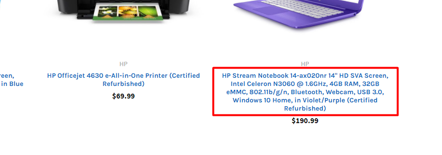

Add this custom CSS to **Storefront** > **Footer Script**:

```css
<style>
.card-title {
    max-height: 3.75rem;
    overflow: hidden;
}
</style>
```

It will limit maximum 3 lines. Set `max-height: 2.5rem` to limit maximum 2 lines.


## Hide category name on category page

Add this custom CSS to **Storefront** > **Footer Script**:

```css
<style>
.papaSupermarket-page--pages-category .page-heading--desktopOnly {
    display: none;
}
</style>
```

## Hide the category images on category pages

Add the code below to **Storefront** > **Footer Script**:

```html
<style>
.emthemesModez-categoryPage-mainImage { display: none !important }
</style>
```


## Change active tabs & remove other tabs in products by category block


By default, the theme display Bestselling tab active by default, if you want to make other tab active by default and/or hide other tabs, follow instruction below to edit the theme source code.

Make a copy of your theme in order to edit the theme source code:


Then click on **Edit Theme Files**. In the editor, edit file `templates\components\papa-supermarket\category\ajax-products-by-category-sorting-tabs.html`:


Edit as screenshot:


In the next version, we will add new feature allow customize this in Theme Editor.


## My products by category with sorting tabs block is not rendering on homepage?


If you already configured **Number of Categories** in Theme Editor but it's still not appearing, it's probably your categories have no products. To bypass this case to display products in sub-categories, you will need to edit theme source code. Edit file `templates/components/emthemes-modez/section/section.html`

Delete 2 line as screenshot below:


## Make main image & thumbnails on product details page uniform

Add the code below to Footer Script:

```html
<style>
.productView-imageCarousel-nav-item.slick-slide {
    position: relative;
}

.productView-imageCarousel-nav-item.slick-slide:before {
    display: block;
    content: ' ';
    height: 0;
    padding-bottom: 113.8%; /* height/width */
}

.productView-imageCarousel-nav-item img {
    max-height: 100%;
    max-width: calc(100% - 10px);
    position: absolute;
    top: 0;
    left: 50%;
    transform: translateX(-50%);
}

.productView-imageCarousel-main {
    margin-left: auto;
    margin-right: auto;
}

@media (min-width: 550px) {
    .productView-imageCarousel-main {
        max-width: 500px;
    }
}

.productView-imageCarousel-main-item > a {
    position: relative;
    display: block;
    height: 0;
    padding-top: 113.8%; /* height/width */
}

.productView-imageCarousel-main-item > a img {
    position: absolute;
    top: 0;
    left: 50%;
    transform: translateX(-50%);
    max-height: 100%;
}
</style>
```


## Display tooltip when hover Compare button on product items

Add custom code below into **Storefront** > **Footer Scripts**:

```html
<style>
.card-figcaption-button--compare:hover:after {
    content: 'Compare';
    position: absolute;
    padding: 4px 8px;
    background: #fff;
    display: inline-block;
    font-size: 12px;
    color: #666666;
    bottom: calc(100% + 4px);
    right: 0;
    text-indent: 0;
}
</style>
```


## How to change "Image Coming Soon" default product image?

Please upload your own "Coming Soon" image in **Marketing** > **Banner Manager**, then copy the image URL.

Go to **Storefront** > **Script Manager**, click **Create a Script**, choose:

- **Location on page** = `Footer`
- **Select pages where script will be added** = `All pages`
- **Script type** = `Script`

Enter the script below to **Scripts contents**:

```html
<script>
(function($) {
    var YOUR_COMINGSOON_IMG = '//placehold.it/500x500'; // <-- PUT YOUR COMING SOON IMAGE HERE

    function replaceImg($scope) {
        $('img[src*="ProductDefault.gif"]', $scope).attr('src', YOUR_COMINGSOON_IMG);
    }
    replaceImg();

    const observer = new MutationObserver(function(mutationsList, observer) {
        for (var i in mutationsList) {
            var mutation = mutationsList[i];
            if (mutation.type === 'childList') {
                replaceImg(mutation.addedNodes);
            }
        }
    });
    observer.observe(document.body, { childList: true, subtree: true });

    var style = document.createElement('style');
    style.innerHTML = 'img[src*="ProductDefault.gif"] { visibility: hidden }';
    document.head.appendChild(style);
})(window.jQuerySupermarket || window.jQuery);
</script>
```

Replace  `https://placehold.it/500x500` by your "Coming Soon" image URL.


## How to show "Coming Soon" default product image on product page?

Display: "Coming Soon" image on product page by adding the code in **Footer Scripts**:

```html
{{#unless product.main_image}}
<style>
.productView-images { background: url(https://placehold.it/500x500) no-repeat center center; background-size: auto; padding-top: 100%; height: 0; }
    
@media (min-width: 801px) {
.productView-images { padding-top: 50%; }
}
</style>
{{/unless}}​
```

Replace  `https://placehold.it/500x500` by your "Coming Soon" image URL.


## Move maintenance notice box to top of page

Add the code below into **Storefront** > **Footer Scripts**:

```html
<style>
body {
    padding-top: 10rem;
}

.maintenanceNotice {
    top: 55px;
    left: 0;
    right: 0;
    width: auto;
    display: flex;
    justify-content: space-between;
    height: 6rem;
    font-size: 11px;
    overflow: hidden;
}

@media (min-width: 550px) {
    body {
        padding-top: 8rem;
    }
    .maintenanceNotice {
        height: 4rem;
    }
}

@media (min-width: 800px) {
    body {
        padding-top: 4rem;
    }
    .maintenanceNotice {
        top: 0;
    }
}


@media (min-width: 1200px) {
    body {
        padding-top: 3rem;
    }
    .maintenanceNotice {
        height: 3rem;
    }
}

.maintenanceNotice > p {
    margin: 0;
    padding-right: 1.5rem;
}

.maintenanceNotice > br {
    display: none;
}

.maintenanceNotice > a {
    padding-left: 1.5rem;
}
</style>
```

**Note: Remove it when you launch your store.**


## Display sub-category name below sub-category image

By the default, the theme dipslays sub-category name over image. If you don't like this style, but want to display sub-category name under image, just add custom CSS code below into **Storefront** > **Footer Scripts**:

```css
<style>
.papaSupermarket-subcategories-image {
    height: 0;
    padding-top: 100%;
    text-align: center;
    display: block;
    position: relative;
}
.papaSupermarket-subcategories-image img {
    max-height: 100%;
    position: absolute;
    top: 50%;
    left: 50%;
    transform: translate(-50%, -50%);
}
.papaSupermarket-subcategories-grid-item:hover img {
    transform: translate(-50%, -50%) scale(1.2);
}
.papaSupermarket-subcategories-image + .papaSupermarket-subcategories-name {
    position: static;
    transform: none;
    background-color: transparent;
    display: block;
    text-align: center;
    padding-left: 0;
    padding-right: 0;
}
</style>
```

## Display entire product description on mobile

To optimize for mobile view, product description are collapse by default. Tap on VIEW ALL link to expand all product description.


If you want to display entire product description by default, add the custom code below into **Storefront** > **Footer Scripts**:

```html
<style>
@media (max-width: 800px) {
    .productView-description-tabContent.emthemesModez-mobile-collapse-content {
        max-height: none;
        overflow: auto;
    }

    .productView-description-tabContent .emthemesModez-mobile-collapse-handle {
        display: none;
    }
}
</style>
```

## Move reviews tab next to description tab on product page

Edit file `templates\components\products\product-view.html`, insert the code as showing below:


```html
{{#if settings.show_product_reviews}}
{{#if product.reviews.total '>' 0}}
    <li class="tab">
        <a class="tab-title" href="#tab-reviews">{{lang 'products.reviews.header' total=product.reviews.total}}</a>
    </li>
{{/if}}
{{/if}}
```

```html
{{#if settings.show_product_reviews}}
{{#if product.reviews.total '>' 0}}
    <div class="tab-content" id="tab-reviews" data-emthemesmodez-mobile-collapse>
        <h2 class="page-heading">{{lang 'products.reviews.header' total=product.reviews.total}}</h2>
        <div class="emthemesModez-mobile-collapse-content" data-emthemesmodez-mobile-collapse-content>
            {{> components/products/reviews reviews=product.reviews product=product urls=urls}}
        </div>
        <a href="#" class="emthemesModez-mobile-collapse-handle" data-emthemesmodez-mobile-collapse-handle><span class="on">{{lang 'common.view_all'}}</span><span class="off">{{lang 'common.close'}}</span></a>
    </div>
{{/if}}
{{/if}}
```


Edit file `templates\pages\product.html`, delete the code as showing below:


## Move brands list underneath products list on Brand page


If you want to display brands list under products list on brand page, add the custom CSS below into **Storefront** > **Footer Scripts**:

```html
<style>
@media (max-width: 800px) {
  .papaSupermarket-page--pages-brand .page {
    display: flex;
    flex-direction: column;
  }
  
  .papaSupermarket-page--pages-brand .page-sidebar {
    order: 2;
  }
  
  .papaSupermarket-page--pages-brand .page-content {
    order: 1;
  }

  .emthemesModez-productsFilter {
    position: fixed;
    top: 100px;
    left: 10px;
    z-index: 100;
  }
  
  .emthemesModez-productsFilter .actionBar {
    width: 280px;
  }
}
</style>
```

## Move bottom banner to under brand title on brand page

Insert the custom script below into **Storefront** > **Footer Scripts**:

```html
<script>
(function() {
    var body = document.body || document.getElementsByTagName('body')[0];
    if (body.className.match(/papaSupermarket-page--pages-brand/)) {
        var banners = document.querySelectorAll('.banners--bottom');
        var title = document.querySelectorAll('.h1.page-heading')[0];
        for (var i = 0; i < banners.length; i++) {
            title.parentNode.insertBefore(banners[i], title.nextSibling);
        }

        var css = '.papaSupermarket-page--pages-brand .banners--bottom { margin-top: 0; }';
        var head = document.head || document.getElementsByTagName('head')[0];
        var style = document.createElement('style');
        style.type = 'text/css';
        if (style.styleSheet){
            style.styleSheet.cssText = css;
        } else {
            style.appendChild(document.createTextNode(css));
        }
        head.appendChild(style);
    }
})();
</script>
```

## Move bottom banner up above product tabs

Insert the custom script below into **Storefront** > **Footer Scripts**:

```html
<script>
(function() {
    var body = document.body || document.getElementsByTagName('body')[0];
    if (body.className.match(/papaSupermarket-page--pages-home/)) {
        var banners = document.querySelectorAll('.banners--bottom');
        var productTabs = document.querySelectorAll('.emthemesModez-section--specialProductsTabs')[0];
        for (var i = 0; i < banners.length; i++) {
            productTabs.parentNode.insertBefore(banners[i], productTabs);
        }
    }
})();
</script>
```


## Display custom message above shipping options on checkout page:


Insert the code below into **Scripts Manager**, Checkout page, footer location:

```html
<script>
(function() {
    function processCheckoutShippingOptionTips() {
        $(function() {
            var $tipsEl = $('#checkout-shipping-options-tips');
            window.setInterval(function() {
                if ($('#checkout-shipping-options-tips-clone').length === 0) {
                    var $shippingOptionsEl = $('#checkout-shipping-options');
                    if ($shippingOptionsEl.length > 0) {
                        $tipsEl.clone()
                            .attr('id', 'checkout-shipping-options-tips-clone')
                            .show()
                            .insertBefore($shippingOptionsEl.children('legend'));
                    }
                }
            }, 500);
        });
    }

    document.write('\
        <div id="checkout-shipping-options-tips" style="display: none">\
            <ul>\
                <li>Please allow 1 to 2 business days for handling in addition to shipping time.</li>\
                <li>Orders placed on Fridays or Holidays may not be shipped until the next business day.</li>\
            </ul>\
            <p>Tip: Look at USPS as a shipping option for late week orders. We ship from Rhode Island and in many cases USPS is more cost effective method and will deliver on Saturdays as opposed to other carriers in the same or less time frame.</p>\
        </div>');

    var script = document.createElement("script");
    script.onload = processCheckoutShippingOptionTips;
    document.currentScript.parentNode.insertBefore(script, document.currentScript);
    script.src = 'https://cdnjs.cloudflare.com/ajax/libs/jquery/3.3.1/jquery.min.js';
})();
</script>
```


## Hide Sale badge for logged in users

Insert the custom script below into **Storefront** > **Footer Scripts**:

```html
<!-- Hide sale label for logged in users -->
{{#if customer}}
    <style>
        .sale-flag-side:not(.sale-flag-side--custom) {
            display: none;
        }
    </style>
{{/if}}
```


## Display customer group name & 'Price' label before products price

Insert the custom script below into **Storefront** > **Footer Scripts**:

```html
<!-- Display customer group & 'price' label before price -->
{{#if customer.customer_group_id}}
    <style>
        .customerGroup-price-label {
            float: left;
            margin-right: .75rem;
            margin-top: 5px;
        }
        .card-customerGroup-price-label {
            margin-right: .375rem;
        }
    </style>
    <script src="https://cdnjs.cloudflare.com/ajax/libs/jquery/3.3.1/jquery.min.js"></script>
    <script>
        $(function() {
            $('.productView-price').prepend('<div class="customerGroup-price-label">{{{customer.customer_group_name}}} Price</div>');
            $('.card-text .price:not(.price--rrp)').prepend('<span class="card-customerGroup-price-label">{{{customer.customer_group_name}}} Price</span>')
        });
    </script>
{{/if}}
```


## Fix product thumbnails carousel on product page for Supermarket version 1.5.4 and older

Insert the custom script below into **Storefront** > **Footer Scripts**:

```html
<!-- Fix product thumbnails carousel on product page for Supermarket version 1.5.4 and older -->
{{#if page_type '===' 'product'}}
    {{#if product.images.length '<=' theme_settings.productpage_thumbnails_count}}
        <style>
            .productView-imageCarousel-nav .slick-track { transform: none !important }
        </style>
    {{/if}}
{{/if}}
```


## Display product condition badge on every product card and product page main image


Insert the custom script below into **Storefront** > **Footer Scripts**:

```html
<!-- Papathemes: display product condition badge on product cards and product details page -->
<script src="https://cdnjs.cloudflare.com/ajax/libs/jquery/3.3.1/jquery.min.js"></script>
<script>
$(function() {
    function product_page() {
        var $el = $('.productView-info-value--condition');
        var $cond_badge = $('<div class="sale-flag-side sale-flag-side--custom"><span class="sale-text">' + $el.text() + '</span></div>');
        var $image = $('.productView-imageCarousel-main');
        var $last_badge = $('.productView-images .sale-flag-side').last();
        if ($last_badge.length > 0) {
            $last_badge.before($cond_badge);
        } else {
            $image.after($cond_badge)
        }
    }
    product_page();

    
    function request_all($scope) {
        $('[data-emthemesmodez-cart-item-add]', $scope).each(function(i, a) {
            var m = a.href.match(/product_id=([0-9]+)/);
            if (m) {
                var $card_figure = $(a).closest('.card-figure');
                var id = m[1];
                request_card(id, $card_figure);
            }
        });
    }

    function request_card(id, $card_figure) {
        $.ajax({
            url: '/products.php?productId=' + id,
            headers: {
                'stencil-options': '{"render_with":"products/quick-view"}'
            },
            success: function(data, status, xhr) {
                $html = $(data);
                $cond = $html.find('.productView-info-value--condition');
                if ($cond.length > 0) {
                    var $cond_badge = $('<div class="sale-flag-side sale-flag-side--custom"><span class="sale-text">' + $cond.text() + '</span></div>');
                    var $last_badge = $card_figure.find('.sale-flag-side');
                    if ($last_badge.length > 0) {
                        $last_badge.after($cond_badge);
                    } else {
                        $card_figure.prepend($cond_badge);
                    }
                }
            }
        });
    }
    request_all($('body'));
  
    setInterval(function() {
      $('.emthemesModez-productsByCategoryTabs-products').each(function(i, el) {
        if (!$(el).data('conditionBadgeAdded')) {
          $(el).data('conditionBadgeAdded', true);
          request_all($(el));
        }
      });
    }, 500);
});
</script>​
```


## Make all product card items in carousel (Related Products, Customer Also Viewed) same height

Add this custom CSS into **Storefront** > **Footer Scripts**:

```html
<style>
.productCarousel .slick-track { display: flex; align-items: stretch; }
.productCarousel .slick-track:before,
.productCarousel .slick-track:after { display: none; }
.productCarousel .slick-slide { height: auto; }
.productCarousel .card { min-height: 100%; }
</style>
```


## Show Out of Stock message on product page

It is a built-in feature of BigCommerce. However, some of our clients don't know how to accomplish. So we think this guide will be helpful.


Please configure **Advanced Settings** > **Inventory** as showing below:
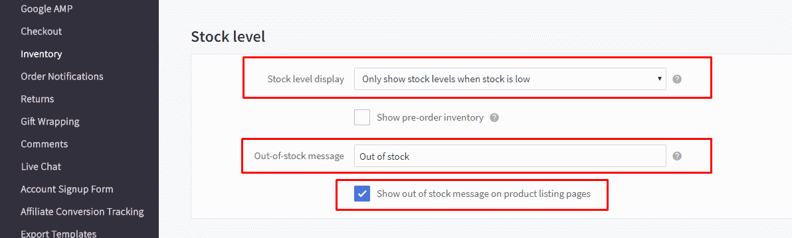

Edit your product, make sure you enable tracking inventory:


## Show UPS and all options of shipping

### On Checkout page for developers

Edit file `checkout_express.html` in **Storefront** > **Checkout Template Files**, add the code below:

```html
<style>
.shippingquote { display: block !important; }
.shippingquote a[onclick*=toggle] { display:none; }
</style>
```
### On estimated shipping of shopping cart page

Add the custom CSS below into **Storefront** > **Footer Scripts**:
```html
<style>
.estimator-form--ups { display: block !important; clip: auto !important; height: auto !important; width: auto !important; position: static !important }
.estimator-form-toggleUPSRate { display: none }
</style>
```


## Fix quick search popup cut off when the header is configured sticky

Add the custom CSS below into **Storefront** > **Footer Scripts**:

```html
<style>
[data-stickymenu] .dropdown--quickSearch .quickSearchResults { max-height: calc(100vh - 300px); overflow: auto; overflow-x: hidden }
.is-sticky[data-stickymenu] .dropdown--quickSearch .quickSearchResults { max-height: calc(100vh - 250px) }
[data-stickymenu] .dropdown--quickSearch .modal-close { top: -25px; right: -25px }
</style>
```


## Show all product thumbnails on product page

Configure Theme Editor to show up to 10 thumbnail images and add custom CSS below to **Storefront** > **Footer Scripts**:

```html
<style>
@media (min-width: 801px) {
    .productView-imageCarousel-nav { height: auto !important; overflow: visible !important; padding: 0 !important; }
    .productView-imageCarousel-nav .slick-arrow { display: none }
    .productView-imageCarousel-nav .slick-track { width: 100% !important; transform: none !important; }
    .productView-imageCarousel-nav-item { width: 100px !important; margin-bottom: 10px !important }
    .js .productView-imageCarousel-nav { max-height: none }
}
</style>
```


## Move Out of Stock alert to the top of product details on product page

Add this custom script into **Storefront** > **Footer Scripts**:

<script>
(function () {
    function moveAlert(from, to) {
        var alerts = from.querySelectorAll('.alertBox.alertBox--error');
        if (alerts) {
            for (var i in alerts) {
                if (typeof alerts[i] === 'object') {
                    var alert = alerts[i];
                    to.insertBefore(alert, to.firstChild);
                }
            }
        }
    }

    var productView = document.querySelector('.productView');
    var productViewInfo = document.querySelector('.productView-options');
    if (productView && productViewInfo) {
        setInterval(function () {
            moveAlert(productViewInfo, productView);
        }, 100);

        var MutationObserver = window.MutationObserver || window.WebKitMutationObserver;
        if (MutationObserver) {
            var observer = new MutationObserver(function () {
                moveAlert(productViewInfo, productView);
            });
            observer.observe(productViewInfo, {
                childList: true,
                subtree: true,
            });
        }
    }
})();
</script>

## Add background image to header

Add this custom script into **Storefront** > **Footer Scripts**:

<style>
@media (min-width: 801px) {
.emthemesModez-header-userSection { background-image: url('https://cdn8.bigcommerce.com/s-tlt0fnmxln/product_images/uploaded_images/lpgshop-logo.png?t=1535516377'); background-repeat: no-repeat; background-position: left center; background-size: contain }
.header .header-logo-text { opacity: 0 }
}
</style>​​​​​​​​​​​​


## Always show Add to Cart button on product cards

Add this custom script into **Storefront** > **Footer Scripts**:

```html
<style>
.productCarousel .card-buttons, .productGrid .card-buttons { opacity: 1; clip: auto; visibility: visible }
.card-figcaption { opacity: 1 }
.card-figcaption-button.quickview { opacity: 0 }
.card:hover .card-figcaption-button.quickview { opacity: 1 }
</style>
```

## Show Add to Cart button at the bottom of product card item

Add this custom script into **Storefront** > **Footer Scripts**:

```html
<style>
@media (min-width: 801px) {
    .card { padding-bottom: 50px !important }
    .card-figure { overflow: visible; position: static }
    .card-img-container { position: relative }
    .card-figcaption-button.quickview-alt { bottom: 0 }
}
</style>
```

## Display phone number on header on mobile

Add this custom script into **Storefront** > **Footer Scripts**:

```html
<style>
@media(max-width:800px) {
  .emthemesModez-header-topSection .navUser:last-child .navUser-section .navUser-item:last-child { display: block; margin-right: 50px; border: 0 } 
}
</style>
```


## Fix instagram photos display uniform

Add this custom script into **Storefront** > **Footer Scripts**:

```html
<style>
.emthemesModez-instafeed .slick-slide a {
  padding-top: 100%;
  content: '';
  display: block;
  height: 0;
  position: relative;
}

.emthemesModez-instafeed .slick-slide img {
  object-fit: cover;
  position: absolute;
  top: 0;
  left: 0;
  width: 100%;
  height: 100%;
}
</style>
```


## Fix Products Bought Together stop working after BigCommerce API changed

If you suddenly get a problem that the products also bought together stop working on your product pages. 
That is because BigCommerce has changed the content type of product ajax request.

To workaround this issue while waiting for the fix from BigCommerce or the theme update, please follow
this instruction.

Login to your store admin panel, go to **Storefront** > **Script Manager** > click on the button **Create a Script**.

Input:

- **Name of Script**: `Fix Also Bought Products stop working after BC API changed` or whatever.
- **Location of page**: `Footer`
- **Select pages where script will be added**: `Storefront pages`.
- **Script type**: `Script`.
- **Script contents**:

```html
<script>
window.jQuerySupermarket(document).ajaxSend((event, xhr, settings) => {
	if (settings.url.match(/\/products\.php/)) {
		xhr.setRequestHeader('x-requested-with', '');
	}
});
</script>
```

Then click **Save** button.

Your script should look like this screenshot:


## Fix the main product image carousel show next image cropped

This issue may appears when upgrade theme from version 4.1 to 4.2. To fix it, just increase the main image size from 608x608 to 734x734 or bigger. Go to **Theme Editor** > **Products** > **Image Sizes** > set **Main product images** = `Specify dimensions` and set **Max width** = `734`, **Max height** = `734`.


## Fix the popular brands not show enough items as configured in the footer

From version 4.2, we added an option to support show/hide popular brands in the sidebar. The popular brands in the footer may not work properly because your theme settings still stores the old variable. To fix this, go to **Theme Editor** > **Products** > **Category pages** > set **Show shop by brands on** = any value; Footer > **Main Footer** > **Show brands** = any value.

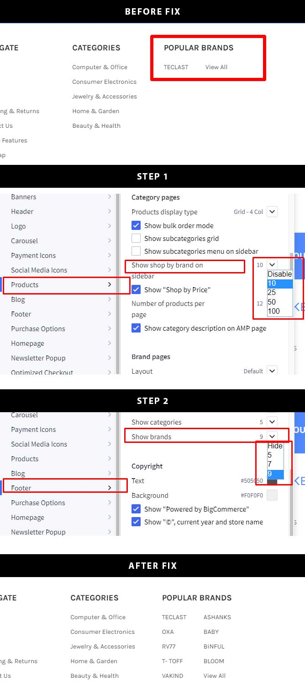


## Show all thumbnails as grid in product detail pages

Add the custom code below to **Storefront** > **Footer Scripts**:

```html
<style>
.productView-imageCarousel-nav .slick-track { transform: none !important; width: 100% !important; }
.productView-imageCarousel-nav-item { width: calc(25% - 10px) !important; margin: 5px !important; }
.productView-imageCarousel-nav .slick-arrow { display: none }
</style>
```


## Add custom labels on the main menu items

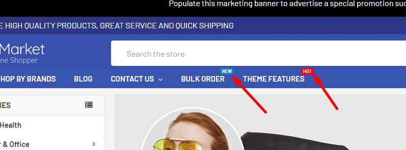

Add the custom code below to **Storefront** > **Footer Scripts**:

```html
<style>
@media (min-width: 801px) {
.navPages-container .navPages > .navPages-list > .navPages-item:nth-child(5) a:after {
  content: "New";
  font-size: 9px;
  position: absolute;
  top: -2px;
  right: 0;
  background: #167ac6;
  color: white;
  padding: 0 4px;
}
.navPages-container .navPages > .navPages-list > .navPages-item:nth-child(6) a:after {
  content: "Hot";
  font-size: 9px;
  position: absolute;
  top: -2px;
  right: 0;
  background: red;
  color: white;
  padding: 0 4px;
}
}
</style>​
```

Update `nth-child(5)` and `nth-child(6)` coresponding your menu item order number.


## Move sub-pages menu to the right sidebar

Go to **Storefront** > **Script Manager**, click **Create a Script**, choose:

- **Location on page** = `Footer`
- **Select pages where script will be added** = `All pages`
- **Script type** = `Script`

Enter the script below to **Scripts contents**:

```html
<script>
(function($) {
    var $subpages = $('.page-sidebar .navList--aside .sidebarBlock--navList');
    var $rightSidebar = $('<div class="page-sidebar page-sidebar--right"></div>');
    if ($subpages.length > 0) {
        $rightSidebar.append($subpages);
        $('.page-sidebar').after($rightSidebar);
    }
})(window.jQuerySupermarket || window.$);
</script>
```


## How to use animated GIF logo

Go to **Storefront** > **Script Manager**, click **Create a Script**, choose:

- **Location on page** = `Footer`
- **Select pages where script will be added** = `All pages`
- **Script type** = `Script`

Enter the script below to **Scripts contents**:

```html
<script>
(function() {
    var els = document.getElementsByClassName('header-logo-image');
    for (var i in els) {
        var el = els[i];
        el.src = el.src.replace(/^.*\/([^\/]+)$/, '/product_images/$1');
    }
})();
</script>
```

## Use SVG logo

Upload your SVG logo in **Storefront** > **Images Manager** and copy the image URL.

Go to **Storefront** > **Script Manager**, click **Create a Script**, choose:

- **Location on page** = `Footer`
- **Select pages where script will be added** = `All pages`
- **Script type** = `Script`

Enter the script below to **Scripts contents**:

```html
<script>
(function() {
    var els = document.getElementsByClassName('header-logo-image');
    for (var i in els) {
        var el = els[i];
        el.src = 'YOUR-SVG-LOGO-URL';
    }
})();
</script>
```

Replace `YOUR-SVG-LOGO-URL` by your logo URL.


## Hide the active page title on the breacrumbs

If you want to hide the active page title or the last item link on the breadcrumbs, add the code below to **Storefront** > **Footer Scripts**:

```html
<style>
.breadcrumb.is-active { display: none }
</style>
```


## Fix review link anchor jump to content hidden by the sticky header

Go to **Storefront** > **Script Manager**, click **Create a Script**, choose:

- **Location on page** = `Footer`
- **Select pages where script will be added** = `All pages`
- **Script type** = `Script`

Enter the script below to **Scripts contents**:

```html
<script>
(function($) {
    $('.productView-reviewLink a').not('[data-reveal-id]').on('click', function() {
        $('html, body').animate({scrollTop: $('#product-reviews').offset().top - 200}, 500);
    });
})(window.jQuerySupermarket || window.jQuery);
</script>
```


## Display the main carousel's content overlay the image on mobile like  on desktop

Add the custom code below to **Storefront** > **Footer Scripts**:

```html
<style>
@media (max-width: 800px) {
    .heroCarousel-content {
        position: absolute;
        top: 50%;
        transform: translateY(-50%);
        padding: 8px 16px;
        background-color: transparent;
        display: flex;
        flex-direction: column;
    }

    .heroCarousel-title {
        font-size: 16px;
        background-color: rgba(0, 0, 0, .6);
        padding: 2px 4px;
        margin: 0 auto;
    }

    .heroCarousel-description {
        font-size: 12px;
        background-color: rgba(0, 0, 0, .6);
        padding: 2px 4px;
        margin: 4px auto 0;
    }

    .heroCarousel-action {
        padding: 4px 8px;
        font-size: 12px;
        margin: 4px auto 0;
    }
}
</style>
```


## Fix the phone number link on the top header bar

The phone number link which has `tel:` attribute requires to specify the country code in order to make it callable. 

To fix this issue, go to **Storefront** > **Script Manager**, click **Create a Script**, choose:

- **Location on page** = `Footer`
- **Select pages where script will be added** = `All pages`
- **Script type** = `Script`

Enter the script below to **Scripts contents** and update `+11231231234` by your phone number. `+1` is dialing code of USA:

```html
<script>
(function($) {
    $('.emthemesModez-header-topSection a[href^="tel:"]').attr('href', 'tel:+11231231234');
})(window.jQuerySupermarket || window.jQuery);
</script>
```

## Add custom CSS to Checkout Page

Go to **Storefront** > **Script Manager**, click **Create a Script**, choose:

- **Location on page** = `Footer`
- **Select pages where script will be added** = `Checkout`
- **Script type** = `Script`

Enter the script below to **Scripts contents**:

```html
<script>
(function() {
    var style = document.createElement('style');
    style.innerHTML = 'INSERT YOUR CUSTOM CSS HERE';
    document.head.appendChild(style);
})();
</script>
```


## Fix cart quantity counter shouldn't count child products

By default, BigCommerce API returns cart quantity include the parent products and the child products (products used in product pick-list option). If think it's incorrect, take a look at the code below to make it only counts the parent products.

Go to **Storefront** > **Script Manager**, click **Create a Script**, choose:

- **Location on page** = `Footer`
- **Select pages where script will be added** = `All pages`
- **Script type** = `Script`

Enter the script below to **Scripts contents**:

```html
<script>
(function($) {
    $(document).ajaxComplete(function(event, xhr, options) {
        if (!options.url || options.url.indexOf('api/storefront/cart') === -1 || !xhr.responseJSON || xhr.responseJSON.length === 0) {
            return;
        }
        var cart = xhr.responseJSON[0];
        var lineItemQuantities = [
            cart.lineItems.physicalItems,
            cart.lineItems.digitalItems,
            cart.lineItems.customItems,
        ].reduce(function(a, b) {
            return a.concat(b);
        }).reduce(function(total, item) {
            return (typeof total == 'object' ? total.quantity : total) + (item.parentId ? 0 : item.quantity);
        });
        var giftCertificateQuantity = cart.lineItems.giftCertificates.length;
        var quantity = lineItemQuantities + giftCertificateQuantity;
        setTimeout(function() {
        	$('body').trigger('cart-quantity-update', quantity);
        }, 200);
    });
})(window.jQuerySupermarket || window.jQuery);
</script>
```


## Change the placeholder text of the search input box

Go to **Storefront** > **Script Manager**, click **Create a Script**, choose:

- **Location on page** = `Footer`
- **Select pages where script will be added** = `All pages`
- **Script type** = `Script`

Enter the script below to **Scripts contents**:

```html
<script>
(function($) {
    $('input[data-search-quick]').attr('placeholder', 'Search by product name,sku and keyword');
})(window.jQuerySupermarket || window.jQuery);
</script>
```


## Change the wording "You can only purchase a maximum of 1..." in the popup message.


Go to **Storefront** > **Script Manager**, click **Create a Script**, choose:

- **Location on page** = `Footer`
- **Select pages where script will be added** = `All pages`
- **Script type** = `Script`

Enter the script below to **Scripts contents**:


```html
<script>
(function($) {
    $('#alert-modal').on('opened.fndtn.reveal', function(event) {
        var $el = $(event.target).find('.modal-content > span');
        if ($el.length > 0) {
            var msg = $el.html().replace('You can only purchase a maximum of 1', 'You already have one in your shopping cart');
            $el.html(msg);
        }
    });
})(window.jQuerySupermarket || window.chiarajQuery || window.jQuery);
</script>
```

## Remove the new products on the left sidebar of blog pages

Go to **Storefront** > **Script Manager**, click **Create a Script**, choose:

- **Location on page** = `Footer`
- **Select pages where script will be added** = `All pages`
- **Script type** = `Script`

Enter the script below to **Scripts contents**:

```html
<script>
(function($) {
    $('.sidebarBlock .productList[data-product-type=new]').closest('.sidebarBlock').remove();
})(window.jQuerySupermarket || window.jQuery);
</script>
```

## Fix social bookmarks doesn't work properly when Instant-Load feature is enabled

Go to **Storefront** > **Script Manager**, click **Create a Script**, choose:

- **Location on page** = `Footer`
- **Select pages where script will be added** = `All pages`
- **Script type** = `Script`

Enter the script below to **Scripts contents**:

```html
<script>
(function($) {
    $('body').on('loaded.instantload', function() {
        if (window.addthis) {
            window.addthis.toolbox('.addthis_toolbox');
        }
    });
})(window.jQuerySupermarket || window.jQuery);
</script>
```

## Move product description show under the price

Go to **Storefront** > **Script Manager**, click **Create a Script**, choose:

- **Location on page** = `Footer`
- **Select pages where script will be added** = `All pages`
- **Script type** = `Script`

Enter the script below to **Scripts contents**:

```html
<script>
(function($) {
    function main() {
        $('.productView').first().find('.productView-price').first().after($('#tab-description .productView-description-tabContent').html());
        $('.productView').first().find('.productView-description').hide();
    }
    $(document).ready(main);
    $('body').on('loaded.instantload', main);
})(window.jQuerySupermarket || window.jQuery);
</script>
```


## Fix product main images loading slow on product page

If your original product image uploaded is PNG format and its size is too large, BigCommerce will need time to convert the image into WEBP format that is optimized for web. Especially with the new LQIP algorithm that supports better responsiveness for mobile and retina screen, it will take longer processing time for the original image in PNG format and large size.

This problem usually occurs on the **product page** and product **quick-view**. To fix this, you can disable the LQIP compression feature, using the old image conversion method.

Go to **Storefront** > **Script Manager**, click **Create a Script**, choose:

- **Location on page** = `Footer`
- **Select pages where script will be added** = `All pages`
- **Script type** = `Script`

Enter the script below to **Scripts contents**:

```html
<script>
(function($) {
    function main($scope) {
        console.log('Fix product main images.');
        $('.productView-imageCarousel-main-item img', $scope)
            .removeAttr('srcset')
            .removeAttr('data-srcset');
    }
    main();

    $(document).ready(main);
    $('body').on('loaded.instantload', main);
    $('#modal').on('opened.fndtn.reveal', function() {
        setTimeout(main, 1000);
    });
    $(document).ajaxComplete(function(event, resp, options) {
        if (options.headers['stencil-options'] && options.headers['stencil-options'].match(/quick-view/)) {
            setTimeout(main, 1000);
        }
    });
})(window.jQuerySupermarket || window.jQuery);
</script>
```


## Use animated GIF images on Home Page Carousel

Go to **Storefront** > **Script Manager**, click **Create a Script**, choose:

- **Location on page** = `Footer`
- **Select pages where script will be added** = `All pages`
- **Script type** = `Script`


Enter the script below to **Scripts contents**: 

```html
<script>
(function($) {
    function main() {
        $('.heroCarousel-image').each(function(i, el) {
            var $el = $(el);
            var url = $el.attr('src').replace(/^(.+\/.+\.bigcommerce\.com\/s-[^\/]+)\/.+\/([^\/]+)$/, '$1/product_images/theme_images/$2?imbypass=on');

            $el.removeAttr('data-srcset').removeAttr('srcset');

            if ($el.hasClass('lazyload')) {
                $el.attr('data-src', url);
            } else {
                $el.attr('src', url);
            }
        });
            
    }
    $(document).ready(main);
    $('body').on('loaded.instantload', main);
})(window.jQuerySupermarket || window.jQuery);
</script>
```


## Make the header logo sharper on Retina screens

Go to **Storefront** > **Script Manager**, click **Create a Script**, choose:

- **Location on page** = `Footer`
- **Select pages where script will be added** = `Store pages`
- **Script type** = `Script`


Enter the script below to **Scripts contents**: 

```html
<script>
    (function($) {
        var $img = $('.header-logo-image');
        if ($img.length > 0) {
            var src = $img.attr('src');
            var s = src.replace(/stencil\/[^\/]+\//, 'stencil/***/');
            $img.attr('srcset', src + ' 1x, ' + s.replace('***', '640w') + ' 2x');
        }
        
    })(window.jQuerySupermarket || window.jQuery);
</script>
```


Go to **Storefront** > **Script Manager**, click **Create a Script**, choose:

- **Location on page** = `Footer`
- **Select pages where script will be added** = `Checkout`
- **Script type** = `Script`


Enter the script below to **Scripts contents**: 


```html
<script
  src="https://code.jquery.com/jquery-3.4.1.min.js"
  integrity="sha256-CSXorXvZcTkaix6Yvo6HppcZGetbYMGWSFlBw8HfCJo="
  crossorigin="anonymous"></script>
<script>
(function($) {
    var $img = $('#logoImage'); 
    var src = $img.attr('src');
    var s = src.replace(/stencil\/[^\/]+\//, 'stencil/***/');
                        console.log(s);
    $img.attr('srcset', src + ' 1x, ' + s.replace('***', '640w') + ' 2x');
    
})(window.jQuerySupermarket || window.jQuery);
</script>
```


## Automatically add quotation marks to make the quick search more accurately

**Question:** What changes have to be made to the quick search code for it to automatically add "quotations" to the keyword being entered in the search bar so that searches are more exact.

**Answer:**

Go to **Storefront** > **Script Manager**, click **Create a Script**, choose:

- **Location on page** = `Footer`
- **Select pages where script will be added** = `All pages`
- **Script type** = `Script`

Enter the script below to **Scripts contents**: 

```html
<script>
    (function($) {
        function main() {
            stencilUtils.api.search._oldSearch = stencilUtils.api.search.search;
            stencilUtils.api.search.search = function(query, params, callback) {
                if (params && params.template && params.template == 'search/quick-results') {
                    return this._oldSearch('"' + query + '"', params, callback);
                } else {
                    return this._oldSearch(query, params, callback);
                }
            };

            $('form[action*="search.php"]').on('submit', function() {
                var $el = $(event.target).find('input[name=search_query]');
                var s = $el.val().trim();
                if (!s.match(/^['"]/)) {
                    $el.val('"' + s + '"');
                }
            });

            // Without jQuery:
            // var els = document.querySelectorAll('form[action*="search.php"]');
            // for (var i = 0; i < els.length; i++) {
            //     els[i].addEventListener('submit', function(event) {
            //        var input = event.target.querySelectorAll('input[name=search_query]')[0];
            //        var s = input.value.trim();
            //        if (!s.match(/^['"]/)) {
            //            input.value = '"' + s + '"';
            //         }
            //     });
            // }
        }
        $(document).ready(main);
        $('body').on('loaded.instantload', main);
    })(window.jQuerySupermarket || window.jQuery);
</script>
```


## Apply a coupon code automatically on the cart page

If you want to apply a coupon code automatically when it is passed to the cart page URL, for example: `/cart.php?coupon=YOUR-COUPON-CODE`.

Go to **Storefront** > **Script Manager**, click **Create a Script**, choose:

- **Location on page** = `Footer`
- **Select pages where script will be added** = `All pages`
- **Script type** = `Script`

Enter the script below to **Scripts contents**: 

```html
<script>
(function($) {
    var scriptLoading = 0;

    function addScript(fn) {
        scriptLoading++;
        var el = document.createElement('script');
        el.src = fn;
        el.onload = function() { scriptLoading--; };
        document.head.appendChild(el);
    }

    if (typeof $ == 'undefined') {
        addScript('https://code.jquery.com/jquery-3.4.1.min.js');
    }
    if (typeof stencilUtils == 'undefined') {
        addScript('https://cdn.jsdelivr.net/npm/@bigcommerce/stencil-utils@4.2.0/dist/stencil-utils.min.js');
    }
    if (typeof Cookies == 'undefined') {
        addScript('https://cdn.jsdelivr.net/npm/js-cookie@2/src/js.cookie.min.js');
    }

    function ready() {
        // console.log('ready is called');
        var couponcode = Cookies.get('couponcode');

        if (m = window.location.search.match(/coupon=([^&]+)/)) {
            couponcode = m[1];
            Cookies.set('couponcode', couponcode);
        }

        if (couponcode) {
            stencilUtils.api.cart.getCartQuantity({}, function(_, quantity) {
                // console.log(quantity);

                if (quantity > 0) {
                    stencilUtils.api.cart.applyCode(couponcode, function(error, response) {
                        Cookies.remove('couponcode');
                        if (window.location.pathname.match(/^\/cart\.php/)) {
                            window.location.reload();
                        }
                    });
                }
            });
        }
    }

    function main() {
        if (typeof $ == 'undefined') {
            $ = window.jQuery;
        }
        $(document).ready(ready);
        $('body').on('loaded.instantload', ready);
        stencilUtils.hooks.on('cart-item-add', function() {
            setTimeout(ready, 500);
        });
    }

    var i = setInterval(function() {
        if (scriptLoading === 0) {
            clearInterval(i);
            main();
        }
    }, 100);
})(window.jQuerySupermarket || window.jQuery);
</script>
```

## Fix product variant image changed slow when selecting product option

From Cornerstone 4.0, BigCommerce supports responsive image using `` `srcset` attribute which allows the browser to download different image depending on user's screen size. This function consumes a lot of time to generate many different size images, specially if your original product images are high quality and large sizes.

For workaround, you can install the custom script below to disable this feature, so that BigCommerce only generates the main product image one size.

Go to **Storefront** > **Script Manager**, click **Create a Script**, choose:

- **Location on page** = `Footer`
- **Select pages where script will be added** = `Store pages`
- **Script type** = `Script`

Enter the script below to **Scripts contents**: 

```html
<script>
(function() {
    var getSrcsetOld = stencilUtils.tools.imageSrcset.getSrcset;
    stencilUtils.tools.imageSrcset.getSrcset = function(url, sizes) {
        if (!sizes) {
            sizes = {'1x': '608x608'};
        }
        return getSrcsetOld(url, sizes);
    }
})();
</script>
```

## Make Homepage Carousel fade in/out instead of sliding right to left

Go to **Storefront** > **Footer Script**, insert the custom script below:

```html
<style>
.heroCarousel-container { width: 100% }
.js .slick-initialized.heroCarousel .slick-track { width: 100% !important; transform: none !important; position: relative; }
.js .slick-initialized.heroCarousel .slick-slide { z-index: 1; opacity: 0 !important; top: 0; left: 0; position: absolute; transition: opacity .5s ease-in; }
.js .slick-initialized.heroCarousel .slick-active { z-index: 2 !important; opacity: 1 !important; position: relative; }
</style>
```


## Display phone number on the header on mobile

Go to **Storefront** > **Footer Script**, insert the custom script below:

```html
<style>
@media (max-width:800px) {
  .emthemesModez-header-topSection .navUser:last-child { position: absolute; left: 0; top: 55px; width: 100%; transform: none }
  .emthemesModez-header-topSection .navUser:last-child .navUser-section { display: block; float: none;  }
  .emthemesModez-header-topSection .navUser:last-child .navUser-item:last-child { display:block;  text-align: center; width: 100%; background: black; height: 34px; }
  body { padding-top: 89px }
}
</style>
```

## Translate language in Optimized Checkout Page and Order Confirmation Page without editing theme files.


Go to **Storefront** > **Script Manager**, click **Create a Script**, choose:

- **Location on page** = `Head`
- **Select pages where script will be added** = `Checkout` for the checkout page or `Order Confirmation` for the order confirmation page.
- **Script type** = `Script`

Enter the example script below to **Scripts contents**: 

```html
<script>
    window.language = {"locale":"en","locales":{},"translations":{
        "optimized_checkout": {
            "address": {
                "postal_code_label": "Zip/Postal Code"
            },
            "shipping": {
                "shipping_heading": "Delivery"
            },
            "order_confirmation": {
                "order_with_support_number_text": "An email will be sent containing information about your purchase. If you have any questions about your purchase, email us at <a ng-href=\"mailto:order@papathemes.com?Subject=Order {orderNumber}\" target=\"_top\">order@papathemes.com</a> or call us at <a href=\"tel://+1 111-111-1111\">111-111-1111</a>.",
                "order_without_support_number_text": "An email will be sent containing information about your purchase. If you have any questions about your purchase, email us at <a ng-href=\"mailto:order@papathemes.com?Subject=Order {orderNumber}\" target=\"_top\">order@papathemes.com</a>."
            }
        }
    }};
</script>
```

In the example above, we translated `Postal Code` to `Zip/Postal Code`, `Shipping` to `Delivery`. We also translate the message on the order confirmation page to insert our email `order@papathemes.com` and phone number `111-111-1111`.

For a full list of the translation keys, check and download the language file in this guide: https://developer.bigcommerce.com/stencil-docs/localization/multi-language-checkout#browsing-hidden-translation-keys


## Show sold out products at bottom of product category page or at the end of in products grid

Using the custom script below to show out of stock products at the end of products grid.

Go to **Storefront** > **Script Manager**, click **Create a Script**, choose:

- **Location on page** = `Footer`
- **Select pages where script will be added** = `All pages`
- **Script type** = `Script`

Enter the script below to **Scripts contents**: 

```html
<script>
    (function($) {
        function addCss() {
            $('head').append(''
                + '<style>'
                + '.product { order: 1 }'
                + '.product--outstock { order: 2 }'
                + '</style>'
            );
        }
        function main() {
            $('.productGrid .product').each(function(i, el) {
                const $el = $(el);
                if ($el.find('.card-figcaption-button.quickview-alt, .card-figcaption-button[href*="/cart.php?action=add"]').length === 0) {
                    $el.addClass('product--outstock');
                }
            });
        }
        $(document).ready(function() {
            addCss();
            main();
        });
        $('body').on('loaded.instantload', main);
    })(window.jQuerySupermarket || window.jQuery);
</script>
```


## Make the pagination standing out

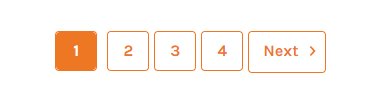

Add the custom CSS below to **Storefront** > **Footer Scripts**:


```html
<style>
.pagination-item .pagination-link {
  font-size: 16px;
  font-weight: bold;
  min-width: 40px;
}

.pagination-item,
.pagination-item.pagination-item--current {
  border-color: #f0790b;
  border-radius: 4px;
}
.pagination-item--current .pagination-link,
.pagination-item--current .pagination-link:hover{
  background: #f0790b;
  color: #fff;
}
</style>
```

## Add the external CSS file to your theme

Go to **Storefront** > **Script Manager**, click **Create a Script**, choose:

- **Location on page** = `Footer`
- **Select pages where script will be added** = `All pages`
- **Script type** = `Script`

Enter the script below to **Scripts contents**: 

```html
<script>
(function() {
    var el = document.createElement('link');
    el.rel = "stylesheet";
    el.src = "/PATH-TO-YOUR-CSS-FILE/FILE-NAME.css";
    document.head.appendChild(el);
})();
</script>
```

Replace `/PATH-TO-YOUR-CSS-FILE/FILE-NAME.css` with your external CSS file URL.

### Host your external CSS file with BigCommerce CDN to take advantage of BigCommerce's cache system to optimize page load speed

Upload your external CSS file to your  [BigCommerce store WebDAV](https://support.bigcommerce.com/s/article/File-Access-WebDAV). We recommend to upload in folder `content/`.

Find your store CDN URL by opening your website, right click View page source (`Ctrl + U` on Chrome). Find (`Ctrl + F`) string `data-stencil-stylesheet`, the string `https://cdn11.bigcommerce.com/s-c14n6tful3/` in href attribute start with `https://cdn...` end with `s-....../` is your store CDN URL:

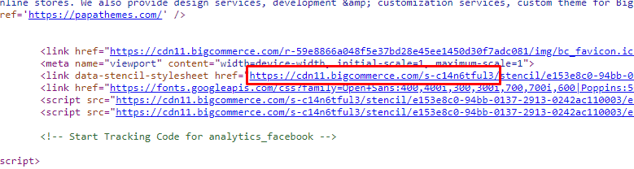

For example your CSS file name is `custom.css` and you upload to folder `content/` via WebDAV, its URL is `https://cdn11.bigcommerce.com/s-c14n6tful3/content/custom.css`


## Move the bottom banners to the top of content on Category Page

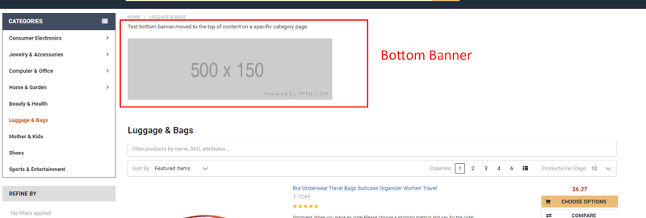

Create a banner in **Marketing** > **Bannners**:

- **Show on Page** = `For a Specific Category`
- **Visible** = `Yes`
- **Location** = `Bottom of Page`

Go to **Storefront** > **Script Manager**, click **Create a Script**, choose:

- **Location on page** = `Footer`
- **Select pages where script will be added** = `All pages`
- **Script type** = `Script`

Enter the script below to **Scripts contents**: 

```html
<script>
(function($) {
    function main() {
        if ($('body').hasClass('papaSupermarket-pageType--category')) {
            $('.banners[data-banner-location=bottom]').children().insertAfter('.breadcrumbs');   
        }
    }
    $(document).ready(main);
    $('body').on('loaded.instantload', main);
})(window.jQuerySupermarket || window.jQuery);
</script>
```

**Note:** This solution doesn't work when **Instant-Load** feature is enabled in the current version. We will fix it in the next version.


## Move Add to Cart button in Recently Viewed Products not overlap the price

Add the CSS script below to **Storefront** > **Footer Scripts**:

```html
<style>
@media (min-width: 801px) {
  .listItem-body { padding-bottom: 40px !important }
  .listItem-buttons { min-width: 200px; left: auto !important; right: 0 !important }
}
</style>
```


## Fix price styling in Shipping Method section of Checkout page

Go to **Storefront** > **Script Manager**, click **Create a Script**, choose:

- **Location on page** = `Footer`
- **Select pages where script will be added** = `Checkout`
- **Script type** = `Script`

Enter the script below to **Scripts contents**: 


```html
<script>
(function() {
    var style = document.createElement('style');
    style.innerHTML = '.shippingOptionLabel .shippingOption-price { min-width: 10rem; max-width: 10rem }';
    document.head.appendChild(style);
})();
</script>
```

## Show Mega Menu on Homepage and Slide-down Menu on other pages

1. Tick on **Showing sub-category vertical** in **Theme Editor** > **Header** > **Main navigation**.
2. Go to **Storefront** > **Script Manager**, click **Create a Script**, choose:

- **Location on page** = `Head`
- **Select pages where script will be added** = `Store pages`
- **Script type** = `Script`

Enter the script below to **Scripts contents**: 


```html
<script>/* {{#if page_type '===' 'default'}}{{merge theme_settings subcategories_menu_vertical=false}}{{/if}} */</script>
```


##  Uncheck "My Billing address is the same as my Delivery address" on Checkout page

Go to **Storefront** > **Script Manager**, click **Create a Script**, choose:

- **Location on page** = `Footer`
- **Select pages where script will be added** = `Checkout`
- **Script type** = `Script`

Enter the script below to **Scripts contents**: 

```html
<script>
(function() {
    var done = false;
    var timer = setInterval(function() {
        if (done) {
            clearInterval(timer);
            return;
        }
        var el = document.getElementById('sameAsBilling');
        if (el) {
            if (el.checked) {
                el.click();
            }
            done = true;
        }
    }, 500);
})();
</script>
```


## Sort Popular Brands on the sidebar by alphabet

Go to **Storefront** > **Script Manager**, click **Create a Script**, choose:

- **Location on page** = `Footer`
- **Select pages where script will be added** = `All Pages`
- **Script type** = `Script`

Enter the script below to **Scripts contents**: 

```html
<script>
    (function($) {
        var $li = $('#brands-navList li:not(:last-child)').sort(function(a, b) {
            return $(a).find('a').attr('title').localeCompare($(b).find('a').attr('title'));
        });
        $('#brands-navList').prepend($li);
    })(window.jQuerySupermarket || window.jQuery);
</script>
```


## Move Popular Brands block on the left sidebar to the right sidebar

Go to **Storefront** > **Script Manager**, click **Create a Script**, choose:

- **Location on page** = `Footer`
- **Select pages where script will be added** = `Store Pages`
- **Script type** = `Script`

Enter the script below to **Scripts contents**: 

```html
<script>
    (function($) {
        function ready() {
            var $sidebar = $('<div class="page-sidebar page-sidebar--right custom"></div>').insertBefore('.page-content');
            var $brandsBlock = $('.page-sidebar .sidebarBlock--brands').first().appendTo($sidebar);

            if ($brandsBlock.length === 0) {
                $.get('/cart.php', null, function(resp) {
                    $(resp).find('.sidebarBlock--brands').appendTo($sidebar);
                });
            }
        }
        $(document).ready(ready);
        $('body').on('loaded.instantload', ready);

        $('<style />').html('.page-sidebar--right.custom { padding-left: 0; padding-right: 1.125rem }').appendTo('head');
    })(window.jQuerySupermarket || window.jQuery);
</script>
```

## Fix 2 banners beside the main carousel on home page display wrong in version 4.5.2


Go to **Storefront** > **Script Manager**, click **Create a Script**, choose:

- **Location on page** = `Header`
- **Select pages where script will be added** = `Store Pages`
- **Script type** = `Script`

Enter the script below to **Scripts contents**: 

```html
<script>
    (function() {
        var css = document.createElement('style');
        css.innerHTML = '@media (min-width: 801px) {'
            + '.heroCarousel-container--hasBanners { flex-wrap: nowrap; }'
            + '.heroCarousel-container--hasBanners .heroCarousel { min-width: auto; *width: auto; }'
            + '.heroCarousel-banners { width: auto; max-width: 385px; }'
            + '.heroCarousel-container:not(.heroCarousel-container--hasBanners) .heroCarousel-banners { display: none }'
            + '}';
        document.head.appendChild(css);
		window.addEventListener('DOMContentLoaded', function() {   
            if (document.querySelector('.heroCarousel-banners')) {
                document.querySelector('.heroCarousel-container').classList.add('heroCarousel-container--hasBanners');
            }
        });
    })();
</script>
```


## Display product stock number under every product card items

1. Go to **Advanced Settings** > **Inventory**, set **Stock level display** = `Show stock levels`.

2. Go to **Storefront** > **Script Manager**, click **Create a Script**, choose:

- **Location on page** = `Footer`
- **Select pages where script will be added** = `Store Pages`
- **Script type** = `Script`

Enter the script below to **Scripts contents**: 

```html
<script src="https://cdn.jsdelivr.net/npm/in-view@0.6.1/dist/in-view.min.js"></script>
<script src="https://cdn.jsdelivr.net/npm/javascript-debounce@1.0.1/dist/javascript-debounce.min.js"></script>
<script>
    (function($) {
        function main() {
            var $card = $('.card');

            //
            // Request stock number
            //
            var update = debounce(function() {
                $card.each(function(i, el) {
                    const $scope = $(el);
                    if ($scope.data('stockLoaded') || !inView.is(el)) {
                        return;
                    }
                    var id = $scope.find('.quickview[data-product-id]').data('productId');
                    stencilUtils.api.product.getById(id, { template: 'products/quick-view' }, function(err, resp) {
                        if (err || resp.error) {
                            return;
                        }
                        var stock = $(resp).find('[data-product-stock]').html().trim();
                        if (stock) {
                            $scope.find('.card-body').append('<div class="card-text cart-text--stock">Current Stock: <span class="value">' + stock + '</span></div>');
                        }
                    });
                    $scope.data('stockLoaded', true);
                    $card = $card.not($scope);
                });
            }, 200);

            //
            // Bind events and call at initial
            //
            $(window).on('scroll resize load', update);
            update();

            //
            // Watch DOM changes
            //
            const MutationObserver = window.MutationObserver || window.WebKitMutationObserver;
            if (MutationObserver) {
                var mo = new MutationObserver(function(mutations) {
                    for (var i in mutations) {
                        if (mutations[i].type === 'childList' && mutations[i].addedNodes) {
                            $card = $card.add($(mutations[i].addedNodes).find('.card'));
                            update();
                        }
                    }
                });
                mo.observe(document.documentElement, {
                    childList: true,
                    subtree: true,
                });
            }

            //
            // Add custom CSS
            //
            var css = '<style>'
                    + '.cart-text--stock .value { font-weight: bold; color: #000 }'
                    + '</style>';
            $('head').append(css);
        }
        $(document).ready(main);
    })(window.jQuerySupermarket || window.jQuery);
</script>
```


## Move the first paragraph of product description to under the product rating and product info to under product options

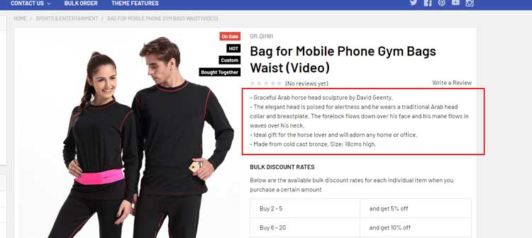

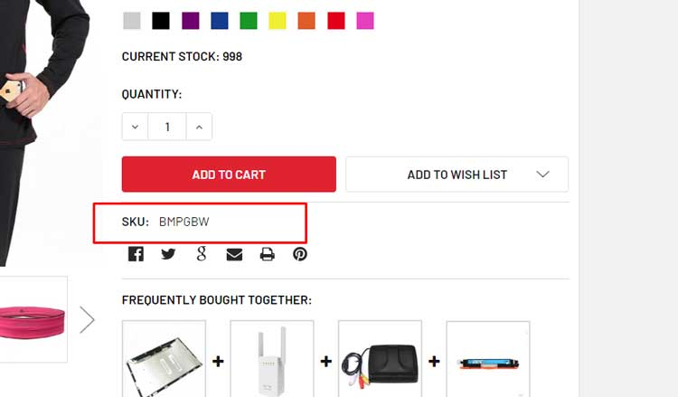

Go to **Storefront** > **Script Manager**, click **Create a Script**, choose:

- **Location on page** = `Footer`
- **Select pages where script will be added** = `Store Pages`
- **Script type** = `Script`

Enter the script below to **Scripts contents**: 

```html
<script>
    (function($) {
        function load($scope) {
            // Move the first paragraph of product description to below the product rating
            var $p = $('.productView-description-tabContent > p').first();
            if ($p.length > 0) {
                $('<div class="productView-sortDescription"></div>').append($p).insertAfter($('.productView-rating', $scope));
            }

            // Move the product info to below the product options
            $('.productView-info', $scope).insertAfter($('.productView-options', $scope));

        }

        $(document).ready(function() {
            if ($('body').hasClass('papaSupermarket-pageType--product')) {
                load();
            }
        })
        
        $('body').on('loaded.instantload', function() {
            if ($('body').hasClass('papaSupermarket-pageType--product')) {
                load();
            }
        });

        $('body').on('loaded.quickview', function(product) {
            load(product.$scope);
        });
    })(window.jQuerySupermarket || window.jQuery);
</script>
```


## Show the original category image on the category page in v4.5.2


Go to **Storefront** > **Script Manager**, click **Create a Script**, choose:

- **Location on page** = `Footer`
- **Select pages where script will be added** = `Store Pages`
- **Script type** = `Script`

Enter the script below to **Scripts contents**: 

```html
<script>
    (function($) {
        function main() {
            var $img = $('.emthemesModez-categoryPage-mainImage img[srcset]');
            if ($img.length > 0) {
                $img.attr('src', $img.attr('src').replace(/stencil\/[^\/]+\//, 'stencil/original/'))
                	.attr('srcset', '')
            }
        }
        $(document).ready(main);
        $('body').on('loaded.instantload', main);
    })(window.jQuerySupermarket || window.jQuery);
</script>
```


## Hide "There are no products listed under this category" on the category page

Go to **Storefront** > **Script Manager**, click **Create a Script**, choose:

- **Location on page** = `Footer`
- **Select pages where script will be added** = `Store Pages`
- **Script type** = `Script`

Enter the script below to **Scripts contents**: 

```html
<script>
    (function() {
        var css = document.createElement('style');
        css.innerHTML = '#product-listing-container > p:first-child { display: none }';
        document.head.appendChild(css);
    })();
</script>
```


## Change the welcome message on the top header for logged in users

Go to **Storefront** > **Script Manager**, click **Create a Script**, choose:

- **Location on page** = `Footer`
- **Select pages where script will be added** = `Store Pages`
- **Script type** = `Script`

Enter the script below to **Scripts contents**: 

```html
<script>
    {{#if customer}}
        (function($) {
            function main() {
                $('.navUser--storeInfo .navUser-item')
                    .first()
                    .find('span')
                    .html('Hi {{customer.name}}');
            }
            $(document).ready(main);
            $('body').on('loaded.instantload', main);
        })(window.jQuerySupermarket || window.jQuery);
    {{/if}}
</script>
```


## Move the release date (pre-order message) to under the Add to Cart button on PDP

Go to **Storefront** > **Script Manager**, click **Create a Script**, choose:

- **Location on page** = `Footer`
- **Select pages where script will be added** = `Store Pages`
- **Script type** = `Script`

Enter the script below to **Scripts contents**: 

```html
<script>
(function($) {
    function css() {
        $('<style/>')
            .html('.productView-options > p { font-weight: bold; color: red }')
            .appendTo('head');
    }
    function main($scope) {
        var $el = $('.productView-options > p', $scope).first();
        if ($el.length > 0) {
            $el.parent().append($el);
        }
    }
    main();
    css();
    $('body').on('loaded.instantload', main);
    $('body').on('loaded.quickview', function(event, product) {
        main(product.$scope);
    });
})(window.jQuerySupermarket || window.jQuery);
</script>
```


## Add custom text after the copyright text in the footer

Go to **Storefront** > **Script Manager**, click **Create a Script**, choose:

- **Location on page** = `Footer`
- **Select pages where script will be added** = `All Pages`
- **Script type** = `Script`

Enter the script below to **Scripts contents**: 

```html
<script>
(function() {
    var el = document.createElement('span');
    el.innerHTML = ' All product names, logos, and brands are property of their respective owners. All company, product and service names used in this website are for identification purposes only. Use of these names, logos, and brands does not imply endorsement.';
    document.querySelector('.footer-copyright .powered-by').appendChild(el);
})();
</script>
```

## Integrate PartFinder app to display below the header

Display PartFinder app: https://www.bigcommerce.com/apps/partfinder-targeted-product-search/ below header across the site.

Go to **Storefront** > **Script Manager**, click **Create a Script**, choose:

- **Location on page** = `Footer`
- **Select pages where script will be added** = `All Pages`
- **Script type** = `Script`

Enter the script below to **Scripts contents**: 

```html
<script>
(function() {
    var el = document.createElement('div');
    el.id = 'pf-embed-container';
    document.querySelector('[data-content-region="header_bottom"]').appendChild(el);
})();
</script>
```


## Add custom links to Footer > Navigate column

Go to **Storefront** > **Script Manager**, click **Create a Script**, choose:

- **Location on page** = `Footer`
- **Select pages where script will be added** = `All Pages`
- **Script type** = `Script`

Enter the script below to **Scripts contents**: 

```html
<script>
(function() {
    document.querySelector('.footer-info .footer-info-col:nth-child(2) .footer-info-list').innerHTML += ''
        + '<li><a href="/privacy-policy">Privacy Policy</a></li>'
        + '<li><a href="/suppliers">Suppliers</a></li>'
})();
</script>
```

Change your own links by editting lines:

```html
+ '<li><a href="/privacy-policy">Privacy Policy</a></li>'
+ '<li><a href="/suppliers">Suppliers</a></li>'
```

Or duplicate it to add more links.


## Hide Shipping Estimation on the cart page

Go to **Storefront** > **Script Manager**, click **Create a Script**, choose:

- **Location on page** = `Footer`
- **Select pages where script will be added** = `All Pages`
- **Script type** = `Script`

Enter the script below to **Scripts contents**: 

```html
<script>
(function() {
    var css = document.createElement('style');
    css.innerHTML = '.cart-total--shippingEstimator { display: none }';
    document.head.appendChild(css);
})();
</script>
```

## Hide Refine By block on the left sidebar

Go to **Storefront** > **Script Manager**, click **Create a Script**, choose:

- **Location on page** = `Footer`
- **Select pages where script will be added** = `All Pages`
- **Script type** = `Script`

Enter the script below to **Scripts contents**: 

```html
<script>
(function() {
    var css = document.createElement('style');
    css.innerHTML = '.facetedSearch-toggle, #facetedSearch { display: none }';
    document.head.appendChild(css);
})();
</script>
```

## Limit the main navigation level up to 3 on mobile

Go to **Storefront** > **Script Manager**, click **Create a Script**, choose:

- **Location on page** = `Footer`
- **Select pages where script will be added** = `All Pages`
- **Script type** = `Script`

Enter the script below to **Scripts contents**: 

```html
<script>
(function() {
    function main() {
        var els = document.querySelectorAll('.navPage-childList-action.has-subMenu');
        for (var i = 0; i < els.length; i++) {
            els[i].addEventListener('click', function(e) {
                e.stopPropagation();
                e.preventDefault();
                window.location = e.target.href;
            });
        }

        var css = document.createElement('style');
        css.innerHTML = '@media (max-width: 800px) {'
            + '.navPage-childList-action.has-subMenu .navPages-action-moreIcon { display: none }'
            + '.navPage-childList .navPage-childList { display: none }'
            + '}';
        document.head.appendChild(css);
    }
    // main();
    window.addEventListener('DOMContentLoaded', main);
})();
</script>
```


## Move Paypal Checkout button display under Amazon Pay button on the cart page

Go to **Storefront** > **Script Manager**, click **Create a Script**, choose:

- **Location on page** = `Footer`
- **Select pages where script will be added** = `Store Pages`
- **Script type** = `Script`

Enter the script below to **Scripts contents**: 

```html
<script>
(function() {
    var css = document.createElement('style');
    css.innerHTML = ''
        + '.cart-additionalCheckoutButtons { display: flex; flex-direction: column }'
        + '.cart-additionalCheckoutButtons .CheckoutButton { order: 1 }'
        + '.cart-additionalCheckoutButtons .AmazonPaymentsCheckout { order: 1 }'
        + '.cart-additionalCheckoutButtons .PayPalExpressCheckout { order: 2 }';
    document.head.appendChild(css);
})();
</script>
```

## Display product main images with fixed size


Go to **Storefront** > **Script Manager**, click **Create a Script**, choose:

- **Location on page** = `Header`
- **Select pages where script will be added** = `Store Pages`
- **Script type** = `Script`

Enter the script below to **Scripts contents**: 

```html
<script>
(function() {
    var css = document.createElement('style');
    css.innerHTML = '.productView-imageCarousel-main { max-width: 300px; max-height: 300px; margin: 0 auto; }';
    document.head.appendChild(css);
})();
</script>
```

Change `max-width: 300px; max-height: 300px;` by the width and height of images you want.


## Hide UPC and MPN on the product page

Go to **Storefront** > **Script Manager**, click **Create a Script**, choose:

- **Location on page** = `Footer`
- **Select pages where script will be added** = `Store Pages`
- **Script type** = `Script`

Enter the script below to **Scripts contents**: 

```html
<script>
(function() {
    var css = document.createElement('style');
    css.innerHTML = '.productView-info-name--upc, .productView-info-value--upc, .productView-info-name--mpn, .productView-info-value--mpn { display: none }';
    document.head.appendChild(css);
})();
</script>
```

## Fix product images on Featured / Bestselling / New columns uniform on mobile

Go to **Storefront** > **Script Manager**, click **Create a Script**, choose:

- **Location on page** = `Footer`
- **Select pages where script will be added** = `Store Pages`
- **Script type** = `Script`

Enter the script below to **Scripts contents**: 

```html
<script>
(function() {
    var css = document.createElement('style');
    css.innerHTML = '@media (max-width: 801px) {'
        + '.listItem-figure { padding-top: 100%; margin-bottom: .75rem }'
        + '.listItem-image { position: absolute; left: 0; top: 0; bottom: 0; right: 0; max-height: 100%; margin: 0 auto; object-fit: contain; }'
        + '.listItem-content { display: flex; flex-direction: column }'
        + '.listItem-actions { order: 1; margin-bottom: .75rem  }'
        + '.listItem-details { order: 2 }'
        + '}';
    document.head.appendChild(css);
})();
</script>
```


## Hide AMEX credit card option on the checkout page

Go to **Storefront** > **Script Manager**, click **Create a Script**, choose:

- **Location on page** = `Footer`
- **Select pages where script will be added** = `Checkout Pages`
- **Script type** = `Script`

Enter the script below to **Scripts contents**: 

```html
<script>
(function() {
    var css = document.createElement('style');
    css.innerHTML = '.creditCardTypes-list-item .icon[data-test="credit-card-icon-american-express"] { display: none }';
    document.head.appendChild(css);
})();
</script>
```


## Customize the main navigation full width


Go to **Storefront** > **Script Manager**, click **Create a Script**, choose:

- **Location on page** = `Footer`
- **Select pages where script will be added** = `All Pages`
- **Script type** = `Script`

Enter the script below to **Scripts contents**: 

```html
<script>
(function() {
    var css = document.createElement('style');
    css.innerHTML = ''
        + '@media (min-width: 801px) {'
        + '.navPages-container .container { width: auto; max-width: none; padding: 0 }'
        + '.navPages { max-width: none; text-align: center }'
        + '}';
    document.head.appendChild(css);
})();
</script>
```


## Hide the default image when hover the product card

Go to **Storefront** > **Script Manager**, click **Create a Script**, choose:

- **Location on page** = `Footer`
- **Select pages where script will be added** = `All Pages`
- **Script type** = `Script`

Enter the script below to **Scripts contents**: 

```html
<script>
(function() {
    var css = document.createElement('style');
    css.innerHTML = '.card-image ~ .card-image { background-color: #fff; height: 100% }';
    document.head.appendChild(css);
})();
</script>
```


## Display YouTube videos as the alternate images on PDP

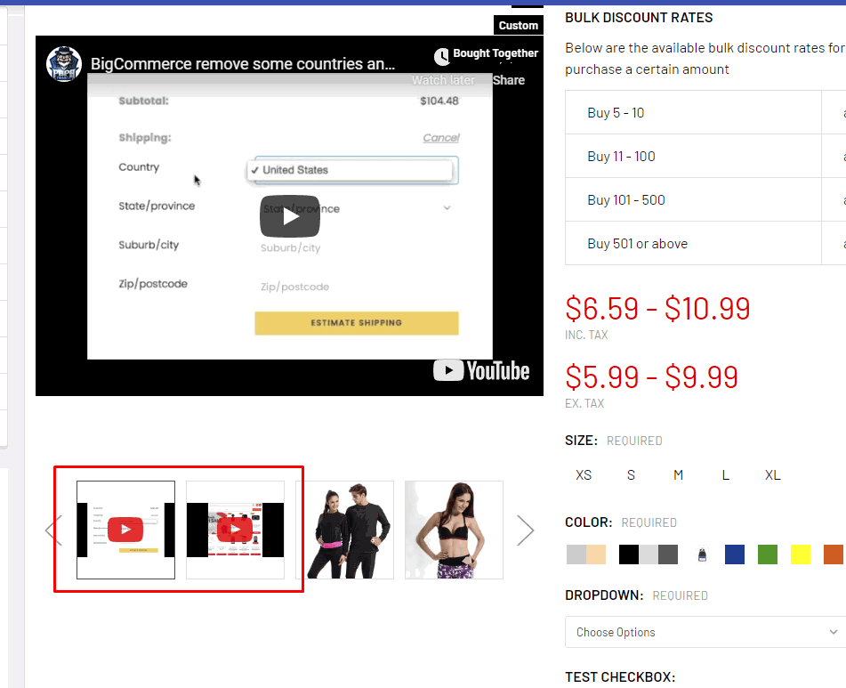

**Question:**

We are trying to get a youtube video to be in the alternate image spots on our products. We have 3 videos that we show for 3 separate categories.
Is it possible to have these videos applied in bulk to the products in those categories?

**Answer:**

Go to **Storefront** > **Script Manager**, click **Create a Script**, choose:

- **Location on page** = `Footer`
- **Select pages where script will be added** = `All Pages`
- **Script type** = `Script`

Enter the script below to **Scripts contents**: 

```html
<script>
    (function(vidsByCat, $) {
        var css = document.createElement('style');
        css.innerHTML = ''
            + '.productView-imageCarousel-main-item iframe { position: absolute; top: 0; bottom: 0; left: 0; width: 100%; max-width: 100%; max-height: 100%; margin: auto }'
            + '.productView-imageCarousel-nav-item svg { position: absolute; width: 40px; height: 40px; top: 0; left: 0; right: 0; bottom: 0; margin: auto; fill: rgba(255,0,0,0.8) }';
        document.head.appendChild(css);

        var icon = '<svg viewBox="0 0 32 32" xmlns:xlink="http://www.w3.org/1999/xlink"><path d="M31.6634051,8.8527593 C31.6634051,8.8527593 31.3509198,6.64879843 30.3919217,5.67824658 C29.1757339,4.40441487 27.8125088,4.39809002 27.1873503,4.32353816 C22.7118278,4 15.9983092,4 15.9983092,4 L15.984407,4 C15.984407,4 9.27104501,4 4.79536595,4.32353816 C4.17017613,4.39809002 2.80745205,4.40441487 1.59082583,5.67824658 C0.631890411,6.64879843 0.319843444,8.8527593 0.319843444,8.8527593 C0.319843444,8.8527593 0,11.4409393 0,14.0290881 L0,16.4554834 C0,19.0436008 0.319843444,21.6317495 0.319843444,21.6317495 C0.319843444,21.6317495 0.631890411,23.8357417 1.59082583,24.8062935 C2.80745205,26.0801566 4.40557339,26.0398591 5.11736986,26.1733699 C7.67602348,26.4187241 15.9913894,26.4946536 15.9913894,26.4946536 C15.9913894,26.4946536 22.7118278,26.4845401 27.1873503,26.1610333 C27.8125088,26.0864501 29.1757339,26.0801566 30.3919217,24.8062935 C31.3509198,23.8357417 31.6634051,21.6317495 31.6634051,21.6317495 C31.6634051,21.6317495 31.9827789,19.0436008 31.9827789,16.4554834 L31.9827789,14.0290881 C31.9827789,11.4409393 31.6634051,8.8527593 31.6634051,8.8527593 Z M12.6895342,19.39582 L12.6880626,10.4095186 L21.3299413,14.9183249 L12.6895342,19.39582 Z" id="Imported-Layers"></path></svg>';

        function process($scope, category, useJS) {
            if (category && vidsByCat[category]) {
                var $thumbs = $();
                var $mains = $();
                for (var i = 0; i < vidsByCat[category].length; i++) {
                    var vid = vidsByCat[category][i];
                    var thumbUrl = 'https://img.youtube.com/vi/' + vid + '/maxresdefault.jpg';
                    var mainIframe = '<iframe id="ytplayer" type="text/html" width="720" height="405" src="https://www.youtube.com/embed/' + vid + '?controls=0&enablejsapi=1&modestbranding=1&playsinline=1&iv_load_policy=3&showinfo=0&wmode=transparent&rel=0&fs=0" frameborder="0" allowfullscreen>';
                    $thumbs = $thumbs.add($('<li class="productView-imageCarousel-nav-item">' + icon + '</li>'));
                    $mains = $mains.add($('<li class="productView-imageCarousel-main-item">' + mainIframe + '</li>'));
                }

                if (useJS) {
                    var $nav = $scope.find('[data-image-gallery-nav]');
                    var $main = $scope.find('[data-image-gallery-main]');
                    var idx = $nav.slick('slickCurrentSlide');
                    $thumbs.each(function(i, el) {
                        $nav.slick('slickAdd', el, idx + i);
                    });
                    $mains.each(function(i, el) {
                        $main.slick('slickAdd', el, idx + i);
                    });
                } else {
                    $scope.find('[data-image-gallery-nav] .slick-current').after($thumbs);
                    $scope.find('[data-image-gallery-main] .slick-current').after($mains);
                }
            }

        }

        $(document).ready(function() {
            var $scope = $('.productView [data-also-bought-parent-scope]');
            if ($scope.length > 0) {
                var category = {{{JSONstringify (first product.category)}}};
                process($scope, category);
            }
        });

        $('body').on('loaded.instantload', function(event, resp) {
            var $scope = $('.productView [data-also-bought-parent-scope]');
            if ($scope.length > 0) {
                var category = $('.breadcrumbs .breadcrumb.is-active').prev().find('[itemprop="name"]').text();
                process($scope, category);
            }
        });

        $('body').on('loaded.quickview', function(event, product) {
            var productId = product.$scope.find('[name=product_id]').val();
            stencilUtils.api.product.getById(productId, { template: 'common/breadcrumbs' }, function(err, resp) {
                if (err) {
                    return;
                }
                var category = $(resp).find('.breadcrumb.is-active').prev().find('[itemprop="name"]').text();
                process(product.$scope, category, true);
            });
        });
    })({
        'Sports & Entertainment': [
            'DF3saLvmGow',
            'h27hXL5Pemg'
        ],
        'Beauty & Health': [
            '_m1Je_BYdrQ',
            'l9Iug7n1uFA'
        ]
    },
    window.jQuerySupermarket || window.jQuery);
</script>
```

**Configure the videos coresponding to each category:**

Edit these lines in the script above:

```
'Sports & Entertainment': [
    'DF3saLvmGow',
    'h27hXL5Pemg'
],
'Beauty & Health': [
    '_m1Je_BYdrQ',
    'l9Iug7n1uFA'
]
```

Where `Sports & Entertainment` is the category name with case-sensity. `DF3saLvmGow` and `h27hXL5Pemg` are the YouTube videos code to display for this category.

`Beauty & Health` is a different category name. `_m1Je_BYdrQ` and `l9Iug7n1uFA` are other YouTube videos code for this category.

You can add more categories and videos if you want.

To find the YouTube video code, view the video, click Share button and copy the code next to `https://youtu.be/`, see this screenshot:

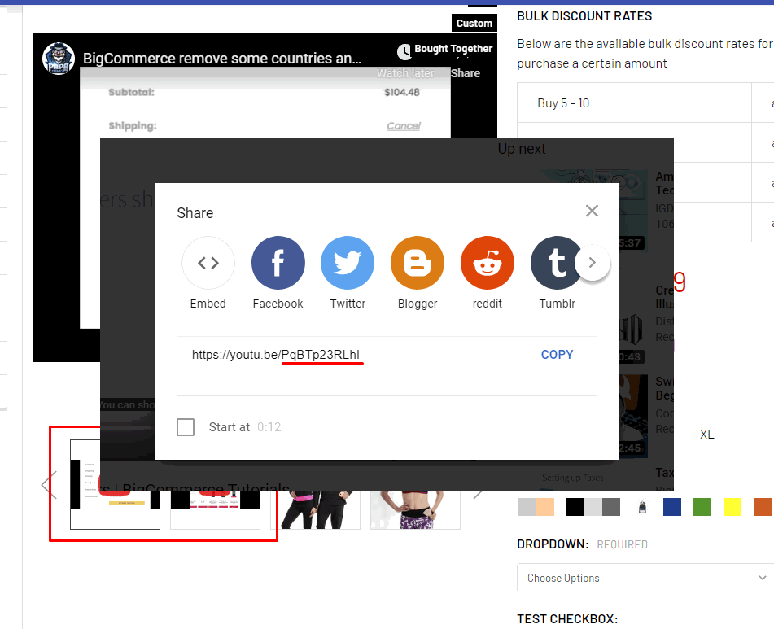


 
## Display your custom social icons on the header

```html
<script>
(function() {
    document.querySelector('.navPages .navPages-socials').innerHTML = ''
        + '<a href="https://www.facebook.com/SupremeAudio" target="_blank"></a>&nbsp;'
        + '<a href="https://www.instagram.com/SupremeAudioNH/" target="_blank"></a>&nbsp;'
        + '<a href="https://www.pinterest.com/SupremeAudio/pins/" target="_blank"></a>&nbsp;'
        + '<a href="https://www.twitter.com/supremeaudionh/" target="_blank"></a>&nbsp;'
        + '<a href="https://www.linkedin.com/company/1010604/" target="_blank"></a>&nbsp;'
        + '<a href="https://www.youtube.com/user/SupremeAudioInc" target="_blank"></a>';
})();
</script>
```


## Display another phone number on the footer

Go to **Storefront** > **Script Manager**, click **Create a Script**, choose:

- **Location on page** = `Footer`
- **Select pages where script will be added** = `All Pages`
- **Script type** = `Script`

Enter the script below to **Scripts contents**: 

```html
<script>
(function() {
    var li = document.createElement('li');
    li.innerHTML = '<i class="fa fa-li fa-phone"></i><a href="tel:01 1234 5678">Call us at 01 1234 5678</a>';
    document.querySelector('.footer-info-col--about > ul:nth-child(2)').appendChild(li);
})();
</script>
```

Replace the sample phone number `01 1234 5678` by yours.


## Move Bulk Discount Rates table to below the quantity box

Go to **Storefront** > **Script Manager**, click **Create a Script**, choose:

- **Location on page** = `Footer`
- **Select pages where script will be added** = `All Pages`
- **Script type** = `Script`

Enter the script below to **Scripts contents**: 

```html
<script>
(function($) {
    function process($scope) {
        $scope.find('.productView-info-bulkPricing').insertBefore($scope.find('form[data-cart-item-add]').first().find('> .form-action'));
    }
    process($('.productView'));

    $('body').on('loaded.quickview', function() {
        process($('.productView--quickView'));
    });

    $('body').on('loaded.instantload', function() {
        process($('.productView'));
    });
})(window.jQuerySupermarket);
</script>
```