# Headers & Footers

This page will instruct you how to edit the headers, footers and carousel.

## Top Banner

The top banner can be showed / edited in admin page > Marketing > Banners. When you add / edit remember to choose __Location__ is __Top of Page__.

### Colors Customization

To customize colors of this section, go to admin page > __Storefront Design__ > __My Themes__, click button __Customize__ of the current theme to open the Theme Editor. 

Look into the options showing below:

## Header

### Header Styles
This theme support 3 different header styles:
- Logo at left
- Logo at right
- Logo at center

To configure, open the __Theme Editor__, scroll down to section __Logo__, click to expand the logo options. Choose a certain option of __Logo position__, then click __Refresh__ button appear after.

### Edit 3 info text blocks

Show or hide these text blocks in Theme Editor > __Header__ section as showing below: 
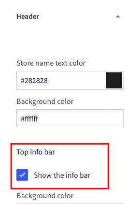

Edit content in the language file, from admin page > __Storefront Design__ > __My Themes__, click button __Advanced__ > __Edit Theme Files__ of the current theme:

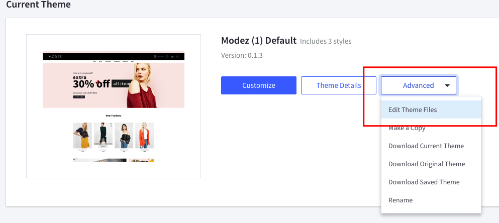

From the left navigation, click to edit the language file (e.i `en.json`):

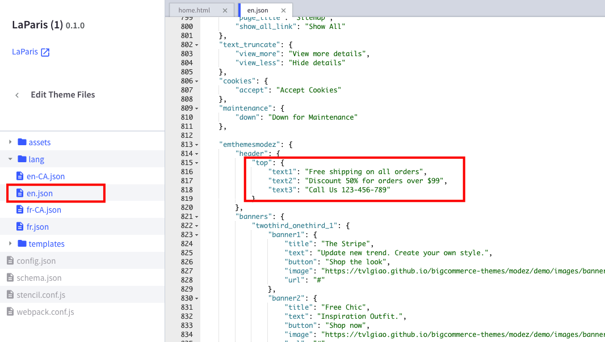

Edit the text as figured above.

### Colors Customization

To customize colors of the header section, look into the options showing below in the Theme Editor:

## Main Slideshow / Carousel

### Edit the slideshow

Edit the slideshow in admin page > __Storefront Design__ > __Design Options__:

### Change position of text content

The theme supports showing slideshow content like heading, text, button on __left__, __right__ or __center__ of the image. To configure this option, open Theme Editor, Look into section Carousel, click to expand:

Choose position of each slide you want to change.

### Colors Customization

To customize color of the slideshow's elements, look into section __Carousel__ in the Theme Editor:

### Hide the slideshow

To hide the slideshow on homepage, uncheck on the checkbox __Show Carousel__ in section __Carousel__ of the Theme Editor.

## 3 Banners

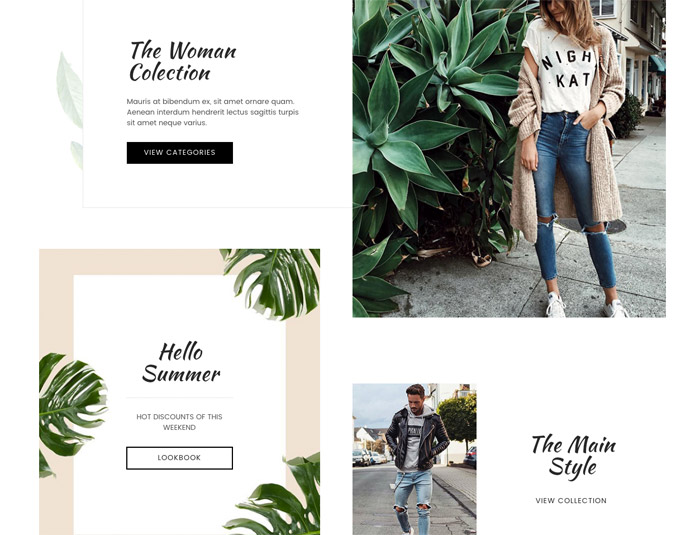

To edit content and images of 3 banners, edit the language file `en.json` as showing below:

## New Products, Featured Products & Popular Products

See how to configure in chapter [Sections > New / Featured / Popular Products Blocks](sections.md#new-featured-popular-products-blocks)

## 2 Banners 2/3 & 1/3 Column Section

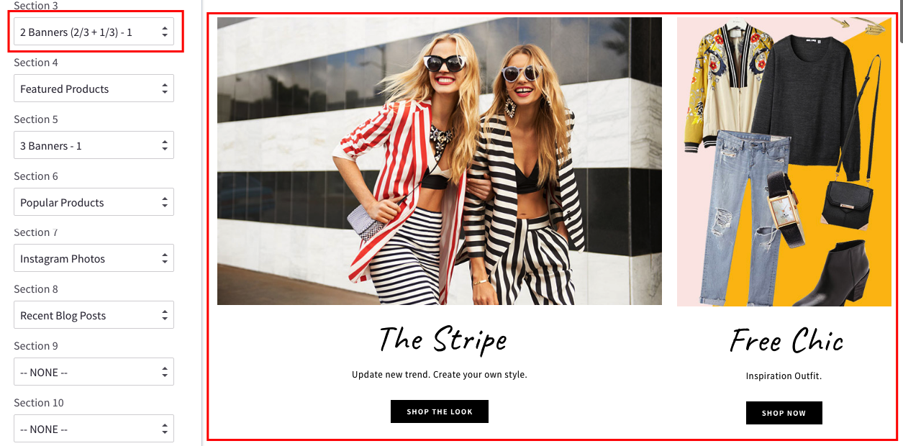

See how to configure in chapter [Sections > Image Banners](sections.md#image-banners)

## Featured Products Section

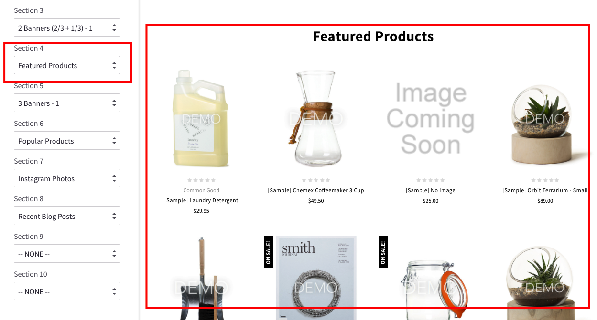

See how to configure in chapter [Sections > New / Featured / Popular Products Blocks](sections.md#new-featured-popular-products-blocks)

## 3 Banners 1/3 Column Section

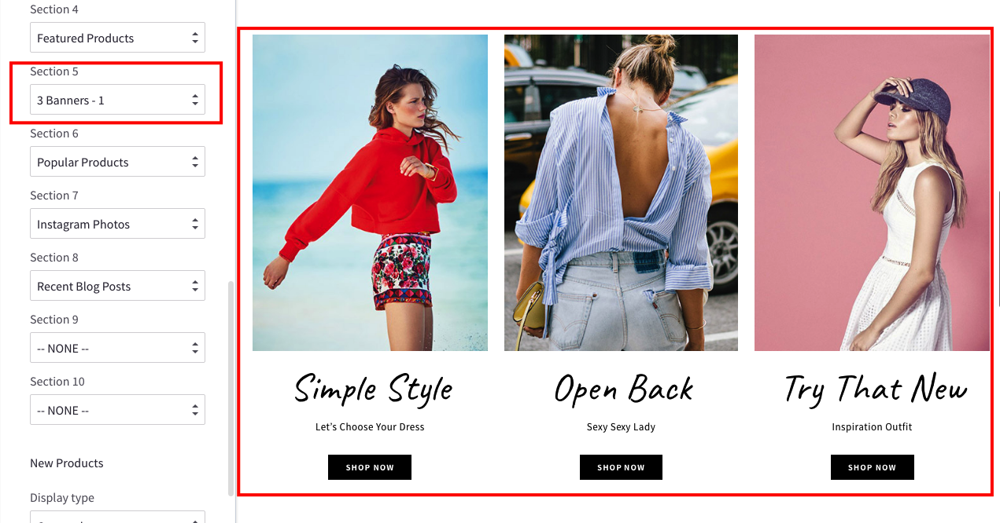

See how to configure in chapter [Sections > Image Banners](sections.md#image-banners)

## Popular Products Section

See how to configure in chapter [Sections > New / Featured / Popular Products Blocks](sections.md#new-featured-popular-products-blocks)

## Instagram Photos Section

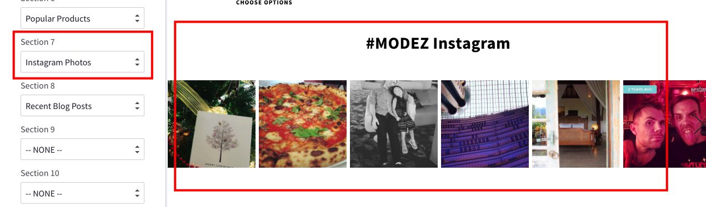

See how to configure in chapter [Sections > Instagram Photos](sections.md#instagram-photos)

## Recent Posts Section

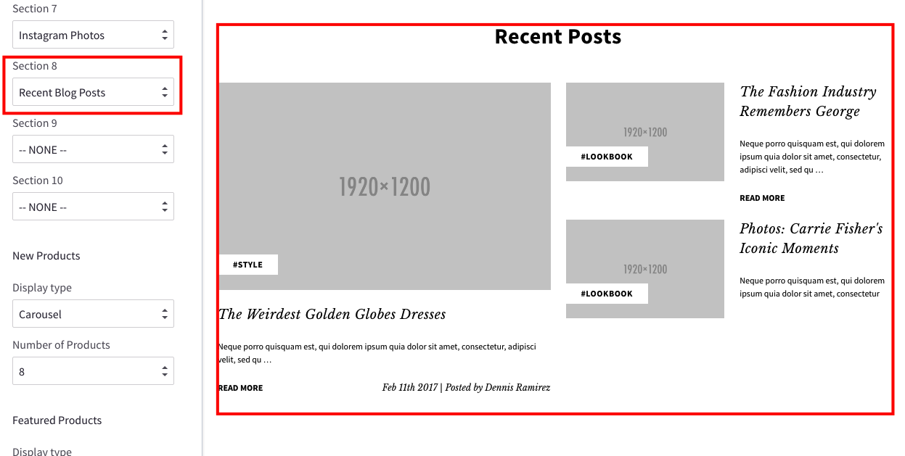

See how to configure in chapter [Sections > Recent Blog Posts](sections.md#recent-blog-posts)

## Footer - Newsletter

### Change text

To change text appear on this section you can edit the language file as instruction below:

From admin page > __Storefront Design__ > __My Themes__, click button __Advanced__ > __Edit Theme Files__ of the current theme:

From the left navigation, click to edit the language file (e.i `en.json`):

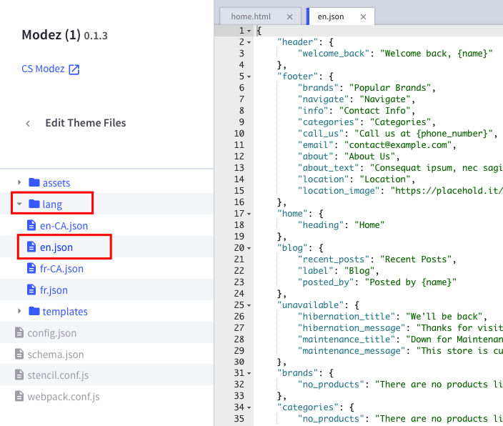

See the section `Newsletter` you can edit as you want:

### Colors Customization

To customize colors of the header section, look into the options showing below in the __Theme Editor__ > __Footer__:

### Social Icons

To show/hide or change position of the Social Icons, look into the options showing below in the __Theme Editor__ > __Social Media Icons__:

## Footer - About Us, Contact Info, Navigate, Location

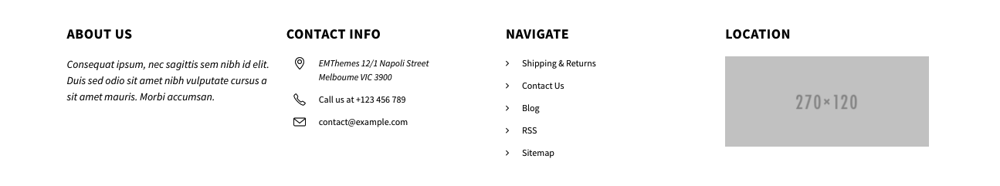

### Edit text of About Us

Edit the language file, section `footer` > `about` and `about_text`:

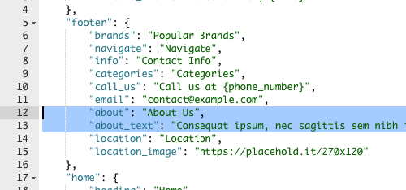

### Edit text of Contact Info

Edit the language file, section `footer` > `call_us` and `email`:

The address is edited in admin page > __Store Setup__ > __Store Profile__ > __Store Address__:

### Edit Navigate

__Navigate__ links automatically showing all your published pages.

You can change the heading in the language file:

### Edit Location

You can change text and image in the language file, section `footer` > `location` and `location_image`:

## Brands Carousel

Theme support 2 type of brands carousel: __Static Images__ and __Dynamic Popular Brands__.

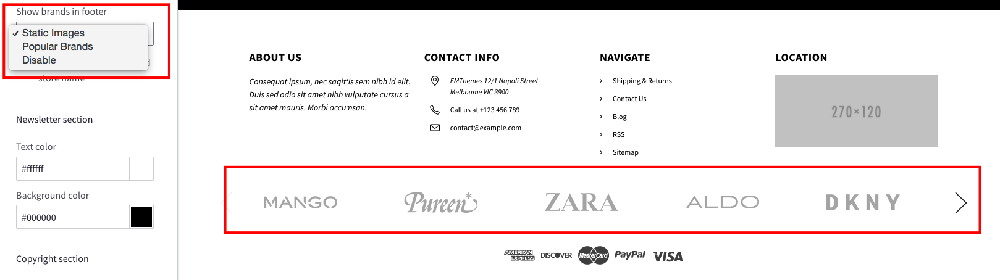

### Static Images Carousel

If using this option, your custom images will be showed up instead of the real brands you input in the backend.

You can change text and image in the language file, section `footer` > `emthemesmodez` > `brands`:

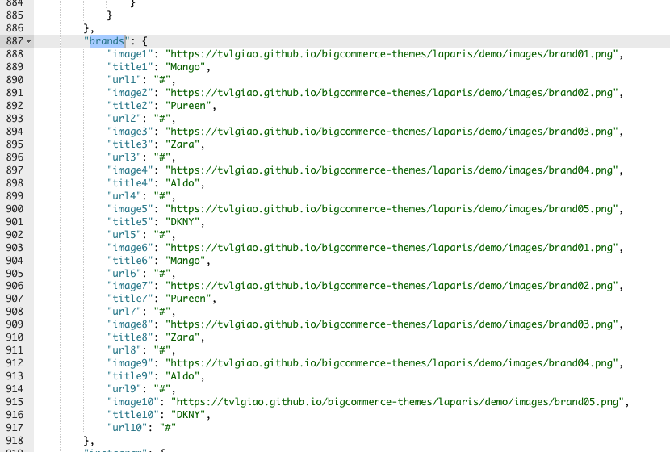

The theme supports up to 10 images.

To hide any image, just input __a single space__ in the quote, for example `"image1": " "`.

### Dynamic Popular Brands

If using this option, your store's real brands will be showed up.

### Hide the brands carousel

To hide the brands carousel, in the Theme Editor > __Footer__ > __Show brands in footer__, choose __Disable__.

## Payment Icons

To show/hide any payment icons, go to __Theme Editor__ > __Payment Icons__ > check/uncheck the corresponding payment methods.

## Copyright Section

### Colors Customization

To customize colors of this section, look into the options showing below in the __Theme Editor__ > __Footer__ > __Copyright section__.

### Show/Hide Power By text

To show/hide the text "Powered by BigCommerce", toggle the checkbox __Show "Powerd by BigCommerce"__ in the __Theme Editor__ > __Footer__.

### Show/Hide Store Name text

To show/hide this text, toggle the checkbox __"©", current year and store name__ in the __Theme Editor__ > __Footer__.

### Show/Hide GeoTrust SSL seal

Toggle the checkbox __Show Seal__ in the __Theme Editor__ > __Footer__ > __GeoTrust SSL__.
