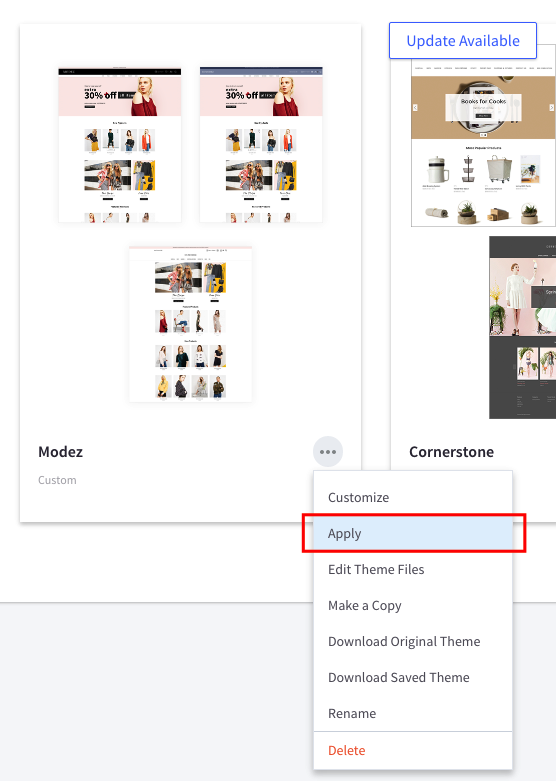
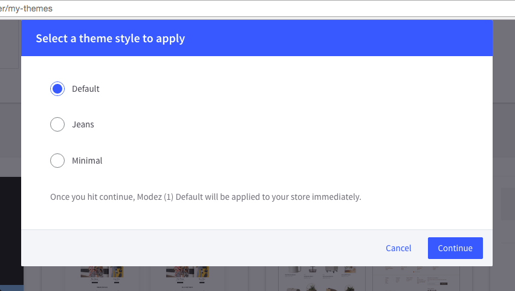

# Theme Installation

1. Login to your BigCommerce store's admin page. 
2. Go to __Storefront Design__ > __My Themes__. 
3. Click button __Upload Theme__. On the popup, click button __Select theme from your computer__. 
4. Choose the zip file `Modez-x.x.x.zip` to start installing the theme.
5. Waiting for the uploading completed.

When a new theme appears, click on the button __Apply Theme__ as showing below:

Then choose a style you want to use:

Refresh your store's front page you should see the theme installed successfully.

