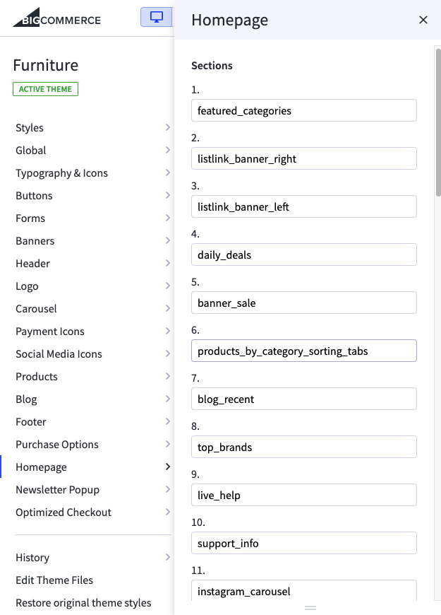
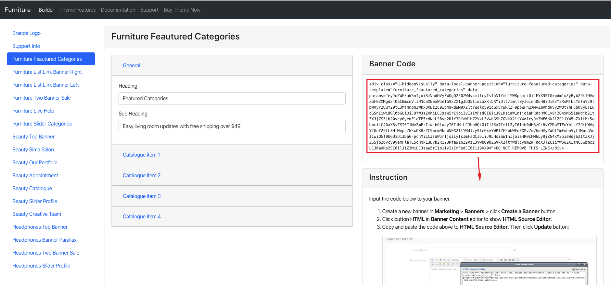
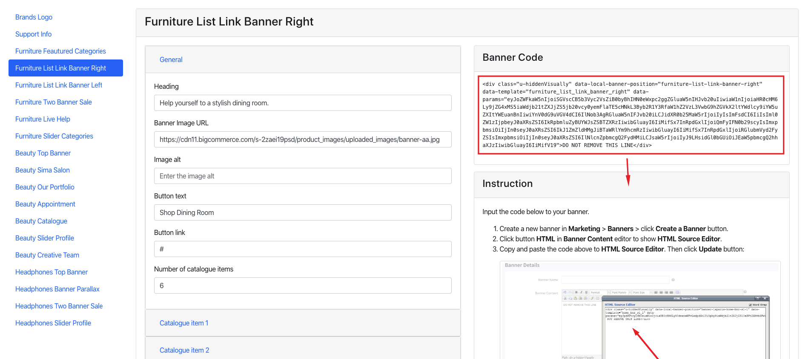
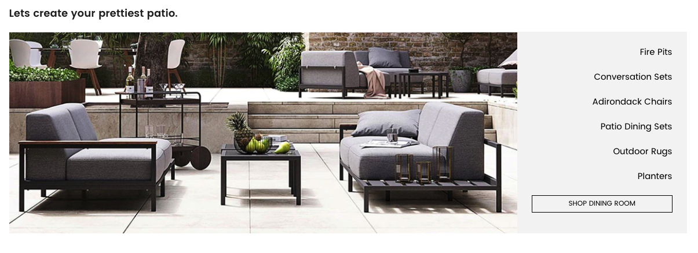
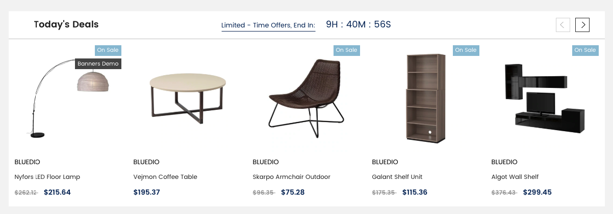
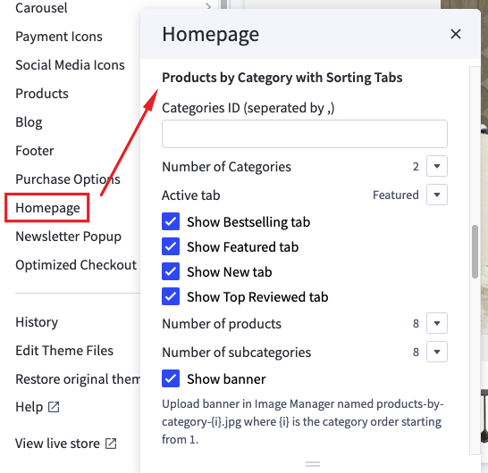

# Home Page Section

## -- Sections Manager

You can select the sections displayed on the homepage (maximum 11 sections) in **Theme Editor** > **Homepage** > **Sections**.

---

### List of available sections key: ###

* **section1": "featured_categories**
* **section2": "listlink_banner_right**
* **section3": "listlink_banner_left**
* **section4": "daily_deals**
* **section5": "banner_sale**
* **section6": "products_by_category_sorting_tabs**
* **section7": "blog_recent**
* **section8": "top_brands**
* **section9": "live_help**
* **section10": "support_info**
* **section11": "instagram_carousel**

## --- Furniture Featured Categories Section

To edit content and images of banners, Open the link below on your web browser: [https://bc-feellio-builder.papathemes.com/](https://bc-feellio-builder.papathemes.com/)

Chooes the tab __Furniture Featured Categories Section__ and Enter all required info on the form.

- Create a new banner in __Marketing__ > __Banners__ > click __Create a Banner__ button.
- Click button __HTML__ in __Banner Content__ editor to show __HTML Source Editor__.
- Copy and paste the code above to __HTML Source Editor__. Then click __Update__ button:

Set Show on __Page = Home Page__ and __Location = Top of Page__:

## --- Furniture Listlink Banner Right Section

To edit content and images of banners, Open the link below on your web browser: [https://bc-feellio-builder.papathemes.com/](https://bc-feellio-builder.papathemes.com/)

Chooes the tab __Furniture Listlink Banner Right Section__ and Enter all required info on the form.

- Create a new banner in __Marketing__ > __Banners__ > click __Create a Banner__ button.
- Click button __HTML__ in __Banner Content__ editor to show __HTML Source Editor__.
- Copy and paste the code above to __HTML Source Editor__. Then click __Update__ button:

Set Show on __Page = Home Page__ and __Location = Top of Page__:

## --- Furniture Listlink Banner Left Section

To edit content and images of banners, Open the link below on your web browser: [https://bc-feellio-builder.papathemes.com/](https://bc-feellio-builder.papathemes.com/)

Chooes the tab __Furniture Listlink Banner Left Section__ and Enter all required info on the form.

- Create a new banner in __Marketing__ > __Banners__ > click __Create a Banner__ button.
- Click button __HTML__ in __Banner Content__ editor to show __HTML Source Editor__.
- Copy and paste the code above to __HTML Source Editor__. Then click __Update__ button:

Set Show on __Page = Home Page__ and __Location = Top of Page__:

## --- Furniture Daily Deals Section

You can configure this section in **Theme Editor** > **Homepage** > **Daily Deals**.

## --- Furniture Banner Sale Section

To edit content and images of banners, Open the link below on your web browser: [https://bc-feellio-builder.papathemes.com/](https://bc-feellio-builder.papathemes.com/)

Chooes the tab __Furniture Banner Sale Section__ and Enter all required info on the form.

- Create a new banner in __Marketing__ > __Banners__ > click __Create a Banner__ button.
- Click button __HTML__ in __Banner Content__ editor to show __HTML Source Editor__.
- Copy and paste the code above to __HTML Source Editor__. Then click __Update__ button:

Set Show on __Page = Home Page__ and __Location = Top of Page__:

## --- Furniture Products By Category Sorting Tabs Section

This section will show products organized categories. You can choose number of categories to display products. Categories are sorted by the order specified in **Product Categories** in admin manager.

To configure this section, go to **Theme Editor** > **Homepage** > **Products by Category with Sorting Tabs**:

