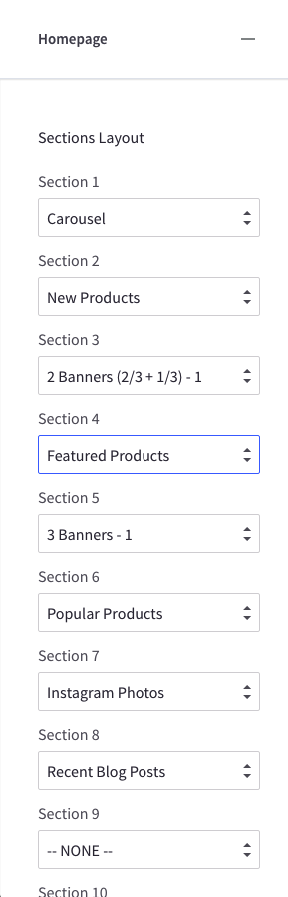
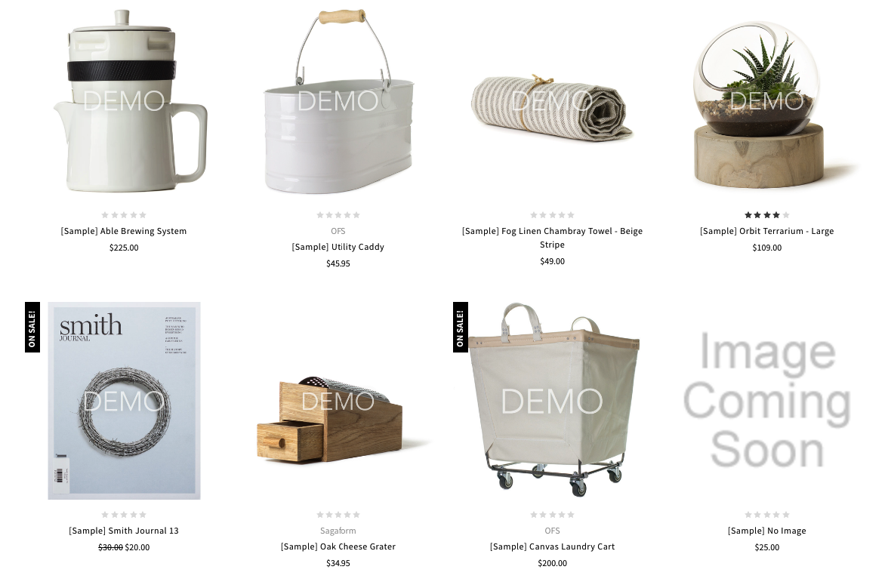
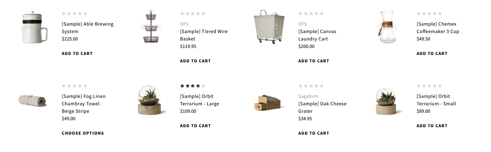
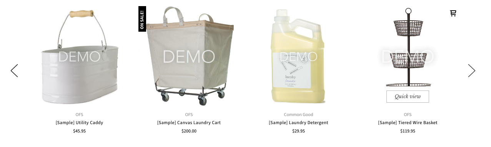
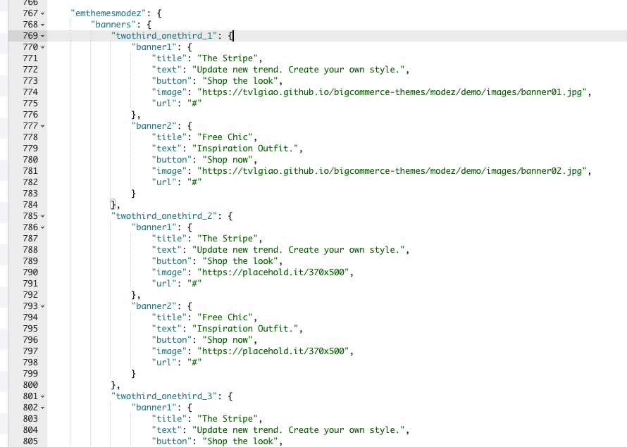

# Block Sections

This is a powerful and unique feature of the theme, let you rearrange contents, show/hide contents block on the homepages without editing the theme's source code. And __No HTML/CSS programming knowledge required__.

In the __Theme Editor__ > __Homepage__. There is 10 sections (or placeholder), where you can pick a content block to show on.



- __Section 1__ is a placeholder which only support __Carousel__ block - the main image slideshow.
- __Section 2__ to __Section 10__ are placeholder which support the following blocks:
	+ __New Products__
	+ __Featured Products__
	+ __Popular Products__
	+ __1st Two Banners 2/3 & 1/3 Column__
	+ __2st Two Banners 2/3 & 1/3 Column__
	+ __3st Two Banners 2/3 & 1/3 Column__
	+ __1st Three Banners 1/3 Column__
	+ __2st Three Banners 1/3 Column__
	+ __3st Three Banners 1/3 Column__
	+ __Recent Blog Posts__
	+ __Instagram Photos__


## New / Featured / Popular Products Blocks

The theme supports 3 layout type of New Products, Featured Products and Popular Products blocks:

- Grid
- List
- Carousel

__Products Grid__:



__Products List__:



__Products Carousel__:



### Configure a Layout Type of products block & Number of Products to show up

In the __Theme Editor__ > __Homepage__, look into __New Products__ section (or __Featured Products__, __Most Popular Products__):

- __Display type__: Choose appropriate layout type (__Grid__, __List__ or __Carousel__).
- __Number of Products__: Choose number of products to show up.


### Show/Hide Quickview button

When hover on a product item, Quickview button is showed up by default. To disable this feature, uncheck the checkbox __Show Quickview__ in the __Theme Editor__ > __Products__ section.


### Change colors and image sizes

In the __Theme Editor__ > __Products__ section, Look into the color options below __Product cards__, __Product Sale Badges__, __Product cards (Quick search)__ and __Image sizes__'s options.


### Change the heading text

To change the heading text (New Products, Featured Products, Most Popular Products), edit the language file, look for the key `products` > `new` or `featured` or `top`.


## Image Banners

The theme supports 2 type of banner blocks:

- 2 Banners with size 2/3 column & 1/3 column.
- 3 Banners with the same size 1/3 column.

__Group of 2 banners size 2/3 & 1/3 column__


__Group of 3 banners same size 1/3 column__


Each banner type supports up to 3 instances.


### Edit banner text and images

To change banner images, heading text, description and buttons, edit the language file, find the key `emthemesmodez` > `banners`:



- `twothird_onethird_1`: The first group of 2 banners with size 2/3 column & 1/3 column
	+ `banner1`: Is the first banner
		* `title`: Banner heading text
		* `text`: Banner description text
		* `button`: Button text
		* `image`: Banner image URL
		* `url`: Image and button link
	+ `banner2`: Is the second banner
- `twothird_onethird_2`: The second group of 2 banners with size 2/3 column & 1/3 column
- `twothird_onethird_3`: The third group of 2 banners with size 2/3 column & 1/3 column
- `onethird_x3_1`: The first group of 3 banners with size 1/3 column
- `onethird_x3_2`: The first group of 3 banners with size 1/3 column
- `onethird_x3_3`: The first group of 3 banners with size 1/3 column

If you don't want to show any elements of a banner, for example the button, leave the value __a single space__ character. Example: `"button": " "`.


## Recent Blog Posts


This block show the most recent blog posts, maximum 3 posts are allowed to show up. 

### Customize heading text and other text

To change the heading text, read more text and date format, edit the language file. Find the key `blog` > `recent_posts`, `posted_by` and `read_more`, edit its values as you want.


## Instagram Photos


### Get your own User ID, Client ID, Access Token

In order to display your Instagram photos on your website, you will need to get the __User ID__, __Client ID__ and __Access Token__ from __Instagram Developer__ portal.

#### 1. Create your own Client ID

Open the URL <https://www.instagram.com/developer/> in your browser.

Login to your Instagram account.

Click button __Register Your Application__: 


Click button __Register a New Client__: 


Enter all required info on the form. 


Note that __Valid redirect URIs__ should be exactly `http://127.0.0.1` as recommended as it will be used in the next step.

After submitting the form you will get back to the previous page with a new __Client ID__ is created.


Save this __Client ID__ value, it will be used to configure the Instagram Photos block.

#### 2. Retrieve your Access Token

Click button __Manage__ on your the client app created previously. Open __Security__ tab, uncheck __Disable Implicit OAuth__ checkbox:


Click __Update Client__ button to complete.

Now open your web browser with the URL: 

```plain
https://api.instagram.com/oauth/authorize/?client_id=CLIENT-ID&redirect_uri=http://127.0.0.1&response_type=token
```

where `CLIENT-ID` is replaced by your __Client ID__ number created previously.

Click __Authorize__ button to grant access permission:


Instagram will redirect you to an error page with the URL similiar: 


The text after `access_token=` is the __Access Token__ you want to get. Save it for the next step.

#### 3. Retrieve your User ID

Open the link below on your web browser:

```plain
https://api.instagram.com/v1/users/self/?access_token=ACCESS-TOKEN
```
Where `ACCESS-TOKEN` is replaced by your real __Access Token__ just received previously.


The number in `"id": "..."` is your __User ID__.

### Display your Instagram photos

To display our own Instagram photos, edit the language file. Find the key `emthemesmodez` > `instagram`, input your real code:

- `user_id`: Is your Instagram __User ID__.
- `client_id`: is your Instagram __Client ID__.
- `access_token`: is your Instagram __Access Token__.
- `title`: Is the heading text.

