# Theme Settings

Theme Settings or Theme Editor is a graphical user interface, lets you configure all features which the theme supports.

To open Theme Editor, go to your admin page > __Storefront Design__ > __My Themes__, on the Current Theme section, click __Customize__ button:

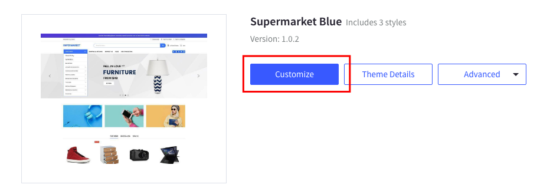

## Styles

This section shows all the theme's variations. You can change other style here.

## Global

This section lets you change colors of common elements, load indicator and overlays.

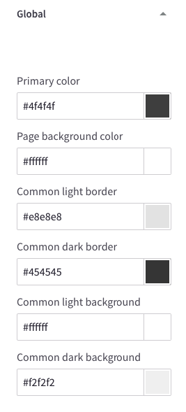

## Typography & Icons

This section lets you change fonts, font sizes, colors of the logo, body text, headings, links, icons, ratings and other common elements.

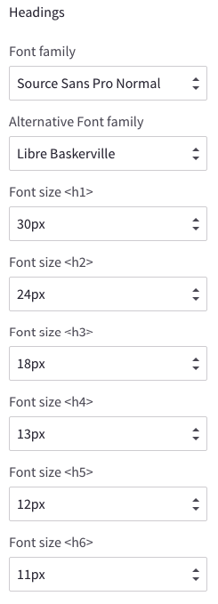
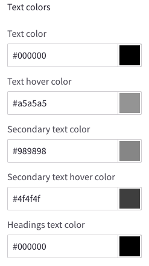
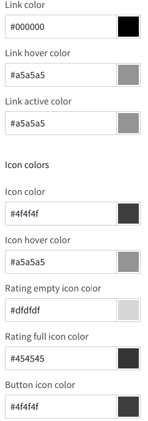

## Buttons

This section lets you change colors of buttons.

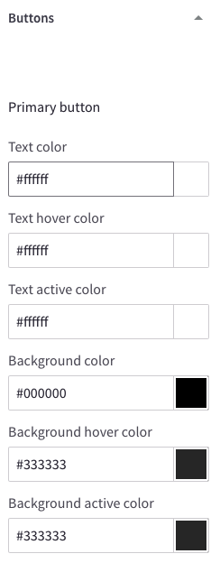

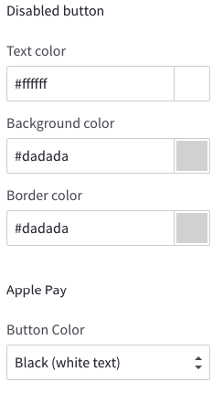

## Forms

This section lets you change colors, borders, background of the form elements like labels, input boxes, select boxes, checkbox and radios.

## Top Banner

This section lets you change colors of the top banner and the bottom banner.

## Header

- This section let you configure colors of the elements showing on the page header.
- Show/Hide page links on the Main Menu.

## Logo

This section lets you configure logo position and size.

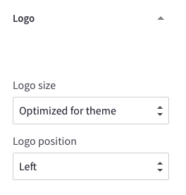

## Carousel

This configuration allow you:

- Show/hide the main slideshow on homepage.
- On/off allowing image to stretch on large screens.
- Change colors of all carousel's elements.
- Change position of the main slideshow's description box to left, right or center.

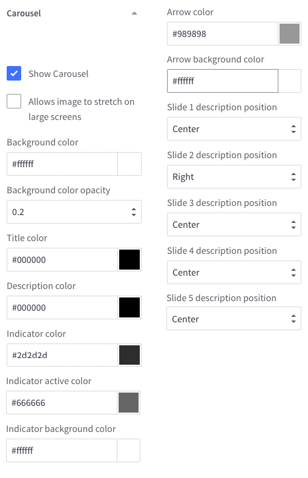

## Payment Icons

This section lets you toggle payment icons to show/hide on the footer.

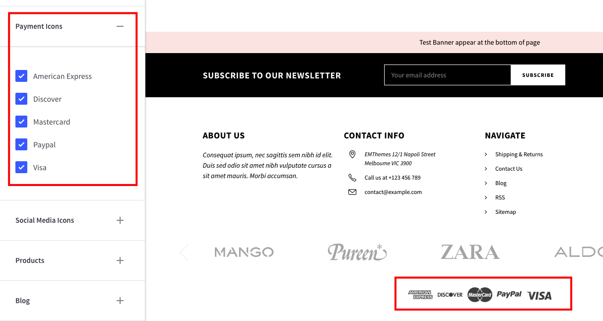

## Social Media Icons

This section lets you configure position of the social icons on footer or header.

## Products

This configuration section lets you:

- Show/Hide Quickview button.
- Configure number of products, reviews, brands, search results showing.
- Configure product image sizes
- Configure Product swatch image sizes.
- Configure position and colors of Product Badges.
- Configure colors of elements of products grid items.

## Blog

This section lets you configure blog post image sizes.

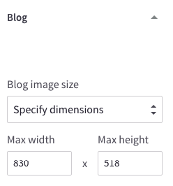

## Footer

This configuration let you:

- Show/Hide "Powered By..." text at the footer.
- Show/Hide copyright text.
- Change colors of the footer background, newsletter section, copyright section.
- Show/Hide GeoTrust SSL seal and configure seal size.

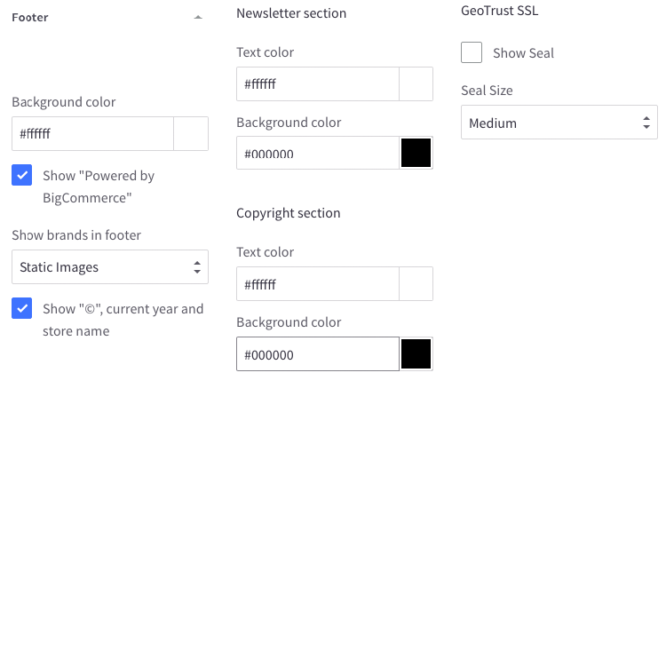

## Purchase Options

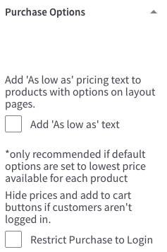

## Homepage

This section let you configure the homepage:

- Show/hide any content blocks and product blocks.
- Rearrange position of any blocks.
- Configure display type of New, Featured, Popular Products blog.
- Number of products to show on each block.

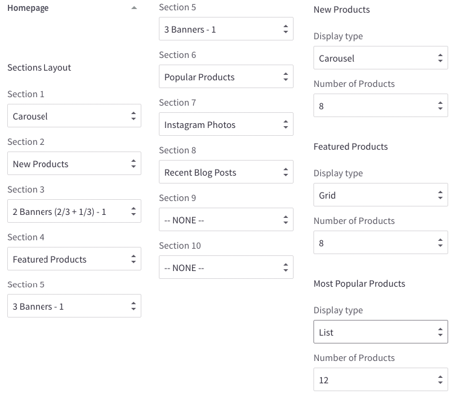