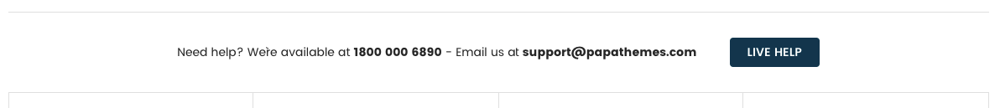
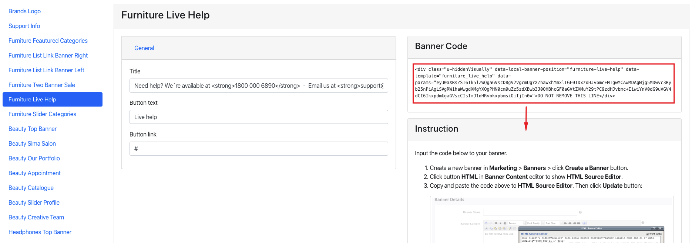

# Home Page

## -- LINK BELOW HEADER


You can enable this banner across all pages or on all other pages except Home Page in **Theme Editor** > **Banners** > **Link after header**:


After enabled, you can edit banner content by go to **Marketing** > **Banners**, click **Create a Banner** button. Input the fields as below:

_ **Banner Name**: whatever.
_ **Banner Content**: click the HTML button to open HTML source code editor.

Copy and paste the sample code below:

```
<div id="emthemesModezBannersBlockAfterHeader" class="emthemesModezBannersBlockAfterHeader">
    <div class="container">
        <div class="sale-list">
            <div class="sale-list__item">
                <a class="sale-list__link" title="" href="#">game day furniture sale</a>
            </div>
            <div class="sale-list__item">
                <a class="sale-list__link" title="" href="#">the entryway sale</a>
            </div>
            <div class="sale-list__item">
                <a class="sale-list__link" title="" href="#">the white sale</a>
            </div>
            <div class="sale-list__item">
                <a class="sale-list__link" title="" href="#">outdoor warm-up sale</a>
            </div>
        </div>
    </div>
</div>
```

Set Show on __Page = Home Page__ and __Location = Top of Page__:


Click **Save** button to finish.


## -- Sections Manager

You can select the sections displayed on the homepage (maximum 11 sections) in **Theme Editor** > **Homepage** > **Sections**.


---

### List of available sections key: ###

* **section1": "featured_categories**
* **section2": "listlink_banner_right**
* **section3": "listlink_banner_left**
* **section4": "daily_deals**
* **section5": "banner_sale**
* **section6": "products_by_category_sorting_tabs**
* **section7": "blog_recent**
* **section8": "top_brands**
* **section9": "live_help**
* **section10": "support_info**
* **section11": "instagram_carousel**


## --- Furniture Featured Categories Section


To edit content and images in this block, open the builder tool: [https://bc-furnisima-builder.papathemes.com/](https://bc-furnisima-builder.papathemes.com/)

Chooes __Furniture Featured Categories__ tab, fill in the form and follow the instruction on that page to create banner.


## --- Furniture Listlink Banner Right Section


To edit content and images in this block, open the builder tool: [https://bc-furnisima-builder.papathemes.com/](https://bc-furnisima-builder.papathemes.com/)

Chooes __Furniture Listlink Banner Right__ tab, fill in the form and follow the instruction on that page to create banner.


## --- Furniture Listlink Banner Left Section


To edit content and images in this block, open the builder tool: [https://bc-furnisima-builder.papathemes.com/](https://bc-furnisima-builder.papathemes.com/)

Chooes __Furniture Listlink Banner Left__ tab, fill in the form and follow the instruction on that page to create banner.


## --- Furniture Daily Deals Section


You can configure this section in **Theme Editor** > **Homepage** > **Daily Deals**.


## --- Furniture Banner Sale Section


To edit content and images in this block, open the builder tool: [https://bc-furnisima-builder.papathemes.com/](https://bc-furnisima-builder.papathemes.com/)

Chooes __Furniture Banner Sale__ tab, fill in the form and follow the instruction on that page to create banner.


## --- Furniture Products By Category Sorting Tabs Section


This section will show products organized categories. You can choose number of categories to display products. Categories are sorted by the order specified in **Product Categories** in admin manager.

To configure this section, go to **Theme Editor** > **Homepage** > **Products by Category with Sorting Tabs**:


#### OPTIMIZE FOR EXECUTION TIME

By default, all products will be loaded and displayed when opening the page. At a result, it takes a longer execution time that can affect your site's Page Speed score. To avoid this, you can select **Only load when scrolling to the viewport** option, the products won't loaded until user scrolls down to this area.

#### SPECIFY WHICH CATEGORIES TO DISPLAY

By default, the product categories displayed are the top categories in the order in which they are sorted on the main navigation. You can limit number of categories to display by setting Number of Categories option.

You can manually specify which categories should be displayed by setting the categories ID to Category ID box, separated by comma. For example: 200,221,254,275. Check instruction How to find the category ID. Note that Number of Categories will be ignored if you choose to display categories manually.

#### SHOW BANNER PER CATEGORY

To show the banner image per products by category block, tick on option Show banner in **Theme Editor** > **Homepage** > **Products by Category with Sorting Tabs**:


### Furnisima Slider 


To show these banners on homepage, go to **Marketing** > **Banners** > click **Create a Banner** button. In **Banner Content** editor, click **HTML** button to open **HTML Source Editor**, input them sample content below:

```
<div data-local-banner-position="furnisima-pbcst1">
    <div class="furnisima-list">
        <div class="furnisima-list-item">
            <a class="furnisima-list-img" title="" href="https://wholesale-light-demo.mybigcommerce.com/"> 
                 
            </a> 
            <a class="furnisima-list-title" title="" href="https://wholesale-light-demo.mybigcommerce.com/"> 
                Marble Drink Table <span>Treated to an intriguingantique finish...</span> 
            </a>
        </div>
        <div class="furnisima-list-item">
            <a class="furnisima-list-img" title="" href="https://wholesale-light-demo.mybigcommerce.com/"> 
                 
            </a> 
            <a class="furnisima-list-title" title="" href="https://wholesale-light-demo.mybigcommerce.com/"> 
                Mix Console Table <span>Treated to an intriguingantique finish...</span> </a>
            </div>
        <div class="furnisima-list-item">
            <a class="furnisima-list-img" title="" href="https://wholesale-light-demo.mybigcommerce.com/"> 
                 
            </a> 
            <a class="furnisima-list-title" title="" href="https://wholesale-light-demo.mybigcommerce.com/"> 
                Intarsia Natural Table <span>Treated to an intriguingantique finish...</span> 
            </a>
        </div>
        <div class="furnisima-list-item">
            <a class="furnisima-list-img" title="" href="https://wholesale-light-demo.mybigcommerce.com/"> 
                 
            </a> 
            <a class="furnisima-list-title" title="" href="https://wholesale-light-demo.mybigcommerce.com/"> 
                Elke Table <span>Treated to an intriguingantique finish...</span> 
            </a>
        </div>
        <div class="furnisima-list-item">
            <a class="furnisima-list-img" title="" href="https://wholesale-light-demo.mybigcommerce.com/"> 
                 
            </a> 
            <a class="furnisima-list-title" title="" href="https://wholesale-light-demo.mybigcommerce.com/"> 
                Marble Drink Table <span>Treated to an intriguingantique finish...</span> 
            </a>
        </div>
    </div>
</div>
```


Set Show on __Page = Home Page__ and __Location = Bottom of Page__:


Click **Save** button to finish.

You can freely edit the HTML above to change banner images or links but keep the HTML attribute `data-local-banner-position="furnisima-pbcst1"`, or change `1` with numbers in the order `2,3...n` corresponding to the order of block product by categories.


## --- Furniture Recent Posts Section


To show Recent Posts section on **Home Page**, go to **Theme Editor** > **Homepage** > set **Recent blog posts** = number of posts to show up.

## --- Furniture Top Brands Section


To edit content and images in this block, open the builder tool: [https://bc-furnisima-builder.papathemes.com/](https://bc-furnisima-builder.papathemes.com/)

Chooes __Furniture Top Brands__ tab, fill in the form and follow the instruction on that page to create banner.


## --- Furniture Live Help Section



To edit content and images in this block, open the builder tool: [https://bc-furnisima-builder.papathemes.com/](https://bc-furnisima-builder.papathemes.com/)

Chooes __Furniture Live Help__ tab, fill in the form and follow the instruction on that page to create banner.




## --- Furniture Support Info Section


To edit content and images in this block, open the builder tool: [https://bc-furnisima-builder.papathemes.com/](https://bc-furnisima-builder.papathemes.com/)

Chooes __Furniture Live Help__ tab, fill in the form and follow the instruction on that page to create banner.


## --- Furniture Instagram Section


To show your Intagram photos on Home Page, go to **Theme Editor** > **Homepage** > **Instagram**, input your **Access Token** code and **User ID**.

To retrieve your Access Token, use this tool [https://bit.ly/2Cm0I1O](https://bit.ly/2Cm0I1O)


Here you can configure access token and number of photos.

Choose **Number of photos** to show up.

