# Home Page

## -- Sections Manager

You can select the sections displayed on the homepage (maximum 11 sections) in **Theme Editor** > **Homepage** > **Sections**.

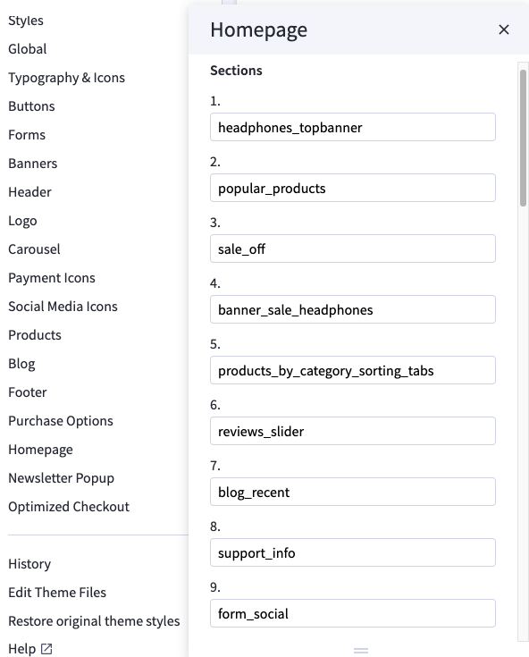

---

### List of available sections key: ###

* **section1": "headphones_topbanner**
* **section2": "popular_products**
* **section3": "sale_off**
* **section4": "banner_sale_headphones**
* **section5": "products_by_category_sorting_tabs**
* **section6": "reviews_slider**
* **section7": "blog_recent**
* **section8": "support_info**
* **section9": "form_social**

## --- Headphones Top Banner Section

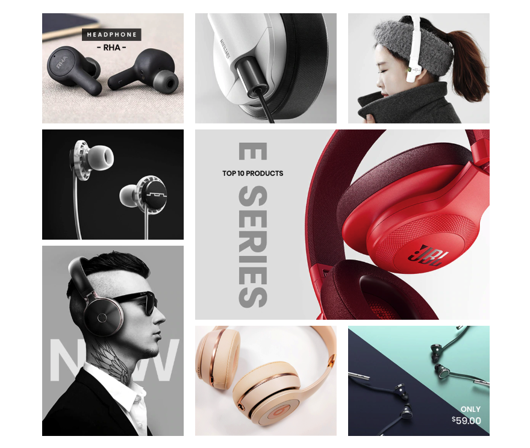

To edit content and images in this block, open the builder tool: [https://bc-feellio-builder.papathemes.com/](https://bc-feellio-builder.papathemes.com/)

Chooes __Headphones Top Banner__ tab, fill in the form and follow the instruction on that page to create banner.

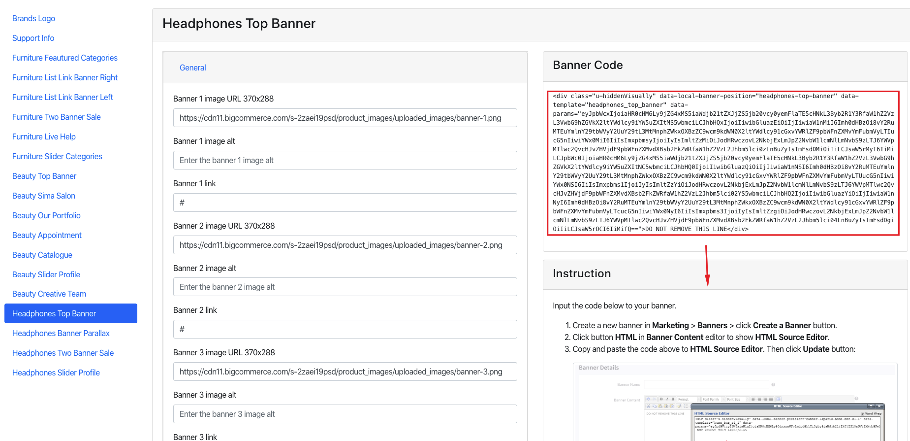

## --- New / Featured / Bestselling Products

### --- Default style:

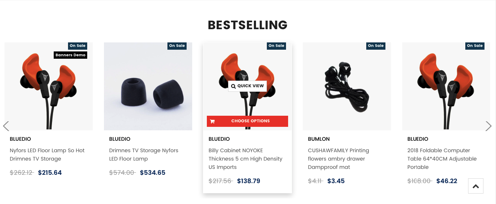

Configure New Products, Featured Products, Bestselling Products showing on the home page in **Theme Editor** > **Homepage**:

- Number of products to display.
- Heading of the new, featured, bestselling product blocks.
- Sub-heading.
- Columns (number of products per row).
- Columns on tablet.
- Columns on mobile.
- Type (Grid or List).

## --- Headphones Banner Parallax

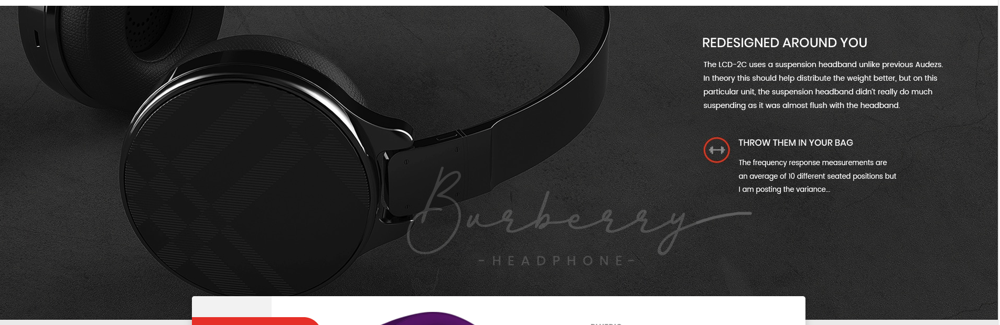

To edit content and images in this block, open the builder tool: [https://bc-feellio-builder.papathemes.com/](https://bc-feellio-builder.papathemes.com/)

Chooes __Headphones Banner Parallax__ tab, fill in the form and follow the instruction on that page to create banner.

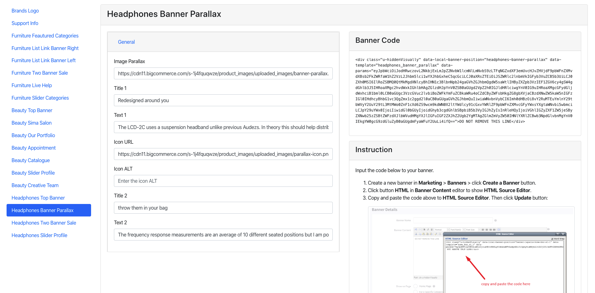

## --- Headphones Product Sale Off Section

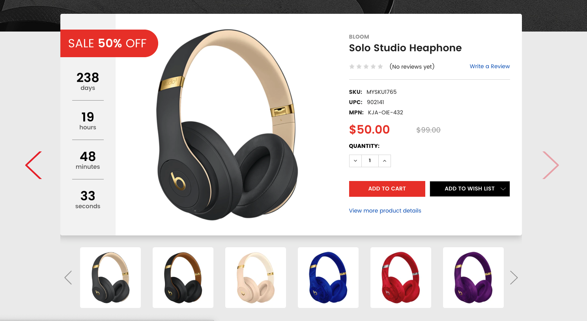

Configure New Products Sale Off showing on the home page in **Theme Editor** > **Products**:

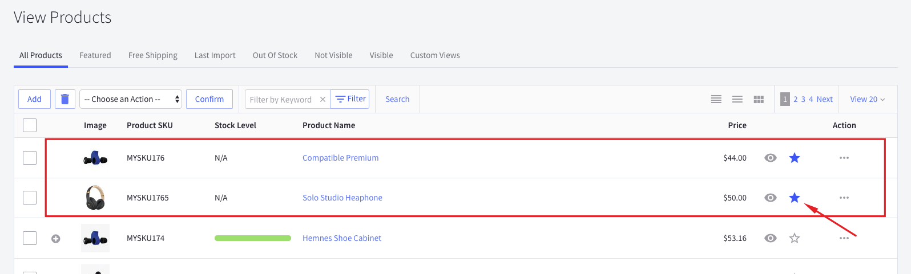

## --- Headphones Banner Sale Section

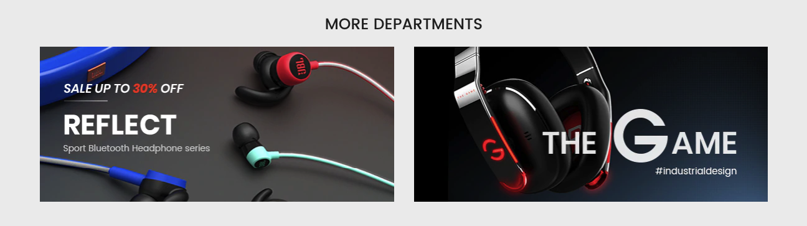

To edit content and images in this block, open the builder tool: [https://bc-feellio-builder.papathemes.com/](https://bc-feellio-builder.papathemes.com/)

Chooes __Headphones Banner Sale__ tab, fill in the form and follow the instruction on that page to create banner.

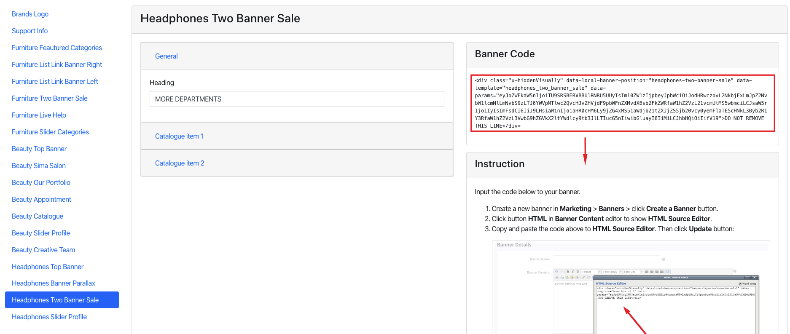

## --- Headphones Products By Category Sorting Tabs Section

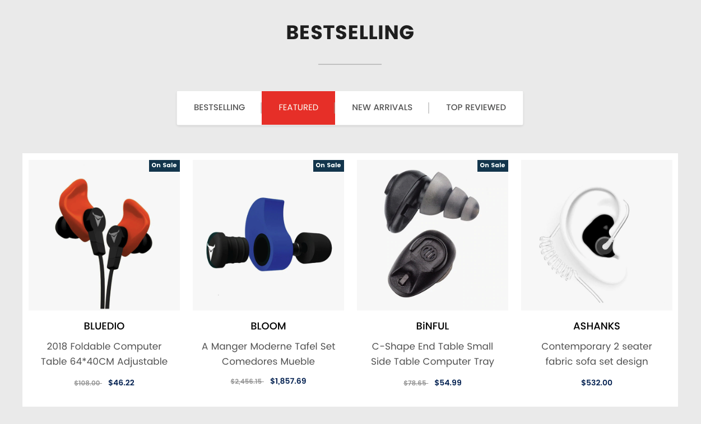

This section will show products organized categories. You can choose number of categories to display products. Categories are sorted by the order specified in **Product Categories** in admin manager.

To configure this section, go to **Theme Editor** > **Homepage** > **Products by Category with Sorting Tabs**:

#### OPTIMIZE FOR EXECUTION TIME

By default, all products will be loaded and displayed when opening the page. At a result, it takes a longer execution time that can affect your site's Page Speed score. To avoid this, you can select **Only load when scrolling to the viewport** option, the products won't loaded until user scrolls down to this area.

#### SPECIFY WHICH CATEGORIES TO DISPLAY

By default, the product categories displayed are the top categories in the order in which they are sorted on the main navigation. You can limit number of categories to display by setting Number of Categories option.

You can manually specify which categories should be displayed by setting the categories ID to Category ID box, separated by comma. For example: 200,221,254,275. Check instruction How to find the category ID. Note that Number of Categories will be ignored if you choose to display categories manually.

## --- Headphones Reviews Slider Section

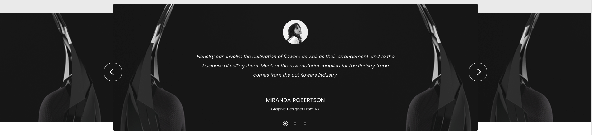

To edit content and images in this block, open the builder tool: [https://bc-feellio-builder.papathemes.com/](https://bc-feellio-builder.papathemes.com/)

Chooes __Headphones Reviews Slider__ tab, fill in the form and follow the instruction on that page to create banner.

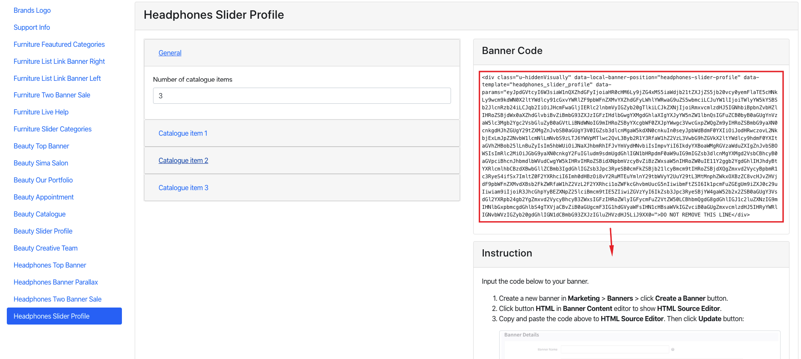

## --- Headphones Recent Posts Section

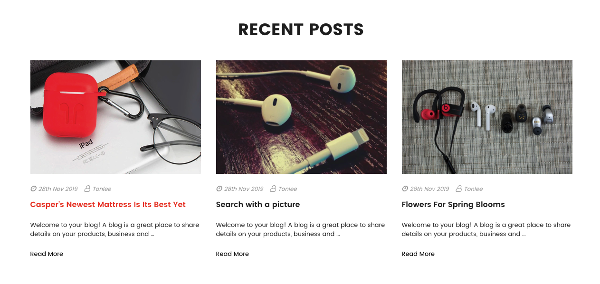

To show Recent Posts section on **Home Page**, go to **Theme Editor** > **Homepage** > set **Recent blog posts** = number of posts to show up.

## --- Headphones Support Info Section

To edit content and images in this block, open the builder tool: [https://bc-feellio-builder.papathemes.com/](https://bc-feellio-builder.papathemes.com/)

Chooes __Furniture Live Help__ tab, fill in the form and follow the instruction on that page to create banner.

