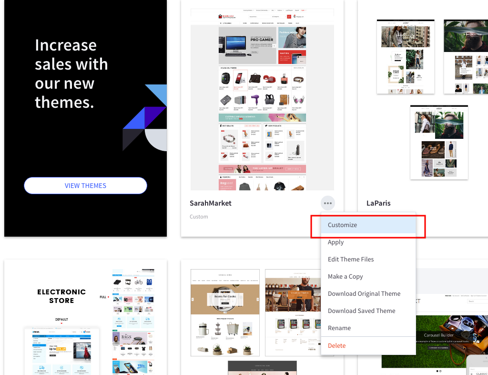

# Upgrade Theme

This instruction below will help you upgrade the theme to the latest version.

__Step 1:__ Install the upgraded theme package like the new theme. See [instruction for installing theme](installation.md) here. __But DON'T active the the updraded theme yet.__

__Step 2:__ Re-configure all theme settings in the Theme Editor for the new theme by click on button Customize in the thumbnail of the new upgraded theme: 

__Step 3:__ Copy content of all files you've edited from to old version to the new version by editing the files in Edit Theme Files editor. See [how to edit template files](quickstart.md#edit-template-files). Files are often edited for customization are:

- __lang/en.json__
- __assets/scss/_theme-custom.scss__
- __templates/pages/home.html__

__Step 4:__ Activate the upgrade theme. If you see any error you can revert back to the old version by activating the old theme.

