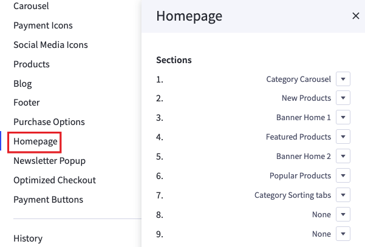
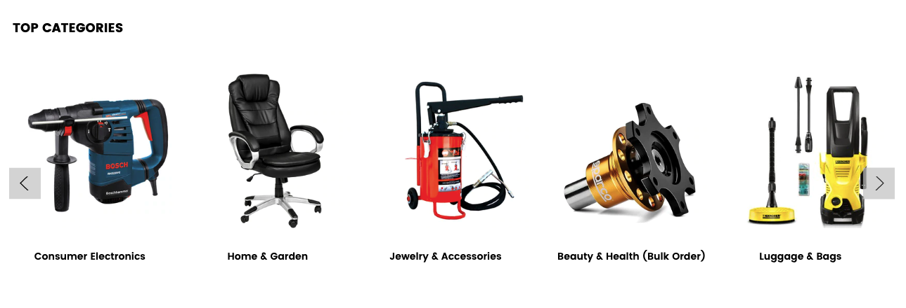
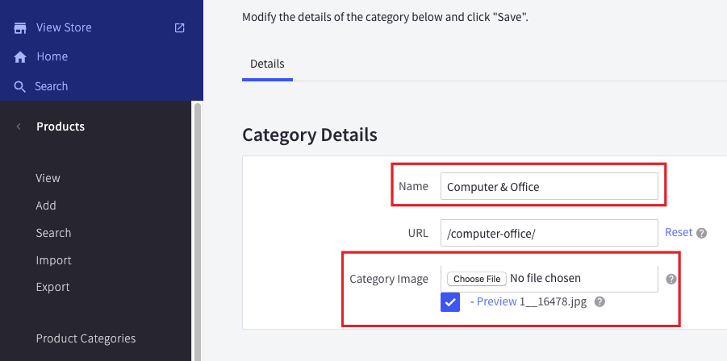
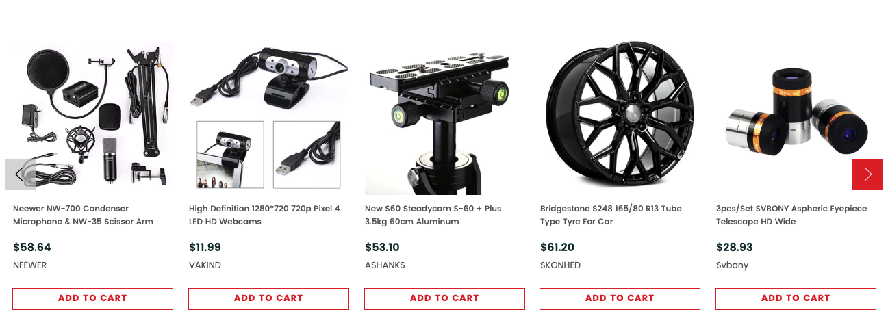
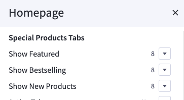
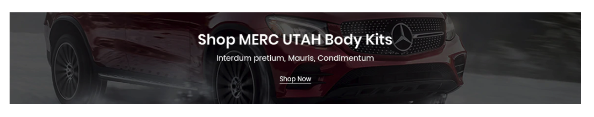
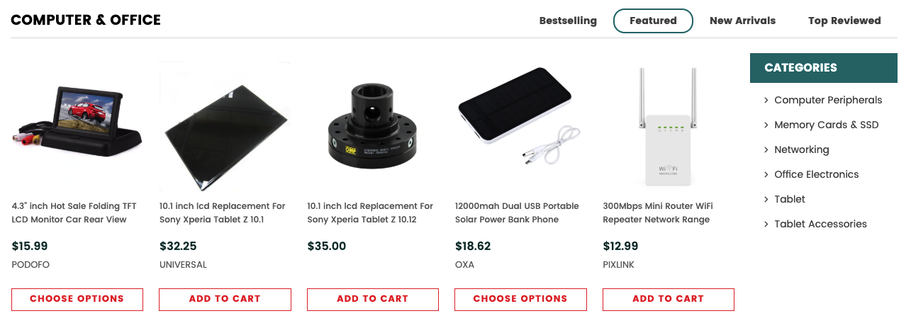
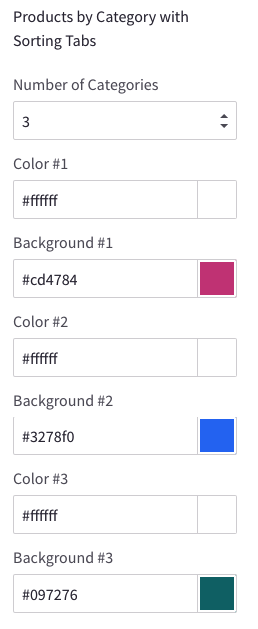
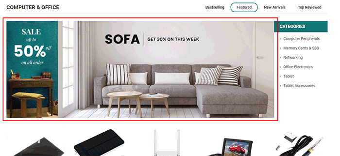
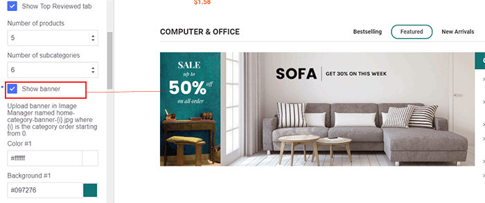

# Home Page Section

## -- Sections Manager

You can select the sections displayed on the homepage (maximum 11 sections) in **Theme Editor** > **Homepage** > **Sections**.




---

### List of available sections key: ###

* **section1": "category_carousel**
* **section2": "new_products**
* **section3": "bc_banner_home_1**
* **section4": "featured_products**
* **section5": "bc_banner_home_2**
* **section6": "popular_products**
* **section7": "bc_banner_home_3**
* **section8": "products_by_category_sorting_tabs**

## --- Wholesale Top Categories Section



This block show top categories and its sub-categories sorted by the order set in Product Categories manager.

You can configure titles and images of categories in **Product** > **Product Categories** > **Category Details**



## --- Product Sections (New / Featured / Bestselling)

By default, these sections will not appear on the homepage. However, you can use it.



Configure New Products, Featured Products, Bestselling Products showing on the home page in **Theme Editor** > **Homepage**:

- Number of products to display.



## Fullwidth Banner on Home Page



To show this banner on Home Page, Go to **Marketing** > **Banners** > click **Create a Banner** button. In **Banner Content** editor, click **HTML** button to open **HTML Source Editor**, input the sample content below:

```
<div id="emthemesModezBannersBlockHome02" class="emthemesModez-section  emthemesModez-section--banners-one">
    <div class="emthemesModez-section-inner">
        <div class="emthemesModez-bannersContainer emthemesModez-bannersContainer--one emthemesModez-bannersContainer--one-1">
            <div class="emthemesModez-banner">
                <div class="emthemesModez-banner-container">
                    <a href="#">
                        
                    </a>
                </div>
            </div>
        </div>
    </div>
</div>
```


Then click **Update** button to go back the previous screen.

Choose **Show on Page** = **Home Page**.

Choose **Location** = **Top of Page**.


Click **Save** button to finish.

You can freely edit the HTML code above to change banner images or links but keep the HTML attribute `id="emthemesModezBannersBlockHome02"` unchanged.


## --- Products By Categories



This section will show products organized categories. You can choose number of categories to display products. Categories are sorted by the order specified in **Product Categories** in admin manager.

#### CONFIGURATION

To configure this section, go to **Theme Editor** > **Homepage** > **Products by Category with Sorting Tabs**:



#### OPTIMIZE FOR EXECUTION TIME

By default, all products will be loaded and displayed when opening the page. At a result, it takes a longer execution time that can affect your site's Page Speed score. To avoid this, you can select **Only load when scrolling to the viewport** option, the products won't loaded until user scrolls down to this area.

#### SPECIFY WHICH CATEGORIES TO DISPLAY

By default, the product categories displayed are the top categories in the order in which they are sorted on the main navigation. You can limit number of categories to display by setting **Number of Categories** option.

You can manually specify which categories should be displayed by setting the categories ID to Category ID box, separated by comma. For example: `200,221,254,275`. [Check instruction How to find the category ID](https://solidcommerce.zendesk.com/hc/en-us/articles/215722843-Finding-Bigcommerce-Category-Names-and-ID-Numbers#automark4). Note that Number of Categories will be ignored if you choose to display categories manually. 

#### HOT CATEGORIES

**Hot Categories** appears on the right is the sub-categories of the current category.


#### SHOW BANNER PER CATEGORY



To show the banner image per products by category block, tick on option **Show banner** in **Theme Editor** > **Homepage** > **Products by Category with Sorting Tabs**:



Then go to **Storefront** > **Image Manager**, upload your banner image with name following this rule: `products-by-category-{i}` where `{i}` is replaced by category order starting from 1. The banner image format must be jpg, it means the image on your computer must be `products-by-category-1.jpg` if it's used for the first category. All letters must be lower case.