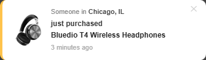
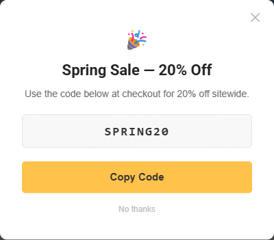

# Release Notes

-   Highly recommend making a backup copy of your current theme before updating to the newer version.
-   Please note that if your theme files have been modified, it cannot be updated automatically. Please [contact us](/contact-us/) for a quote on manual updates.

## 7.4.0 (06-12-2026)
- Fix: Hero carousel is now full-bleed (full-width) on every screen with a consistent aspect ratio. All slides reserve the first slide's ratio and use an absolutely-filled object-fit:cover image, so the carousel keeps the correct ratio, stays the same height across slides, and no longer jumps when Slick initializes (was up to +288px CLS). Affects all variations.
- Feature: Add server-rendered skeleton placeholder to Products by Category Sorting Tabs so the section reserves its exact layout (cards, subcategory sidebar) while products load, eliminating layout shift (CLS). Respects `prefers-reduced-motion`.
- Change: Product names in Products by Category Sorting Tabs are clamped to two lines with an ellipsis, giving every card a uniform height.
- Change: The Products by Category Sorting Tabs banner now reserves a fixed aspect ratio (recommended upload 1448 x 525, cropped to fit) so loading the image no longer shifts the layout (CLS).
- Fix: Products by Category Sorting Tabs skeleton now renders the real subcategory links in the sidebar instead of fixed-height placeholder bars, so the banner/sidebar row reserves its exact height at narrow viewports and no longer shifts the layout when products load (CLS).
- Fix: Products by Category Sorting Tabs boxes now include products from subcategories. Switched the GraphQL query from `category.products` (returns directly-assigned products only) to `search.searchProducts` with `searchSubCategories: true` (#12741).
- Fix: Social proof stock pill now always shows the variant stock count, even when the urgency widget is disabled. Previously the pill was gated behind the urgency feature flag (off by default), so stores not using urgency lost the native stock display entirely.

## 7.3.0 (05-12-2026)
- [CORNERSTONE] Bump stencil-utils to 6.23.0.
- Fix: Out of stock alert overlaps Add to Cart button when product allows back-ordering or when a purchasable variant is selected (#45).
- Fix: Filter accordion +/- toggle button is not keyboard accessible when filters start collapsed (#39).
- [CORNERSTONE] Backorder availability prompt on PDP — shows merchant-configured prompt text next to stock count when product has backorder stock available; updates dynamically on variant change ([#2592](https://github.com/bigcommerce/cornerstone/pull/2592))
- [CORNERSTONE] Backordered quantity message on PDP — shows "{n} will be backordered" when selected quantity exceeds on-hand stock ([#2613](https://github.com/bigcommerce/cornerstone/pull/2613))
- [CORNERSTONE] Backorder support for complex products (variants) — prompt and quantity message update correctly on variant/option change ([#2618](https://github.com/bigcommerce/cornerstone/pull/2618), [#2619](https://github.com/bigcommerce/cornerstone/pull/2619))
- [CORNERSTONE] Custom backorder message on PDP — shows merchant-configured message alongside the backordered quantity line ([#2625](https://github.com/bigcommerce/cornerstone/pull/2625))
- [CORNERSTONE] Cart line item backorder messages — shows quantity on hand, quantity backordered, and backorder message per item, controlled by individual inventory settings ([#2608](https://github.com/bigcommerce/cornerstone/pull/2608))
- [CORNERSTONE] Shipping expectation prompt in cart totals — shows default_shipping_expectation_prompt in the Shipping row ([#2622](https://github.com/bigcommerce/cornerstone/pull/2622), [#2624](https://github.com/bigcommerce/cornerstone/pull/2624))
- Feature: Add page transition overlay when navigating between pages.
- [CORNERSTONE] Dispatch an event on productOptionsChanged ([#2400](https://github.com/bigcommerce/cornerstone/pull/2400))
- [CORNERSTONE] Fix: swap content/data keys in onProductOptionsChanged event detail ([#2640](https://github.com/bigcommerce/cornerstone/pull/2640))
- Feature: Add PDP urgency widget (viewing count + last purchase time). Disabled by default. Enable via Script Manager with `window.supermarketThemeSettings.urgency`. See [PDP Urgency Widget](/customization/social-proof#pdp-urgency-widget).

  

- Feature: Add cart goal progress bar with multi-milestone support (free shipping, discount, gift, etc.). Disabled by default. Enable via Script Manager with `window.supermarketThemeSettings.cartGoal`. See [Cart Goal Bar](/customization/social-proof#cart-goal-bar).

  

- Feature: Add recent sales mini-popup sourced from best-sellers / new / featured / manual products. Disabled by default. Enable via `window.supermarketThemeSettings.recentSales` (safe defaults: delay 8s, max 3 shows per session). See [Recent Sales Popup](/customization/social-proof#recent-sales-popup).

  

- Feature: Add promotional popup with coupon code and clipboard copy. Disabled by default. Configure via `window.supermarketThemeSettings.promo`. See [Promotional Popup](/customization/social-proof#promotional-popup).

  

- Feature: Add exit-intent popup (desktop mouse-leave / mobile inactivity). Disabled by default. Configure via `window.supermarketThemeSettings.exit`. See [Exit-Intent Popup](/customization/social-proof#exit-intent-popup).

  

- Change: Existing newsletter popup now coordinates with new popups through a priority queue to prevent overlap. Theme settings (`nl_popup_*`) and cookie (`NL_POPUP_HIDE`) preserved.
- Change: Social proof widgets now render with demo content inside the BigCommerce theme editor preview panel when a given feature is not configured in Script Manager. Merchant-configured features (including explicit disables) are respected unchanged. Production shoppers see no change.
- Docs: New user guide at `customization/social-proof` covering configuration and examples.

## 7.2.0 (12-12-2025)
- Feature: [Suggest Keywords for Quick Search](/customization/header#quick-search---keyword-suggestions) (#36)

<iframe width="560" height="315" src="https://www.youtube.com/embed/mMg9aPb5SJY" title="Quick Search - Keyword Suggestions" frameborder="0" allow="accelerometer; autoplay; clipboard-write; encrypted-media; gyroscope; picture-in-picture; web-share" allowfullscreen></iframe>

## 7.1.5 (10-03-2025)
- Fix: remove min-width of Google Pay button on PDP.
- Fix: indent of H3 tag on sitemap page.
- Fix: add gap between payment button and wishlist button on PDP on mobile.
- Add link to product page for frequently bought together products.

## 7.1.4 (09-12-2025)
- [CORNERSTONE] Add a section to display the payment promotion widget in the drop-down of the cart preview. ([#2523](https://github.com/bigcommerce/cornerstone/pull/2523))
- Fix payment buttons on pdp overlap the sticky header

## 7.1.3 (07-18-2025)
- Add login with email link feature.

## 7.1.2 (05-09-2025)
- add #add-to-cart-wrapper for B2B compatibility
- Fix special product tabs: refactor GraphQL query variables

## 7.1.1 (02-21-2025)
- fix page's height when there are many category menus enabled fade effect
- update facebook sdk api
- remove deprecated variable `settings.request.is_crawler`

## 7.1.0 (01-20-2025)
- [CORNERSTONE] Add nonce to scripts in checkout and account pages [#2525](https://github.com/bigcommerce/cornerstone/pull/2525)
- [CORNERSTONE] Use fetch when updating variants in cart ([#2521](https://github.com/bigcommerce/cornerstone/pull/2521))

## 7.0.9 (01-10-2025)
- [CORNERSTONE] Fix product filter display name in Show More modal window [#2510](https://github.com/bigcommerce/cornerstone/pull/2510)
- Fix compare products not working on home page
- Fix cache issue of shop by category banner images

## 7.0.8 (10-11-2024)
- Fix browser crash when editing options in Bulk Order layout with products that have an empty file
- Fix products by category not load products when clicking on the tabs

## August 2, 2024 - v7.0.7

-   Fix price not display on homepage for logged in customer if hide price from guest is enabled
-   Display login for pricing link on home page

## July 12, 2024 - v7.0.6

-   Fix incorrect price symbol displayed in product cards generated by GraphQL
-   \[CORNERSTONE\] Extended initialization interface of the storefront-account-payments lib, added theme styles \[#2335\]\[https://github.com/[bigcommerce/cornerstone/pull/2335](https://github.com/bigcommerce/cornerstone/pull/2335)\]

## June 21, 2024 - v7.0.5

-   Fix Frequently Bought Together overlap product image on Safari
-   Disable Instant-Load feature when viewing in Preview panel
-   Support playing YouTube videos for homepage carousel on mobile

## May 3, 2024 - v7.0.4

-   Fix show hover image and button on product cards generated by graphQL to respect theme settings
-   Fix Instant-Load not display products by category on homepage

## April 26, 2024 - v7.0.3

-   Fix remote banner: increase limit to 20
-   Fix Add to Cart button appear along with Pre-order button
-   Remove incorrect variable from GraphQL fetch products
-   Fix price display on GraphQL product cards

## April 18, 2024 - v7.0.2

-   Use GraphQL to display products by category and load more of featured/bestselling/new products

## March 29, 2024 - v7.0.1

-   Fix jstree hover color
-   Set mute video on carousel by default
-   Fix faceted filter price range not collapse by default
-   Limit shop by brands strictly on the left sidebar
-   Update arrow icon on standard menu consistent with other menu styles

## March 21, 2024 - v7.0.0

-   Update new header design
-   Update Bulk Order layout support choosing product options
-   Improve accessibility score
-   Fix accessibility for advanced search
-   Fix accessibility for main menu
-   Make focus visible on product card image
-   Fix color of the top banner link
-   Update color of X icon on Modern style and border color of main menu on mobile
-   Fix image flash when sliding to the next product image
-   Update faceted filter toggle link on mobile
-   Display loading for quick search, close button bigger on mobile
-   Restore theme price

## February 2, 2024 - v6.5.2

-   Update quick search to display results after typing 2 letters.
-   Fix main image not display on PDP when BC encode HTML incorrect.
-   Fix code typo.
-   Fix category menu open on homepage but not close on other pages when Instant-Load is enabled.

## October 20, 2023 - v6.5.1

-   Fix scroll to top button not clickable when scrolling to the footer
-   Change tab title of products by category sections

## August 01, 2023 - v6.5.0

-   Fix the sub menu item hidden in the 'more' menu item when auto-fit is enabled
-   Fix edit cart item display incorrect message when product is unavailable / out of stock
-   Fixed unavailable options' strikeout display during cart edit
-   Fix cart quantity input change not working
-   Fix to prevent mega menu from overflowing right edge of page
-   Fix product schema snippet error when product has not description
-   \[CORNERSTONE\] Removed accelerated checkout integration [#2341](https://github.com/bigcommerce/cornerstone/pull/2341)
-   \[CORNERSTONE\] Added css classes for ApplePay Button [\[#2344\]](https://github.com/bigcommerce/cornerstone/pull/2344)
-   \[CORNERSTONE\] Added styling config for the Bolt smart payment button [\[#2356\]](https://github.com/bigcommerce/cornerstone/pull/2356)
-   \[CORNERSTONE\] Added style configs to payment buttons [#2361](https://github.com/bigcommerce/cornerstone/pull/2361) - PARTIAL MERGE due to limited file size, ignore file [schema.json](https://github.com/bigcommerce/cornerstone/commit/c2ab2d0828e8bb4debb1d251b13b05e67ce559a7#diff-9fcde326d127f74194f70e563bdf2c118c51b719c308f015b8eb0204a9a552fb)
-   \[CORNERSTONE\] Bump Stencil utils to 6.15.1 \[#2365\]\[https://github.com/[bigcommerce/cornerstone/pull/2365](https://github.com/bigcommerce/cornerstone/pull/2365)\]
-   \[CORNERSTONE\] Added ACH payment method section to My Account -> Payment Methods page [#2362](https://github.com/bigcommerce/cornerstone/pull/2362)
-   \[CORNERSTONE\] Display fees on cart page [#2360](https://github.com/bigcommerce/cornerstone/pull/2376)
-   \[CORNERSTONE\] Replace Twitter logo with X logo within social sharing and social link components [#2387](https://github.com/bigcommerce/cornerstone/pull/2387)

## July 07, 2023 - v6.4.0

-   Fix homepage blank display when products by category are not visible for specific customers due to permission restrictions
-   Fix Add to Cart button display for out of stock products in the recently viewed products section
-   Fix SASS Compiler: stop using string +#{number} in function parameter
-   Fix SCSS Compiler: product card icons
-   Fix home page display blank when a category is not visible in products by categories section
-   Use node 18
-   Update Klarna logo
-   Fix menu fit 1 line generating duplicated ID
-   Fix mini popup not open again when adding to cart from product cards
-   Fix quick payment button process incorrect product when frequently bought together enabled

## March 09, 2023 - v6.3.0

-   Optimize schema remove some variable
-   Fix glitch with product thumbnail arrows when video is enabled in gallery
-   Fix logo size original on mobile
-   Fix a glitch of searchInCategory in category page on mobile when the banner block above category appears
-   **Update Cornerstone 6.9.0:**
-   \[CORNERSTONE\] Make screen reader say error messages when editing customer account. [#2233](https://github.com/bigcommerce/cornerstone/pull/2233)
-   \[CORNERSTONE\] Make screen reader say all errors then each error while tabbing. \[#2230\][bigcommerce/cornerstone#2230](https://github.com/bigcommerce/cornerstone/pull/2230)
-   \[CORNERSTONE\] On customer message page, screen reader should say each error \[#2234\][bigcommerce/cornerstone#2234](https://github.com/bigcommerce/cornerstone/pull/2234)
-   \[CORNERSTONE\] feat(payment): PAYPAL-1579 added wallet buttons component for product details and quick view
-   \[CORNERSTONE\] Clarify customer order pagination. \[#2241\][bigcommerce/cornerstone#2241](https://github.com/bigcommerce/cornerstone/pull/2241)
-   \[CORNERSTONE\] Add global region below the navigation in the header [#2231](https://github.com/bigcommerce/cornerstone/pull/2231)
-   \[CORNERSTONE\] Bump jQuery to 3.6.1. [#2250](https://github.com/bigcommerce/cornerstone/issues/2250)
-   \[CORNERSTONE\] feat(payment): PAYPAL-1474 added an ID for 'Check out' button and added extra container to render Accelerated Checkout in
-   \[CORNERSTONE\] Reduce lodash usage \[#2256\][bigcommerce/cornerstone#2256](https://github.com/bigcommerce/cornerstone/pull/2256)
-   \[CORNERSTONE\] Added styling config for the PayPal Accelerated Checkout button [#2254](https://github.com/bigcommerce/cornerstone/pull/2254)
-   \[CORNERSTONE\] Bump stencil utils with BODL events: Add to Cart and Remove from Cart \[#2252\][bigcommerce/cornerstone#2252](https://github.com/bigcommerce/cornerstone/pull/2252)
-   \[CORNERSTONE\] Add unionpay img to be display on custumers account. [#2260](https://github.com/bigcommerce/cornerstone/pull/2260)
-   \[CORNERSTONE\] Add smart buttons attributes for various payment providers in Page builder \[#2212\][bigcommerce/cornerstone#2212](https://github.com/bigcommerce/cornerstone/pull/2212)
-   \[CORNERSTONE\] Migrate Cornerstone to new "Hide Price From Guests" functionality [#2262](https://github.com/bigcommerce/cornerstone/pull/2262)
-   \[CORNERSTONE\] Add Accelerated buttons container into 'add to cart' popup on product details page [#2264](https://github.com/bigcommerce/cornerstone/pull/2264)
-   \[CORNERSTONE\] Made PDP wallet buttons container hidden in cases when the product is not purchasable or out of stock [#2267](https://github.com/bigcommerce/cornerstone/pull/2267)
-   \[CORNERSTONE\] Updated PayPal Accelerated Checkout default button styles [#2268](https://github.com/bigcommerce/cornerstone/pull/2268)
-   \[CORNERSTONE\] Add logic to collect Product Details data and send it to the BC App stencil template through custom event [#2270](https://github.com/bigcommerce/cornerstone/pull/2270)
-   \[CORNERSTONE\] Fix the issue with getting product details data if the product details form is valid on page load [#2271](https://github.com/bigcommerce/cornerstone/pull/2271)
-   \[CORNERSTONE\] Fixed escaping on created store account confirm message. \[#2265\][bigcommerce/cornerstone#2265](https://github.com/bigcommerce/cornerstone/pull/2265)
-   \[CORNERSTONE\] Delay validation on account signup, message form, and account edit page [#2274](https://github.com/bigcommerce/cornerstone/pull/2274)
-   \[CORNERSTONE\] Set "Show quick payment buttons" setting to true by default \[#2283\][bigcommerce/cornerstone#2283](https://github.com/bigcommerce/cornerstone/pull/2283)
-   \[CORNERSTONE\] Fixed en-CA translation warning in terminal. \[#2278\]\[https://github.com/[bigcommerce/cornerstone/pull/2278](https://github.com/bigcommerce/cornerstone/pull/2278)\]
-   \[CORNERSTONE\] Added manual captcha to Contact Us form for additional spam protection. [#2290](https://github.com/bigcommerce/cornerstone/pull/2290)
-   \[CORNERSTONE\] Fixed PDP not respecting "quantity box" display settings. [#2291](https://github.com/bigcommerce/cornerstone/pull/2291)
-   \[CORNERSTONE\] Added integrarion of storefront-account-payments lib \[#2288\]\[https://github.com/[bigcommerce/cornerstone/pull/2288](https://github.com/bigcommerce/cornerstone/pull/2288)\]
-   \[CORNERSTONE\] Fix styles for wallet buttons on PDP [#2285](https://github.com/bigcommerce/cornerstone/pull/2285)
-   \[CORNERSTONE\] Add remote\_api\_scripts into cart/preview template to let GA3 snippet to fire the Product Added event, when clicking Add to cart button on Product detail page and rendering the response in popup. [#2281](https://github.com/bigcommerce/cornerstone/pull/2281)
-   \[CORNERSTONE\] Refactored `hide_price_from_guests` logic around `show_cart_action` use [#2304](https://github.com/bigcommerce/cornerstone/pull/2304)
-   \[CORNERSTONE\] Removed all Google AMP template files [#2308](https://github.com/bigcommerce/cornerstone/pull/2308)
-   \[CORNERSTONE\] Customer order summary with both physical and digital items shows shipping as null [#2309](https://github.com/bigcommerce/cornerstone/pull/2309)
-   \[CORNERSTONE\] Fixed product panels with scrolling/arrows prevent contextual menu on mobile devices [#2310](https://github.com/bigcommerce/cornerstone/pull/2310)
-   \[CORNERSTONE\] Webpack 5, Node 18 Support \[#2311\]\[https://github.com/[bigcommerce/cornerstone/pull/2311](https://github.com/bigcommerce/cornerstone/pull/2311)\]
-   \[CORNERSTONE\] Remove xlink attributes on svg [#2322](https://github.com/bigcommerce/cornerstone/pull/2322)
-   \[CORNERSTONE\] form.serialize() ignores dropdown option elements that have the disabled attribute [#2326](https://github.com/bigcommerce/cornerstone/pull/2326)
-   \[CORNERSTONE\] Extended BigCommerce.accountPayments app initialization interface [#2317](https://github.com/bigcommerce/cornerstone/pull/2317)
-   \[CORNERSTONE\] Translation Gap: Submit Return Request button [#2331](https://github.com/bigcommerce/cornerstone/pull/2331)
-   \[CORNERSTONE\] Gift certificate CSS properties are applied to page after previewing Gift certificate on storefront [#2330](https://github.com/bigcommerce/cornerstone/pull/2330)

## December 13, 2022 - v6.2.1

-   Fix theme updating issue.
-   Fix 'blog\_count' value type
-   Fix duplicated font value
-   Rename setting variables: fontSize-\*, button-radius, carousel-bgColor-opacity, input-radius, container-border-radius, to change the variable types.

## December 9, 2022 - v6.2.0

-   Fix no-sidebar product template cause theme\_settings.layout undefined
-   Add new widget region blog\_post\_body
-   Fix PayPal button (PaypalCommerceButton) overlap on the added to cart popup
-   Add new Google fonts: Playfair Display, Montserrat, Josefin Sans. Optimize schema.json file.
-   Update key render-blocking resources to be preloaded via HTTP headers/Early Hints \[#2261\](https://github.com/bigcommerce/cornerstone/pull/2261)

## October 13, 2022 - v6.1.2

-   Change blog count option from 20 to 15.
-   Fix in-category search not working when multiple search boxes are present.
-   Fix shipping estimator's quotes alignment.
-   Fix missing price in merchant listing schema. Fix long description in schema snippet.

## September 23, 2022 - v6.1.1

-   Hide Frequently Bought Together if all items are not purchasable
-   Add theme setting: Blog > Posts per page
-   Display the value of the selected swatch option when the PDP loads
-   Update product schema json from Cornerstone
-   Use browser-native lazyload for YouTube iframe videos

## August 26, 2022 - v6.1.0

-   Fix duplicate social sharing icons in the footer
-   Improve Page Speed Optimization:
    -   Remove webpack vendors split chunk.
    -   Disable loading remote banners for search bots in speedtest optimization mode.
    -   Disable sharing buttons on PDP for search bots in speedtest optimization mode.
    -   Disable Frequently Bought Together for search bots in speedtest optimization mode.
    -   Disable loading third-party scripts for search bots in speedtest optimization mode.
    -   Fix Layout Shift of the product image carousel on PDP.
    -   Specify Width & Height of img tags of product cards, product listing items and product images.
    -   Add head-last block.
    -   Preload product main image on PDP.
    -   Not use lazyload+lqip for product image in write a review modal.
-   Add theme setting Blog Style (Featured, 1 Column, 2 Columns)
-   Revise design elements to make them more sophisticated and trendy
-   Center logo on mobile

## August 16, 2022 - v6.0.0

-   Fix edit cart item not working
-   Display min only if min equals max in bulk pricing table
-   Fix product custom templates not displaying related products and front matter declaration
-   Display qty box for PreOrder products on Bulk Order layout
-   Correct product price format on Bulk Order layout
-   Fix Add to Cart button of Bulk Order layout does not take into account quantity input after Cornerstone update
-   Display all items in cart preview popup.
-   Tweak Yellow style.
-   Update Cornerstone 6.5.0:
-   \[CORNERSTONE\] Scss lint has been replaced with stylelint. [#2069](https://github.com/bigcommerce/cornerstone/pull/2069)
-   \[CORNERSTONE\] BCTHEME-152 Replaced scss-lint with stylelint (#2069)([bigcommerce/cornerstone#2069](https://github.com/bigcommerce/cornerstone/pull/2069))
-   \[CORNERSTONE\] User Account, bug styles in section payment methods. [#2085](https://github.com/bigcommerce/cornerstone/pull/2085)
-   \[CORNERSTONE\] 'undefined' is announced with screen reader while changing Product quantity on PDP. [#2094](https://github.com/bigcommerce/cornerstone/pull/2094)
-   \[CORNERSTONE\] Fixing merge conflict: BCTHEME-606 [#2100](https://github.com/bigcommerce/cornerstone/pull/2100)
-   \[CORNERSTONE\] "Manage Website Data Collection Preferences" phrase is not translatable. [#2090](https://github.com/bigcommerce/cornerstone/pull/2090)
-   \[CORNERSTONE\] Empty email input in newsletter field should trigger an error. [#2101](https://github.com/bigcommerce/cornerstone/pull/2101)
-   \[CORNERSTONE\] As a shopper I want to see gift wrapping price in product list the cart. [#2093](https://github.com/bigcommerce/cornerstone/pull/2093)
-   \[CORNERSTONE\] Translation mechanism for config.json has been updated. [#2089](https://github.com/bigcommerce/cornerstone/pull/2089)
-   \[CORNERSTONE\] (Partial Merge) Translation mechanism for config.json has been updated. [#2089](https://github.com/bigcommerce/cornerstone/pull/2089)
-   \[CORNERSTONE\] Google AMP feature request - Add in release date info for preorder products. [#2107](https://github.com/bigcommerce/cornerstone/pull/2107)
-   \[CORNERSTONE\] Translation for states select field on account signup page. [#2105](https://github.com/bigcommerce/cornerstone/pull/2105)
-   \[CORNERSTONE\] Added description field below payment provider name on "My Account" -> "Payment Methods" page. [#2111](https://github.com/bigcommerce/cornerstone/pull/2111)
-   \[CORNERSTONE\] additional checkout buttons don't work on applying 100% discount coupon. [#2109](https://github.com/bigcommerce/cornerstone/pull/2109)
-   \[CORNERSTONE\] Changed debounce wait time for search to 1200 ms from 200 ms. [#2115](https://github.com/bigcommerce/cornerstone/pull/2115)
-   \[CORNERSTONE\] Apply dependency updates (jest & lighthouse). [#2132](https://github.com/bigcommerce/cornerstone/pull/2132)
-   \[CORNERSTONE\] Added basic validation for Account Signup Date Field when it's empty [#2126](https://github.com/bigcommerce/cornerstone/pull/2126)
-   \[CORNERSTONE\] Hide prices for aria-label and data-product-price attributes if set to "Hidden for guests". Hide currency selection for non-logged in users. [#2131](https://github.com/bigcommerce/cornerstone/pull/2131)
-   \[CORNERSTONE\] Translation Gap: Checkbox Option selection on Product. [#2063](https://github.com/bigcommerce/cornerstone/pull/2063)
-   \[CORNERSTONE\] Replace schema microdata with LD+JSON tag. [#2138](https://github.com/bigcommerce/cornerstone/pull/2138)
-   \[CORNERSTONE\] Optimized usage of jsTree library. [#2145](https://github.com/bigcommerce/cornerstone/pull/2145)
-   \[CORNERSTONE\] Update stencil-utils package. [#2157](https://github.com/bigcommerce/cornerstone/pull/2157)
-   \[CORNERSTONE\] Cornerstone performance optimizations: remove unused fonts. [#2176](https://github.com/bigcommerce/cornerstone/pull/2176)
-   \[CORNERSTONE\] (Partial Merge) Cornerstone performance optimizations: blocking scripts delaying DomContentLoaded. [#2158](https://github.com/bigcommerce/cornerstone/pull/2158)
-   \[CORNERSTONE\] Fixed password complexity error not displaying the complexity rules set in the store settings [#2117](https://github.com/bigcommerce/cornerstone/pull/2117)
-   \[CORNERSTONE\] Remove Compare Form. [#2162](https://github.com/bigcommerce/cornerstone/pull/2162)
-   \[CORNERSTONE\] Add google recaptcha to password reset request page [#2164](https://github.com/bigcommerce/cornerstone/pull/2164)
-   \[CORNERSTONE\] When price list price is set for currency, the cart does not respect product's price.[#2190](https://github.com/bigcommerce/cornerstone/issues/2190)
-   \[CORNERSTONE\] (Partial Merge) Remove adminBar. [#2191](https://github.com/bigcommerce/cornerstone/issues/2191)
-   \[CORNERSTONE\] Social media icons failing wave scan with "Empty Link". [#2202](https://github.com/bigcommerce/cornerstone/issues/2202)
-   \[CORNERSTONE\] Apply security updates (April 2022) [#2200](https://github.com/bigcommerce/cornerstone/issues/2200)
-   \[CORNERSTONE\] Stored Payment Methods form can be submitted without selecting a Country.[#2194](https://github.com/bigcommerce/cornerstone/issues/2194)
-   \[CORNERSTONE\] Show pickup details in storefront for BOPIS orders. [#2199](https://github.com/bigcommerce/cornerstone/pull/2199)
-   \[CORNERSTONE\] (Partial Merge) Incorrect handling of unsuccessful item removing from cart on the Cart page. [#2211](https://github.com/bigcommerce/cornerstone/issues/2211)
-   \[CORNERSTONE\] Add lang attribute to html tag to improve checkout accesibility \[#2210\][bigcommerce/cornerstone#2210](https://github.com/bigcommerce/cornerstone/pull/2210)
-   \[CORNERSTONE\] Blog Pages Do Not Include Link Rel Next/Prev Tags. [#2214](https://github.com/bigcommerce/cornerstone/issues/2214).
-   \[CORNERSTONE\] feat(orders) ORDERS-4645 Add pickup to storefront order invoice
-   \[CORNERSTONE\] feat(orders) ORDERS-4645 Minor formatting update
-   \[CORNERSTONE\] Fixed "None" not being selected by default on unrequired Pick Lists without images [#2215](https://github.com/bigcommerce/cornerstone/pull/2215)
-   \[CORNERSTONE\] Fixed The stored bank account was not displayed in the "payment methods" section [#2225](https://github.com/bigcommerce/cornerstone/pull/2225)
-   \[CORNERSTONE\] Incorrect translation key for Diners Club card type. [#2237](https://github.com/bigcommerce/cornerstone/issues/2237).
-   \[CORNERSTONE\] Cannot Vault 16-digit Diners Club cards - creditcards module version is out of date [#2239](https://github.com/bigcommerce/cornerstone/issues/2239)

## April 01, 2022 - v5.2.0

-   Added new region on the cart page [#1901](https://github.com/bigcommerce/cornerstone/pull/1901)
-   Added custom event for product price change on PDP page. [#1948](https://github.com/bigcommerce/cornerstone/pull/1948)
-   PAYPAL-886 added container setting for spb container. [#2041](https://github.com/bigcommerce/cornerstone/pull/2041)
-   Workaround for PayPal Pay Later Message setting doesn't show Product price section
-   New feature: Display videos in image gallery on PDP

## December 10, 2021 - v5.1.2

-   Fix Google Structured Data schema for product reviews - Invalid object type for field "author".
-   Fix Recently Viewed Products dropdown position wrong when 'row' class exists (Foundation bug)
-   Add class .sidebarBlock--recentlyViewed

## October 23, 2021 - v5.1.1

-   Revert SCSS for NodeJS 10 compatibility.

## October 22, 2021 - v5.1.0

-   Fix auto fit 1 line menu not display standard menu + check right edge more accurately.
-   Fix HTML encoding in Address List + Edit Account pages
-   Fix SCSS compile error in NodeJS v12
-   \[New Feature\] Display Recently Viewed Products for everyone
-   Remove recently viewed products limit

## September 09, 2021 - v5.0.2

-   \[CORNERSTONE\] HTML Entity displayed as is via system/error message on a Storefront. [#1888](https://github.com/bigcommerce/cornerstone/pull/1888)
-   End discount program.

## August 26, 2021 - v5.0.1

-   \[CORNERSTONE\] Apple pay button displaying needs to be fixed. [#2043](https://github.com/bigcommerce/cornerstone/pull/2043)
-   \[CORNERSTONE\] Use [https:// for](https:// for) schema markup. [#2039](https://github.com/bigcommerce/cornerstone/pull/2039)
-   \[CORNERSTONE\] Added styling config for the PayPal SPB on checkout page [#1866](https://github.com/bigcommerce/cornerstone/pull/1866)
-   \[CORNERSTONE\] Added settings for payment banners. [#2021](https://github.com/bigcommerce/cornerstone/pull/2021)
-   \[CORNERSTONE\] Translation Gap: Delete from Cart confirmation popup. [#2065](https://github.com/bigcommerce/cornerstone/pull/2065)
-   \[CORNERSTONE\] Translation Gap: Gift Certificate -> Code required message. [#2064](https://github.com/bigcommerce/cornerstone/pull/2064)
-   \[CORNERSTONE\] Translation Gap: Compare page fields (Description, Rating and Availability). [#2059](https://github.com/bigcommerce/cornerstone/pull/2059)
-   \[CORNERSTONE\] Translation Gap: Cart -> Shipping estimator error messages. [#2066](https://github.com/bigcommerce/cornerstone/pull/2066)
-   \[CORNERSTONE\] Translation Gap: Account -> Wish List -> Name required message. [#2060](https://github.com/bigcommerce/cornerstone/pull/2060)
-   \[CORNERSTONE\] Add missing quotes for Country and State/Province fields of Shipping Estimator to pass functional tests [#2079](https://github.com/bigcommerce/cornerstone/pull/2079)
-   \[CORNERSTONE\] Added translations for Consent Manager. [#2083](https://github.com/bigcommerce/cornerstone/pull/2083)
-   \[CORNERSTONE\] Add pagination for Wishlists.[#1906](https://github.com/bigcommerce/cornerstone/pull/1906)
-   Remove instagram. Optimize schema/config. Optimize cssrelpreload.
-   Fix Sort By not working when Instant-Load is enabled.
-   Fix issue when selecting the search text from right to left by mouse
-   \[CORNERSTONE\] BCTHEME-304 add pagination for wishlists ([bigcommerce/cornerstone#1906](https://github.com/bigcommerce/cornerstone/pull/1906))
-   Discount 25%

## July 01, 2021 - v4.10.0

-   Move phrases and static strings to en.json for improving translation customizing. [#1850](https://github.com/bigcommerce/cornerstone/pull/1850)
-   Bulk-Order: Hide progress bar when done
-   Add option "Show all categories on sidebar"
-   Improve CLS score on blog posts
-   Add option show wishlist icon on the header.
-   Convert some icons to SVG.
-   Add product custom template no-addtocart.html

## May 06, 2021 - v4.9.0

-   Fix number field too small on product options
-   Move Cookie Consent Update bar to bottom of page
-   \[CORNERSTONE\] BCTHEME-445 replace page builder ssl settings with new global region for html widget
-   \[CORNERSTONE\] fixed email address validation in forms. [#2029](https://github.com/bigcommerce/cornerstone/pull/2029)
-   \[CORNERSTONE\] fix(search): ES-2071 removed adding selected filters for price filter since not needed
-   \[CORNERSTONE\] BCTHEME-349 improve email validation for forms
-   \[CORNERSTONE\] Remove AddThis for social sharing, replace with provider sharing links [bigcommerce/cornerstone#1997](https://github.com/bigcommerce/cornerstone/pull/1997)
-   Add bulk-order custom template for brand page
-   Fix sale badge diagonal position
-   Update price min max form spacing
-   Update category and brand image optimized for Core Web Vitals CLS

## April 09, 2021 - v4.8.6

-   Fix MPN not update when selecting product options
-   Fix sub pages menu not expand on mobile
-   Add theme option "Full width background color"
-   \[CORNERSTONE\] BCTHEME-269 Remove layout shifts to improve CLS indicator from Lighthouse performance report

## March 09, 2021 - v4.8.5

-   Fixed BCTHEME-384 case when default option is out of stock add to cart button does not populate for in stock options. [#1955](https://github.com/bigcommerce/cornerstone/pull/1955)
-   Fixed STRF-8898 'Show More' gives no additional options when filter clicked. Bump stencil utils to 6.8.1.
-   Fixed Choose Options button on Bulk Order layout not showing quick-view when ecommerce tracking is enabled.
-   Added region product\_below\_rating on PDP.

## February 09, 2021 - v4.8.4

-   Update vertical assignment

## February 02, 2021 - v4.8.3

-   Fix \[THEME-2048\] Supermarket 4.8.2 - Pagination on Search Result Page
-   Fix \[THEME-2047\] Supermarket 4.8.2 - Checkbox modifier rule doesn't reflect price
-   Add theme option Carousel Video Autoplay
-   Fix reviews pagination link not work when configured in tab
-   Update theme vertical assignments

## December 19, 2020 - v4.8.2

-   Fix Faceted Filter not working at version 4.8.1
-   \[CORNERSTONE\] fix(storefront): STRF-8599 Drop Jquery: Replaced event's current target to the element passed from utils(on hook)

## December 15, 2020 - v4.8.1

-   Fix border of rectangle list using input border color
-   Fix homepage carousel not full width in some case
-   Add custom webpage template fullwidth
-   Hide bulk pricing when Restrict to Login is set
-   Fix some typo
-   Fix blog page column misalignment
-   Fix Fit Nav 1 Line moved Categories menu to right
-   Removal Bulk Discounts Toggle from Store Settings
-   Move blog\_bottom region out page-content-body

## October 20, 2020 - v4.8.0

-   Fix Products By Category right column not hide when banner=no sub-category=hide
-   Remove CSS transition of Sale badge
-   Add regions for blog and blog-post pages
-   Delete the old cookie warning script
-   Add class sidebarBlock--shopByPrice to Shop by Price sidebar block
-   \[THEME-2003\] Fix pagination display wrong total
-   Fix currency switcher warning popup not show on mobile
-   Add global regions

## July 03, 2020 - v4.7.0

-   Display Klarna logo in payment icons
-   Add font-display: swap to FontAwesome
-   Fix home carousel first image not show up before slick init
-   Fix Faceted filter not work with + and space param
-   Update Also Bought for MQPO addon compatibility
-   Display sidebar banners on category pages
-   Fix search keyword show encoded string
-   Add option alert-color-alt
-   Add option search-in-category includes subcategory's products
-   Fine tune product card info's style
-   Fix the brand carousel wrong height
-   Fix Products By Category image not show if subcategories = 0 & fine tune CSS for Modern style.
-   Reduce site logo top/bottom spacing
-   Add 20, 50 to related and customer also viewed products
-   Fix the main navigation item icons break line
-   Fix logo size incorrect on AMP
-   Update Facebook SDK version 7.0
-   Update stencil-cli v2.1.1
-   Update Cornerstone 4.7.0
-   \[CORNERSTONE\] Fix logo in admin bar
-   \[CORNERSTONE\] Reset cart quantity to 0 if we get a 404 for the cart
-   \[CORNERSTONE\] Add rel="noopener" to social links
-   \[CORNERSTONE\] Bump lazysizes to 5.2.1
-   \[CORNERSTONE\] Account: Product option special characters are not rendered on invoice, order contents and returns
-   \[CORNERSTONE\] CATALOG-5689 Special characters in the author field for product reviews are displaying html entities
-   \[CORNERSTONE\] INT-2593 Display wallet on drop-down section from cart icon
-   \[CORNERSTONE\] ES-1322 fixed the collapse and expand issue for custom filter without no special characters
-   \[CORNERSTONE\] STRF-7591 Storefront - “&” displays as “&” under account > orders > Ship/Bill to
-   \[CORNERSTONE\] STRF-7436 Line breaks entered in Return Instructions
-   \[CORNERSTONE\] \[PERFORMANCE\] Optimize polyfills
-   \[CORNERSTONE\] CATALOG-5557 Special characters are not rendered for product review
-   \[CORNERSTONE\] ES-466 Custom facets with & symbol works now
-   \[CORNERSTONE\] CHECKOUT-4828 Special characters to render properly on the cart modal pop up
-   \[CORNERSTONE\] Suppress YouTube 3rd party related videos
-   \[CORNERSTONE\] MCU-427 Display modal before switching currencies

## March 30, 2020 - v4.6.2

-   Add region product\_below\_price
-   Support main nav auto fit single line
-   Fix indent of radio / checkbox product option on PDP
-   Add regions: page\_builder\_content, home\_below\_new\_products, home\_below\_featured\_products, home\_below\_top\_products
-   \[CORNERSTONE\] fix(storefront): STRF-5678 fixed the check for max length in create account fields
-   Update Cornerstone 4.5.0

## February 26, 2020 - v4.6.1

-   Fix products pick list image not display proper sizes
-   Fix Sort By stop working if Facted Search enabled.
-   Update stencil-utils 5.0.3 and remove the fixes for old stencil-utils
-   Fix Facebook Page block not reload if Instant-Load enabled
-   Add border to the quick search box in Modern style
-   Fix Facebook share icon not break line properly on mobile

## February 19, 2020 - v4.6.0

-   Fix top bottom banners not change when InstantLoad enabled
-   Fix 2 banners next to the main carousel dropped the line
-   Fix Non Sale Price label not display. Improve prices display on PDP.
-   Fix category menu display twice on the search page has faceted filter
-   Fix "Search in Category" is clear when press enter
-   Fix "Search in Category" clear all filters also clear search
-   Fix newsletter popup form overflow on Firefox
-   Add Bulk Order option to Products display type
-   Add DIV tag to wrap brand description
-   Fix incorrect category image and brand image size
-   Fix Popular Brands limit on PDP and Brand page
-   Fix Popular Brands sidebar block on Brand page showing as configured
-   Improve Sticky Header support for the whole header
-   Fix category image on Bulk Order template
-   Fix thumbnail image responsive on cart page
-   Fine tune spacing on cart page on mobile
-   Fix Faceted Search XHR doesn't work after the first click
-   Fix back button doesn't clear the search input in category page
-   Fix Faceted Filter option title wrong encoded character %, "
-   Update Cornerstone 4.4.0:
    -   Fixes and some additions to our Google Structured Data schema for the product page template
    -   MERC-3688: Fix thumbnail image sizes
    -   Added missing gift certificate translation
    -   Fix registerValidation function to validate on writeReview-form email field [#1585](https://github.com/bigcommerce/cornerstone/pull/1585)
    -   Fix typo using `page` instead of `pages`
    -   Fixes body text color not taking effect for cart item headings on mobile / tablet [#1586](https://github.com/bigcommerce/cornerstone/pull/1586)
    -   chore: bumping stencil-cli forward for node 10 support
    -   Add alert/success components on customer address list page.
    -   Fix styling of review modal image [#1592](https://github.com/bigcommerce/cornerstone/pull/1592)
    -   Fix corejs warning [#1594](https://github.com/bigcommerce/cornerstone/pull/1594)
    -   Fix cart quantity calculation for bundled products [#1596](https://github.com/bigcommerce/cornerstone/pull/1596)
    -   Upgrade core-js to version 3 [#1598](https://github.com/bigcommerce/cornerstone/pull/1598)
    -   Add jquery-migrate to Modal test [#1599](https://github.com/bigcommerce/cornerstone/pull/1599)
    -   STRF-7604 - Fix remaining itemprop availability tag for pricing
    -   Fix to make browser back button navigate pagination properly when faceted search is enabled [#1606](https://github.com/bigcommerce/cornerstone/pull/1606)
    -   Allow alert text color editing from theme editor and update default alert text color for Bold variation [#1565](https://github.com/bigcommerce/cornerstone/pull/1565)
    -   Update sweetalert2 library to latest version [#1617](https://github.com/bigcommerce/cornerstone/pull/1617)
    -   Resolve visual regression in error modal icon animation [#1619](https://github.com/bigcommerce/cornerstone/pull/1619)
    -   Cannot add wishlist with item when logged out [#1618](https://github.com/bigcommerce/cornerstone/pull/1618)
    -   ES-98 Product filters configured to not display product count show a count when you use the "More" modal
    -   Add translation key for "read more" blog post link [#1625](https://github.com/bigcommerce/cornerstone/pull/1625)
    -   Update My Account Payment Methods template to expose all new savable payment methods [1603](https://github.com/bigcommerce/cornerstone/pull/1603)
    -   Proper address formatting without any additional commas in My Account Payment Methods [1626](https://github.com/bigcommerce/cornerstone/pull/1626)
    -   Product filters configured to not display product count show a count when you use the "More" modal[1622](https://github.com/bigcommerce/cornerstone/pull/1622)

## November 11, 2019 - v4.5.2

-   Fix \[THEME-1893\] Largest srcset image being picked by browser for PDP image, which causes it to load slowly
-   Fix flyout menu broken when set style = Modern, layout = Default
-   Fix spacing of sub menu items when Style = Modern and Showing sub-categories vertical = Yes
-   Support Retina logo

## November 6, 2019 - v4.5.1

-   Fix vertical subcategories menu broken in Modern style in version 4.5.0.
-   Add footer.scripts to order confirmation page
-   Do not load main image srcset if product image responsive is disabled
-   Fix JS error when input only 1 category ID in Products By Category setting in version 4.5.0.
-   Improve restoring original image when switching no image variant

## November 1, 2019 - v4.5.0

-   Fix rich snippets on AMP product pages
-   Fix social bookmark not work when InstantLoad enable
-   Fix InstantLoad call duplicated requests on the pagination links when Faceted filters enabled.
-   New feature "Search in Category" on category pages. Turn on/off this feature in Theme Editor > Products > Show quick search in category.
-   Fix AMP add to cart button not work on Safari iOS in some case.
-   Improve products by category allow to load form any sub-categories, and load more products.
-   Update Featured Bestselling New products tabs to support load more, improve loading speed.
-   Add search in category for bulk-order template
-   Fix HTML validator
-   Add new feature to display banners on Mega Menu
-   Add option to on/off responsive main product images
-   Tweak CSS padding for static pages in Modern style
-   Remove unused settings product\_uniform\_

## September 16, 2019 - v4.4.0

-   Fix cart image overflow.
-   Fix \[THEME-1880\] Sale Badges overlap Side Navigation when Compact Style used.
-   Improve "Frequently Bought Together" add selected to cart button, hide thumbnails of products cannot be purchased.
-   Fix Menu icon not show on AMP on Chrome.
-   Add Google Pay icon.
-   Show View Cart button on the mini popup after added to cart.
-   Show Cart-Level discounted price on added to cart popup.
-   Remove margin of product custom fields when in table.
-   Update Cornerstone 4.1.1:
    -   Reset compare products counter after faceted search updates page content [#1571](https://github.com/bigcommerce/cornerstone/pull/1571)

## August 30, 2019 - v4.3.0

-   Fix THEME-1706 Image Coming Soon does not display on product page.
-   Fix THEME-1764 Header webpage dropdown overlay is behind 2nd row links
-   Fix THEME-1813 Footer > Brand Theme Editor display count setting ignored on storefront
-   Fix JS error when having only 1 image in PDP
-   Fix product thumbnails break line when the carousel hasn't finished initialization.
-   Improve home main carousel to allow smaller image.
-   Update Cornerstone 4.1.0:
    -   deleted whitespaces in if statments(content.html) [#1560](https://github.com/bigcommerce/cornerstone/pull/1560)

## August 16, 2019 - v4.2.1

-   Fix product images distorted in version 4.2.0
-   Fix videos layout break if not show in tab
-   Fix the main carousel autoplay issue occurred in version 4.2.0

## August 12, 2019 - v4.2.0

-   Fix out of stock message on PDP.
-   Fix product faceted filters error when having special characters.
-   Show MPN.
-   Rename Bought Together button to "Select all".
-   Fix social sharing urls.
-   Fix Product badges on list item.
-   Fix multiple videos on the main carousel not play.
-   Optimize JS.
-   Fix price prop for Google structured data (rich text).
-   Fix review link not work in InstantLoad.
-   Add option to show Videos in tabs and re-style videos layout.
-   Fix breadcrumb spacing on search result page.
-   PRODUCTS COMPARE: Improve products compare feature.
-   Fix JS error on product page on IE.
-   Fix setProductVariant error when product name contains (") character.
-   Fine tune CSS for mobile.
-   **Update Cornerstone 4.0.0**:
    -   Explicitly disable autocomplete in password entry input fields. [#1465](https://github.com/bigcommerce/cornerstone/pull/1465)
    -   Sanitize faceted search titles to remove HTML [#1426](https://github.com/bigcommerce/cornerstone/pull/1426)
    -   Fix submenu click on mobile navigation [#1472](https://github.com/bigcommerce/cornerstone/pull/1472)
    -   Fix dropdown cart not showing discounts [#1481](https://github.com/bigcommerce/cornerstone/pull/1481)
    -   Fix to open Bulk Pricing modal from Quick View. [#1483](https://github.com/bigcommerce/cornerstone/pull/1483)
    -   Update default layout settings for PayPal smart buttons [#1486](https://github.com/bigcommerce/cornerstone/pull/1486)
    -   Update jQuery to 3.4.1 [#1502](https://github.com/bigcommerce/cornerstone/pull/1502)
    -   Remove remote\_api\_scripts to avoid double firing analytics [#1505](https://github.com/bigcommerce/cornerstone/pull/1505)
    -   Update license year [#1510](https://github.com/bigcommerce/cornerstone/pull/1510)
    -   Remove Node 6 from Travis [#1511](https://github.com/bigcommerce/cornerstone/pull/1511)
    -   Clean up whitespace in [#1513](https://github.com/bigcommerce/cornerstone/pull/1513)
    -   Add additional regions \[#1491\] ([bigcommerce/cornerstone#1491](https://github.com/bigcommerce/cornerstone/pull/1491))
    -   Fix conditional logic in returns-list.html [#1512](https://github.com/bigcommerce/cornerstone/pull/1512)
    -   Fix conditional logic in share.html [#1522](https://github.com/bigcommerce/cornerstone/pull/1522)
    -   Update @babel/polyfill to 7.4.4 [#1521](https://github.com/bigcommerce/cornerstone/pull/1521)
    -   Add maxlength to text options [#1531](https://github.com/bigcommerce/cornerstone/pull/1531)
    -   Add return instructions in return-saved.html [#1525](https://github.com/bigcommerce/cornerstone/pull/1525)
    -   Remove Google Plus [#1526](https://github.com/bigcommerce/cornerstone/pull/1526)
    -   Fix broken conditional statement in share.html [#1533](https://github.com/bigcommerce/cornerstone/pull/1533)
    -   Enable Facebook like button to be displayed on product page if enabled [#1530](https://github.com/bigcommerce/cornerstone/pull/1530)
    -   Remove nanobar (loading bar) [#1537](https://github.com/bigcommerce/cornerstone/pull/1537)
    -   Fix incorrect DOM selectors causing the payment method form on the account page from working properly in Safari [#1541](https://github.com/bigcommerce/cornerstone/pull/1541)
    -   Remove head.rsslinks [#1539](https://github.com/bigcommerce/cornerstone/pull/1539)
    -   Utilize srcset for responsive images [#1507](https://github.com/bigcommerce/cornerstone/pull/1507)
    -   Clean up conditional logic in a couple component templates [#1547](https://github.com/bigcommerce/cornerstone/pull/1547)
    -   Remove "demo" product conditional logic [#1551](https://github.com/bigcommerce/cornerstone/pull/1551)

## April 16, 2019 - v4.1.0

-   Fix faceted search encoding URL
-   Fix product image padding on add to cart popup of Modern style
-   Fix related products price changed
-   Fix AMP add to cart error
-   Fix schema.json validation
-   Rename product template from default to with-sidebar
-   Fix JS error in AMP iframe
-   Allow clients to select their desired number of brands on the sidebar
-   Fix button's posittion on 3 product columns
-   Fix newsletter form style in the footer

## April 1, 2019 - v4.0.0

-   Add option "Layout" of product page (default or no-sidebar).
-   Add option "Show subcategories menu on sidebar".
-   Add option "Show categories" (Vertical in 'Categories' item or Horizontal).
-   Add new feature "Instant Load"
-   Fix card buttons not show on list mode
-   Fix Also Bought Together product price changed
-   Fix out of stock message show up when Also Bought product is out stock
-   Add extra CSS class for tabs on product page
-   Active vertical category menu on the sidebar for product pages
-   Add theme setting Main navigation > Animation
-   Fine tune CSS mainly for Modern style.
-   Increase image size of product list option
-   Add option to Card Text Align.
-   Add option featured, new, bestselling products limit up to 50.
-   Add option products by category limit up to 100.
-   Add option Style: "Compact".
-   Major update for Yellow style: new colors, compact style, smaller font sizes.
-   Show selected value of Swatch-type product option.
-   Move brand below rating on product cards.
-   Expose jQuery as global variable "window.jQuerySupermarket".
-   Add option allow to pull Bought Together products from related products or customer also bought products.
-   Allow restore product main image after select an option.
-   Remove vertical slide down menu on the header.
-   Add option to show Add Recently viewed products on the sidebar.
-   Move Subpages block to the left sidebar
-   Remove Sticky sidebar & content on category pages.
-   Add option to show product detailed info on product list mode
-   Improve styling of products listing column on mobile
-   Show a short tab's content on mobile devices
-   Scroll to viewport after collapse content
-   Optimize loading remote banners & display banners on quick view
-   Add option to hide loading bar at the top of page
-   Add schema markup for MPN, GTIN

## February 15, 2019 - v3.1.1

-   **Update Cornerstone 3.2.1:**
    -   Product description in Compare no longer shows escaped HTML. [#1439](https://github.com/bigcommerce/cornerstone/pull/1439)
    -   Removed href="#" from quick view button. [#1445](https://github.com/bigcommerce/cornerstone/pull/1445)
    -   Removed href="#" from quick view list item. [#1446](https://github.com/bigcommerce/cornerstone/pull/1446)

## February 11, 2019 - v3.1.0

-   Fix static banner glitch after BC changed banner content wrapped by a DIV element.
-   Fix to show only 1 loading progress bar on the top of page.
-   Revert "Remove deprecated fields..." [#1407](https://github.com/bigcommerce/cornerstone/pull/1407) to continue supporting configurable fields
-   Fix add to cart not show popup if GA auto tag enabled
-   **Update Cornerstone 3.2.0:**
    -   Ensure SKU and UPC display correctly for Variants on PDP. [#1431](https://github.com/bigcommerce/cornerstone/pull/1431)
    -   Don't fire Cart API request if there is no cart [#1402](https://github.com/bigcommerce/cornerstone/pull/1402)
    -   Cleanup and XSS fix on Cart page. [#1434](https://github.com/bigcommerce/cornerstone/pull/1434)
    -   Correcting ID's in date.html form-fields
    -   Fix for product without image on Compare page. [#1438](https://github.com/bigcommerce/cornerstone/pull/1438)
-   **Update Cornerstone master:**
    -   Added package-lock.json. [#1441](https://github.com/bigcommerce/cornerstone/pull/1441)
-   Improve PageSpeed score.

## January 24, 2019 - v3.0.0

-   **\[NEW\]** Product image sticky on product page
-   **\[NEW\]** Add new feature Also Bought (Bought Together) on product pages.
-   Fix hide special custom fields in compare page.
-   Fix hide empty addition tab.
-   Improve feature banner below header.
-   Support expand/close content of custom tabs.
-   Fix Bulk Order add to cart when customer login is required.
-   Fix login for price link
-   Add custom class for custom field rows.
-   Add CSS class for cart-total.
-   **Update to Conerstone 3.0.0**.

-   Make display of quantity selection box on PDP configurable. [#1398](https://github.com/bigcommerce/cornerstone/pull/1398)
-   Remove unnecessary API call to get cookie notification status [#1380](https://github.com/bigcommerce/cornerstone/pull/1380)
-   Cart switch from quote item hash to id which is immutable [#1387](https://github.com/bigcommerce/cornerstone/pull/1387)
-   Remove extra font only used for textual store logo. [#1375](https://github.com/bigcommerce/cornerstone/pull/1375)
-   shotaK's Add context to the menu collapsible factory target elements [#1382](https://github.com/bigcommerce/cornerstone/pull/1382)
-   Added default rule for product carousel card title to break words on overflow. [#1389](https://github.com/bigcommerce/cornerstone/pull/1389)
-   Only show cookie privacy notice for EU IP addresses [#1381](https://github.com/bigcommerce/cornerstone/pull/1381)
-   Move Cart Quantity header value to a FE API call [#1379](https://github.com/bigcommerce/cornerstone/pull/1379)
-   Added defer tag to addThis and defered execution of related script [#1406](https://github.com/bigcommerce/cornerstone/pull/1406)
-   Remove deprecated fields - delivery and event date, and configurable fields. [#1407](https://github.com/bigcommerce/cornerstone/pull/1407)

-   **Update to Cornerstone 3.1.0**:
    -   Fix for ESLint "func-names" warnings. [#1420](https://github.com/bigcommerce/cornerstone/pull/1420)
    -   Major performance improvements. Reduce Javascript bundle size from 376kb to 286kb. [#1390](https://github.com/bigcommerce/cornerstone/pull/1390)
    -   Send GA tracking event whenever the last product is removed from the CART[#1409](https://github.com/bigcommerce/cornerstone/pull/1409)
    -   Fix cart item quantity change rollback [#1418](https://github.com/bigcommerce/cornerstone/pull/1418)
    -   Changed z-index to higher for header [#1422](https://github.com/bigcommerce/cornerstone/pull/1422)
    -   Removed customer (not address) phone number requirement from Edit Account [#1417](https://github.com/bigcommerce/cornerstone/pull/1417)
-   **Update to Cornerstone 3.1.1**:
    -   Downgrade Webpack to last known good version during development. [#1428](https://github.com/bigcommerce/cornerstone/pull/1428)

## December 05, 2018 - v2.8.0

-   Add 2 banners beside the main carousel
-   Add brands page sorted by newest
-   Fix \[THEME-1700\] Carousel image links do not function correctly in IE
-   Add Bulk Order feature.

## November 12, 2018 - v2.7.1

-   Fix the bundle error of 2.7.0

## November 07, 2018 - v2.7.0

-   Add support for Paypal smart buttons settings \[#1359\](https://github.com/bigcommerce/cornerstone/pull/1359)
-   Allow to configure homepage sections
-   MERC-4097 Copy changes, rearrange Payment Buttons section
-   Fix spacing with SweetAlert cancel button on mobile \[#1363\](https://github.com/bigcommerce/cornerstone/pull/1363)
-   Copy changes for Payment Buttons section. \[#1365\](https://github.com/bigcommerce/cornerstone/pull/1365)
-   Product review modal error message is now accurate. \[#1370\](https://github.com/bigcommerce/cornerstone/pull/1370)
-   Add support for Card Management: List, Delete, Edit, Add and Default Payment Method \[#1376\](https://github.com/bigcommerce/cornerstone/pull/1376)
-   Add support for declarative data tag analytics. \[#1377\](https://github.com/bigcommerce/cornerstone/pull/1377)
-   Update base theme Cornerstone 2.6.0

## October 02, 2018 - v2.6.0

-   Fix textarea cannot start new line when hit enter
-   Show Add to Cart & Compare buttons on mobile
-   Add link to order status in account menu when viewing order \[#1343\](https://github.com/bigcommerce/cornerstone/pull/1343)
-   Fixed amp page error related to store logo \[#1323\](https://github.com/bigcommerce/cornerstone/pull/1323)
-   Blueprint for Mapping Custom Templates to JavaScript Modules \[#1346\](https://github.com/bigcommerce/cornerstone/pull/1346)
-   Fix option set. Selection from option set that containes multiple similar options. \[1347\] (https://github.com/bigcommerce/cornerstone/pull/1347)
-   Update lazysizes plugin to 4.1.2 \[#1358\](https://github.com/bigcommerce/cornerstone/pull/1358)
-   Stop lazyloading store logo \[#1357\](https://github.com/bigcommerce/cornerstone/pull/1357)
-   Added hidden field for checkboxes with a "No" value. \[#1355\](https://github.com/bigcommerce/cornerstone/pull/1355)
-   Add div and id attributes so that contact form steps can be tracked \[#1317\](https://github.com/bigcommerce/cornerstone/pull/1317)

## September 11, 2018 - v2.5.2

-   Fix \[THEME-1661\] Product images load constantly when first image in list is not set to thumbnail

## September 07, 2018 - v2.5.1

-   Fix popup preview cart CSS error appear in v2.5.0

## September 07, 2018 - v2.5.0

-   Fix faceted fitlers if filter name has special character
-   Fix Facebook Like icon hide Pinterest icon
-   Fix banner images do not show when specify Cat IDs for products by categories section
-   Fix breadcrumb schema
-   Add theme option Flyout Menu
-   Fix blog\_post import statement in app.js \[#1301\](https://github.com/bigcommerce/cornerstone/pull/1301)
-   Corrects mini cart display issues \[#1298\](https://github.com/bigcommerce/cornerstone/pull/1298)
-   Fix invoice store logo. \[#1326\](https://github.com/bigcommerce/cornerstone/pull/1326)
-   Require Webpack config only when used (reduce time to be ready for receiving messages from stencil-cli). \[#1334\](https://github.com/bigcommerce/cornerstone/pull/1334)
-   Fix encoding issues on Account Signup Form ("'" characters showing in country name)\[#1341\] (https://github.com/bigcommerce/cornerstone/pull/1341)

## August 02, 2018 - v2.4.0

-   Add new feature allow to specify categories to display products on homepage
-   Update QuickSearch to support ajax results on mobile
-   Fix for ESLint "quotes" and "quote-props" errors. \[#1280\](https://github.com/bigcommerce/cornerstone/pull/1280)
-   Fix cart link not being clickable on mobile when white space reduced around store logo \[#1296\](https://github.com/bigcommerce/cornerstone/pull/1296)
-   Open correct product page tabs when URL contains a fragment identifier referring to that content \[#1304\](https://github.com/bigcommerce/cornerstone/pull/1304)
-   Hide popup product option swatch on mobile
-   Display product reviews in tabbed content region of product page. \[#1302\](https://github.com/bigcommerce/cornerstone/pull/1302)
-   Show bulk discounts only if enabled through store settings. \[#1310\](https://github.com/bigcommerce/cornerstone/pull/1310)
-   Style active section in search results. \[#1316\](https://github.com/bigcommerce/cornerstone/pull/1316)

## July 02, 2018 - v2.3.0

-   Fix logo footer not center on mobile
-   \[THEME-1614\] Fix Facebook Like button not appear
-   Fix typo class name productView-info-value--upc
-   Fix not show product special tabs when no tabs checked
-   Add main brand logo size configuration
-   Fix AMP category page error: span no href
-   Fix empty image on carousel wrap. \[#1263\](https://github.com/bigcommerce/cornerstone/pull/1263)
-   Fix duplicate IDs occurrence in product options in certain situations & syntax fix in bulk-discount-rates component \[#1223\](https://github.com/bigcommerce/cornerstone/pull/1223)
-   Fix use case that prevented retail/sale prices from displaying on product details page \[#1262\](https://github.com/bigcommerce/cornerstone/pull/1262)
-   Fix svg arrows missing on AMP product pages. \[#1258\](https://github.com/bigcommerce/cornerstone/pull/1258)
-   Fix arrow placement on currency dropdown menu \[#1267\](https://github.com/bigcommerce/cornerstone/pull/1267)
-   Add alias for lazysizes module to bundle minified library \[#1275\](https://github.com/bigcommerce/cornerstone/pull/1275)
-   Fix prices not showing in quick search while logged in when "Restrict to Login" for price display is true \[#1272\](https://github.com/bigcommerce/cornerstone/pull/1272)
-   Fix duplicate input ID's in product review form \[#1276\](https://github.com/bigcommerce/cornerstone/pull/1276)
-   Fix Webpack DefinePlugin configuration. \[#1286\](https://github.com/bigcommerce/cornerstone/pull/1286)

## June 21, 2018 - v2.2.0

-   Fix footer logo align left
-   Fix checkout buttons alignment
-   Fix footer popular brands break new line on Safari
-   Fix bulk price table not show for Price Lists
-   Show SKU on cart page and dropdown preview cart
-   Fix AMP store logo and revert STRF-4804 as it cause invalid CSS
-   Fix swatch not display tooltip
-   Fix site logo size
-   Fix default brand logo not display
-   Fix video on the main carousel not play
-   Styling video block on product page for Modern style
-   Add new setting to display mini modal or hide modal after added to cart
-   Fix add to cart on AMP product page

## June 01, 2018 - v2.1.0

-   Add Newsletter summary section to subscription form. \[#1248\](https://github.com/bigcommerce/cornerstone/pull/1248)
-   Show retail price range with strikethrough. \[#1199\](https://github.com/bigcommerce/cornerstone/pull/1199)
-   Fix quantity edit on Simple Product AMP pages. \[#1242\](https://github.com/bigcommerce/cornerstone/pull/1242)
-   Fix for individual low inventory count for SKUs. \[#1234\](https://github.com/bigcommerce/cornerstone/pull/1234)
-   Avoid undefined context in WishList instance. \[#1247\](https://github.com/bigcommerce/cornerstone/pull/1247)
-   Update code from Cornerstone 2.1.0
-   Add image lazyload

## May 29, 2018 - v2.0.0

-   Update improvements from Cornerstone 2.0.0
-   Performance improvements. \[#1229\](https://github.com/bigcommerce/cornerstone/pull/1229)
-   Fix Product Options hiding Add to Cart on a Google AMP page \[#1214\](https://github.com/bigcommerce/cornerstone/pull/1214)
-   Hide blank review stars when there are no reviews on a product \[#1209\](https://github.com/bigcommerce/cornerstone/pull/1209)
-   Fix for excess whitespace in multiline text field product option \[#1222\](https://github.com/bigcommerce/cornerstone/pull/1222)
-   Fix for sort disappearing on range update with product filtering \[#1232\](https://github.com/bigcommerce/cornerstone/pull/1232)
-   Fix logo image dimensions on AMP pages. \[#1239\](https://github.com/bigcommerce/cornerstone/pull/1239)
-   Fix product pricing schema.org microdata. \[#1233\](https://github.com/bigcommerce/cornerstone/pull/1233)
-   Removed unused browserlist. \[#1241\](https://github.com/bigcommerce/cornerstone/pull/1241)
-   Fix for ESLint "no-console" warning. \[#1237\](https://github.com/bigcommerce/cornerstone/pull/1237)
-   fix(catalog): CATALOG-2913 individual low inventory count for skus

## May 24, 2018 - v1.5.5

-   Show custom badge on product page
-   Fix: Support redirect to cart page after added to cart was removed by mistake.
-   Fix category description has no padding on Modern style
-   Add theme option allow to display category description on AMP
-   Fix currency label display wrong on AMP. Change color of menu toggle icon on AMP.
-   Fix product thumbnails carousel when image count < image to show
-   Fix vertical subcategories 3-level not expand automatically

## May 18, 2018 - v1.5.4

-   Fix multiple videos cannot play
-   Fix a glitch of price with tax on product page
-   Update image size of blog bigger
-   Support menu to display 4th+ level categories
-   Fix styling price on product page when Include Tax is selected

## May 10, 2018 - v1.5.3

-   Fix add to wishlist dropdown css on Firefox medium screen
-   Fix \[THEME-1512\] Titles of product tabs include in description structured data
-   Fix \[THEME-1540\] Product images disappear when first image in list is not set to thumbnail
-   Fix \[THEME-1557\] Unable to close store search overlay when 0 results are returned
-   Fix \[THEME-1595\] Ordered Lists are truncated on left side of Product Description
-   Improve style of advanced search categories jstree
-   Improve style of price on product page better

## May 04, 2018 - v1.5.2

-   Fix product thumbnails carousel should not have variable width
-   Fix product image disappear on cart page on tablet

## May 03, 2018 - v1.5.1

-   Fix no results quick search popup cannot close

## May 03, 2018 - v1.5.0

-   Shows price ranges instead of prices when they are present in the context on product list pages \[#1111\](https://github.com/bigcommerce/cornerstone/pull/1111)
-   Remove "as low as" feature and add support for price ranges instead\[#1143\](https://github.com/bigcommerce/cornerstone/pull/1143)
-   CATALOG-2408 Fix updateView firing when there are no default options \[#1172\](https://github.com/bigcommerce/cornerstone/pull/1172)
-   Add representation for products and variants with retail price that has sale price. \[#1195\](https://github.com/bigcommerce/cornerstone/pull/1195)
-   Add the +/- icons for the category filtering \[#1211\](https://github.com/bigcommerce/cornerstone/pull/1211)
-   Add head.scripts reference to checkout & order\_confirmation pages \[#1158\](https://github.com/bigcommerce/cornerstone/pull/1158)
-   Fix image dimensions on AMP pages. \[#1192\](https://github.com/bigcommerce/cornerstone/pull/1192)
-   Add schema microdata for breadcrumbs. \[#1175\](https://github.com/bigcommerce/cornerstone/pull/1175)
-   Add support for per-variant bulk pricing tier display on PDP \[#1167\](https://github.com/bigcommerce/cornerstone/pull/1167)
-   Implements Add to any Wish Lists capability. \[#1134\](https://github.com/bigcommerce/cornerstone/pull/1134)
-   Fix slick-next and slick-prev so that they are centered across all screen sizes. \[#1166\](https://github.com/bigcommerce/cornerstone/pull/1166)
-   Fixes functionality of date picker option on product pages. \[#1125\](https://github.com/bigcommerce/cornerstone/pull/1125)
-   Add image width & height for carousel images. \[#1126\](https://github.com/bigcommerce/cornerstone/pull/1126)
-   STENCIL-3962 Use \_.includes rather than \_.contains
-   Adds a theme editor display toggle for weight and dimensions on product pages \[#1092\](https://github.com/bigcommerce/cornerstone/pull/1092)
-   Upgrades all dependencies except for Foundation and jQuery \[#1069\](https://github.com/bigcommerce/cornerstone/pull/1069)
-   Add footer script to optimized checkout / order confirmation \[#1085\](https://github.com/bigcommerce/cornerstone/pull/1085)
-   Fix quick search icon hide on other variations
-   Fix price styling on product page
-   Hide newsletter popup image on mobile
-   Fix quick view product on product page cannot select options

## April 25th, 2018 - v1.4.3

-   \[New\] Add ability to mute sound on video on the main carousel
-   \[Fix\] swatch option cannot change on iPad landscape mode
-   \[New\] Add option to display SKU on product card
-   \[Fix\] cutting text on cart form select box
-   **SALE OFF 20%** for limited time

## April 4th, 2018 - v1.4.2

-   \[Fix\] Fix logo & product image stretched on AMP pages
-   \[Fix\] Fix Add to Cart button does not work if product have no option on AMP page

## March 29th, 2018 - v1.4.1

-   \[New\] Add theme option to on/off changing product image when hover
-   \[Fix\] Fix missing font size, outstock badge color in Theme Editor
-   \[Fix\] fix(storefront): STENCIL-3567 Fix spaces in faceted search option names
-   \[Improve\] Update styling Main Carousel for Modern style
-   \[Fix\] Fix store-logo image at footer not valid AMP

## March 22th, 2018 - v1.4.0

-   \[Fix\] Fix padding of banners search box on mobile
-   \[Fix\] Hide brand images for layout A-Z Table
-   \[New\] Update AMP compatible with Supermarket theme
-   \[New\] Add new variation Modern
-   \[New\] Add option to display Out Of Stock badge
-   \[New\] Display remove icon on dropdown mini cart

## March 7th, 2018 - v1.3.0

-   \[Improve\] Don't show homepage carousel video until it is loaded
-   \[Fix\] Fix expand styling on default layout - vertical dropdown sub menus checked
-   \[Improve\] Add more space on default layout for breadcumbs and sidebar
-   \[Fix\] Fix product option checkbox not change price
-   \[Fix\] Fix top banner padding
-   \[Fix\] Fix welcome text color not change
-   \[Improve\] Show products by category even category has no products
-   \[New\] Add options to set active tab, show/hide tabs in products by category blocks
-   \[Fix\] Fix G+, FB social icons messy on product page
-   \[New\] Add options number of products, subcategories display on products by category blocks
-   \[Improve\] Collapse popular brands on sidebar on mobile
-   \[Improve\] Tweak container padding, search form on 404 page, heading align & spacing
-   \[Improve\] Change checkout button to primary on cart page
-   \[Improve\] update modernizr.js to 3.5.0
-   \[Fix\] Fix product options 3 columns not work on chrome/android
-   \[Improve\] Hide quick-view text on product listing on mobile
-   \[Improve\] reduce space in product listing item
-   \[Improve\] blog page show categories menu like other pages
-   \[New\] Add option to display 4 categories in top categories list section on homepage
-   \[New\] Improve advanced search to sidebar
-   \[Improve\] Faster loading homepage carousel
-   \[Improve\] Center product main image while page is still loading
-   \[Fix\] Fix product page horizontal slider when the first image is not default
-   \[Improve\] Improve image thumbnails better size on product page
-   \[Improve\] Fix print order on checkout confirmation page
-   \[New\] Add options to display images on category blocks on homepage
-   \[New\] Add options to display recent blog posts and Instagram on homepage
-   \[Improve\] Show popular brands on category page sidebar
-   \[New\] Add theme options: top header banners, menu categories label, background of main nav
-   \[New\] Add Theme Option allow to redirect cart page after add to cart
-   \[New\] Add Option to display SKU on product items
-   \[Fix\] Fix Apple Pay button
-   \[New\] Add new Layout A-Z Table for Brands page
-   \[Fix\] Fix duplicated categories button when adding new feature search sidebar
-   \[Fix\] Fix compare table missing image when image uniform enabled
-   \[Improve\] Fix Google snippet to show correct Stock
-   \[New\] Add new feature showing button Scroll to Top
-   \[Fix\] Fix Product List none option is not checked by default
-   \[Fix\] Fix facebook like button on product page
-   \[New\] Add Feature to show Newsletter Popup
-   \[New\] Add option number of thumbnail slides on product page

## January 23th, 2018 - v1.2.5

-   Fix sorting bar gear icon on category page on mobile
-   Fix sidebar margin top when no pages nav or when banner below header enabled
-   Improve better cookie warning style
-   Remove banner style for bottom banner position
-   Fix vertical images carousel glitch when product main image is not the first
-   Fix boxed main carousel not full width
-   Fix main carousel min-height incorrect when categories not expand on homepage
-   Update Akamai image optimization to not optimized for logo and product zoom images
-   Add new feature to allow display videos on homepage carousel

### NEW FEATURES:

## January 18th, 2018 - v1.2.4

-   Fix qty box not show on product page on version 1.2.3

## January 17th, 2018 - v1.2.3

-   Add 40, 100 to number products per brand page, search page
-   Fix bug product options select box's default value reset when others out of stock
-   Fix bug lightbox image won't change when product option is changed
-   Update Yellow style product page image carousel horizontal by default
-   Fix spacing G+ icon
-   Add new feature to support custom tabs on product details
-   Don't display other images when product page loading
-   Fix schema.org Brand when product has no brand
-   Better product card image uniform
-   Move card buttons on image container
-   Add new feature on/off Sticky Header
-   Fix hide qty box if configured in store settings
-   Add new feature showing grid/list, products per page on product page
-   Remove instruction for custom tab
-   Fix setting incorrect ID when product image carousel has no ID
-   Fix login for price on product listing and make it link to login page
-   Fix login for price don't show after login
-   Fix microdata schema when no rating and added image schema
-   Fix product list view type not check show\_cart\_action
-   Add option to display 2,3,6 columns on product page
-   Use same template 'grid' for product page list view
-   Add theme option on/off address, phone, colors for top header
-   Add theme option on/off shop by brand, shop by price on sidebar
-   Support custom badges via custom fields, option on/off custom fields \_\_

### NEW FEATURES:

## December 21th, 2017 - v1.2.2

-   Fix main product image not display when product options have image changed
-   Fix banner before description overlaps product details
-   Add feature to support show sub pages on menu
-   Fix CSS issue on popup appear after add to cart
-   Fix product attribute "checkbox" not work
-   Add theme option "product options column" & tweak css on product thumbnail horizontal carousel
-   Move saving price showing before without tax
-   Fix product image height responsive when image uniform enabled
-   Fix product options won't show when open child SKU direct link
-   Fix image lightbox not change when product option is changed

## November 3rd, 2017 - v1.2.1

-   Add Number of Products per page 40, 100 in Theme Editor
-   Add new feature allow Vertical categories menu on sidebar auto expand on current category page and auto scroll to current category menu item.
-   Add Theme Option allow to display subcategories grid thumbnails.
-   Fix qty form on product page.
-   Add Theme Option to allow display manual custom links on main menu
-   Fix product thumbnail carousel on quick-view
-   Add Theme Options to support banners below header, on category pages, product pages.
-   Fix main carousel image height for general use
-   Fix products columns show heading when disabled

## October 17th, 2017 - v1.2.0

-   Add theme options allow to change hover color of dropdown nav links, footer links.
-   Add theme option allow to change colors of Special products tabs.
-   Fix categories list block's heading still show when option set off.
-   Fix vertical subcategories showing wrong
-   Fix problem when enter on quantity box won't decrease 1 unit
-   Fix problem when manually input quality input on the cart page don't update
-   Add theme option to support showing horizontal slider thumbnails below the main image on product page.
-   Remove space at bottom of subcategories on vertical menu
-   Fix restore main image when product option has no custom image is selected on product page

## September 28th, 2017 - v1.1.1

-   Fix search results overlap sidebar on Yellow style.
-   Remove facebook block by default.
-   Add theme option to make product images uniform.
-   Update Roboto fonts for Yellow style.

## September 27th, 2017 - v1.1.0

-   Add new layout Left Sidebar across the whole site
-   Style better sidebar block
-   Update smaller categories menu
-   Update sidebar display below content on mobile
-   Update product filter on brand page, search page on mobile
-   Fix a styling glitch on block 'shop by price'

## August 8th, 2017 - v1.0.8

-   Initial release on theme store.