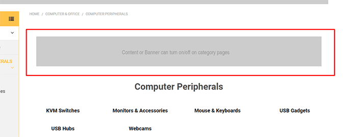

import { CategoryTopBannerBuilderComponent } from '@tvlgiao/bc-supermarket-builder-components'

# Category Page

## Content Top Banner

You can enable this banner on all category pages in **Theme Editor** > **Banners** > **Top banner on category page** set to `Show`.

After enabled, you can edit the banner content by go to **Marketing** > **Banners**, click button **Create a Banner**. click button **Create a Banner**. In **Banner Content**, click `HTML` button to open **HTML Source Editor**.

Use the editor below to generate HTML. Click **Export HTML** button, copy & paste the generated HTML to **HTML Source Editor**.

<CategoryTopBannerBuilderComponent />

Choose other options:

- __Show on Page__: `Search Results Page`
- __Visible__: Yes
- __Location__: `Top of Page`

## Bulk Order feature

This feature allows to display products in any category as table layout. Customer can quickly choose and add the selected products to cart at the same time. It's ideal for wholesale and large stores. 

Enable it in **Theme Editor** > **Products** > **Category pages** > tick on **Show bulk order mode**.

To display Bulk Order layout for a specific category, edit the category and choose **Template Layout File** = `bulk-order`.

## Search in Category feature

This feature allows to quickly search products on the current category. 

Enable this feature in **Theme Editor** > **Products** > **Category page** > **Show quick search in category** = `Show`.

## Sub-Category Thumbnails

Theme supports displaying sub-category thumbnails. Enable this feature in **Theme Editor** > **Products** > **Category pages**, tick **Show subcategories grid**. The thumbnails are the sub-category images.

If you only use the category images for these thumbnails, and hide it on the category pages, see the instruction [Hide the category images on category pages](/faqs#hide-the-category-images-on-category-pages)
