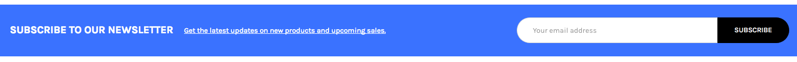
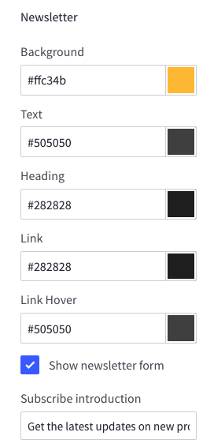
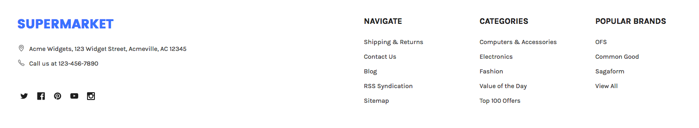
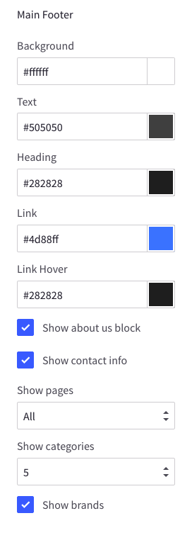

# Footer

## Newsletter

You can configure the newsletter block, show/hide or change colors in __Theme Editor__ > __Footer__ > __Newsletter__:

## Links

You can change colors in __Theme Editor__ > __Footer__:

You can also show/hide About Us block, Pages, Categories, Brands, or configure number of links to show.

## Payment Icons

To show/hide the payment icons, go to __Theme Editor__ > __Payment Icons__ seciton, tick on any icons you want to show.

## Credit Links

To show/hide the credit links, go to **Theme Editor** > __Footer__ section, tick on the checkboxes as showing above.

