import {
    LeftHeaderContentBuilderComponent,
    RightHeaderContentBuilderComponent,
    BannerBelowHeaderBuilderComponent,
    ThreeBannersBelowHeaderBuilderComponent
} from '@tvlgiao/bc-supermarket-builder-components'


# Header

## Header Styles

Theme supports 3 different header styles:

- Logo at left
- Logo at center
- Logo at right

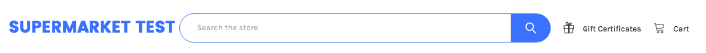

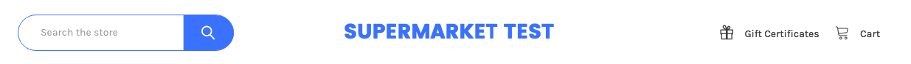

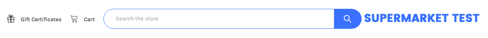

To configure it, open the __Theme Editor__, scroll down to __Logo__ section, click to expand Logo options, choose __Logo position__ as you wish.

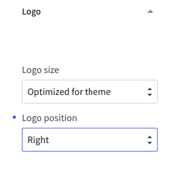


## Welcome Text

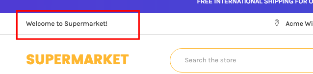

The welcome text can be showed in __Theme Editor__ > __Header__ > tick on __Show welcome text__

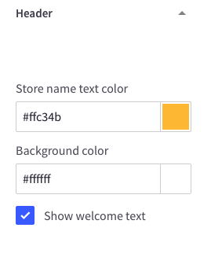

You can edit the text in the language file `lang/en.json` in __Edit Theme Files__:

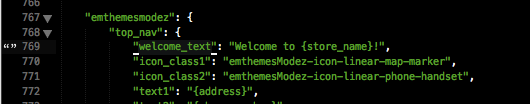


## Phone Number & Store Address

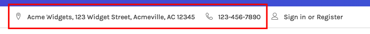

Your store address and phone number are pulled out from **Store Profile**. You can edit it in __Store Setup__ > __Store Profile__:

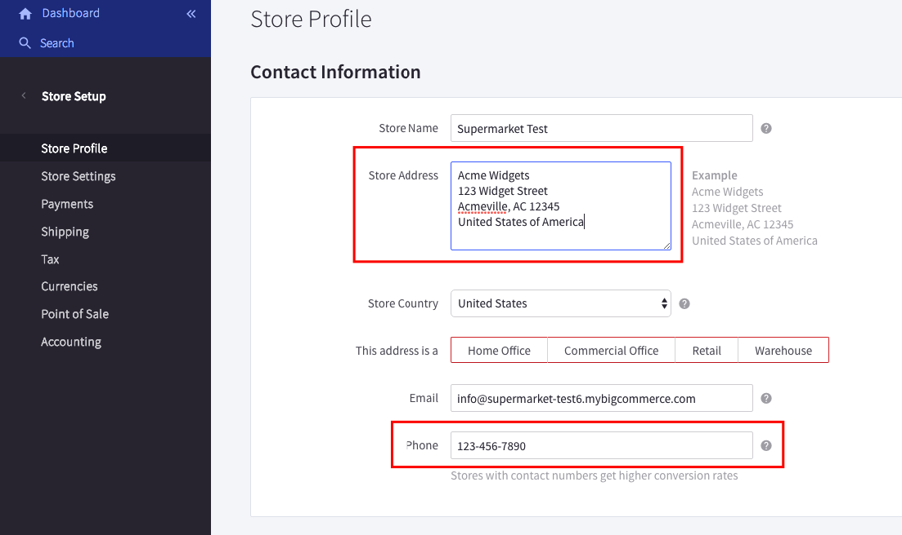


## Promotion content on the header left

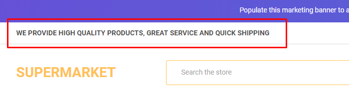

To display the custom text at this position, go to **Theme Editor** > **Header**, tick on **Show custom content after welcome text**, save & publish:

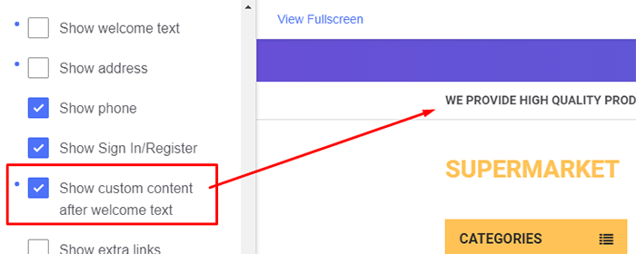

Then create a new banner content in **Marketing** > **Banners** as below screenshot:

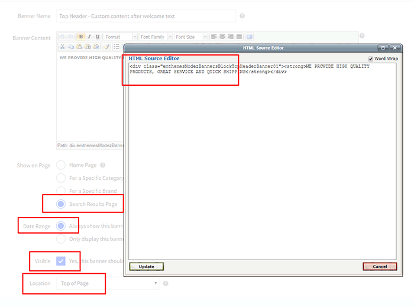

**Banner Content**: Click the **HTML** button to open **HTML Source Editor**.

Use the editor below to generate HTML. Click **Export HTML** button, copy & paste the generated HTML to **HTML Source Editor**.

<!-- <SupermarketTopHeaderBanner01 /> -->

<LeftHeaderContentBuilderComponent />

_**Note:** DO NOT remove `emthemesModezBannersBlockTopHeaderBanner01`._

- **Show on Page**: `Search Results Page`
- **Location**: `Top of Page`


## Custom Links on the header right

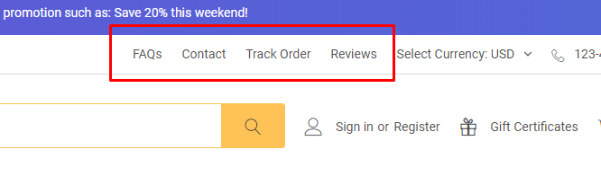

To display the custom links at this position, go to **Theme Editor** > **Header** > **Top Bar**, tick on **Show extra links**, save & publish:

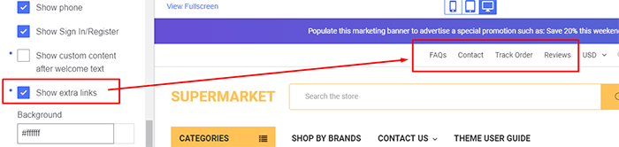

Then create a new banner content in **Marketing** > **Banners** as showing below:

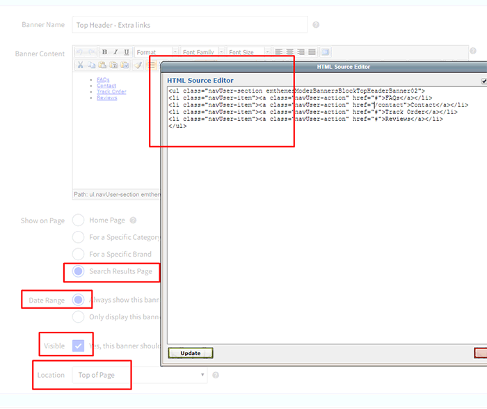

**Banner Content**: Click to the **HTML** button to open **HTML Source Editor**.

Use the editor below to generate HTML. Click **Export HTML** button, copy & paste the generated HTML to **HTML Source Editor**.

<!-- <SupermarketTopHeaderBanner02 /> -->

<RightHeaderContentBuilderComponent />

_**Note:** DO NOT remove `emthemesModezBannersBlockTopHeaderBanner02`._

- **Show on Page**: `Search Results Page`
- **Location**: `Top of Page`


## Social Media Icons

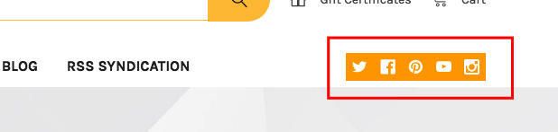

The social media icons group can be turned on/off in __Theme Editor__ > __Social Media Icons__ > __Placement__ > __Top/Right__:

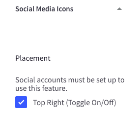

To configure your social media links, go to __Storefront Design__ > __Design Options__ > __Social Media__ section:

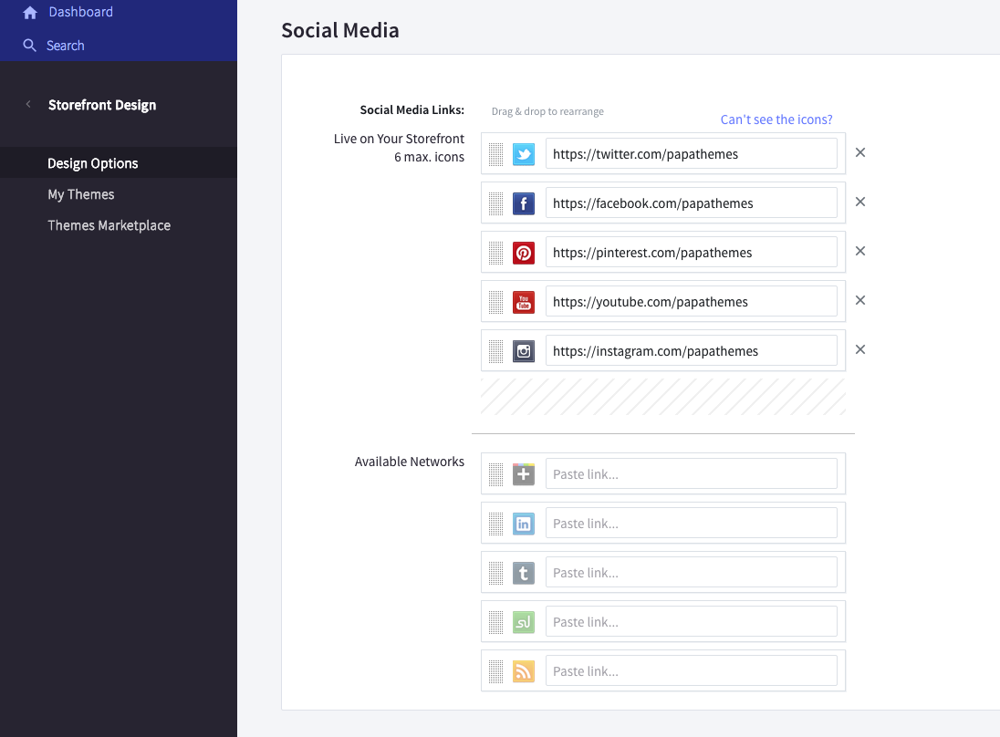


## Colors Customization

To customize the header's colors, find the options showing below in Theme Editor:

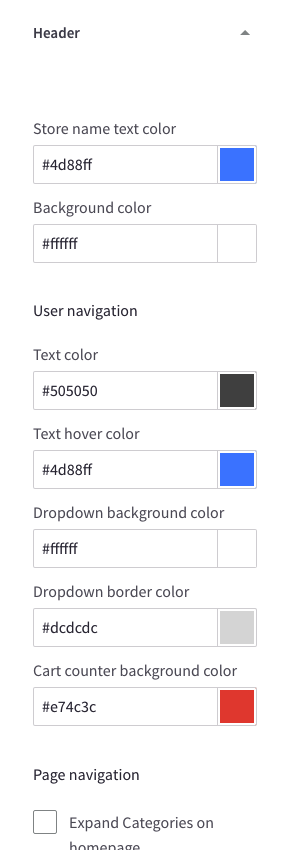


## Banner below Header

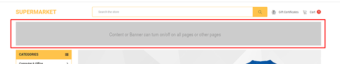

You can enable this banner across all pages or on all other pages except Home Page in **Theme Editor** > **Banners** > **Banner after header**:

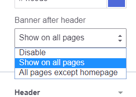


After enabled, you can edit banner content by go to **Marketing** > **Banners**, click **Create a Banner** button. Input the fields as below:

- __Banner Name__: whatever.
- __Banner Content__: click the **HTML** button to open **HTML Source Editor**.

Use the editor below to generate HTML. Click **Export HTML** button, copy & paste the generated HTML to **HTML Source Editor**.

<BannerBelowHeaderBuilderComponent />

Remember to choose other fields as below:

- __Show on Page__: `Search Results Page`
- __Visible__: Checked
- __Location__: `Top of Page`


## 3 offer banners below the header

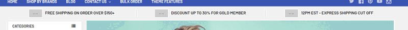

Go to **Theme Editor** > **Banners** > **Banner after header** > choose **Show on all pages**.

Create a new banner in **Marketing** > **Banners**, In the content editor, click HTML button to open **HTML Source Editor**.

Use the editor below to generate HTML. Click **Export HTML** button, copy & paste the generated HTML to **HTML Source Editor**.

<ThreeBannersBelowHeaderBuilderComponent />

Choose other fields as below:

- __Show on Page__: `Search Results Page`
- __Visible__: Checked
- __Location__: `Top of Page`


## Quick Search - Keyword Suggestions

The keyword suggestions feature enhances the search experience by displaying popular keyword suggestions when users interact with the search box. This feature includes autocomplete functionality similar to Google Search and keyboard navigation support.

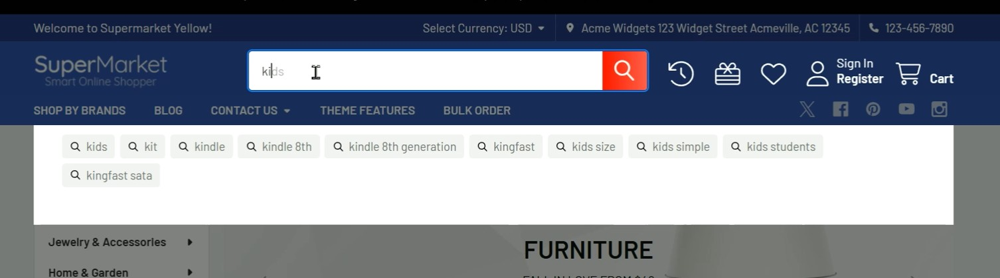

### Quick Start

1. **Generate keywords**:
   - Go to **[BC Tools](https://bc-tools.papathemes.com/)** and click **"Keyword Extractor"** menu item
   - Enter your store URL and extract keywords (includes free credits)
   - Download the generated CSV files

2. **Upload CSV files**:
   - Upload the downloaded files to BigCommerce WebDAV `/content/` folder
   - Or upload to your own server/CDN

3. **Enable feature**:
   - Go to **Theme Editor** > **Header** > **Quick search**
   - Enable **"Enable keyword suggestions"**
   - Configure the CSV file paths
   - Save & Publish

4. **Test**: Try searching on your storefront!

### Features

- **Smart Display**: Shows top 10 popular keywords when focusing on the search box
- **Realtime Filtering**: Updates suggestions as users type, matching keywords that start with the search query
- **Inline Autocomplete**: Like Google Search, displays suggested completion directly in the search input
  - Type "bo" → Shows "bo**ok**" with "ok" dimmed
  - Press Right Arrow (→) to accept and continue suggesting
- **Keyboard Navigation**:
  - `→` (Right Arrow): Accept autocomplete suggestion
  - `↑/↓`: Navigate between suggestions
  - `Enter`: Select highlighted suggestion
  - `Esc`: Clear selection and autocomplete
- **Responsive Design**: Adapts to mobile and desktop layouts
- **Smart Loading**: Uses lazy loading for optimal performance

### Configuration

#### Enable/Disable the Feature

Go to **Theme Editor** > **Header** > **Quick search** section:

1. Enable **Enable keyword suggestions** checkbox
2. Configure CSV file paths (see below)
3. Save & Publish

#### CSV File Configuration

You can specify up to 3 CSV files containing keywords:

- **Keywords file 1**: Single-word keywords (e.g., "laptop", "phone")
- **Keywords file 2**: Two-word keywords (e.g., "gaming laptop", "wireless mouse")
- **Keywords file 3**: Three+ word keywords (e.g., "best gaming laptop 2024")

**File Path Options:**

You can use either relative paths or full URLs:

```
Relative path: /content/suggest-keywords-1.csv
Full URL: https://example.com/data/suggest-keywords-1.csv
```

**Note about Lazy Loading:**
- If **any** file uses a relative path, CSV files load only when users focus on search (lazy loading) - except on the search page where they load immediately
- If **all** files use full URLs, CSV files load immediately on page load
- Lazy loading reduces traffic since BigCommerce servers don't support browser cache headers

#### To Disable

**Method 1**: Uncheck "Enable keyword suggestions" in Theme Editor

**Method 2**: Leave all 3 file paths empty

### CSV File Format

Each CSV file should have 2 columns **without a header row**:

1. **Keyword** (text)
2. **Rank** (number - **higher rank = better match, higher priority**)

**Example CSV file:**

```csv
laptop,80000
phone,70000
tablet,60000
computer,50000
monitor,40000
```

**Important:** Higher rank numbers mean the keyword will appear first in suggestions. Keywords are sorted by rank in descending order.

### Creating CSV Files

#### Method 1: Use the Keyword Extractor Tool (Recommended)

The easiest way to create keyword CSV files is to use our **Keyword Extractor** tool:

**Step-by-step instructions:**

1. **Open BC Tools**:
   - Go to **[https://bc-tools.papathemes.com/](https://bc-tools.papathemes.com/)**
   - Click on the **"Keyword Extractor"** menu item to access the tool

2. **Extract Keywords**:
   - Enter your BigCommerce store URL in the input field
   - Click the extract button
   - The tool will automatically analyze your store's products and extract relevant keywords
   - Keywords will be organized by word count with appropriate rank values

3. **Download CSV Files**:
   - Once extraction is complete, download the generated CSV files
   - You'll typically get 3 files:
     - `suggest-keywords-1.csv` (single-word keywords)
     - `suggest-keywords-2.csv` (two-word keywords)
     - `suggest-keywords-3.csv` (three+ word keywords)

4. **Upload to Your Store**:
   - **Option A - Upload to BigCommerce WebDAV**:
     - Connect to your store via WebDAV
     - Create a `/content/` folder if it doesn't exist
     - Upload the 3 CSV files to `/content/` folder

   - **Option B - Upload to Your Own Server/CDN**:
     - Upload the CSV files to your own hosting/CDN
     - Use the full URLs in Theme Editor settings (e.g., `https://yourdomain.com/keywords/suggest-keywords-1.csv`)

5. **Configure in Theme Editor** (see Configuration section above)

This tool analyzes your actual product data and generates keyword suggestions with appropriate rank values automatically.

**Note:** The Keyword Extractor tool includes a few free credits to extract keywords. If you need to extract more keywords beyond the free credits, you'll need to purchase additional credits.

#### Method 2: Create Manually

If you prefer to create CSV files manually:

1. **Create the CSV files** on your computer using the format above
2. Use a spreadsheet program (Excel, Google Sheets) or text editor
3. Save as CSV format with 2 columns: keyword, rank (no header row)
4. Name your files:
   - `suggest-keywords-1.csv` (single-word keywords)
   - `suggest-keywords-2.csv` (two-word keywords)
   - `suggest-keywords-3.csv` (three+ word keywords)

**Then upload using one of these options:**

- **Upload to BigCommerce WebDAV**:
  - Connect to your store via WebDAV
  - Create a `/content/` folder if it doesn't exist
  - Upload the 3 CSV files to the `/content/` folder
  - Use relative paths in Theme Editor: `/content/suggest-keywords-1.csv`

- **Upload to Your Own Server/CDN**:
  - Upload to your hosting or CDN service
  - Use full URLs in Theme Editor: `https://yourdomain.com/keywords/suggest-keywords-1.csv`

After uploading, configure the file paths in **Theme Editor** > **Header** > **Quick search** section.

**Sample Data (based on actual demo data):**

**suggest-keywords-1.csv** (single words):
```csv
set,80023
usb,70042
travel,70002
new,60028
wireless,60016
original,60007
fashion,60004
men,60000
high,50044
bag,50013
phone,45000
laptop,40000
tablet,35000
computer,30000
monitor,25000
keyboard,20000
mouse,15000
camera,12000
watch,10000
shoes,8000
```

**suggest-keywords-2.csv** (two words):
```csv
micro sd,30007
high heels,30000
sd card,20010
card reader,20008
memory card,20007
gaming laptop,18000
wireless mouse,16000
bluetooth headphone,14000
mechanical keyboard,12000
usb cable,10000
running shoes,8000
smart watch,7000
leather bag,6000
phone case,5000
laptop stand,4000
```

**suggest-keywords-3.csv** (three+ words):
```csv
micro sd card,20006
breathable mesh men,20000
cotton baby hat,10001
baby hat scarf,10001
gaming laptop 2024,9000
wireless gaming mouse,8000
noise cancelling headphone,7000
mechanical keyboard rgb,6000
fast charging cable,5000
leather travel bag,4000
running shoes men,3000
smart watch women,2500
phone case clear,2000
laptop stand adjustable,1500
```

**Live Examples:** You can download actual working CSV files from the demo site:
- [suggest-keywords-1.csv](http://supermarket-yellow-demo.mybigcommerce.com/content/suggest-keywords-1.csv)
- [suggest-keywords-2.csv](http://supermarket-yellow-demo.mybigcommerce.com/content/suggest-keywords-2.csv)
- [suggest-keywords-3.csv](http://supermarket-yellow-demo.mybigcommerce.com/content/suggest-keywords-3.csv)

### How It Works

1. **On Page Load**:
   - If using full URLs: CSV files load with low priority (doesn't block page)
   - If using relative paths: Waits until user focuses on search box (or on search page)

2. **On Search Focus**: Displays top 10 keywords sorted by rank

3. **While Typing**:
   - Filters keywords that **start with** the typed text
   - Shows inline autocomplete suggestion (first match)
   - Updates in realtime (debounced 100ms)

4. **Selecting Keyword**: Fills the search box and triggers quick search

### Advanced Configuration

For advanced users who want to use external CDN or customize file paths, you can:

1. Upload CSV files to your own CDN
2. Use full URLs in the Theme Editor settings
3. This enables immediate loading with browser caching support

**Example with CDN:**
```
Keywords file 1: https://cdn.yourstore.com/keywords/single-words.csv
Keywords file 2: https://cdn.yourstore.com/keywords/two-words.csv
Keywords file 3: https://cdn.yourstore.com/keywords/three-words.csv
```

### Tips for Best Results

1. **Use the Keyword Extractor Tool**: Start with our **[Keyword Extractor](https://bc-tools.papathemes.com/)** to automatically generate keywords from your actual products - this is the fastest and most accurate way
2. **Rank Keywords by Popularity**: Assign higher rank numbers to more popular search terms (e.g., "laptop,80000" appears before "mouse,15000")
3. **Use Meaningful Rank Gaps**: Leave gaps between ranks (e.g., 80000, 70000, 60000) so you can easily insert new keywords later
4. **Organize by Word Count**: Use the 3 files to separate keywords by length for better matching:
   - File 1: Single words ("laptop", "phone")
   - File 2: Two words ("gaming laptop", "wireless mouse")
   - File 3: Three+ words ("best gaming laptop 2024")
5. **Base on Search Analytics**: Use your store's actual search data to identify popular keywords
6. **Update Regularly**: Refresh your keyword lists based on seasonal trends and new products
7. **Start Small**: Begin with 20-30 keywords per file and expand as needed
8. **Test Thoroughly**: After uploading CSV files, test on different devices to ensure smooth performance
9. **Match Your Products**: Include keywords that actually match products in your store
