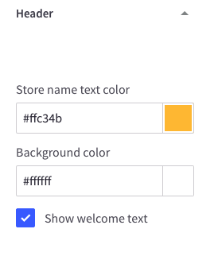
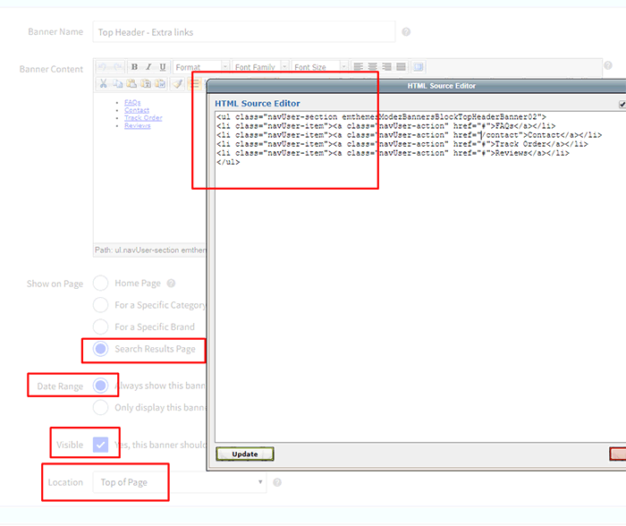
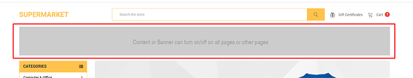
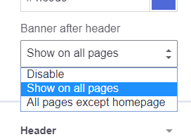

import {
    LeftHeaderContentBuilderComponent,
    RightHeaderContentBuilderComponent,
    BannerBelowHeaderBuilderComponent,
    ThreeBannersBelowHeaderBuilderComponent
} from '@tvlgiao/bc-supermarket-builder-components'

# Header

## Header Styles

Theme supports 3 different header styles:

- Logo at left
- Logo at center
- Logo at right

To configure it, open the __Theme Editor__, scroll down to __Logo__ section, click to expand Logo options, choose __Logo position__ as you wish.

## Welcome Text

The welcome text can be showed in __Theme Editor__ > __Header__ > tick on __Show welcome text__

You can edit the text in the language file `lang/en.json` in __Edit Theme Files__:

## Phone Number & Store Address

Your store address and phone number are pulled out from **Store Profile**. You can edit it in __Store Setup__ > __Store Profile__:

## Promotion content on the header left

To display the custom text at this position, go to **Theme Editor** > **Header**, tick on **Show custom content after welcome text**, save & publish:

Then create a new banner content in **Marketing** > **Banners** as below screenshot:

**Banner Content**: Click the **HTML** button to open **HTML Source Editor**.

Use the editor below to generate HTML. Click **Export HTML** button, copy & paste the generated HTML to **HTML Source Editor**.

<!-- <SupermarketTopHeaderBanner01 /> -->

<LeftHeaderContentBuilderComponent />

_**Note:** DO NOT remove `emthemesModezBannersBlockTopHeaderBanner01`._

- **Show on Page**: `Search Results Page`
- **Location**: `Top of Page`

## Custom Links on the header right

To display the custom links at this position, go to **Theme Editor** > **Header** > **Top Bar**, tick on **Show extra links**, save & publish:

Then create a new banner content in **Marketing** > **Banners** as showing below:

**Banner Content**: Click to the **HTML** button to open **HTML Source Editor**.

Use the editor below to generate HTML. Click **Export HTML** button, copy & paste the generated HTML to **HTML Source Editor**.

<!-- <SupermarketTopHeaderBanner02 /> -->

<RightHeaderContentBuilderComponent />

_**Note:** DO NOT remove `emthemesModezBannersBlockTopHeaderBanner02`._

- **Show on Page**: `Search Results Page`
- **Location**: `Top of Page`

## Social Media Icons

The social media icons group can be turned on/off in __Theme Editor__ > __Social Media Icons__ > __Placement__ > __Top/Right__:

To configure your social media links, go to __Storefront Design__ > __Design Options__ > __Social Media__ section:

## Colors Customization

To customize the header's colors, find the options showing below in Theme Editor:

## Banner below Header

You can enable this banner across all pages or on all other pages except Home Page in **Theme Editor** > **Banners** > **Banner after header**:

After enabled, you can edit banner content by go to **Marketing** > **Banners**, click **Create a Banner** button. Input the fields as below:

- __Banner Name__: whatever.
- __Banner Content__: click the **HTML** button to open **HTML Source Editor**.

Use the editor below to generate HTML. Click **Export HTML** button, copy & paste the generated HTML to **HTML Source Editor**.

<BannerBelowHeaderBuilderComponent />

Remember to choose other fields as below:

- __Show on Page__: `Search Results Page`
- __Visible__: Checked
- __Location__: `Top of Page`

## 3 offer banners below the header

Go to **Theme Editor** > **Banners** > **Banner after header** > choose **Show on all pages**.

Create a new banner in **Marketing** > **Banners**, In the content editor, click HTML button to open **HTML Source Editor**.

Use the editor below to generate HTML. Click **Export HTML** button, copy & paste the generated HTML to **HTML Source Editor**.

<ThreeBannersBelowHeaderBuilderComponent />

Choose other fields as below:

- __Show on Page__: `Search Results Page`
- __Visible__: Checked
- __Location__: `Top of Page`

