import * as sbc from '@tvlgiao/bc-supermarket-builder-components'

# Home Page

## Rearrange Home Page Sections

The home page content is divided into sections. You can show or hide any section or rearrange the sections' order in **Theme Editor** > **Home Page** > **Sections**.

### Tutorial video

Watch this video for how to hide and rearrange the sections' order.

<iframe width="560" height="315" src="https://www.youtube.com/embed/0wILFdym2M4" frameborder="0" allow="accelerometer; autoplay; encrypted-media; gyroscope; picture-in-picture" allowfullscreen></iframe>

## Home Page Carousels

### Edit the carousel

Edit the home page carousel in __Storefront Design__ > __Design Options__:

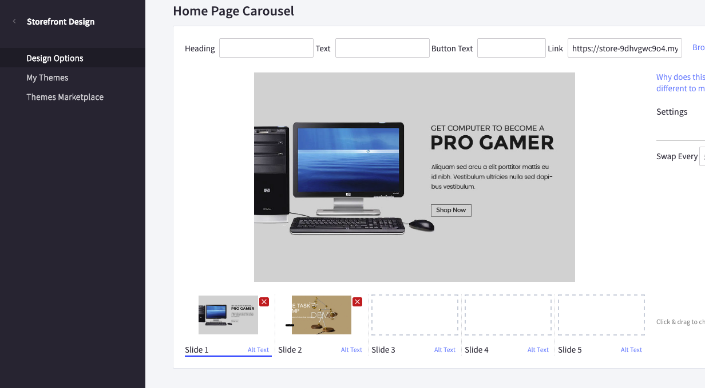

### Colors customization

To customize the carousel colors, find __Carousel__ section in the Theme Editor:

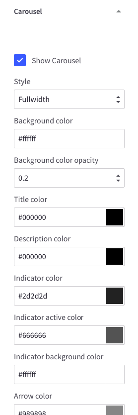

### Hide the carousel

To hide the main carousel on Home Page, uncheck __Show Carousel__ checkbox in __Carousel__ section of Theme Editor.

### Show videos on the carousel

To display YouTube videos on Home Page Carousel, go to **Theme Editor** > **Carousel** > input your _YouTube video ID_ in the input fields as showing below:

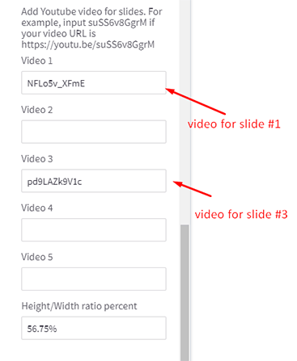

**Video 1** will be put on the first slide, **Video 3** will be put on the 3rd slide and so on.

**_Note: you much upload images on the slides at position 1 and position 3 in order to display videos on these slides._**

Example how to display videos on slide 1 and slide 3:

**Height/Width ratio percent** is percent of your video height divide width, for example the size of video is 1920x1080, then input `56.25%` into this field.

## 2 banners beside the carousel

Enable in **Theme Editor** > **Carousel** > tick on **Enable side banners?**.

In **Marketing** > **Banners**, click button **Create a Banner**. In **Banner Content** box, click the square `HTML` button to open **HTML Source Editor**.

Use the editor below to generate HTML. Click **Export HTML** button, copy & paste the generated HTML to **HTML Source Editor**.

<sbc.CarouselSideBannerBuilderComponent />

Choose other options:

- **Show on page**: `Home Page`
- **Location**: `Top of Page`

## 3 Banners on Home Page

To show these banners on homepage, go to __Marketing__ > __Banners__ > click __Create a Banner__ button. In __Banner Content__ editor, click **HTML** button to open __HTML Source Editor__.

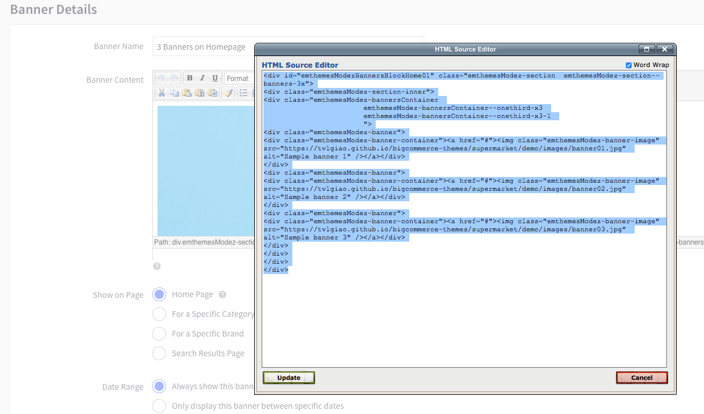

Use the editor below to generate HTML. Click **Export HTML** button, copy & paste the generated HTML to **HTML Source Editor**.

<sbc.HomeThreeBannersBuilderComponent />

Choose other options:

- __Show on Page__ = `Home Page`
- __Location__ = `Top of Page`

Click __Save__ button to finish.

You can freely edit the HTML above to change banner images or links but keep the HTML attribute `id="emthemesModezBannersBlockHome01"` unchanged.

### Tutorial video

Watch the video below for step by step instruction:

<iframe width="560" height="315" src="https://www.youtube.com/embed/Yp0NXGn9lBY" frameborder="0" allow="accelerometer; autoplay; encrypted-media; gyroscope; picture-in-picture" allowfullscreen></iframe>

## Featured / Bestselling / New  Products Tabs

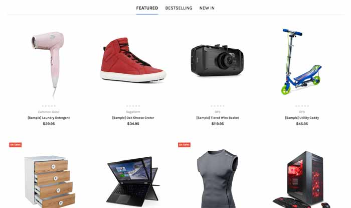

You can configure this section in __Theme Editor__ > __Homepage__:

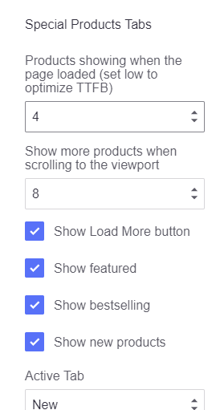

### Optimize for loading speed

Showing many products may affects to your website loading speed. In order to optimize the loading speed (TTFB - Time to first byte) while still loading many products, you can configure value of **Show more products when the page loaded** lower, for example `4` and set **Show more products when scrolling to the viewport** higher, for example `8`. As a result, when opening the home page, 4 products will be displayed immediately, when scrolling down to this section, additional 8 products will be loaded and displayed next.

In addition, **Show Load More button** option allows displaying a Load More button that when clicked will load and display more products. The maximium number of products that can be displayed is 25 for new products, 100 for bestselling and featured.

## Products By Categories

This section will show products organized categories. You can choose number of categories to display products. Categories are sorted by the order specified in __Product Categories__ in admin manager.

### Configuration 

To configure this section, go to __Theme Editor__ > __Homepage__ > __Products by Category with Sorting Tabs__:

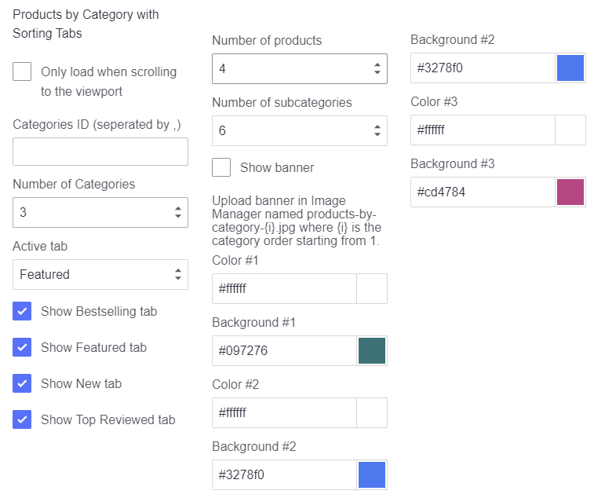

### Optimize for execution time

By default, all products will be loaded and displayed when opening the page. At a result, it takes a longer execution time that can affect your site's Page Speed score. To avoid this, you can select **Only load when scrolling to the viewport** option, the products won't loaded until user scrolls down to this area.

### Specify which categories to display

By default, the product categories displayed are the top categories in the order in which they are sorted on the main navigation. You can limit number of categories to display by setting **Number of Categories** option. 

You can manually specify which categories should be displayed by setting the categories ID to **Category ID** box, separated by comma. For example: `200,221,254,275`. Check instruction [How to find the category ID](https://solidcommerce.zendesk.com/hc/en-us/articles/215722843-Finding-Bigcommerce-Category-Names-and-ID-Numbers#automark4). Note that **Number of Categories** will be ignored if you choose to display categories manually.

### Show Banner per Category

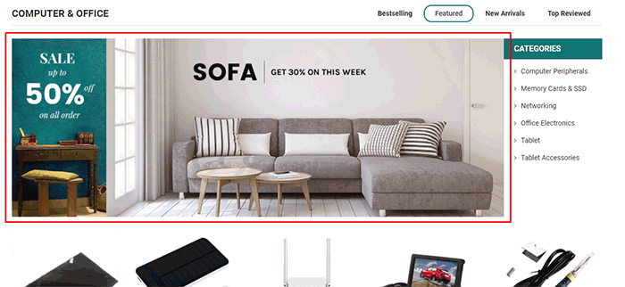

To show the banner image per products by category block, tick on option **Show banner** in **Theme Editor** > **Homepage** > **Products by Category with Sorting Tabs**:

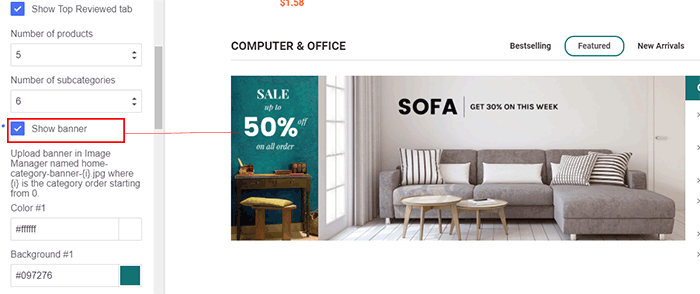

Then go to **Storefront** > **Image Manager**, upload your banner image with name following this rule: `products-by-category-{i}` where `{i}` is replaced by category order starting from 1. The banner image format must be **jpg**, it means the image on your computer must be `products-by-category-1.jpg` if it's used for the first category. All letters must be lower case.

**Watch this tutorial video:**

<iframe width="560" height="315" src="https://www.youtube.com/embed/0cWTw4xr_w0" frameborder="0" allow="accelerometer; autoplay; encrypted-media; gyroscope; picture-in-picture" allowfullscreen></iframe>

### Hot Categories

__Hot Categories__ appears on the right is the sub-categories of the current category.

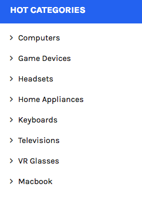

### Display featured product items

To show products sorted by _Featured_, edit the products, change the **Sort Order** value to smaller than others. By default, Sort Order value is 0, therefore you need to update the products you want to display by featured order a smaller value, negative number also works well.

Please note that products by category sorted by _featured item_ are different than **featured products**. Your featured products (which are marked stars) won't show here if the **Sort Order** value is not set correctly.

**Watch this video for step by step instruction:**

<iframe width="560" height="315" src="https://www.youtube.com/embed/lV931JCfvEc" frameborder="0" allow="accelerometer; autoplay; encrypted-media; gyroscope; picture-in-picture" allowfullscreen></iframe>

## Top Categories

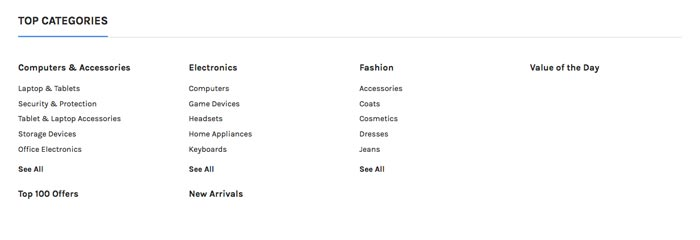

This block show top categories and its sub-categories sorted by the order set in Product Categories manager.

### Configuration 

You can configure number of categories to display in __Theme Editor__ > __Homepage__ > __Top Categories__:

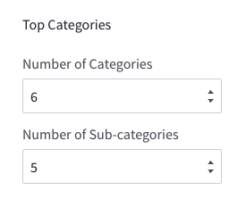

### Show Thumbnails

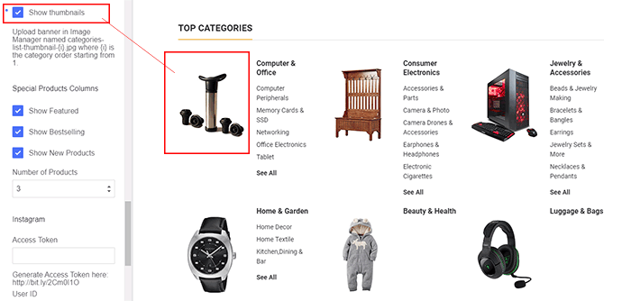

To show thumbnail images beside each category, tick on **Show thumbnails** in **Theme Editor** > **Homepage** > **Top Categories Of This Month**.

Then go to **Storefront** > **Image Manager**, upload your thumbnail images with appropriated name: `categories-list-thumbnail-{i}` where `{i}` is replaced by category order starting from 1. The thumbnail image format must be **jpg**, it means the image on your computer must be `categories-list-thumbnail-1.jpg` if it's used for the first category. All letters must be lower case.

## Fullwidth Banner on Home Page

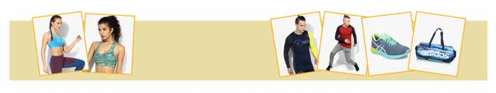

To show this banner on Home Page, Go to __Marketing__ > __Banners__ > click __Create a Banner__ button. In __Banner Content__ editor, click **HTML** button to open __HTML Source Editor__.

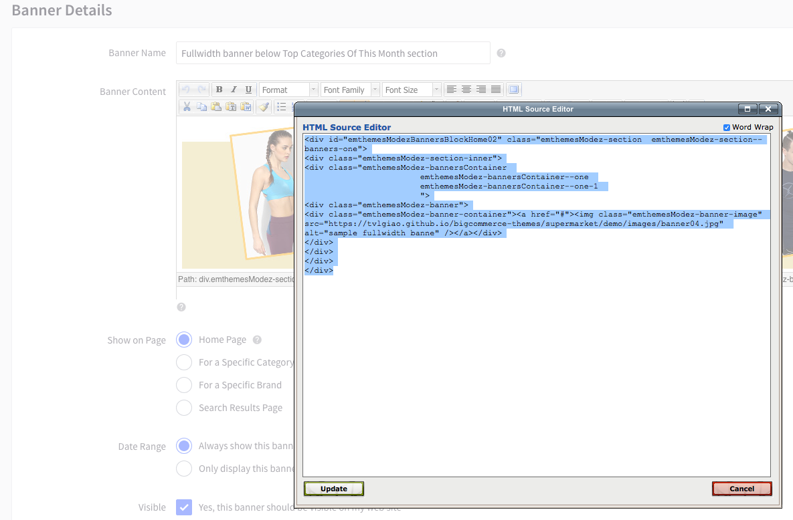

Use the editor below to generate HTML. Click **Export HTML** button, copy & paste the generated HTML to **HTML Source Editor**.

<sbc.HomeFullwidthBannerBuilderComponent />

Choose other options:

- __Show on Page__ = `Home Page`
- __Location__ = `Top of Page`

Click __Save__ button to finish.

You can freely edit the HTML code above to change banner images or links but keep the HTML attribute `id="emthemesModezBannersBlockHome02"` unchanged.

## Brand Carousel

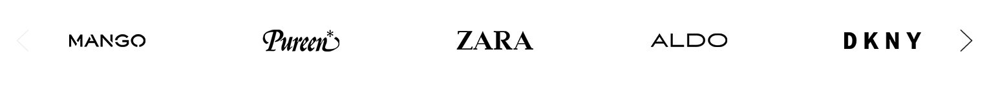

To show this carousel on Home Page, go to __Marketing__ > __Banners__ > click __Create a Banner__ button. In __Banner Content__ editor, click **HTML** button to open __HTML Source Editor__.

Use the editor below to generate HTML. Click **Export HTML** button, copy & paste the generated HTML to **HTML Source Editor**.

<sbc.HomeBrandCarouselBuilderComponent />

Then click __Update__ button to go back the previous screen.

- __Show on Page__ = `Home Page`
- __Location__ = `Top of Page`

Click __Save__ button to finish.

You can freely edit the HTML above to change banner images or links but keep the HTML attribute `id="emthemesModezBannersBlockHome03"` unchanged.

## Special Products Columns

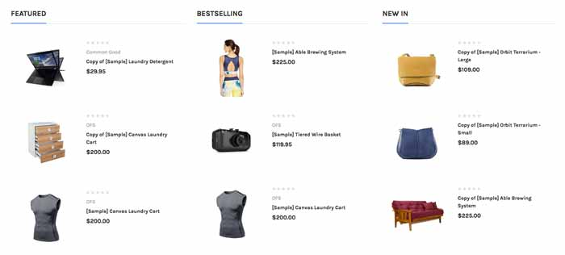

This section shows bestselling products, featured products and new products in 3 columns.

You can configure this section in **Theme Editor** > **Homepage** > **Special Products Columns**:

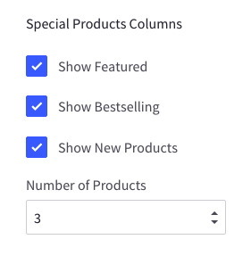

## Recent Posts

To show Recent Posts section on Home Page, go to **Theme Editor** > **Homepage** > set **Recent blog posts** = number of posts to show up.

## Instagram

To show your Intagram photos on Home Page, go to **Theme Editor** > **Homepage** > **Instagram**, input your **Access Token** code and **User ID**.

- To retrieve your Access Token, use this tool <http://bit.ly/2Cm0I1O>
- To retrieve your User ID, use this tool <http://bit.ly/2Et7ULx>

Choose **Number of photos** to show up.

## Newsletter Popup

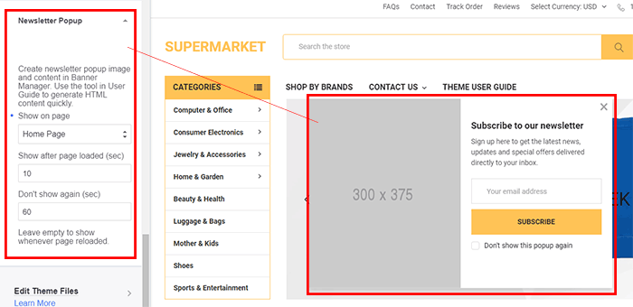

To configure Newsletter Popup, go to **Theme Editor** > **Newsletter Popup**.

To edit the popup content, create a new banner in **Marketing** > **Banners**, click button **Create a Banner**. In **Banner Content** box, click the square `HTML` button to open **HTML Source Editor**.

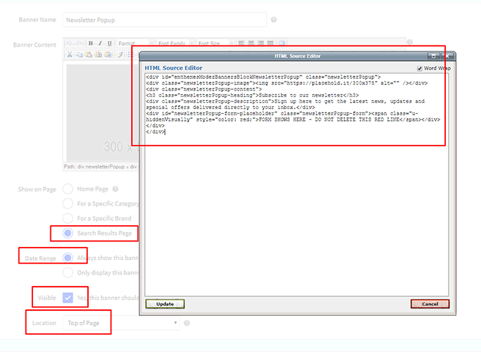

Use the editor below to generate HTML. Click **Export HTML** button, copy & paste the generated HTML to **HTML Source Editor**.

<sbc.NewsletterPopupBuilderComponent />

Choose other options:

- **Show on Page**: `Search Results Page`
- **Location**: `Top of Page`

