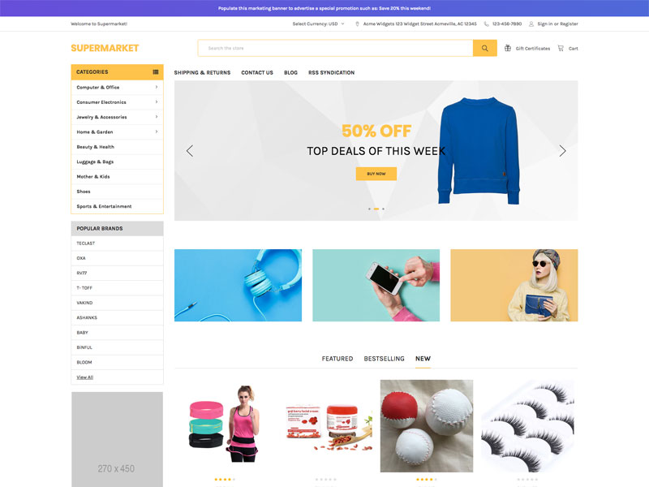

# Layout

Theme supports 2 different layouts across the entire site:

1. **Fixed Left Sidebar layout** - Sidebar always appears on most of pages.
2. **Default layout** - Sidebar appears only on the pages required, such as category pages, brands, search pages.

You can configure the layout in **Theme Editor** > **Global** > **Layout**:

