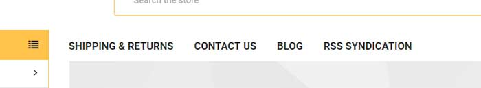

import { SupermarketStaticNavPages } from '../../components/SupermarketStaticNavPages'
import { MenuBuilderComponent } from '@tvlgiao/bc-supermarket-builder-components'

# Main Navigation



The main navigation automatically shows your web page links if it's visible.

You can show or hide the web page links, or just show some custom links or custom text by editing the options in Theme Editor in **Theme Editor** > **Header** > **Page Navigation**:


- **Hide Content Pages in Main Menu**: if checked, it will hide all web page links completely.
- **Use manual links in Main Menu**: if checked, it will allow you to show custom links or custom text by creating a specific banner in **Marketing** > **Banners**. Use the tool below to generate banner HTML code with your custom links.


## Vertical Mega Menu vs. Slide Down Menu

**Note: the slide-down menu only works with the `Fixed Left Sidebar` layout.**


**Mega Menu**:


**Slide Down Menu**:


You can switch the mega menu to slide down menu in **Theme Editor** > **Header** > tick to **Showing sub-categories vertical**:


## Show all top categories menu horizontally


To display all top categories menu horizontally instead of displaying in the dropdown "Categories" item, go to **Theme Editor** > **Header** > **Main navigation** > set **Show categories** = `Horizontal`.


## Use flyout menu


Enable in **Theme Editor** > **Header** > **Main navigation** > tick on **Use flyout menu instead of mega menu**.


## Show custom links in Main Navigation

Theme allows you to input your custom links manually in the main navigation area. First, tick on **Use manual links in Main Menu** checkout in **Theme Editor**.

Go to **Marketing** > **Banners**, click **Create a Banner** button. In **Banner Content** field, click on **HTML** button to open **HTML Source Editor**, input the sample content below:

<SupermarketStaticNavPages />

Remember to choose other fields as below:

- __Show on Page__: `Search Results Page`
- __Visible__: Checked
- __Location__: `Top of Page`


## Show banners on Mega Menu


You can show custom banners on Mega Menu. Enable this feature in **Theme Editor** > **Header** > **Main Navigation** > tick on **Show banners on Mega Menu**. Click **Save** then **Publish**.

Then go to **Marketing** > **Banners**, click **Create a Banner** button. In Banner Content editor, click on small **HTML** button to open **HTML Source Editor**.

Use the editor below to generate HTML. Click **Export HTML** button, copy & paste the generated HTML to **HTML Source Editor**.

<!-- <SupermarketMegaMenu /> -->
<MenuBuilderComponent />

Remember to choose:

- **Show on Page** = `Search Results Page`
- **Visible** = Yes
- **Location** = `Top of Page`


## Limit number of sub categories in the mega menu with View All link


Go to **Storefront** > **Script Manager**, click **Create a Script**, choose:

- **Location on page** = `Footer`
- **Select pages where script will be added** = `All Pages`
- **Script type** = `Script`

Enter the script below to **Scripts contents**: 

```html
<script>
    (function($) {
        var MAX_ITEMS = 5;
        var MORE_TEXT = 'View All';
        var LESS_TEXT = 'Collapse';

        
        $('<style/>').html(''
            + '@media (max-width: 800px) {'
            + '.navPage-childList-item--more, .navPage-childList-item--less { display: none }'
            + '}'
            + '@media (min-width: 801px) {'
            + '.navPage-childList-item--more a, .navPage-childList-item--less a { font-size: small; text-decoration: underline }'
            + '.navPage-childList-item--more.is-open { display: none }'
            + '.navPage-childList-item--more:not(.is-open) ~ .navPage-childList-item { display: none }'
            + '}')
            .appendTo('head');

        function ready() {
            $('.navPage-childList').each(function(i, el) {
                var $el =  $(el);
                if ($el.data('modShowMore')) {
                    return;
                }
                $el.data('modShowMore', true);
                if ($el.children().length > MAX_ITEMS) {
                    $('<li class="navPage-childList-item navPage-childList-item--more"><a class="navPage-childList-action navPages-action" href="#">' + MORE_TEXT + '</a></li>')
                        .insertAfter($el.children().eq(MAX_ITEMS));
                    $('<li class="navPage-childList-item navPage-childList-item--less"><a class="navPage-childList-action navPages-action" href="#">' + LESS_TEXT + '</a></li>')
                        .appendTo($el);

                    var $toggle = $el.children('.navPage-childList-item--more, .navPage-childList-item--less');
                    console.log($toggle.children('a'));
                    $toggle.children('a').on('click', function(event) {
                        event.preventDefault();
                        $toggle.toggleClass('is-open');
                    });
                }
            });
        }
        
        $(document).ready(ready);
        $('body').on('loaded.instantload', ready);
    })(window.jQuerySupermarket);
</script>
```

Edit `MAX_ITEMS`, `MORE_TEXT`, `LESS_TEXT` values to change the maximum number of subcategories to show, View All link text, and Collapse link text.


## Enable Main Navigation auto fit to a single line

This feature is added from version 1.6.2.

Go to **Theme Editor** > **Header** > **Main Navigation** > tick on **Fit to 1 line**

If the number of menu items is longer than one line, it will automatically group into a "More" menu item, as shown in the screenshot below:

