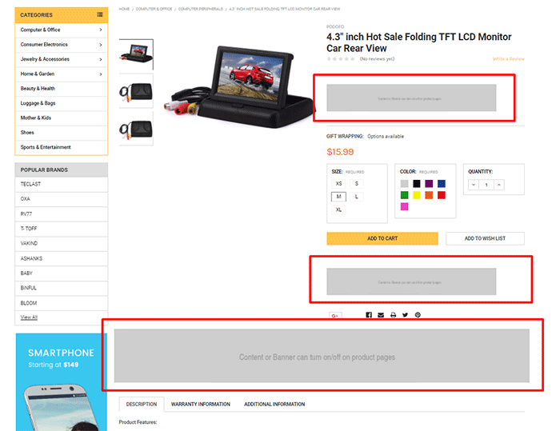
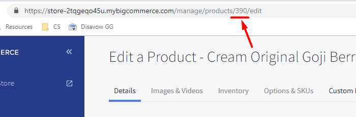

import * as sbc from '@tvlgiao/bc-supermarket-builder-components'

# Product Page


## Responsive main product images

To display the main product images automatically changing quality according to screen size, and especially displaying high quality images for retina displays, you can enable this feature in the **Theme Editor** > **Products** > **Product page** > tick on **Responsive main product images**.

**Note:** If your original image is larger than 10Mb or it's PNG format, you should NOT enable this feature because it will take more time to generate many different size images, which affect the speed of image display.


## Display Sale badget & custom badges


### Sale badges

You need to input both **Sale Price** and **Retail Price** of product:


In **Theme Editor** > **Products** > **Product Sale Badges**, choose to display product Sale badge:


### Custom Badges

To display the custom badges, enable **Custom Badges** option in **Theme Editor**. Edit your product, add a custom field with name = `__badge` and value is the custom badget content.


## Banners



Theme supports various banner positions on the product pages. You can enable it in **Theme Editor** > **Banners**:

- **Banner below ratings on product page**
- **Banner below Add To Cart button on product page**
- **Banner above description tabs on product page**


After enabled, you can edit the banner content by go to **Marketing** > **Banners**, click button **Create a Banner**. In **Banner Content**, click the square `HTML` button to open **HTML Source Editor**.

Use the editor below to generate HTML. Click **Export HTML** button, copy & paste the generated HTML to **HTML Source Editor**.

<sbc.ProductBannerBuilderComponent />

Choose other options:

- __Show on Page__: `Search Results Page`
- __Visible__: Yes
- __Location__: `Top of Page`


## Custom Tabs

To add the custom tabs and product pages, edit your product description, click on **HTML** button to open **HTML Source Editor**:


Use the editor below to generate HTML for your custom tabs. Click **Export HTML** button, copy & paste the generated HTML at the end of **HTML Source Editor**.

<sbc.ProductCustomTabsBuilderComponent />


## Frequently Bought Together


To display **Frequently Bought Together** feature, go to **Theme Editor** > **Products** > **Product Page** > **Show buy together**, choose position to display:


### Associate "bought together" products to a specific product

Then, edit a product, in **Custom Fields** tab, add some custom fields with name `__alsobought` and value is the "bought together" **product ID** you want to associate:


To find the **product ID**, edit the product, then look at the URL address box on your web browser, the number between `products/` and `/edit` is the product ID.




## Shipping Date Notification (BETA)


_**Warning: This feature is Beta testing. We do not guarantee with work as your expectation.**_

This notification displays estimated shipping automatically.

Enable **Banner below Add To Cart button on product page** in **Theme Editor** > **Banners**.

Next, create a banner in **Marketing** > **Banners**:


**Content:**

```html
<div id="emthemesModezBannersBlockAfterAddToCartButton" class="emthemesModezBannersBlockAfterAddToCartButton">
<div class="emthemesModez-section emthemesModez-section--banners-one">
<div class="emthemesModez-section-inner">
<div class="emthemesModez-bannersContainer emthemesModez-bannersContainer--one">
<div class="emthemesModez-banner">
<div class="emthemesModez-banner-container">
<p data-blackout-dates="02-05,03-01,05-02" data-deadline-time="13" data-shipping-day="2" data-time-offset="-5"><strong>Want it on <span data-shipping-date="dddd, MMM. d">***</span>?<br /></strong> Choose <strong>Priority Mail</strong> at checkout.</p>
</div>
</div>
</div>
</div>
</div>
</div>
```

- `data-blackout-dates="02-05,03-01,05-02"`: Configure backout dates of year
- `data-deadline-time="13"`: Configure deadline time when postal service is closed.
- `data-shipping-day="2"`: Configure shipping days.
- `data-time-offset="-5"`: Configure your time offset.
- `data-shipping-date="dddd, MMM. d"`: Configure print out date format.

_**Note:** Don't remove `emthemesModezBannersBlockAfterAddToCartButton`._

- **Show on Page**: `Search Results Page`
- **Location**: `Top of Page`


Next, insert the custom javascript below to **Storefront** > **Footer Scripts**:

```html
<script src="https://cdnjs.cloudflare.com/ajax/libs/datejs/1.0/date.min.js"></script>
<script>
// <!--
window.jQuerySupermarket(function(e){function t(){if(e("body").hasClass("papaSupermarket-page--pages-product"))var t=setInterval(function(){var a=e("#emthemesModezBannersBlockAfterAddToCartButton");if(a.length>0){clearInterval(t);var i=a.find("[data-deadline-time]");if(i.length>0){var n=parseInt(i.data("deadline-time"),10),r=parseInt(i.data("shipping-day"),10),d=[];i.data("blackout-dates").split(",").forEach(function(e){var t=e.split("-");d.push(t)});var s=parseInt(i.data("time-offset"),10),o=new Date;o.setTime(o.getTime()+60*s*60*1e3),o.getUTCHours()>=n&&o.setTime(o.getTime()+864e5);var p,g=!1;do{if((p=!1)||0!=o.getUTCDay()||(p=!0),p||6!=o.getUTCDay()||g||(p=!0),!p)for(var l in d)if(d[l][0]==o.getUTCMonth()+1&&d[l][1]==o.getUTCDate()){p=!0;break}(r>0||p)&&o.setTime(o.getTime()+864e5),p||(r--,g=!0)}while(r>=0||p);o.setTime(o.getTime()-60*s*60*1e3);var m=e("[data-shipping-date]");m.length>0&&m.html(o.toString(m.data("shipping-date")))}}},1e3)}t(),e("body").on("loaded.instantload",t)});
// -->
</script>
```
