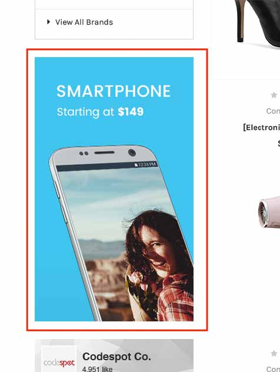
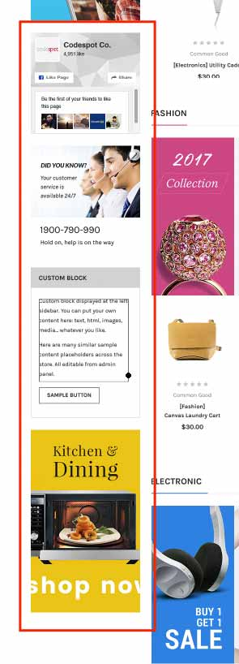

import { SidebarBannerBuilderComponent } from '@tvlgiao/bc-supermarket-builder-components'

# Sidebar

## Banners on Left Sidebar

Banner above Facebook Like Page block:

Banner below Facebook Like Page block:

In **Marketing** > **Banners**, click __Create a Banner__ button. In **Banner Content**, click `HTML` button to open **HTML Source Editor**.

Use the editor below to generate HTML. Click **Export HTML** button, copy & paste the generated HTML to **HTML Source Editor**.

<SidebarBannerBuilderComponent />

Choose other options:

- __Show on Page__: `Search Results Page`
- __Visible__: Yes
- __Location__: `Top of Page`

## Facebook Like Page

You can show your own Facebook Like Page block or hide it completely. 

From __Theme Editor__ > __Social Media Icons__ > Enter your facebook page name in __Facebook page__ field. For example if your Facebook page URL is <https://www.facebook.com/papathemes/>, ONLY input `papathemes`.

To hide this block, just leave it empty.

