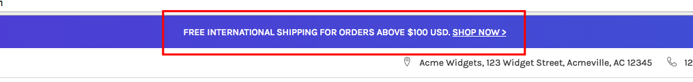
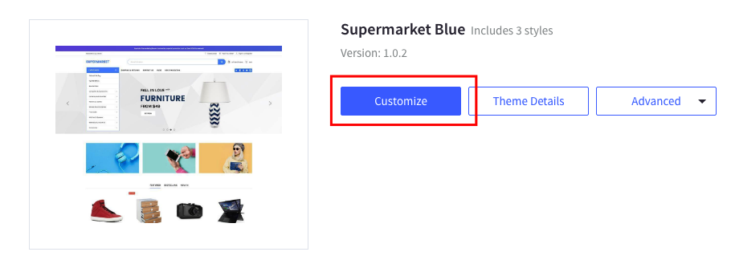
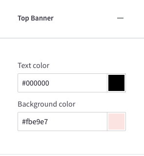
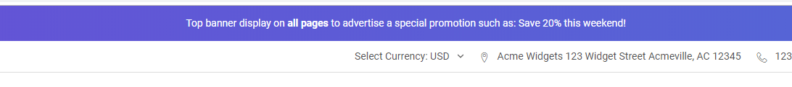
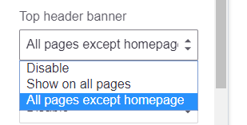

import { TopBannerBuilderComponent } from '@tvlgiao/bc-supermarket-builder-components'

# Top Banner

Create or edit the top banner in __Marketing__ > __Banners__. Remember to choose __Location__ = `Top of Page`.

## Colors Customization

To customize this banner's colors, go to __Storefront Design__ > __My Themes__, click __Customize__ button of the current theme to open **Theme Editor**. 

Find the options below:

## Advanced Top Banner

You can show the top banner on all pages or on all other page exclude the homepage. Go to **Theme Editor** > **Banners** > choose **Advanced top header banner**:

Edit the top banner's content in **Marketing** > **Banners**, click button **Create a Banner**. In **Banner Content** box, click the square `HTML` button to open **HTML Source Editor**.

Use the editor below to generate HTML. Click **Export HTML** button, copy & paste the generated HTML to **HTML Source Editor**.

<!-- SupermarketAdvTopHeader -->

<TopBannerBuilderComponent />

Other fields should be configured as below:

- __Show on Page__: `Search Results Page`
- __Visible__: Checked
- __Location__: `Top of Page`

### Tutorial video

Also check out the tutorial video below:

- Display a top banner on all pages with the new documentation:

<iframe width="560" height="315" src="https://www.youtube.com/embed/7HW54Gp72Ok" frameborder="0" allow="accelerometer; autoplay; encrypted-media; gyroscope; picture-in-picture" allowfullscreen></iframe>

- Old video:

<iframe width="560" height="315" src="https://www.youtube.com/embed/pa8_08I3Jn0" frameborder="0" allow="accelerometer; autoplay; encrypted-media; gyroscope; picture-in-picture" allowfullscreen></iframe>
